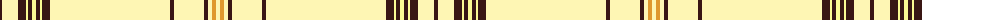

In pattern [BWBWBWBWBWBWBWYW](/patterns/bwbwbwbwbwbwbwyw/).

This was sourced from register-of-tartans.  It is a [16 stripes tartan](/stripes/stripes16/).

Original link https://www.tartanregister.gov.uk/tartanDetails.aspx?ref=10024

## Thread count
K/4 LYa16 K8 LY2 K4 LY4 K4 LY2 K8 LYa120 K4 LYa30 K4 LYa4 Y4 LYa/4

## Palette
Each colour and its ΔE from the base-6 reference it is a variant of.

| Colour | Shade | Base | ΔE (OKLab) |
|---|---|---|---|
| K | <code style="background-color:#391614;">#391614</code> `#391614` | B <code style="background-color:#2C4084;">#2C4084</code> | 0.21 |
| LY | <code style="background-color:#FCFA93;">#FCFA93</code> `#FCFA93` | W <code style="background-color:#F4F4F0;">#F4F4F0</code> | 0.12 |
| LYa | <code style="background-color:#FEF6B4;">#FEF6B4</code> `#FEF6B4` | W <code style="background-color:#F4F4F0;">#F4F4F0</code> | 0.08 |
| Y | <code style="background-color:#DF982E;">#DF982E</code> `#DF982E` | Y <code style="background-color:#E8C000;">#E8C000</code> | 0.11 |

ID: /setts/s16/b4w16b8wa2b4wa4b4wa2b8w120b4w30b4w4y4w4-b391614-wfef6b4-wafcfa93-ydf982e/
