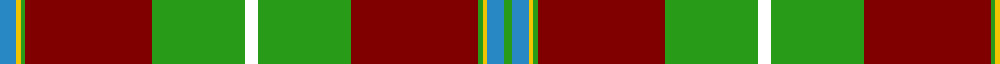

In pattern [BYGRGGGKGGGRGYBG](/patterns/bygrgggkgggrgybg/).

This was sourced from house-of-tartan.  It is a [16 stripes tartan](/stripes/stripes16/).

Original link http://www.house-of-tartan.scotland.net/house/TartanViewjs.asp?colr=Def&tnam=3897

## Thread count
B/8 Y2 G2 DR60 G36 G6 G2 SB6 G2 G6 G36 DR60 G2 Y2 B8 G/4

## Palette
Each colour and its ΔE from the base-6 reference it is a variant of.

| Colour | Shade | Base | ΔE (OKLab) |
|---|---|---|---|
| B | <code style="background-color:#2888C4;">#2888C4</code> `#2888C4` | B <code style="background-color:#2A418A;">#2A418A</code> | 0.21 |
| DB | <code style="background-color:#202060;">#202060</code> `#202060` | B <code style="background-color:#2A418A;">#2A418A</code> | 0.11 |
| DG | <code style="background-color:#003820;">#003820</code> `#003820` | G <code style="background-color:#006100;">#006100</code> | 0.15 |
| DR | <code style="background-color:#800000;">#800000</code> `#800000` | R <code style="background-color:#CC0000;">#CC0000</code> | 0.17 |
| G | <code style="background-color:#289C18;">#289C18</code> `#289C18` | G <code style="background-color:#006100;">#006100</code> | 0.19 |
| Ga | <code style="background-color:#387858;">#387858</code> `#387858` | G <code style="background-color:#006100;">#006100</code> | 0.12 |
| LG | <code style="background-color:#789484;">#789484</code> `#789484` | G <code style="background-color:#006100;">#006100</code> | 0.24 |
| Y | <code style="background-color:#F0C400;">#F0C400</code> `#F0C400` | Y <code style="background-color:#F2BF00;">#F2BF00</code> | 0.01 |

## Nearest tartans

The nearest existing variants by ΔTartan distance.

1. [Keilar (2013)](/setts/s16/r15ra3r3ra1r35g5w2b2g35ra1g3ra3g15r5w2b2~b071579-g034a10-rc2761d-raff0000-wffffff~x2/) — ΔT 0.65
1. [Leask Family Tartan Tartan Number: 905. Earliest known date: 1981 Designed by Madam Leask and the Scottish Tartans Society Accredited in 1981. See products available Copyright © Blair Urquhart, Comrie, 2015](/setts/s14/g2r2w1r2k1r24g12y2g3y2g12r2g3y2~g006818-k101010-rc80000-we0e0e0-ye8c000~x2/) — ΔT 0.93
1. [Hay](/setts/s14/r9g6y4g54r4g4r4g18r72g6r4k2r4w9~g008000-k000000-rc00000-we0e0e0-yf0c000/) — ΔT 0.97
1. [Leask](/setts/s14/g2r2w1r2k1r24g12y2g3y2g12r2g3y2~g008000-k000000-rc00000-we0e0e0-yf0c000~x2/) — ΔT 0.98
1. [Hay Clan Tartan Tartan Number: 1555. Earliest known date: 1842 The design comes from the Vestiarium Scoticum (1842). The authors, the Sobieski Stuart brothers, enjoyed a popular following among the Scottish gentry in the early Victorian era, and in the spirit of the times, added mystery, romance and some spurious historical documentation to the subject of tartan. Of the better known tartans, the book offers some minor variation, but in other cases it provides the only recorded version of many tartans in use today. See products available Copyright © Blair Urquhart, Comrie, 2015](/setts/s14/r9g6y4g54r4g4r4g18r72g6r4k2r4w9~g006818-k101010-rc80000-we0e0e0-ye8c000/) — ΔT 1.06
1. [Strang (Personal)](/setts/s14/r36g18r4g6k1w2k1g2k1w2k1g6r4g18~g146400-k000000-rb00000-wc8c8c8~x2/) — ΔT 1.15
1. [Glendronach](/setts/s12/g21r2w1ga3r2g5r21ga1y1ga1r1g8~g008000-ga908000-r900030-we0e0e0-yf0c000~x2/) — ΔT 1.19
1. [Unidentified](/setts/s22/y3g30r7g2r1g8r1g2r7g16k18b8r14g8r1g1r7g1r1g8r27y3~b5c8ca8-g006818-k101010-rc80000-yfccc00~x2/) — ΔT 1.28
1. [Hay - 1842 (Clan)](/setts/s14/r3g2y1g18r1g1r1g6r24g2r1k1r1w3~g285800-k101010-rc80000-we0e0e0-yd8b000~x2/) — ΔT 1.30
1. [Hay](/setts/s14/r6g4y2g36r2g2r2g12r48g4r2k1r2w6~g004c00-k000000-rc80000-wd0d0d0-yffc800/) — ΔT 1.30

## Neighbour map

Every grey dot is one of 15726 variants placed by the first two principal components of the ΔTartan feature space (44% of its variance). Red is this tartan; blue dots are its nearest — click one to open its page.

<svg viewBox="0 0 640 380" role="img" style="max-width:100%;height:auto;border:1px solid #e0e0e0;border-radius:4px;display:block" xmlns="http://www.w3.org/2000/svg"><image href="/nn/cloud.v1.png" width="640" height="380"/><a href="/setts/s16/r15ra3r3ra1r35g5w2b2g35ra1g3ra3g15r5w2b2~b071579-g034a10-rc2761d-raff0000-wffffff~x2/"><circle cx="294.3" cy="72.7" r="4" fill="#3465a4"><title>Keilar (2013)</title></circle></a><a href="/setts/s14/g2r2w1r2k1r24g12y2g3y2g12r2g3y2~g006818-k101010-rc80000-we0e0e0-ye8c000~x2/"><circle cx="297.1" cy="93.4" r="4" fill="#3465a4"><title>Leask Family Tartan Tartan Number: 905. Earliest known date: 1981 Designed by Madam Leask and the Scottish Tartans Society Accredited in 1981. See products available Copyright © Blair Urquhart, Comrie, 2015</title></circle></a><a href="/setts/s14/r9g6y4g54r4g4r4g18r72g6r4k2r4w9~g008000-k000000-rc00000-we0e0e0-yf0c000/"><circle cx="338.6" cy="70.1" r="4" fill="#3465a4"><title>Hay</title></circle></a><a href="/setts/s14/g2r2w1r2k1r24g12y2g3y2g12r2g3y2~g008000-k000000-rc00000-we0e0e0-yf0c000~x2/"><circle cx="290.8" cy="91.5" r="4" fill="#3465a4"><title>Leask</title></circle></a><a href="/setts/s14/r9g6y4g54r4g4r4g18r72g6r4k2r4w9~g006818-k101010-rc80000-we0e0e0-ye8c000/"><circle cx="344.8" cy="71.8" r="4" fill="#3465a4"><title>Hay Clan Tartan Tartan Number: 1555. Earliest known date: 1842 The design comes from the Vestiarium Scoticum (1842). The authors, the Sobieski Stuart brothers, enjoyed a popular following among the Scottish gentry in the early Victorian era, and in the spirit of the times, added mystery, romance and some spurious historical documentation to the subject of tartan. Of the better known tartans, the book offers some minor variation, but in other cases it provides the only recorded version of many tartans in use today. See products available Copyright © Blair Urquhart, Comrie, 2015</title></circle></a><a href="/setts/s14/r36g18r4g6k1w2k1g2k1w2k1g6r4g18~g146400-k000000-rb00000-wc8c8c8~x2/"><circle cx="359.1" cy="99.4" r="4" fill="#3465a4"><title>Strang (Personal)</title></circle></a><a href="/setts/s12/g21r2w1ga3r2g5r21ga1y1ga1r1g8~g008000-ga908000-r900030-we0e0e0-yf0c000~x2/"><circle cx="325.3" cy="115.0" r="4" fill="#3465a4"><title>Glendronach</title></circle></a><a href="/setts/s22/y3g30r7g2r1g8r1g2r7g16k18b8r14g8r1g1r7g1r1g8r27y3~b5c8ca8-g006818-k101010-rc80000-yfccc00~x2/"><circle cx="252.9" cy="81.0" r="4" fill="#3465a4"><title>Unidentified</title></circle></a><a href="/setts/s14/r3g2y1g18r1g1r1g6r24g2r1k1r1w3~g285800-k101010-rc80000-we0e0e0-yd8b000~x2/"><circle cx="334.4" cy="85.1" r="4" fill="#3465a4"><title>Hay - 1842 (Clan)</title></circle></a><a href="/setts/s14/r6g4y2g36r2g2r2g12r48g4r2k1r2w6~g004c00-k000000-rc80000-wd0d0d0-yffc800/"><circle cx="354.9" cy="58.4" r="4" fill="#3465a4"><title>Hay</title></circle></a><circle cx="307.8" cy="78.0" r="5" fill="#c00000"/></svg>

ID: /setts/s16/b4y1g1r30g18g3g1k3g1g3g18r30g1y1b4g2~b2888c4-g289c18-k000000-r800000-yf0c400~x2/
