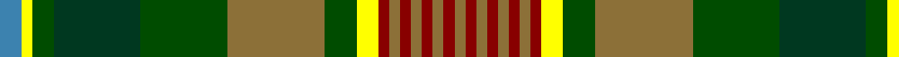

In pattern [BYGGGGGYRGRGRGRG](/patterns/bygggggyrgrgrgrg/).

This was sourced from register-of-tartans.  It is a [16 stripes tartan](/stripes/stripes16/).

Original link https://www.tartanregister.gov.uk/tartanDetails.aspx?ref=10966

## Thread count
B/4 Y2 G4 DG16 G16 LT18 G6 Y4 DR2 LT2 DR2 LT2 DR2 LT2 DR2 LT/2

## Palette
Each colour and its ΔE from the base-6 reference it is a variant of.

| Colour | Shade | Base | ΔE (OKLab) |
|---|---|---|---|
| B | <code style="background-color:#3C82AF;">#3C82AF</code> `#3C82AF` | B <code style="background-color:#2C4084;">#2C4084</code> | 0.20 |
| DG | <code style="background-color:#003820;">#003820</code> `#003820` | G <code style="background-color:#006400;">#006400</code> | 0.16 |
| DR | <code style="background-color:#880000;">#880000</code> `#880000` | R <code style="background-color:#C80000;">#C80000</code> | 0.14 |
| G | <code style="background-color:#004C00;">#004C00</code> `#004C00` | G <code style="background-color:#006400;">#006400</code> | 0.08 |
| LT | <code style="background-color:#8C7038;">#8C7038</code> `#8C7038` | G <code style="background-color:#006400;">#006400</code> | 0.18 |
| Y | <code style="background-color:#FFFF00;">#FFFF00</code> `#FFFF00` | Y <code style="background-color:#E8C000;">#E8C000</code> | 0.16 |

## Nearest tartans

The nearest existing variants by ΔTartan distance.

1. [Dixon, Clyde (Personal)](/setts/s15/y4ya2g4ga16g16r18g6ya4ra2r2ra2r2ra2r2ra2-g006818-ga003820-ra07c58-rac80000-y48a4c0-yae8c000/) — ΔT 0.57
1. [Gordonstoun](/setts/s12/y6g30r4b16ba4r16g16r4ga30r4ga4ba4-b304080-ba5480b0-g008000-ga003000-r900030-yf0c000/) — ΔT 1.08
1. [Allen - 2001 (Personal)](/setts/s14/b32r4b6r8b4g24ga36w4ga36g24b24y4r4y4-b14283c-g604000-ga006818-rc80000-wfcfcfc-ye8c000/) — ΔT 1.11
1. [U.S. Ancient Order of Hibernians (Co](/setts/s13/r6g4w4g6b6g40k40b4k4b4y30b6y6-b2c2c80-g006818-k101010-rc80000-we0e0e0-ybc8c00/) — ΔT 1.20
1. [Donegal County Crest (Fashion)](/setts/s13/k8g20y8g20k8ga40g10k4y12k4r20k4w8-g003820-ga006818-k101010-rc80000-we0e0e0-ybc8c00/) — ΔT 1.25
1. [Murphy (District)](/setts/s12/k16r4k12y4k4w4k4g32ga48r4ga8k4-g84642c-ga347430-k101010-rc80000-wfcfcfc-yd8b000/) — ΔT 1.27
1. [Gordonstoun Corporate Tartan Tartan Number: 190. Earliest known date: 1966 The specimen in the cloth archive of the Scottish Tartans Society was supplied by Bullard in 1969. The original sindex card says it was supplied by Gordon Stewart in 1966. See products available Copyright © Blair Urquhart, Comrie, 2015](/setts/s12/y6g30r4b16ba4r16g16r4ga30r4ga4ba4-b2c2c80-ba5c8ca8-g289c18-ga003820-ra00048-ye8c000/) — ΔT 1.29
1. [Wcwm 9275-1258](/setts/s12/g32ga8k16y4k4w4k4b32g12k4g4w4-b4c3428-g8c7038-ga006818-k101010-wc0c0c0-yd09800/) — ΔT 1.31
1. [Harmon Hunting](/setts/s18/k4g12y4g4y4g38b4r4b4g4ga8k4ga22r4ga4r4ga12y4-b003c64-g006818-ga003820-k10101a-r880000-ye8c000/) — ΔT 1.33
1. [Harmony, 2](/setts/s12/b18ba6b8y6b6y8b6r22g60bb6g8b6-b401000-ba5480b0-bb8080d0-g008000-r806050-yf0c000/) — ΔT 1.36

## Neighbour map

Every grey dot is one of 15726 variants placed by the first two principal components of the ΔTartan feature space (44% of its variance). Red is this tartan; blue dots are its nearest — click one to open its page.

<svg viewBox="0 0 640 380" role="img" style="max-width:100%;height:auto;border:1px solid #e0e0e0;border-radius:4px;display:block" xmlns="http://www.w3.org/2000/svg"><image href="/nn/cloud.v1.png" width="640" height="380"/><a href="/setts/s15/y4ya2g4ga16g16r18g6ya4ra2r2ra2r2ra2r2ra2-g006818-ga003820-ra07c58-rac80000-y48a4c0-yae8c000/"><circle cx="119.7" cy="132.9" r="4" fill="#3465a4"><title>Dixon, Clyde (Personal)</title></circle></a><a href="/setts/s12/y6g30r4b16ba4r16g16r4ga30r4ga4ba4-b304080-ba5480b0-g008000-ga003000-r900030-yf0c000/"><circle cx="103.1" cy="162.1" r="4" fill="#3465a4"><title>Gordonstoun</title></circle></a><a href="/setts/s14/b32r4b6r8b4g24ga36w4ga36g24b24y4r4y4-b14283c-g604000-ga006818-rc80000-wfcfcfc-ye8c000/"><circle cx="135.8" cy="158.6" r="4" fill="#3465a4"><title>Allen - 2001 (Personal)</title></circle></a><a href="/setts/s13/r6g4w4g6b6g40k40b4k4b4y30b6y6-b2c2c80-g006818-k101010-rc80000-we0e0e0-ybc8c00/"><circle cx="108.4" cy="120.3" r="4" fill="#3465a4"><title>U.S. Ancient Order of Hibernians (Co</title></circle></a><a href="/setts/s13/k8g20y8g20k8ga40g10k4y12k4r20k4w8-g003820-ga006818-k101010-rc80000-we0e0e0-ybc8c00/"><circle cx="76.4" cy="149.1" r="4" fill="#3465a4"><title>Donegal County Crest (Fashion)</title></circle></a><a href="/setts/s12/k16r4k12y4k4w4k4g32ga48r4ga8k4-g84642c-ga347430-k101010-rc80000-wfcfcfc-yd8b000/"><circle cx="170.5" cy="122.1" r="4" fill="#3465a4"><title>Murphy (District)</title></circle></a><a href="/setts/s12/y6g30r4b16ba4r16g16r4ga30r4ga4ba4-b2c2c80-ba5c8ca8-g289c18-ga003820-ra00048-ye8c000/"><circle cx="89.2" cy="153.9" r="4" fill="#3465a4"><title>Gordonstoun Corporate Tartan Tartan Number: 190. Earliest known date: 1966 The specimen in the cloth archive of the Scottish Tartans Society was supplied by Bullard in 1969. The original sindex card says it was supplied by Gordon Stewart in 1966. See products available Copyright © Blair Urquhart, Comrie, 2015</title></circle></a><a href="/setts/s12/g32ga8k16y4k4w4k4b32g12k4g4w4-b4c3428-g8c7038-ga006818-k101010-wc0c0c0-yd09800/"><circle cx="144.2" cy="147.7" r="4" fill="#3465a4"><title>Wcwm 9275-1258</title></circle></a><a href="/setts/s18/k4g12y4g4y4g38b4r4b4g4ga8k4ga22r4ga4r4ga12y4-b003c64-g006818-ga003820-k10101a-r880000-ye8c000/"><circle cx="175.6" cy="132.9" r="4" fill="#3465a4"><title>Harmon Hunting</title></circle></a><a href="/setts/s12/b18ba6b8y6b6y8b6r22g60bb6g8b6-b401000-ba5480b0-bb8080d0-g008000-r806050-yf0c000/"><circle cx="174.9" cy="127.7" r="4" fill="#3465a4"><title>Harmony, 2</title></circle></a><circle cx="109.3" cy="128.0" r="5" fill="#c00000"/></svg>

ID: /setts/s16/b4y2g4ga16g16gb18g6y4r2gb2r2gb2r2gb2r2gb2-b3c82af-g004c00-ga003820-gb8c7038-r880000-yffff00/
