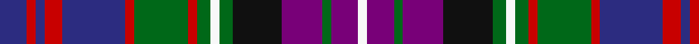

In pattern [BRBRBRGRGWGKBGBW](/patterns/brbrbrgrgwgkbgbw/).

This was sourced from tartans-authority.  It is a [16 stripes tartan](/stripes/stripes16/).

Original link http://www.tartansauthority.com/tartan-ferret/display/7139/

## Thread count
DB/12 R4 DB4 R8 DB28 R4 G24 R4 G6 W4 G6 K22 P18 G4 P12 W/4

## Palette
Each colour and its ΔE from the base-6 reference it is a variant of.

| Colour | Shade | Base | ΔE (OKLab) |
|---|---|---|---|
| DB | <code style="background-color:#2C2C80;">#2C2C80</code> `#2C2C80` | B <code style="background-color:#2A418A;">#2A418A</code> | 0.06 |
| G | <code style="background-color:#006818;">#006818</code> `#006818` | G <code style="background-color:#006100;">#006100</code> | 0.02 |
| K | <code style="background-color:#101010;">#101010</code> `#101010` | K <code style="background-color:#000000;">#000000</code> | 0.17 |
| P | <code style="background-color:#780078;">#780078</code> `#780078` | B <code style="background-color:#2A418A;">#2A418A</code> | 0.17 |
| R | <code style="background-color:#C80000;">#C80000</code> `#C80000` | R <code style="background-color:#CC0000;">#CC0000</code> | 0.01 |
| W | <code style="background-color:#F8F8F8;">#F8F8F8</code> `#F8F8F8` | W <code style="background-color:#F7F7F7;">#F7F7F7</code> | 0.00 |

## Nearest tartans

The nearest existing variants by ΔTartan distance.

1. [Haughey (Personal)](/setts/s16/b6r2b2r4b14r2g12r2g3w2g3ga11ba9g2ba6w2x2~b141e46-ba5a008c-g003c14-ga2a2303-rdc0000-we0e0e0/) — ΔT 0.68
1. [Kinloch Anderson Old Dress](/setts/s12/r4g14w2b4w2k6g3k6ba13r2ba4r4x2~b4c3428-ba1c0070-g8c7038-k101010-r880000-wc0c0c0/) — ΔT 0.75
1. [Alberta Caledonia (Corporate)](/setts/s13/r6b9k2b2k2b9k10y4ba17r5k2r5w4x2~b2c2c80-ba5c5c5c-k101010-rc80000-we0e0e0-ye8c000/) — ΔT 0.79
1. [South Lanarkshire](/setts/s16/b1ba7k1g6k1bb7w1k2w1bb7k1g6k1ba7b1k1x4~b2888c4-ba2c2c80-bb780078-g006818-k101010-we0e0e0/) — ΔT 0.87
1. [North of Scotland Tartan Army](/setts/s13/b3k3b10k11g14ba3g14k11w3y3ba15y2w2x2~b780078-ba2c2c80-g006818-k101010-we0e0e0-ya0a0a0/) — ΔT 1.04
1. [Tawain Scottish (Commemorative)](/setts/s14/r13w2r13k3ra13g21b3k18b9k2b2k2b15w2x2~b2c2c80-g006818-k101010-rc80000-ra880000-we0e0e0/) — ΔT 1.05
1. [South Australia #2](/setts/s11/r6b24r3ba12r7ba12k3g8y3g8k3~b2c4084-ba141e46-g005020-k101010-rdc0000-ye8c000/) — ΔT 1.06
1. [Kilburnie (Fashion)](/setts/s17/b12k2b2k2r3k2ba6k2w2k2ba6k2y2k2b6k2r2x2~b2c2c80-ba5c8ca8-k101010-rc80000-we0e0e0-ye8c000/) — ΔT 1.08
1. [McCrann, Julian David (Personal)](/setts/s13/b8r2b2r4b8g2k10g10k4g2y2g4w1x2~b2c4084-g5c6428-k000028-raf0014-we0e0e0-ye8c000/) — ΔT 1.12
1. [Bowie (Dalgety) Family Tartan Tartan Number: 434. Earliest known date: 1970-80 The name Bowie or Buie is associated with Argyllshire and the islands of Jura, Uist and Bute. The design comes from J. Dalgety, a weaving manufacturer who specializes in tartan. The date of the tartan is assumed. See products available Copyright © Blair Urquhart, Comrie, 2015](/setts/s13/b8r2b3r4b13w2ba13w2g13r4g4y2g8x2~b2c2c80-ba480800-g006818-rc80000-we0e0e0-ye8c000/) — ΔT 1.14

## Neighbour map

Every grey dot is one of 15726 variants placed by the first two principal components of the ΔTartan feature space (44% of its variance). Red is this tartan; blue dots are its nearest — click one to open its page.

<svg viewBox="0 0 640 380" role="img" style="max-width:100%;height:auto;border:1px solid #e0e0e0;border-radius:4px;display:block" xmlns="http://www.w3.org/2000/svg"><image href="/nn/cloud.v1.png" width="640" height="380"/><a href="/setts/s16/b6r2b2r4b14r2g12r2g3w2g3ga11ba9g2ba6w2x2~b141e46-ba5a008c-g003c14-ga2a2303-rdc0000-we0e0e0/"><circle cx="65.4" cy="152.9" r="4" fill="#3465a4"><title>Haughey (Personal)</title></circle></a><a href="/setts/s12/r4g14w2b4w2k6g3k6ba13r2ba4r4x2~b4c3428-ba1c0070-g8c7038-k101010-r880000-wc0c0c0/"><circle cx="60.9" cy="164.1" r="4" fill="#3465a4"><title>Kinloch Anderson Old Dress</title></circle></a><a href="/setts/s13/r6b9k2b2k2b9k10y4ba17r5k2r5w4x2~b2c2c80-ba5c5c5c-k101010-rc80000-we0e0e0-ye8c000/"><circle cx="53.3" cy="148.1" r="4" fill="#3465a4"><title>Alberta Caledonia (Corporate)</title></circle></a><a href="/setts/s16/b1ba7k1g6k1bb7w1k2w1bb7k1g6k1ba7b1k1x4~b2888c4-ba2c2c80-bb780078-g006818-k101010-we0e0e0/"><circle cx="82.6" cy="147.8" r="4" fill="#3465a4"><title>South Lanarkshire</title></circle></a><a href="/setts/s13/b3k3b10k11g14ba3g14k11w3y3ba15y2w2x2~b780078-ba2c2c80-g006818-k101010-we0e0e0-ya0a0a0/"><circle cx="62.3" cy="163.7" r="4" fill="#3465a4"><title>North of Scotland Tartan Army</title></circle></a><a href="/setts/s14/r13w2r13k3ra13g21b3k18b9k2b2k2b15w2x2~b2c2c80-g006818-k101010-rc80000-ra880000-we0e0e0/"><circle cx="70.0" cy="135.1" r="4" fill="#3465a4"><title>Tawain Scottish (Commemorative)</title></circle></a><a href="/setts/s11/r6b24r3ba12r7ba12k3g8y3g8k3~b2c4084-ba141e46-g005020-k101010-rdc0000-ye8c000/"><circle cx="82.9" cy="169.6" r="4" fill="#3465a4"><title>South Australia #2</title></circle></a><a href="/setts/s17/b12k2b2k2r3k2ba6k2w2k2ba6k2y2k2b6k2r2x2~b2c2c80-ba5c8ca8-k101010-rc80000-we0e0e0-ye8c000/"><circle cx="82.4" cy="148.6" r="4" fill="#3465a4"><title>Kilburnie (Fashion)</title></circle></a><a href="/setts/s13/b8r2b2r4b8g2k10g10k4g2y2g4w1x2~b2c4084-g5c6428-k000028-raf0014-we0e0e0-ye8c000/"><circle cx="94.2" cy="156.4" r="4" fill="#3465a4"><title>McCrann, Julian David (Personal)</title></circle></a><a href="/setts/s13/b8r2b3r4b13w2ba13w2g13r4g4y2g8x2~b2c2c80-ba480800-g006818-rc80000-we0e0e0-ye8c000/"><circle cx="80.0" cy="165.0" r="4" fill="#3465a4"><title>Bowie (Dalgety) Family Tartan Tartan Number: 434. Earliest known date: 1970-80 The name Bowie or Buie is associated with Argyllshire and the islands of Jura, Uist and Bute. The design comes from J. Dalgety, a weaving manufacturer who specializes in tartan. The date of the tartan is assumed. See products available Copyright © Blair Urquhart, Comrie, 2015</title></circle></a><circle cx="51.5" cy="144.3" r="5" fill="#c00000"/></svg>

ID: /setts/s16/b6r2b2r4b14r2g12r2g3w2g3k11ba9g2ba6w2x2~b2c2c80-ba780078-g006818-k101010-rc80000-wf8f8f8/
