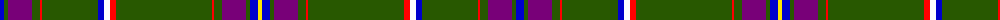

In pattern [BGBGRGBWRGRGBGBY](/patterns/bgbgrgbwrgrgbgby/).

This was sourced from register-of-tartans.  It is a [16 stripes tartan](/stripes/stripes16/).

Original link https://www.tartanregister.gov.uk/tartanDetails.aspx?ref=11324

## Thread count
B/8 G4 P24 G8 R2 G56 B6 W6 R6 G96 R2 G8 P24 G4 B8 Y/4

## Palette
Each colour and its ΔE from the base-6 reference it is a variant of.

| Colour | Shade | Base | ΔE (OKLab) |
|---|---|---|---|
| B | <code style="background-color:#0000CD;">#0000CD</code> `#0000CD` | B <code style="background-color:#2C4084;">#2C4084</code> | 0.15 |
| G | <code style="background-color:#285800;">#285800</code> `#285800` | G <code style="background-color:#006400;">#006400</code> | 0.04 |
| P | <code style="background-color:#780078;">#780078</code> `#780078` | B <code style="background-color:#2C4084;">#2C4084</code> | 0.16 |
| R | <code style="background-color:#FF0000;">#FF0000</code> `#FF0000` | R <code style="background-color:#C80000;">#C80000</code> | 0.11 |
| W | <code style="background-color:#FFFFFF;">#FFFFFF</code> `#FFFFFF` | W <code style="background-color:#F4F4F0;">#F4F4F0</code> | 0.03 |
| Y | <code style="background-color:#FFE600;">#FFE600</code> `#FFE600` | Y <code style="background-color:#E8C000;">#E8C000</code> | 0.10 |

ID: /setts/s16/b8g4ba24g8r2g56b6w6r6g96r2g8ba24g4b8y4-b0000cd-ba780078-g285800-rff0000-wffffff-yffe600/
