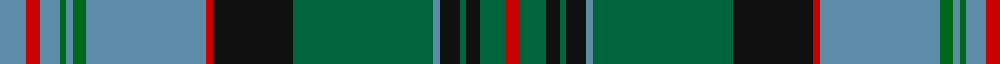

In pattern [BRBGBGBRKGBKGKGR](/patterns/brbgbgbrkgbkgkgr/).

This was sourced from register-of-tartans.  It is a [16 stripes tartan](/stripes/stripes16/).

Original link https://www.tartanregister.gov.uk/tartanDetails.aspx?ref=3052

## Attestations

This cloth appears in 2 source records; the oldest owns this page.

- 01/01/1997 — Munster (register-of-tartans, [record](https://www.tartanregister.gov.uk/tartanDetails.aspx?ref=3052))
- 1997 — Munster (District) (tartans-authority, [record](http://www.tartansauthority.com/tartan-ferret/display/4061/))

## Thread count
B/8 R4 B6 G2 B2 G4 B36 R2 K24 Ga42 B2 K6 Ga2 K4 Ga8 R/4

## Palette
Each colour and its ΔE from the base-6 reference it is a variant of.

| Colour | Shade | Base | ΔE (OKLab) |
|---|---|---|---|
| B | <code style="background-color:#5C8CA8;">#5C8CA8</code> `#5C8CA8` | B <code style="background-color:#2C4084;">#2C4084</code> | 0.23 |
| G | <code style="background-color:#006818;">#006818</code> `#006818` | G <code style="background-color:#006400;">#006400</code> | 0.02 |
| Ga | <code style="background-color:#00643C;">#00643C</code> `#00643C` | G <code style="background-color:#006400;">#006400</code> | 0.06 |
| K | <code style="background-color:#101010;">#101010</code> `#101010` | K <code style="background-color:#000000;">#000000</code> | 0.17 |
| R | <code style="background-color:#C80000;">#C80000</code> `#C80000` | R <code style="background-color:#C80000;">#C80000</code> | 0.00 |

## Nearest tartans

The nearest existing variants by ΔTartan distance.

1. [Rankin, John (Personal)](/setts/s16/b4k2g30w4g30k2b4k2r4k40b4k4b4k4b50k2-b5f749c-g285800-k101010-rc82828-we0e0e0/) — ΔT 0.61
1. [Ranking Corporate Tartan Tartan Number: 3242. Earliest known date: 2002 Personal/Family tartan for the Ranking family and its close relatives as determined by the current head of the family. A minor variation of Rankine tartan. See products available Copyright © Blair Urquhart, Comrie, 2015](/setts/s20/b72k10r4k10g30r4g20w4g20r4g30k10r4k10b20r4b4r4b8w4-b003c64-g006818-k101010-rc80000-we0e0e0/) — ΔT 0.86
1. [Selby (Name)](/setts/s11/g6b2g2b24k4b4k4b6k24ga48w6-b506880-g289c18-ga306434-k101010-we0e0e0/) — ΔT 0.90
1. [Baron of Greencastle Htg (Personal)](/setts/s13/b8y4g48y4k24b6k4b4k4b28r2b2r6-b2c2c80-g006818-k101010-r880000-ye8c000/) — ΔT 0.90
1. [Glen Orchy](/setts/s15/g6r4ra2b36r4g16r8ba2b16r4g36r4ra2b6ba2-b304080-ba5480b0-g008000-rc00000-rad03030/) — ΔT 0.92
1. [Ontario (Official)](/setts/s13/g38r2g4r4g30r2b26w2ba4r4ba42r2w6-b1c1c1c-ba2c2c80-g006818-rc80000-we0e0e0/) — ΔT 0.95
1. [Glen Orchy, or MacIntyre](/setts/s14/g4k4r6g36r6b12ba2r8g12r4b36r6g4k4-b304080-ba5480b0-g008000-k000000-rc00000/) — ΔT 1.06
1. [Couper of Gogar](/setts/s18/b4w8r4g48b8g4b8k20w8b4w8g16b2k2b44w8b4r4-b2c2c80-g006818-k101010-rc80000-wc49cd8/) — ΔT 1.08
1. [Couper of Gogar (Clan)](/setts/s18/r4w8b4g48b8g4b8k20w8b4w8g16b2k4b44w8b4r4-b2c2c80-g006818-k101010-rc80000-wc49cd8/) — ΔT 1.09
1. [Blairlogie (District)](/setts/s17/k56r4b18g4b8g40k2g2w4g2k2g40b8g4b18r2b6-b506878-g006818-k101010-rc80000-we0e0e0/) — ΔT 1.10

## Neighbour map

Every grey dot is one of 15726 variants placed by the first two principal components of the ΔTartan feature space (44% of its variance). Red is this tartan; blue dots are its nearest — click one to open its page.

<svg viewBox="0 0 640 380" role="img" style="max-width:100%;height:auto;border:1px solid #e0e0e0;border-radius:4px;display:block" xmlns="http://www.w3.org/2000/svg"><image href="/nn/cloud.v1.png" width="640" height="380"/><a href="/setts/s16/b4k2g30w4g30k2b4k2r4k40b4k4b4k4b50k2-b5f749c-g285800-k101010-rc82828-we0e0e0/"><circle cx="219.1" cy="96.2" r="4" fill="#3465a4"><title>Rankin, John (Personal)</title></circle></a><a href="/setts/s20/b72k10r4k10g30r4g20w4g20r4g30k10r4k10b20r4b4r4b8w4-b003c64-g006818-k101010-rc80000-we0e0e0/"><circle cx="212.5" cy="114.8" r="4" fill="#3465a4"><title>Ranking Corporate Tartan Tartan Number: 3242. Earliest known date: 2002 Personal/Family tartan for the Ranking family and its close relatives as determined by the current head of the family. A minor variation of Rankine tartan. See products available Copyright © Blair Urquhart, Comrie, 2015</title></circle></a><a href="/setts/s11/g6b2g2b24k4b4k4b6k24ga48w6-b506880-g289c18-ga306434-k101010-we0e0e0/"><circle cx="217.8" cy="123.2" r="4" fill="#3465a4"><title>Selby (Name)</title></circle></a><a href="/setts/s13/b8y4g48y4k24b6k4b4k4b28r2b2r6-b2c2c80-g006818-k101010-r880000-ye8c000/"><circle cx="200.4" cy="112.2" r="4" fill="#3465a4"><title>Baron of Greencastle Htg (Personal)</title></circle></a><a href="/setts/s15/g6r4ra2b36r4g16r8ba2b16r4g36r4ra2b6ba2-b304080-ba5480b0-g008000-rc00000-rad03030/"><circle cx="236.4" cy="122.3" r="4" fill="#3465a4"><title>Glen Orchy</title></circle></a><a href="/setts/s13/g38r2g4r4g30r2b26w2ba4r4ba42r2w6-b1c1c1c-ba2c2c80-g006818-rc80000-we0e0e0/"><circle cx="231.5" cy="118.7" r="4" fill="#3465a4"><title>Ontario (Official)</title></circle></a><a href="/setts/s14/g4k4r6g36r6b12ba2r8g12r4b36r6g4k4-b304080-ba5480b0-g008000-k000000-rc00000/"><circle cx="204.3" cy="120.6" r="4" fill="#3465a4"><title>Glen Orchy, or MacIntyre</title></circle></a><a href="/setts/s18/b4w8r4g48b8g4b8k20w8b4w8g16b2k2b44w8b4r4-b2c2c80-g006818-k101010-rc80000-wc49cd8/"><circle cx="191.8" cy="93.6" r="4" fill="#3465a4"><title>Couper of Gogar</title></circle></a><a href="/setts/s18/r4w8b4g48b8g4b8k20w8b4w8g16b2k4b44w8b4r4-b2c2c80-g006818-k101010-rc80000-wc49cd8/"><circle cx="188.3" cy="94.6" r="4" fill="#3465a4"><title>Couper of Gogar (Clan)</title></circle></a><a href="/setts/s17/k56r4b18g4b8g40k2g2w4g2k2g40b8g4b18r2b6-b506878-g006818-k101010-rc80000-we0e0e0/"><circle cx="257.7" cy="101.5" r="4" fill="#3465a4"><title>Blairlogie (District)</title></circle></a><circle cx="202.5" cy="104.6" r="5" fill="#c00000"/></svg>

ID: /setts/s16/b8r4b6g2b2g4b36r2k24ga42b2k6ga2k4ga8r4-b5c8ca8-g006818-ga00643c-k101010-rc80000/
