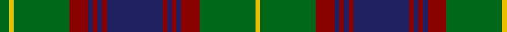

In pattern [GYGRBRBRBRBRBRGY](/stripes/gygrbrbrbrbrbrgy/).

This was sourced from house-of-tartan.  It is a [16 stripe tartan](/stripes/stripes16/).

Original link http://www.house-of-tartan.scotland.net/house/TartanViewjs.asp?colr=Def&tnam=2228

## Thread count
G/8 Y4 G48 DR16 DB4 DR4 DB4 DR4 DB48 DR4 DB4 DR4 DB4 DR16 G48 Y/4

## Palette
Each colour and the base-6 reference it is a variant of.

| Colour | Shade | Base |
|---|---|---|
| DB | <code style="background-color:#202060;">#202060</code> `oklch(28.9% 0.111 276.9)` <small>#202060</small> | B <code style="background-color:#2A418A;">#2A418A</code> |
| DG | <code style="background-color:#003820;">#003820</code> `oklch(30.0% 0.070 158.3)` <small>#003820</small> | G <code style="background-color:#006100;">#006100</code> |
| DR | <code style="background-color:#880000;">#880000</code> `oklch(39.4% 0.162 29.2)` <small>#880000</small> | R <code style="background-color:#CC0000;">#CC0000</code> |
| G | <code style="background-color:#006818;">#006818</code> `oklch(45.0% 0.142 145.0)` <small>#006818</small> | G <code style="background-color:#006100;">#006100</code> |
| O | <code style="background-color:#DC943C;">#DC943C</code> `oklch(72.3% 0.133 67.9)` <small>#DC943C</small> | Y <code style="background-color:#F2BF00;">#F2BF00</code> |
| Y | <code style="background-color:#E8C000;">#E8C000</code> `oklch(81.9% 0.168 93.7)` <small>#E8C000</small> | Y <code style="background-color:#F2BF00;">#F2BF00</code> |

## Nearest tartans

The nearest existing variants by ΔTartan distance, with this tartan at the top so the swatches line up against it.

ΔTartan

Tartan

Sett

—

<a href="/ttd/edit/#slug=db12r1db1r1db1r4g12ly1g2~x4">Durie Clan Tartan Tartan Number: 2228. Earliest known date: 1988 When the matriculation of the Durie 'Arms' was updated in June 1988, this tartan was designed for family use by Harry G Lindlay of Kinloch &amp; Anderson of Edinburgh. The design is said to be based on the Argyle &amp; Southern Highlanders regimental tartan - the yellow is from the mess dress (military uniform evening wear) facings (lapels) and the burgundy represents the Durie family's French connections. Andrew, son of Lt. Col. Raymond Varley Dewar Durie succeded his father as clan chieftain in 1999. See products available Copyright © Blair Urquhart, Comrie, 2015</a> <a class="nn-out" href="/setts/s16/db12r1db1r1db1r4g12ly1g2~x4/" title="open its dictionary page">↗</a>

0.96

<a href="/ttd/edit/#slug=r3db16k16g4k2g2k2g34r4g3r2g3~x2">Park</a> <a class="nn-out" href="/setts/s12/r3db16k16g4k2g2k2g34r4g3r2g3~x2/" title="open its dictionary page">↗</a>

1.03

<a href="/setts/s22/r3db16k16g4k2g2k2g34r4g3r2g3~x2/">Park Clan/Family Weavers Tartan Tartan Number: 2387. Earliest known date: September 1996 William D. Park wished to have a tartan for himself and family. Can be worn by those of the same name. See products available Copyright © Blair Urquhart, Comrie, 2015</a>

1.03

<a href="/ttd/edit/#slug=db2t1r2g16r2db6t1r2g6r2db16t1r2g2~x2">Glen Orchy</a> <a class="nn-out" href="/setts/s14/db2t1r2g16r2db6t1r2g6r2db16t1r2g2~x2/" title="open its dictionary page">↗</a>

1.03

<a href="/ttd/edit/#slug=k2db2g24r2g2r12g3k12db11k3db11g2r2g24db2~x2">MacInroy Hunting</a> <a class="nn-out" href="/setts/s15/k2db2g24r2g2r12g3k12db11k3db11g2r2g24db2~x2/" title="open its dictionary page">↗</a>

1.11

<a href="/ttd/edit/#slug=r6g6r2k24r2db2k2r2k24r2g6r6db2k6r2g27r2k2r2g27r2k6db2~x2">Buchan</a> <a class="nn-out" href="/setts/s23/r6g6r2k24r2db2k2r2k24r2g6r6db2k6r2g27r2k2r2g27r2k6db2~x2/" title="open its dictionary page">↗</a>

1.17

<a href="/ttd/edit/#slug=o16k2o3k2o4k10n27lr2n8lr2n27k10o4k2o3k2o16n2~x2">Highland Granite Weavers Tartan Tartan Number: 6499. Earliest known date: 2005 The colours reflect the imposing scenery when journeying north from Perth to Inverness or through to Royal Deeside, granite being the predominant composition of the surrounding unique hills and mountains. This tartan is for those wishing to embrace the growing popularity of the kilt who may either have no strong clan tartan connection, or who wish to wear a tartan different from their own. See products available Copyright © Blair Urquhart, Comrie, 2015</a> <a class="nn-out" href="/setts/s18/o16k2o3k2o4k10n27lr2n8lr2n27k10o4k2o3k2o16n2~x2/" title="open its dictionary page">↗</a>

1.18

<a href="/ttd/edit/#slug=lb1dr1g1dr11db6dr1g14dr1g1lb1~x4">Glen Tilt #1</a> <a class="nn-out" href="/setts/s10/lb1dr1g1dr11db6dr1g14dr1g1lb1~x4/" title="open its dictionary page">↗</a>

1.19

<a href="/ttd/edit/#slug=g34r4g3r2g4r2g3r4g17k17r2db17r4db4ly3~x2">Cochrane</a> <a class="nn-out" href="/setts/s15/g34r4g3r2g4r2g3r4g17k17r2db17r4db4ly3~x2/" title="open its dictionary page">↗</a>

1.20

<a href="/ttd/edit/#slug=g5db20g20db2g2db2g25r2g2r17k8g2w2~x2">Boyle, Cameron (Personal)</a> <a class="nn-out" href="/setts/s13/g5db20g20db2g2db2g25r2g2r17k8g2w2~x2/" title="open its dictionary page">↗</a>

1.21

<a href="/ttd/edit/#slug=g34r4g4r2g4r2g3r4g17k17r2db17r4db4ly3~x2">Cochrane (1984) Clan Tartan Tartan Number: 978. Earliest known date: 1984 Lord Dundonald originally registered a version missing a red and a green stripe in 1974. There is a story that a fragment of this design was discovered in the foundations of a Perthshire house in 1934. Around that time, a count was recorded from the sample books of Messrs William Anderson. The red and green have been restored in this version, which is now the 'approved' tartan, and appears in the 'Appendix' of the Lyon Court Books dated 12th November 1984. See products available Copyright © Blair Urquhart, Comrie, 2015</a> <a class="nn-out" href="/setts/s15/g34r4g4r2g4r2g3r4g17k17r2db17r4db4ly3~x2/" title="open its dictionary page">↗</a>

## Neighbour map

Every grey dot is one of 14299 variants placed by the first two principal components of the ΔTartan feature space (44% of its variance). Red is this tartan; blue dots are its nearest — click one to open its page.

<svg viewBox="0 0 640 380" role="img" style="max-width:100%;height:auto;border:1px solid #e0e0e0;border-radius:4px;display:block" xmlns="http://www.w3.org/2000/svg"><image href="/nn/cloud.v1.png" width="640" height="380"/><a href="/setts/s12/r3db16k16g4k2g2k2g34r4g3r2g3~x2/"><circle cx="305.3" cy="152.5" r="4" fill="#3465a4"><title>Park</title></circle></a><a href="/setts/s22/r3db16k16g4k2g2k2g34r4g3r2g3~x2/"><circle cx="293.8" cy="130.2" r="4" fill="#3465a4"><title>Park Clan/Family Weavers Tartan Tartan Number: 2387. Earliest known date: September 1996 William D. Park wished to have a tartan for himself and family. Can be worn by those of the same name. See products available Copyright © Blair Urquhart, Comrie, 2015</title></circle></a><a href="/setts/s14/db2t1r2g16r2db6t1r2g6r2db16t1r2g2~x2/"><circle cx="259.6" cy="149.5" r="4" fill="#3465a4"><title>Glen Orchy</title></circle></a><a href="/setts/s15/k2db2g24r2g2r12g3k12db11k3db11g2r2g24db2~x2/"><circle cx="253.2" cy="159.9" r="4" fill="#3465a4"><title>MacInroy Hunting</title></circle></a><a href="/setts/s23/r6g6r2k24r2db2k2r2k24r2g6r6db2k6r2g27r2k2r2g27r2k6db2~x2/"><circle cx="254.5" cy="135.1" r="4" fill="#3465a4"><title>Buchan</title></circle></a><a href="/setts/s18/o16k2o3k2o4k10n27lr2n8lr2n27k10o4k2o3k2o16n2~x2/"><circle cx="273.1" cy="154.9" r="4" fill="#3465a4"><title>Highland Granite Weavers Tartan Tartan Number: 6499. Earliest known date: 2005 The colours reflect the imposing scenery when journeying north from Perth to Inverness or through to Royal Deeside, granite being the predominant composition of the surrounding unique hills and mountains. This tartan is for those wishing to embrace the growing popularity of the kilt who may either have no strong clan tartan connection, or who wish to wear a tartan different from their own. See products available Copyright © Blair Urquhart, Comrie, 2015</title></circle></a><a href="/setts/s10/lb1dr1g1dr11db6dr1g14dr1g1lb1~x4/"><circle cx="267.7" cy="160.3" r="4" fill="#3465a4"><title>Glen Tilt #1</title></circle></a><a href="/setts/s15/g34r4g3r2g4r2g3r4g17k17r2db17r4db4ly3~x2/"><circle cx="265.9" cy="128.3" r="4" fill="#3465a4"><title>Cochrane</title></circle></a><a href="/setts/s13/g5db20g20db2g2db2g25r2g2r17k8g2w2~x2/"><circle cx="271.2" cy="160.6" r="4" fill="#3465a4"><title>Boyle, Cameron (Personal)</title></circle></a><a href="/setts/s15/g34r4g4r2g4r2g3r4g17k17r2db17r4db4ly3~x2/"><circle cx="265.6" cy="128.0" r="4" fill="#3465a4"><title>Cochrane (1984) Clan Tartan Tartan Number: 978. Earliest known date: 1984 Lord Dundonald originally registered a version missing a red and a green stripe in 1974. There is a story that a fragment of this design was discovered in the foundations of a Perthshire house in 1934. Around that time, a count was recorded from the sample books of Messrs William Anderson. The red and green have been restored in this version, which is now the 'approved' tartan, and appears in the 'Appendix' of the Lyon Court Books dated 12th November 1984. See products available Copyright © Blair Urquhart, Comrie, 2015</title></circle></a><circle cx="275.7" cy="152.7" r="5" fill="#c00000"/></svg>

ID: /setts/s16/db12r1db1r1db1r4g12ly1g2~x4/
