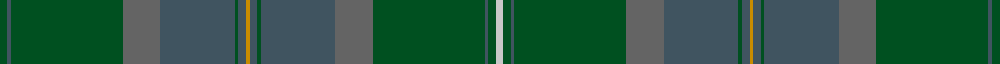

This page is one **sett** — a single exact thread-count. It belongs to the [tartan](/tartans/g2n1g30na10n20g1n2dy1n2g1n20na10g30n1g2nb2/)
(the same proportion at any scale), whose colour order is pattern [GBGBBGBYBGBBGBGW](/stripes/gbgbbgbybgbbgbgw/).

Sourced from register-of-tartans.  It is a [16 stripe tartan](/stripes/stripes16/).

Original link https://www.tartanregister.gov.uk/tartanDetails.aspx?ref=3709

2 attestations — the source records this cloth was collapsed from (oldest owns this page)

<ul>
<li>01/01/1996 — Scottish Borderland (register-of-tartans, <a href="https://www.tartanregister.gov.uk/tartanDetails.aspx?ref=3709">record</a>)</li>
<li>undated — Scottish Borderland Fashion Tartan Tartan Number: 5359. Earliest known date: pre 1996 Lochcarron of Scotland. Sample in STA Johnston Collection. See products available Copyright © Blair Urquhart, Comrie, 2015 (house-of-tartan, <a href="http://www.house-of-tartan.scotland.net/house/TartanViewjs.asp?colr=Def&tnam=5359">record</a>)</li>
</ul>

## Register references

External register numbers recorded for this tartan.

- Scottish Register of Tartans: [3709](https://www.tartanregister.gov.uk/tartanDetails.aspx?ref=3709)
- Scottish Tartans Authority (ITI): 5359

## Thread count
G/4 N2 G60 Na20 N40 G2 N4 DY2 N4 G2 N40 Na20 G60 N2 G4 Nb/4

## Palette
Each colour and the base-6 reference it is a variant of.

| Colour | Shade | Base |
|---|---|---|
| DY | <code style="background-color:#C88C00;">#C88C00</code> `oklch(68.2% 0.142 78.2)` <small>#C88C00</small> | Y <code style="background-color:#F2BF00;">#F2BF00</code> |
| G | <code style="background-color:#005020;">#005020</code> `oklch(37.7% 0.105 149.6)` <small>#005020</small> | G <code style="background-color:#006100;">#006100</code> |
| N | <code style="background-color:#405460;">#405460</code> `oklch(43.4% 0.032 234.8)` <small>#405460</small> | B <code style="background-color:#2A418A;">#2A418A</code> |
| Na | <code style="background-color:#646464;">#646464</code> `oklch(50.3% 0.000 89.9)` <small>#646464</small> | B <code style="background-color:#2A418A;">#2A418A</code> |
| Nb | <code style="background-color:#C8C8C8;">#C8C8C8</code> `oklch(83.3% 0.000 89.9)` <small>#C8C8C8</small> | W <code style="background-color:#F7F7F7;">#F7F7F7</code> |

## Nearest tartans

The nearest existing variants by ΔTartan distance, with this tartan at the top so the swatches line up against it.

ΔTartan

Tartan

Sett

—

<a href="/ttd/edit/#slug=dg2n1dg30n10n20dg1n2lo1n2dg1n20n10dg30n1dg2lb2~x2">Scottish Borderland</a> <a class="nn-out" href="/setts/s16/dg2n1dg30n10n20dg1n2lo1n2dg1n20n10dg30n1dg2lb2~x2/" title="open its dictionary page">↗</a>

1.36

<a href="/ttd/edit/#slug=dg18dg4b1dg5dg6dg3k1dy6k1dg25b1~x2">Mack of Stoneywood Hunting (Personal)</a> <a class="nn-out" href="/setts/s11/dg18dg4b1dg5dg6dg3k1dy6k1dg25b1~x2/" title="open its dictionary page">↗</a>

1.37

<a href="/ttd/edit/#slug=dg18dg4t1dg5dg6dg3k1dy6k1dg25t1~x2">Mack of Stoneywood Hunting (Pers.)</a> <a class="nn-out" href="/setts/s11/dg18dg4t1dg5dg6dg3k1dy6k1dg25t1~x2/" title="open its dictionary page">↗</a>

1.60

<a href="/ttd/edit/#slug=lb2dg2n1dg30n10n20dg1n2lo1~x2">Scottish Borderland (Fashion)</a> <a class="nn-out" href="/setts/s9/lb2dg2n1dg30n10n20dg1n2lo1~x2/" title="open its dictionary page">↗</a>

1.73

<a href="/ttd/edit/#slug=g14dg14n14k1n1k1dg38g9n9~x2">Fiddes - 2007 (Personal)</a> <a class="nn-out" href="/setts/s9/g14dg14n14k1n1k1dg38g9n9~x2/" title="open its dictionary page">↗</a>

1.76

<a href="/ttd/edit/#slug=dg21k1r4k1dy21dg3dy3dg3dy21dg3lo4dg21dy3dg3dy3~x2">Ensign of Ontario (Fashion)</a> <a class="nn-out" href="/setts/s15/dg21k1r4k1dy21dg3dy3dg3dy21dg3lo4dg21dy3dg3dy3~x2/" title="open its dictionary page">↗</a>

1.85

<a href="/ttd/edit/#slug=dg33dg4dg4dg4dg5dg13o13dg13o2dg11o1dg2~x2">Highlander (Corporate)</a> <a class="nn-out" href="/setts/s12/dg33dg4dg4dg4dg5dg13o13dg13o2dg11o1dg2~x2/" title="open its dictionary page">↗</a>

1.87

<a href="/ttd/edit/#slug=y33lo1y3r3g3lo1g21lo1g3r3g3lo1g21~x2">Terry</a> <a class="nn-out" href="/setts/s13/y33lo1y3r3g3lo1g21lo1g3r3g3lo1g21~x2/" title="open its dictionary page">↗</a>

1.88

<a href="/ttd/edit/#slug=dg6n2lb1dg9dt2dg7dt4dg4dt7dg2dt20r1dt2r1dr3dt3r3~x2">Queensferry</a> <a class="nn-out" href="/setts/s17/dg6n2lb1dg9dt2dg7dt4dg4dt7dg2dt20r1dt2r1dr3dt3r3~x2/" title="open its dictionary page">↗</a>

1.90

<a href="/ttd/edit/#slug=dg3dt20dg16r2dg2r3dg3r5dg16dt20ly1k2~x2">Alasdair Dhana</a> <a class="nn-out" href="/setts/s12/dg3dt20dg16r2dg2r3dg3r5dg16dt20ly1k2~x2/" title="open its dictionary page">↗</a>

1.97

<a href="/ttd/edit/#slug=n1do1n12t1do3n1g6n2do1n2g6n1do3t1n12do1n1g1~x4">Wicklow, County</a> <a class="nn-out" href="/setts/s18/n1do1n12t1do3n1g6n2do1n2g6n1do3t1n12do1n1g1~x4/" title="open its dictionary page">↗</a>

## Neighbour map

Every grey dot is one of 14299 variants placed by the first two principal components of the ΔTartan feature space (44% of its variance). Red is this tartan; blue dots are its nearest — click one to open its page.

<svg viewBox="0 0 640 380" role="img" style="max-width:100%;height:auto;border:1px solid #e0e0e0;border-radius:4px;display:block" xmlns="http://www.w3.org/2000/svg"><image href="/nn/cloud.v1.png" width="640" height="380"/><a href="/setts/s11/dg18dg4b1dg5dg6dg3k1dy6k1dg25b1~x2/"><circle cx="461.5" cy="218.1" r="4" fill="#3465a4"><title>Mack of Stoneywood Hunting (Personal)</title></circle></a><a href="/setts/s11/dg18dg4t1dg5dg6dg3k1dy6k1dg25t1~x2/"><circle cx="449.5" cy="209.6" r="4" fill="#3465a4"><title>Mack of Stoneywood Hunting (Pers.)</title></circle></a><a href="/setts/s9/lb2dg2n1dg30n10n20dg1n2lo1~x2/"><circle cx="414.8" cy="184.8" r="4" fill="#3465a4"><title>Scottish Borderland (Fashion)</title></circle></a><a href="/setts/s9/g14dg14n14k1n1k1dg38g9n9~x2/"><circle cx="469.1" cy="232.3" r="4" fill="#3465a4"><title>Fiddes - 2007 (Personal)</title></circle></a><a href="/setts/s15/dg21k1r4k1dy21dg3dy3dg3dy21dg3lo4dg21dy3dg3dy3~x2/"><circle cx="406.3" cy="190.1" r="4" fill="#3465a4"><title>Ensign of Ontario (Fashion)</title></circle></a><a href="/setts/s12/dg33dg4dg4dg4dg5dg13o13dg13o2dg11o1dg2~x2/"><circle cx="406.7" cy="201.8" r="4" fill="#3465a4"><title>Highlander (Corporate)</title></circle></a><a href="/setts/s13/y33lo1y3r3g3lo1g21lo1g3r3g3lo1g21~x2/"><circle cx="482.7" cy="186.8" r="4" fill="#3465a4"><title>Terry</title></circle></a><a href="/setts/s17/dg6n2lb1dg9dt2dg7dt4dg4dt7dg2dt20r1dt2r1dr3dt3r3~x2/"><circle cx="385.7" cy="189.3" r="4" fill="#3465a4"><title>Queensferry</title></circle></a><a href="/setts/s12/dg3dt20dg16r2dg2r3dg3r5dg16dt20ly1k2~x2/"><circle cx="382.4" cy="219.3" r="4" fill="#3465a4"><title>Alasdair Dhana</title></circle></a><a href="/setts/s18/n1do1n12t1do3n1g6n2do1n2g6n1do3t1n12do1n1g1~x4/"><circle cx="454.6" cy="224.4" r="4" fill="#3465a4"><title>Wicklow, County</title></circle></a><circle cx="436.9" cy="182.3" r="5" fill="#c00000"/></svg>

ID: /setts/s16/dg2n1dg30n10n20dg1n2lo1n2dg1n20n10dg30n1dg2lb2~x2/
