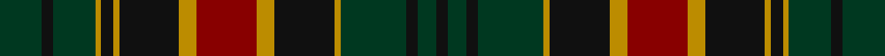

In pattern [GKGYKYKYRYKYGKGK](/stripes/gkgykykyrykygkgk/).

This was sourced from tartans-authority.  It is a [16 stripe tartan](/stripes/stripes16/).

Original link http://www.tartansauthority.com/tartan-ferret/display/10703/

## Thread count
DG/14 K4 DG14 DY2 K4 DY2 K20 DY6 DR20 DY6 K20 DY2 DG22 K4 DG6 K/4

## Palette
Each colour and its ΔE from the base-6 reference it is a variant of.

| Colour | Shade | Base | ΔE (OKLab) |
|---|---|---|---|
| DG | <code style="background-color:#003820;">#003820</code> `#003820` | G <code style="background-color:#006100;">#006100</code> | 0.15 |
| DR | <code style="background-color:#880000;">#880000</code> `#880000` | R <code style="background-color:#CC0000;">#CC0000</code> | 0.15 |
| DY | <code style="background-color:#BC8C00;">#BC8C00</code> `#BC8C00` | Y <code style="background-color:#F2BF00;">#F2BF00</code> | 0.16 |
| K | <code style="background-color:#101010;">#101010</code> `#101010` | K <code style="background-color:#000000;">#000000</code> | 0.17 |

## Nearest tartans

The nearest existing variants by ΔTartan distance.

1. [Matthew Gloag Corporate Tartan Tartan Number: 2397. Earliest known date: 1996 Designed by Gillian Kirkwood of House of Edgar in 1996 for Matthew Gloag & Son Ltd who were established in 1800 as a whisky blenders and makers of the Famous Grouse Whisky. The company is based in Perth, Scotland and now (2002) has a major new visitor attraction at Crieff, 17 miles west of Perth. See products available Copyright © Blair Urquhart, Comrie, 2015](/setts/s18/r3g20k2dt3k12dt3k2r20g3r20k2dt3k12dt3k2g20r3dt2~x2/) — ΔT 0.96
1. [Stewart Ancient (Fashion)](/setts/s15/db17g4k4g4db17r6k12r4k12r6g17k4db2k4g17/) — ΔT 1.01
1. [Kettles, Ryan & Alan (Personal)](/setts/s16/g13k2g2k2g2k12dp16k1g2k1dp16k12g12k1ly2dp1~x2/) — ΔT 1.11
1. [74th Regiment of Foot (Mil.)](/setts/s15/dt8k1dt2k1dt2k6g8k1w2k1g8k6dt8k1dt2~x4/) — ΔT 1.13
1. [Earl of Dumfries (Personal)](/setts/s15/dg13k6dg13r3k10r2k10r3db13k2dg2k2dg2k2db13~x2/) — ΔT 1.16
1. [Stuart/Stewart Ancient](/setts/s15/dg17k4db2k4dg17r6k12r4k12r6db17dg4k4dg4db17/) — ΔT 1.18
1. [Dewar's Highlander](/setts/s13/g56k6g7k6g7k35db45lo6db45k35g45k6g6/) — ΔT 1.26
1. [78th Regiment (Highlanders) (Mil.)](/setts/s15/dt30k5dt5k5dt5k31dg31k3w7k3dg31k31dt31k3r7/) — ΔT 1.27
1. [Murray of Atholl #3](/setts/s13/db12k2db2k2db2k12g12r3g12k12db12k1r3~x2/) — ΔT 1.27
1. [Safeway](/setts/s15/db19k3db3k3db3k20g19k2r5k2g19k20db19k3db3~x2/) — ΔT 1.27

## Neighbour map

Every grey dot is one of 14299 variants placed by the first two principal components of the ΔTartan feature space (44% of its variance). Red is this tartan; blue dots are its nearest — click one to open its page.

<svg viewBox="0 0 640 380" role="img" style="max-width:100%;height:auto;border:1px solid #e0e0e0;border-radius:4px;display:block" xmlns="http://www.w3.org/2000/svg"><image href="/nn/cloud.v1.png" width="640" height="380"/><a href="/setts/s18/r3g20k2dt3k12dt3k2r20g3r20k2dt3k12dt3k2g20r3dt2~x2/"><circle cx="208.5" cy="172.7" r="4" fill="#3465a4"><title>Matthew Gloag Corporate Tartan Tartan Number: 2397. Earliest known date: 1996 Designed by Gillian Kirkwood of House of Edgar in 1996 for Matthew Gloag &amp; Son Ltd who were established in 1800 as a whisky blenders and makers of the Famous Grouse Whisky. The company is based in Perth, Scotland and now (2002) has a major new visitor attraction at Crieff, 17 miles west of Perth. See products available Copyright © Blair Urquhart, Comrie, 2015</title></circle></a><a href="/setts/s15/db17g4k4g4db17r6k12r4k12r6g17k4db2k4g17/"><circle cx="153.0" cy="210.1" r="4" fill="#3465a4"><title>Stewart Ancient (Fashion)</title></circle></a><a href="/setts/s16/g13k2g2k2g2k12dp16k1g2k1dp16k12g12k1ly2dp1~x2/"><circle cx="227.1" cy="160.9" r="4" fill="#3465a4"><title>Kettles, Ryan &amp; Alan (Personal)</title></circle></a><a href="/setts/s15/dt8k1dt2k1dt2k6g8k1w2k1g8k6dt8k1dt2~x4/"><circle cx="198.7" cy="209.5" r="4" fill="#3465a4"><title>74th Regiment of Foot (Mil.)</title></circle></a><a href="/setts/s15/dg13k6dg13r3k10r2k10r3db13k2dg2k2dg2k2db13~x2/"><circle cx="178.8" cy="222.3" r="4" fill="#3465a4"><title>Earl of Dumfries (Personal)</title></circle></a><a href="/setts/s15/dg17k4db2k4dg17r6k12r4k12r6db17dg4k4dg4db17/"><circle cx="159.2" cy="212.4" r="4" fill="#3465a4"><title>Stuart/Stewart Ancient</title></circle></a><a href="/setts/s13/g56k6g7k6g7k35db45lo6db45k35g45k6g6/"><circle cx="226.9" cy="211.0" r="4" fill="#3465a4"><title>Dewar's Highlander</title></circle></a><a href="/setts/s15/dt30k5dt5k5dt5k31dg31k3w7k3dg31k31dt31k3r7/"><circle cx="182.5" cy="176.8" r="4" fill="#3465a4"><title>78th Regiment (Highlanders) (Mil.)</title></circle></a><a href="/setts/s13/db12k2db2k2db2k12g12r3g12k12db12k1r3~x2/"><circle cx="190.0" cy="199.8" r="4" fill="#3465a4"><title>Murray of Atholl #3</title></circle></a><a href="/setts/s15/db19k3db3k3db3k20g19k2r5k2g19k20db19k3db3~x2/"><circle cx="215.6" cy="196.7" r="4" fill="#3465a4"><title>Safeway</title></circle></a><circle cx="211.8" cy="192.0" r="5" fill="#c00000"/></svg>

ID: /setts/s16/dg7k2dg7lo1k2lo1k10lo3r10lo3k10lo1dg11k2dg3k2~x2/
