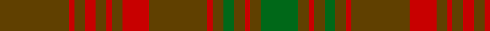

In pattern [GGRGGGRGRGRGRGRG](/stripes/ggrgggrgrgrgrgrg/).

This was sourced from tartans-authority.  It is a [16 stripe tartan](/stripes/stripes16/).

Original link http://www.tartansauthority.com/tartan-ferret/display/2039/

## Also known as

This cloth is also recorded under:

- Särna

## Attestations

This cloth appears in 2 source records; the oldest owns this page.

- pre 2002 — Sarna (District) (tartans-authority, [record](http://www.tartansauthority.com/tartan-ferret/display/2039/))
- undated — Särna District Tartan Tartan Number: 2039. Earliest known date: 1783 Sarna is a town in Sweden. See products available Copyright © Blair Urquhart, Comrie, 2015 (house-of-tartan, [record](http://www.house-of-tartan.scotland.net/house/TartanViewjs.asp?colr=Def&tnam=2039))

## Thread count
T/26 R2 T4 R4 T4 R2 T4 R10 T22 R2 T4 G4 T4 R2 T4 G/14

## Palette
Each colour and its ΔE from the base-6 reference it is a variant of.

| Colour | Shade | Base | ΔE (OKLab) |
|---|---|---|---|
| G | <code style="background-color:#006818;">#006818</code> `#006818` | G <code style="background-color:#006100;">#006100</code> | 0.02 |
| R | <code style="background-color:#C80000;">#C80000</code> `#C80000` | R <code style="background-color:#CC0000;">#CC0000</code> | 0.01 |
| T | <code style="background-color:#604000;">#604000</code> `#604000` | G <code style="background-color:#006100;">#006100</code> | 0.14 |

## Nearest tartans

The nearest existing variants by ΔTartan distance.

1. [Sarna](/setts/s16/o13r1o2r2o2r1o2r5o11r1o2g2o2r1o2g7~x2/) — ΔT 0.92
1. [Sarna (Town)](/setts/s30/dy13r1dy2r2dy2r1dy2r5dy11r1dy2g2dy2r1dy2g7~x2/) — ΔT 1.32
1. [Gray (Personal)](/setts/s18/n33g10r3g3r3g3r8n10r3n10r8g3r3g3r3g10n33r3~x2/) — ΔT 1.54
1. [Frame - Ferniegair (Personal)](/setts/s12/dg4dy14r1dy1dg1dy1r1dy14r14dy1r1dg1~x4/) — ΔT 1.54
1. [MacAlister of Glenbarr Clan Tartan Tartan Number: 910. Earliest known date: pre 1984 This version of the MacAlister of Glenbarr tartan is the same as the MacGillivray hunting tartan. This sample was taken from a piece woven by Lochcarron Weavers around 1984. See products available Copyright © Blair Urquhart, Comrie, 2015](/setts/s14/g4dy2g2dy2g2dy3db1dy1g4dy1db1dy12db2dy3~x2/) — ΔT 1.61
1. [MacAlister of Glenbarr](/setts/s14/g4o2g2o2g2o3db1o1g4o1db1o12db2o3~x2/) — ΔT 1.66
1. [Yarrow](/setts/s11/dy42do10t2do2lo2do2dy10lo6do2lo3dy2~x2/) — ΔT 1.80
1. [MacGillivray Htg (Clan)](/setts/s14/g8o5g5o5g5o6db1o2g8o2db1o24db4o6~x2/) — ΔT 1.85
1. [Gray (Name)](/setts/s10/r3y33g10r3g3r3g3r8y10r3~x2/) — ΔT 1.88
1. [Howells](/setts/s15/n16r1dg3n5r1n5dg3n4dg12n14ly1n14dg12ly2r6~x2/) — ΔT 1.90

## Neighbour map

Every grey dot is one of 14299 variants placed by the first two principal components of the ΔTartan feature space (44% of its variance). Red is this tartan; blue dots are its nearest — click one to open its page.

<svg viewBox="0 0 640 380" role="img" style="max-width:100%;height:auto;border:1px solid #e0e0e0;border-radius:4px;display:block" xmlns="http://www.w3.org/2000/svg"><image href="/nn/cloud.v1.png" width="640" height="380"/><a href="/setts/s16/o13r1o2r2o2r1o2r5o11r1o2g2o2r1o2g7~x2/"><circle cx="480.8" cy="212.3" r="4" fill="#3465a4"><title>Sarna</title></circle></a><a href="/setts/s30/dy13r1dy2r2dy2r1dy2r5dy11r1dy2g2dy2r1dy2g7~x2/"><circle cx="466.0" cy="183.3" r="4" fill="#3465a4"><title>Sarna (Town)</title></circle></a><a href="/setts/s18/n33g10r3g3r3g3r8n10r3n10r8g3r3g3r3g10n33r3~x2/"><circle cx="430.4" cy="216.7" r="4" fill="#3465a4"><title>Gray (Personal)</title></circle></a><a href="/setts/s12/dg4dy14r1dy1dg1dy1r1dy14r14dy1r1dg1~x4/"><circle cx="446.2" cy="192.8" r="4" fill="#3465a4"><title>Frame - Ferniegair (Personal)</title></circle></a><a href="/setts/s14/g4dy2g2dy2g2dy3db1dy1g4dy1db1dy12db2dy3~x2/"><circle cx="467.8" cy="247.7" r="4" fill="#3465a4"><title>MacAlister of Glenbarr Clan Tartan Tartan Number: 910. Earliest known date: pre 1984 This version of the MacAlister of Glenbarr tartan is the same as the MacGillivray hunting tartan. This sample was taken from a piece woven by Lochcarron Weavers around 1984. See products available Copyright © Blair Urquhart, Comrie, 2015</title></circle></a><a href="/setts/s14/g4o2g2o2g2o3db1o1g4o1db1o12db2o3~x2/"><circle cx="440.2" cy="228.7" r="4" fill="#3465a4"><title>MacAlister of Glenbarr</title></circle></a><a href="/setts/s11/dy42do10t2do2lo2do2dy10lo6do2lo3dy2~x2/"><circle cx="505.9" cy="169.0" r="4" fill="#3465a4"><title>Yarrow</title></circle></a><a href="/setts/s14/g8o5g5o5g5o6db1o2g8o2db1o24db4o6~x2/"><circle cx="446.5" cy="183.7" r="4" fill="#3465a4"><title>MacGillivray Htg (Clan)</title></circle></a><a href="/setts/s10/r3y33g10r3g3r3g3r8y10r3~x2/"><circle cx="413.4" cy="225.0" r="4" fill="#3465a4"><title>Gray (Name)</title></circle></a><a href="/setts/s15/n16r1dg3n5r1n5dg3n4dg12n14ly1n14dg12ly2r6~x2/"><circle cx="390.5" cy="197.5" r="4" fill="#3465a4"><title>Howells</title></circle></a><circle cx="479.1" cy="214.3" r="5" fill="#c00000"/></svg>

ID: /setts/s16/dy13r1dy2r2dy2r1dy2r5dy11r1dy2g2dy2r1dy2g7~x2/
