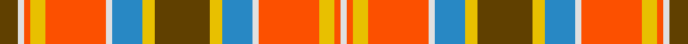

This page is one **sett** — a single exact thread-count. It belongs to the [tartan](/tartans/dy18ly4t10w2r20ly5r2w2dy6/)
(the same proportion at any scale), whose colour order is pattern [GWRYRWBYGYBWRYRW](/stripes/gwryrwbygybwryrw/).

Sourced from register-of-tartans.  It is a [16 stripe tartan](/stripes/stripes16/).

Original link https://www.tartanregister.gov.uk/tartanDetails.aspx?ref=3657

## Register references

External register numbers recorded for this tartan.

- Scottish Register of Tartans: [3657](https://www.tartanregister.gov.uk/tartanDetails.aspx?ref=3657)
- Scottish Tartans Authority (ITI): 3979
- Scottish Tartans World Register: 2853

## Thread count
T/12 LN4 R4 Y10 R40 LN4 B20 Y8 T36 Y8 B20 LN4 R40 Y10 R4 LN/4

## Palette

Palette: <strong>Tartan Register</strong> <small style="color:#888">(6 of 8 colours)</small>
<table><thead><tr><th>Colour</th><th>Threads</th><th>Shade</th><th>Base</th><th>OKLCh</th></tr></thead><tbody><tr><td>T/</td><td style="text-align:right;font-variant-numeric:tabular-nums">12</td><td><code style="background-color:#604000;">#604000</code> <small style="color:#888">#604000</small></td><td>G <code style="background-color:#006100;">#006100</code></td><td><small style="color:#888">oklch(39.8% 0.083 76.8)</small></td></tr><tr><td>LN</td><td style="text-align:right;font-variant-numeric:tabular-nums">4</td><td><code style="background-color:#E0E0E0;">#E0E0E0</code> <small style="color:#888">#E0E0E0</small></td><td>W <code style="background-color:#F7F7F7;">#F7F7F7</code></td><td><small style="color:#888">oklch(90.7% 0.000 89.9)</small></td></tr><tr><td>R</td><td style="text-align:right;font-variant-numeric:tabular-nums">4</td><td><code style="background-color:#FC5000;">#FC5000</code> <small style="color:#888">#FC5000</small></td><td>R <code style="background-color:#CC0000;">#CC0000</code></td><td><small style="color:#888">oklch(66.6% 0.219 37.9)</small></td></tr><tr><td>Y</td><td style="text-align:right;font-variant-numeric:tabular-nums">10</td><td><code style="background-color:#E8C000;">#E8C000</code> <small style="color:#888">#E8C000</small></td><td>Y <code style="background-color:#F2BF00;">#F2BF00</code></td><td><small style="color:#888">oklch(81.9% 0.168 93.7)</small></td></tr><tr><td>R</td><td style="text-align:right;font-variant-numeric:tabular-nums">40</td><td><code style="background-color:#FC5000;">#FC5000</code> <small style="color:#888">#FC5000</small></td><td>R <code style="background-color:#CC0000;">#CC0000</code></td><td><small style="color:#888">oklch(66.6% 0.219 37.9)</small></td></tr><tr><td>LN</td><td style="text-align:right;font-variant-numeric:tabular-nums">4</td><td><code style="background-color:#E0E0E0;">#E0E0E0</code> <small style="color:#888">#E0E0E0</small></td><td>W <code style="background-color:#F7F7F7;">#F7F7F7</code></td><td><small style="color:#888">oklch(90.7% 0.000 89.9)</small></td></tr><tr><td>B</td><td style="text-align:right;font-variant-numeric:tabular-nums">20</td><td><code style="background-color:#2888C4;">#2888C4</code> <small style="color:#888">#2888C4</small></td><td>B <code style="background-color:#2A418A;">#2A418A</code></td><td><small style="color:#888">oklch(60.1% 0.125 241.5)</small></td></tr><tr><td>Y</td><td style="text-align:right;font-variant-numeric:tabular-nums">8</td><td><code style="background-color:#E8C000;">#E8C000</code> <small style="color:#888">#E8C000</small></td><td>Y <code style="background-color:#F2BF00;">#F2BF00</code></td><td><small style="color:#888">oklch(81.9% 0.168 93.7)</small></td></tr><tr><td>T</td><td style="text-align:right;font-variant-numeric:tabular-nums">36</td><td><code style="background-color:#604000;">#604000</code> <small style="color:#888">#604000</small></td><td>G <code style="background-color:#006100;">#006100</code></td><td><small style="color:#888">oklch(39.8% 0.083 76.8)</small></td></tr><tr><td>Y</td><td style="text-align:right;font-variant-numeric:tabular-nums">8</td><td><code style="background-color:#E8C000;">#E8C000</code> <small style="color:#888">#E8C000</small></td><td>Y <code style="background-color:#F2BF00;">#F2BF00</code></td><td><small style="color:#888">oklch(81.9% 0.168 93.7)</small></td></tr><tr><td>B</td><td style="text-align:right;font-variant-numeric:tabular-nums">20</td><td><code style="background-color:#2888C4;">#2888C4</code> <small style="color:#888">#2888C4</small></td><td>B <code style="background-color:#2A418A;">#2A418A</code></td><td><small style="color:#888">oklch(60.1% 0.125 241.5)</small></td></tr><tr><td>LN</td><td style="text-align:right;font-variant-numeric:tabular-nums">4</td><td><code style="background-color:#E0E0E0;">#E0E0E0</code> <small style="color:#888">#E0E0E0</small></td><td>W <code style="background-color:#F7F7F7;">#F7F7F7</code></td><td><small style="color:#888">oklch(90.7% 0.000 89.9)</small></td></tr><tr><td>R</td><td style="text-align:right;font-variant-numeric:tabular-nums">40</td><td><code style="background-color:#FC5000;">#FC5000</code> <small style="color:#888">#FC5000</small></td><td>R <code style="background-color:#CC0000;">#CC0000</code></td><td><small style="color:#888">oklch(66.6% 0.219 37.9)</small></td></tr><tr><td>Y</td><td style="text-align:right;font-variant-numeric:tabular-nums">10</td><td><code style="background-color:#E8C000;">#E8C000</code> <small style="color:#888">#E8C000</small></td><td>Y <code style="background-color:#F2BF00;">#F2BF00</code></td><td><small style="color:#888">oklch(81.9% 0.168 93.7)</small></td></tr><tr><td>R</td><td style="text-align:right;font-variant-numeric:tabular-nums">4</td><td><code style="background-color:#FC5000;">#FC5000</code> <small style="color:#888">#FC5000</small></td><td>R <code style="background-color:#CC0000;">#CC0000</code></td><td><small style="color:#888">oklch(66.6% 0.219 37.9)</small></td></tr><tr><td>LN/</td><td style="text-align:right;font-variant-numeric:tabular-nums">4</td><td><code style="background-color:#E0E0E0;">#E0E0E0</code> <small style="color:#888">#E0E0E0</small></td><td>W <code style="background-color:#F7F7F7;">#F7F7F7</code></td><td><small style="color:#888">oklch(90.7% 0.000 89.9)</small></td></tr></tbody></table>

## Nearest tartans

The nearest existing variants by ΔTartan distance, with this tartan at the top so the swatches line up against it.

ΔTartan

Tartan

Sett

—

<a href="/ttd/edit/#slug=dy18ly4t10w2r20ly5r2w2dy6~x2">Satchidananda (Personal)</a> <a class="nn-out" href="/setts/s16/dy18ly4t10w2r20ly5r2w2dy6~x2/" title="open its dictionary page">↗</a>

1.26

<a href="/ttd/edit/#slug=k2loi4lo5loii2lo1k1lo2k12lo2k1lo2loii6loi7loii3loi12loii1lo4loii1lo12loi1~x2">Highland Aircraft</a> <a class="nn-out" href="/setts/s20/k2loi4lo5loii2lo1k1lo2k12lo2k1lo2loii6loi7loii3loi12loii1lo4loii1lo12loi1~x2/" title="open its dictionary page">↗</a>

1.28

<a href="/ttd/edit/#slug=dy18ly4t10w2r20ly5r2w2dy6~x2">Satchidananda (Personal)</a> <a class="nn-out" href="/setts/s9/dy18ly4t10w2r20ly5r2w2dy6~x2/" title="open its dictionary page">↗</a>

1.32

<a href="/ttd/edit/#slug=g1r2lg12r15w15g3w1g3w15r15lg3dy12lg1~x2">St. John New Brunswick (District)</a> <a class="nn-out" href="/setts/s13/g1r2lg12r15w15g3w1g3w15r15lg3dy12lg1~x2/" title="open its dictionary page">↗</a>

1.34

<a href="/ttd/edit/#slug=r11k1w1dg4w1ly1r1k1r1ly1w1dg4w1k1r1ly3~x2">Chattan (variation)</a> <a class="nn-out" href="/setts/s16/r11k1w1dg4w1ly1r1k1r1ly1w1dg4w1k1r1ly3~x2/" title="open its dictionary page">↗</a>

1.42

<a href="/ttd/edit/#slug=dr10lb1dr3lb6dr1lb3dr1o5ly1o3ly6o1ly3o1~x4">MacGlashan</a> <a class="nn-out" href="/setts/s14/dr10lb1dr3lb6dr1lb3dr1o5ly1o3ly6o1ly3o1~x4/" title="open its dictionary page">↗</a>

1.45

<a href="/ttd/edit/#slug=r6m3w3r4g33m3w3r4w3m3db9r33m3w4r4~x2">MacDougall 10</a> <a class="nn-out" href="/setts/s15/r6m3w3r4g33m3w3r4w3m3db9r33m3w4r4~x2/" title="open its dictionary page">↗</a>

1.45

<a href="/setts/s12/r32k3lo6g10r6k3lo32~x2/">Scrimgeour of Glassary</a>

1.48

<a href="/ttd/edit/#slug=r3w5r2w12ly1k2ly1w2ly1k2ly2k2r1dg4r2dg4r2~x2">Anderson Dress</a> <a class="nn-out" href="/setts/s17/r3w5r2w12ly1k2ly1w2ly1k2ly2k2r1dg4r2dg4r2~x2/" title="open its dictionary page">↗</a>

1.49

<a href="/ttd/edit/#slug=o35w4o3ly7o3w4o7dy15lr4w36lr5~x2">MacKellar Dress (Reproduction colours)</a> <a class="nn-out" href="/setts/s11/o35w4o3ly7o3w4o7dy15lr4w36lr5~x2/" title="open its dictionary page">↗</a>

1.50

<a href="/ttd/edit/#slug=db1ly3r3k2db8ly3r2k1r2ly3dg8w1k1r12w1~x2">MacPherson #2</a> <a class="nn-out" href="/setts/s15/db1ly3r3k2db8ly3r2k1r2ly3dg8w1k1r12w1~x2/" title="open its dictionary page">↗</a>

## Neighbour map

Every grey dot is one of 14359 variants placed by the first two principal components of the ΔTartan feature space (44% of its variance). Red is this tartan; blue dots are its nearest — click one to open its page.

<svg viewBox="0 0 640 380" role="img" style="max-width:100%;height:auto;border:1px solid #e0e0e0;border-radius:4px;display:block" xmlns="http://www.w3.org/2000/svg"><image href="/nn/cloud.v1.png" width="640" height="380"/><a href="/setts/s20/k2loi4lo5loii2lo1k1lo2k12lo2k1lo2loii6loi7loii3loi12loii1lo4loii1lo12loi1~x2/"><circle cx="154.3" cy="115.6" r="4" fill="#3465a4"><title>Highland Aircraft</title></circle></a><a href="/setts/s9/dy18ly4t10w2r20ly5r2w2dy6~x2/"><circle cx="151.5" cy="154.8" r="4" fill="#3465a4"><title>Satchidananda (Personal)</title></circle></a><a href="/setts/s13/g1r2lg12r15w15g3w1g3w15r15lg3dy12lg1~x2/"><circle cx="129.3" cy="122.0" r="4" fill="#3465a4"><title>St. John New Brunswick (District)</title></circle></a><a href="/setts/s16/r11k1w1dg4w1ly1r1k1r1ly1w1dg4w1k1r1ly3~x2/"><circle cx="170.2" cy="94.6" r="4" fill="#3465a4"><title>Chattan (variation)</title></circle></a><a href="/setts/s14/dr10lb1dr3lb6dr1lb3dr1o5ly1o3ly6o1ly3o1~x4/"><circle cx="126.9" cy="144.7" r="4" fill="#3465a4"><title>MacGlashan</title></circle></a><a href="/setts/s15/r6m3w3r4g33m3w3r4w3m3db9r33m3w4r4~x2/"><circle cx="213.3" cy="107.7" r="4" fill="#3465a4"><title>MacDougall 10</title></circle></a><a href="/setts/s12/r32k3lo6g10r6k3lo32~x2/"><circle cx="211.2" cy="149.9" r="4" fill="#3465a4"><title>Scrimgeour of Glassary</title></circle></a><a href="/setts/s17/r3w5r2w12ly1k2ly1w2ly1k2ly2k2r1dg4r2dg4r2~x2/"><circle cx="123.5" cy="102.8" r="4" fill="#3465a4"><title>Anderson Dress</title></circle></a><a href="/setts/s11/o35w4o3ly7o3w4o7dy15lr4w36lr5~x2/"><circle cx="185.8" cy="122.3" r="4" fill="#3465a4"><title>MacKellar Dress (Reproduction colours)</title></circle></a><a href="/setts/s15/db1ly3r3k2db8ly3r2k1r2ly3dg8w1k1r12w1~x2/"><circle cx="119.6" cy="99.5" r="4" fill="#3465a4"><title>MacPherson #2</title></circle></a><circle cx="152.9" cy="124.4" r="5" fill="#c00000"/></svg>

ID: /setts/s16/dy18ly4t10w2r20ly5r2w2dy6~x2/
