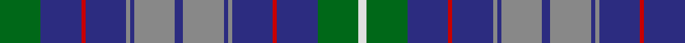

In pattern [GBRBRBRBRBRBRBGW](/patterns/gbrbrbrbrbrbrbgw/).

This was sourced from house-of-tartan.  It is a [16 stripes tartan](/stripes/stripes16/).

Original link http://www.house-of-tartan.scotland.net/house/TartanViewjs.asp?colr=Def&tnam=2316

## Thread count
G/20 DB20 R2 DB20 N2 DB2 N20 DB4 N20 DB2 N2 DB20 R2 DB20 G20 LN/4

## Palette
Each colour and its ΔE from the base-6 reference it is a variant of.

| Colour | Shade | Base | ΔE (OKLab) |
|---|---|---|---|
| DB | <code style="background-color:#2C2C80;">#2C2C80</code> `#2C2C80` | B <code style="background-color:#2A418A;">#2A418A</code> | 0.06 |
| G | <code style="background-color:#006818;">#006818</code> `#006818` | G <code style="background-color:#006100;">#006100</code> | 0.02 |
| LN | <code style="background-color:#E0E0E0;">#E0E0E0</code> `#E0E0E0` | W <code style="background-color:#F7F7F7;">#F7F7F7</code> | 0.07 |
| N | <code style="background-color:#888888;">#888888</code> `#888888` | R <code style="background-color:#CC0000;">#CC0000</code> | 0.24 |
| R | <code style="background-color:#C80000;">#C80000</code> `#C80000` | R <code style="background-color:#CC0000;">#CC0000</code> | 0.01 |

## Nearest tartans

The nearest existing variants by ΔTartan distance.

1. [Dickson Name Tartan Tartan Number: 10140. Earliest known date: July 2009 A tartan designed by Matthew Newsome for George Newberry of Macon, GA, USA who wishes it to be regarded as a tartan for all Dicksons from Kirkcudbrightshire, who are descended from Richard Keith, son of the Marischal of Scotland (d. 1249) and Margaret, daughter of the third Lord Douglas. See products available Copyright © Blair Urquhart, Comrie, 2015](/setts/s12/b4w3b29g12ba8bb8ba6bb8ba8g12b29w3~b002440-ba587084-bb181864-g448c68-wf8f8f8~x2/) — ΔT 1.08
1. [Powys Welsh District Tartan Tartan Number: 5747. Earliest known date: 2002 Tartan the Welsh County of Powys in Mid Wales. Differing in warp and weft, the threads and colours create an unusual striped effect, designed and woven at the Cambrian Woollen Mill which has been in existence since c.1830. Woven for Wales Tartan Centres, Swansea. See products available Copyright © Blair Urquhart, Comrie, 2015](/setts/s12/g24b7g7b7g7ba22b7ba4y4ba4b40r14~b1474b4-ba2c2c80-g285800-rc80000-ye8c000/) — ΔT 1.15
1. [Kildare, County](/setts/s14/g8b2g13r4g12ba22g5ra3g5ba22g12r4g13b2~b4c3428-ba2c2c80-g74846c-r880000-rab84c00~x2/) — ΔT 1.16
1. [Grainger](/setts/s12/b36r4b6g18b15k18w4k18b15g18b6r4~b2c2c80-g006818-k101010-rc80000-wfcfcfc~x2/) — ΔT 1.17
1. [Toronto Blue Jays](/setts/s11/r2b1ba13bb13b4bb4b4bb4ba13b1w2~b280034-ba2888c4-bb646464-rc80000-wfcfcfc~x2/) — ΔT 1.18
1. [American Soc.of Travel Agents (Corp)](/setts/s9/b2r10b1r1b10ra1b10g10w2~b2c2c80-g006818-r888888-rac80000-we0e0e0~x2/) — ΔT 1.21
1. [Kilkenny Irish County Tartan Tartan Number: 2280. Earliest known date: 1995 One of a series of Irish District tartans designed by Polly Wittering of the House of Edgar, with colours reminiscent of the Country with soft warm colours dominating. See products available Copyright © Blair Urquhart, Comrie, 2015](/setts/s13/g25r2b25y5g3ba3g3y5b25r2g27ba5g2~b2c1084-ba300438-g005438-ra46458-yc0a010~x2/) — ΔT 1.22
1. [MacCainsh Family Tartan Tartan Number: 1379. Earliest known date: pre 1992 From the Lumsden Collection ( Alec Lumsden of Toronto). See products available Copyright © Blair Urquhart, Comrie, 2015](/setts/s11/r2b8k1g2k1g4k1g2k1b8y2~b2c2c80-g006818-k101010-rc80000-ye8c000~x2/) — ΔT 1.23
1. [Cochrane Azure](/setts/s15/b27r4b3r2b4r2b3r4b14k14r2ba14r4ba4y3~b3c82af-ba2c4084-k101010-rdc0000-ye8c000~x2/) — ΔT 1.23
1. [Pride of Lorient](/setts/s17/r2y8b1y4b2y3b3y1b15ba1b4ba2b2ba4b1ba9w2~b426581-ba2d3743-rcd3731-weee9e2-y8faec3~x2/) — ΔT 1.24

## Neighbour map

Every grey dot is one of 15726 variants placed by the first two principal components of the ΔTartan feature space (44% of its variance). Red is this tartan; blue dots are its nearest — click one to open its page.

<svg viewBox="0 0 640 380" role="img" style="max-width:100%;height:auto;border:1px solid #e0e0e0;border-radius:4px;display:block" xmlns="http://www.w3.org/2000/svg"><image href="/nn/cloud.v1.png" width="640" height="380"/><a href="/setts/s12/b4w3b29g12ba8bb8ba6bb8ba8g12b29w3~b002440-ba587084-bb181864-g448c68-wf8f8f8~x2/"><circle cx="195.7" cy="177.5" r="4" fill="#3465a4"><title>Dickson Name Tartan Tartan Number: 10140. Earliest known date: July 2009 A tartan designed by Matthew Newsome for George Newberry of Macon, GA, USA who wishes it to be regarded as a tartan for all Dicksons from Kirkcudbrightshire, who are descended from Richard Keith, son of the Marischal of Scotland (d. 1249) and Margaret, daughter of the third Lord Douglas. See products available Copyright © Blair Urquhart, Comrie, 2015</title></circle></a><a href="/setts/s12/g24b7g7b7g7ba22b7ba4y4ba4b40r14~b1474b4-ba2c2c80-g285800-rc80000-ye8c000/"><circle cx="198.5" cy="173.1" r="4" fill="#3465a4"><title>Powys Welsh District Tartan Tartan Number: 5747. Earliest known date: 2002 Tartan the Welsh County of Powys in Mid Wales. Differing in warp and weft, the threads and colours create an unusual striped effect, designed and woven at the Cambrian Woollen Mill which has been in existence since c.1830. Woven for Wales Tartan Centres, Swansea. See products available Copyright © Blair Urquhart, Comrie, 2015</title></circle></a><a href="/setts/s14/g8b2g13r4g12ba22g5ra3g5ba22g12r4g13b2~b4c3428-ba2c2c80-g74846c-r880000-rab84c00~x2/"><circle cx="283.2" cy="180.1" r="4" fill="#3465a4"><title>Kildare, County</title></circle></a><a href="/setts/s12/b36r4b6g18b15k18w4k18b15g18b6r4~b2c2c80-g006818-k101010-rc80000-wfcfcfc~x2/"><circle cx="203.5" cy="195.0" r="4" fill="#3465a4"><title>Grainger</title></circle></a><a href="/setts/s11/r2b1ba13bb13b4bb4b4bb4ba13b1w2~b280034-ba2888c4-bb646464-rc80000-wfcfcfc~x2/"><circle cx="214.0" cy="162.3" r="4" fill="#3465a4"><title>Toronto Blue Jays</title></circle></a><a href="/setts/s9/b2r10b1r1b10ra1b10g10w2~b2c2c80-g006818-r888888-rac80000-we0e0e0~x2/"><circle cx="229.4" cy="184.5" r="4" fill="#3465a4"><title>American Soc.of Travel Agents (Corp)</title></circle></a><a href="/setts/s13/g25r2b25y5g3ba3g3y5b25r2g27ba5g2~b2c1084-ba300438-g005438-ra46458-yc0a010~x2/"><circle cx="260.6" cy="155.4" r="4" fill="#3465a4"><title>Kilkenny Irish County Tartan Tartan Number: 2280. Earliest known date: 1995 One of a series of Irish District tartans designed by Polly Wittering of the House of Edgar, with colours reminiscent of the Country with soft warm colours dominating. See products available Copyright © Blair Urquhart, Comrie, 2015</title></circle></a><a href="/setts/s11/r2b8k1g2k1g4k1g2k1b8y2~b2c2c80-g006818-k101010-rc80000-ye8c000~x2/"><circle cx="217.4" cy="179.2" r="4" fill="#3465a4"><title>MacCainsh Family Tartan Tartan Number: 1379. Earliest known date: pre 1992 From the Lumsden Collection ( Alec Lumsden of Toronto). See products available Copyright © Blair Urquhart, Comrie, 2015</title></circle></a><a href="/setts/s15/b27r4b3r2b4r2b3r4b14k14r2ba14r4ba4y3~b3c82af-ba2c4084-k101010-rdc0000-ye8c000~x2/"><circle cx="227.7" cy="129.1" r="4" fill="#3465a4"><title>Cochrane Azure</title></circle></a><a href="/setts/s17/r2y8b1y4b2y3b3y1b15ba1b4ba2b2ba4b1ba9w2~b426581-ba2d3743-rcd3731-weee9e2-y8faec3~x2/"><circle cx="229.1" cy="133.9" r="4" fill="#3465a4"><title>Pride of Lorient</title></circle></a><circle cx="224.2" cy="167.1" r="5" fill="#c00000"/></svg>

ID: /setts/s16/g10b10r1b10ra1b1ra10b2ra10b1ra1b10r1b10g10w2~b2c2c80-g006818-rc80000-ra888888-we0e0e0~x2/
