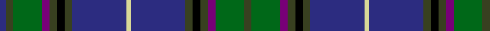

In pattern [BGGBGKGBYBGKGBGG](/patterns/bggbgkgbybgkgbgg/).

This was sourced from register-of-tartans.  It is a [16 stripes tartan](/stripes/stripes16/).

Original link https://www.tartanregister.gov.uk/tartanDetails.aspx?ref=4049

## Thread count
DBa/8 T10 Ga38 P10 T10 K10 T10 DBa72 LY6 DBa72 T10 K10 T10 P10 Ga38 T/10

## Palette
Each colour and its ΔE from the base-6 reference it is a variant of.

| Colour | Shade | Base | ΔE (OKLab) |
|---|---|---|---|
| B | <code style="background-color:#1474B4;">#1474B4</code> `#1474B4` | B <code style="background-color:#2C4084;">#2C4084</code> | 0.15 |
| DB | <code style="background-color:#000064;">#000064</code> `#000064` | B <code style="background-color:#2C4084;">#2C4084</code> | 0.17 |
| DBa | <code style="background-color:#2C2C80;">#2C2C80</code> `#2C2C80` | B <code style="background-color:#2C4084;">#2C4084</code> | 0.05 |
| DP | <code style="background-color:#4C004C;">#4C004C</code> `#4C004C` | B <code style="background-color:#2C4084;">#2C4084</code> | 0.16 |
| G | <code style="background-color:#003800;">#003800</code> `#003800` | G <code style="background-color:#006400;">#006400</code> | 0.15 |
| Ga | <code style="background-color:#006818;">#006818</code> `#006818` | G <code style="background-color:#006400;">#006400</code> | 0.02 |
| K | <code style="background-color:#000000;">#000000</code> `#000000` | K <code style="background-color:#000000;">#000000</code> | 0.00 |
| LY | <code style="background-color:#D8D898;">#D8D898</code> `#D8D898` | Y <code style="background-color:#E8C000;">#E8C000</code> | 0.10 |
| P | <code style="background-color:#780078;">#780078</code> `#780078` | B <code style="background-color:#2C4084;">#2C4084</code> | 0.16 |
| T | <code style="background-color:#384020;">#384020</code> `#384020` | G <code style="background-color:#006400;">#006400</code> | 0.13 |

## Nearest tartans

The nearest existing variants by ΔTartan distance.

1. [Souza Nery (Personal)](/setts/s12/b74r6k34r6g44ka8g44r6k34r6b74w6-b2c2c80-g006818-k101010-ka000000-rc8002c-we0e0e0/) — ΔT 1.00
1. [Scottish Rugby Union](/setts/s20/b12k4b48k20g4r4g4r4g20k4w6k4g20r4g4r4g4k20b48k4-b2c2c80-g006818-k101010-r9c68a4-wc0c0c0/) — ΔT 1.06
1. [Spirit of Fife](/setts/s14/g20w4b6ga4r28ba52g4ba12g4ba52r28ga4b6w4-b14283c-ba003c64-g005448-ga408060-rb468ac-wf8f8f8/) — ΔT 1.06
1. [Bailey, The House of](/setts/s15/b28k4ba4k4b4k4g26k2y5k2g26k4b40k4r10-b2c2c80-ba2888c4-g006818-k101010-rc80000-ye8c000/) — ΔT 1.07
1. [Annandale (Personal)](/setts/s16/b6r4ba4b32k4g4k4g4k4b32g4k20g8r8g24w6-b2c2c80-ba2888c4-g006818-k101010-rc80000-we0e0e0/) — ΔT 1.11
1. [Boyle (Personal)](/setts/s10/b8ba6r4ba52k6b6g6b6g34y6-b2c2c80-ba202060-g006818-k101010-r880000-ybc8c00/) — ΔT 1.12
1. [Kilkenny Irish County Tartan Tartan Number: 2280. Earliest known date: 1995 One of a series of Irish District tartans designed by Polly Wittering of the House of Edgar, with colours reminiscent of the Country with soft warm colours dominating. See products available Copyright © Blair Urquhart, Comrie, 2015](/setts/s13/g50r4b50y10g6ba6g6y10b50r4g54ba10g4-b2c1084-ba300438-g005438-ra46458-yc0a010/) — ΔT 1.16
1. [Barry (Name)](/setts/s15/g8b4k20b4k4b28r4b4k20ba4g4ba4g8k2w4-b1c0070-ba2c2c80-g00643c-k101010-rc80000-wfcfcfc/) — ΔT 1.17
1. [State Seal of North Dakota (Fashion)](/setts/s11/g74b10g10b24ba20bb10ba10bb80ga8bb8y8-b440044-ba1474b4-bb2c2c80-g006818-ga604000-ybc8c00/) — ΔT 1.18
1. [Herriot (Personal)](/setts/s16/r8b4r4b48k4b4k4b4k20g4k4g4k4g20k8y4-b2c2c80-g006818-k101010-r9c68a4-ye8c000/) — ΔT 1.18

## Neighbour map

Every grey dot is one of 15726 variants placed by the first two principal components of the ΔTartan feature space (44% of its variance). Red is this tartan; blue dots are its nearest — click one to open its page.

<svg viewBox="0 0 640 380" role="img" style="max-width:100%;height:auto;border:1px solid #e0e0e0;border-radius:4px;display:block" xmlns="http://www.w3.org/2000/svg"><image href="/nn/cloud.v1.png" width="640" height="380"/><a href="/setts/s12/b74r6k34r6g44ka8g44r6k34r6b74w6-b2c2c80-g006818-k101010-ka000000-rc8002c-we0e0e0/"><circle cx="186.7" cy="147.7" r="4" fill="#3465a4"><title>Souza Nery (Personal)</title></circle></a><a href="/setts/s20/b12k4b48k20g4r4g4r4g20k4w6k4g20r4g4r4g4k20b48k4-b2c2c80-g006818-k101010-r9c68a4-wc0c0c0/"><circle cx="224.5" cy="131.2" r="4" fill="#3465a4"><title>Scottish Rugby Union</title></circle></a><a href="/setts/s14/g20w4b6ga4r28ba52g4ba12g4ba52r28ga4b6w4-b14283c-ba003c64-g005448-ga408060-rb468ac-wf8f8f8/"><circle cx="242.1" cy="129.7" r="4" fill="#3465a4"><title>Spirit of Fife</title></circle></a><a href="/setts/s15/b28k4ba4k4b4k4g26k2y5k2g26k4b40k4r10-b2c2c80-ba2888c4-g006818-k101010-rc80000-ye8c000/"><circle cx="214.3" cy="108.1" r="4" fill="#3465a4"><title>Bailey, The House of</title></circle></a><a href="/setts/s16/b6r4ba4b32k4g4k4g4k4b32g4k20g8r8g24w6-b2c2c80-ba2888c4-g006818-k101010-rc80000-we0e0e0/"><circle cx="152.2" cy="141.7" r="4" fill="#3465a4"><title>Annandale (Personal)</title></circle></a><a href="/setts/s10/b8ba6r4ba52k6b6g6b6g34y6-b2c2c80-ba202060-g006818-k101010-r880000-ybc8c00/"><circle cx="237.6" cy="149.8" r="4" fill="#3465a4"><title>Boyle (Personal)</title></circle></a><a href="/setts/s13/g50r4b50y10g6ba6g6y10b50r4g54ba10g4-b2c1084-ba300438-g005438-ra46458-yc0a010/"><circle cx="258.3" cy="156.0" r="4" fill="#3465a4"><title>Kilkenny Irish County Tartan Tartan Number: 2280. Earliest known date: 1995 One of a series of Irish District tartans designed by Polly Wittering of the House of Edgar, with colours reminiscent of the Country with soft warm colours dominating. See products available Copyright © Blair Urquhart, Comrie, 2015</title></circle></a><a href="/setts/s15/g8b4k20b4k4b28r4b4k20ba4g4ba4g8k2w4-b1c0070-ba2c2c80-g00643c-k101010-rc80000-wfcfcfc/"><circle cx="167.7" cy="132.9" r="4" fill="#3465a4"><title>Barry (Name)</title></circle></a><a href="/setts/s11/g74b10g10b24ba20bb10ba10bb80ga8bb8y8-b440044-ba1474b4-bb2c2c80-g006818-ga604000-ybc8c00/"><circle cx="188.4" cy="155.3" r="4" fill="#3465a4"><title>State Seal of North Dakota (Fashion)</title></circle></a><a href="/setts/s16/r8b4r4b48k4b4k4b4k20g4k4g4k4g20k8y4-b2c2c80-g006818-k101010-r9c68a4-ye8c000/"><circle cx="211.3" cy="131.0" r="4" fill="#3465a4"><title>Herriot (Personal)</title></circle></a><circle cx="211.7" cy="134.1" r="5" fill="#c00000"/></svg>

ID: /setts/s16/g10ga38b10g10k10g10ba72y6ba72g10k10g10b10ga38g10ba8-b780078-ba2c2c80-g384020-ga006818-k000000-yd8d898/
