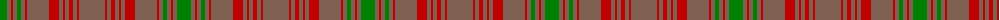

In pattern [GRRRGRRRRRRRRRRR](/patterns/grrrgrrrrrrrrrrr/).

This was sourced from weddslist.  It is a [16 stripes tartan](/stripes/stripes16/).

Original link http://www.weddslist.com/cgi-bin/tartans/pg.pl?source=sts

## Thread count
G/14 LT4 R2 LT4 G4 LT4 R2 LT22 R10 LT4 R2 LT4 R4 LT4 R2 LT/26

## Palette
Each colour and its ΔE from the base-6 reference it is a variant of.

| Colour | Shade | Base | ΔE (OKLab) |
|---|---|---|---|
| G | <code style="background-color:#008000;">#008000</code> `#008000` | G <code style="background-color:#006400;">#006400</code> | 0.09 |
| LT | <code style="background-color:#806050;">#806050</code> `#806050` | R <code style="background-color:#C80000;">#C80000</code> | 0.17 |
| R | <code style="background-color:#C00000;">#C00000</code> `#C00000` | R <code style="background-color:#C80000;">#C80000</code> | 0.02 |

ID: /setts/s16/g14r4ra2r4g4r4ra2r22ra10r4ra2r4ra4r4ra2r26-g008000-r806050-rac00000/
