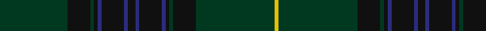

In pattern [GKGKBKBKBKBKGKGY](/patterns/gkgkbkbkbkbkgkgy/).

This was sourced from house-of-tartan.  It is a [16 stripes tartan](/stripes/stripes16/).

Original link http://www.house-of-tartan.scotland.net/house/TartanViewjs.asp?colr=Def&tnam=5776

## Thread count
DG/36 K12 DG2 K2 DB2 K12 DB2 K4 DB2 K12 DB2 K2 DG2 K12 DG42 Y/2

## Palette
Each colour and its ΔE from the base-6 reference it is a variant of.

| Colour | Shade | Base | ΔE (OKLab) |
|---|---|---|---|
| DB | <code style="background-color:#2C2C80;">#2C2C80</code> `#2C2C80` | B <code style="background-color:#2A418A;">#2A418A</code> | 0.06 |
| DG | <code style="background-color:#003820;">#003820</code> `#003820` | G <code style="background-color:#006100;">#006100</code> | 0.15 |
| K | <code style="background-color:#101010;">#101010</code> `#101010` | K <code style="background-color:#000000;">#000000</code> | 0.17 |
| Y | <code style="background-color:#E8C000;">#E8C000</code> `#E8C000` | Y <code style="background-color:#F2BF00;">#F2BF00</code> | 0.02 |

## Nearest tartans

The nearest existing variants by ΔTartan distance.

1. [Lochcarron Mill (Corporate)](/setts/s15/k2b6k2b1k2b1k2b4k4k2b4k19r2k2r2x4~b404040-k101010-r9c0030/) — ΔT 1.27
1. [Letham Hunting](/setts/s15/b2k1g6ka4k1ka5k2g30k2ba4k1ka4g6k1b2x2~b481148-ba1f2056-g074611-k101010-ka051304/) — ΔT 1.35
1. [Prince David Royal Family Tartan Tartan Number: 2125. Earliest known date: 1930 Mackinlay suggests that David was the pet name of the Duke of Windsor when he was a boy and that the tartan was designed for his personal use. See products available Copyright © Blair Urquhart, Comrie, 2015](/setts/s15/g3ga1y2g3ga1y2gb21g18gb2g3gb2g18gb21ga1y2x2~g003820-ga006818-gb604000-yd87c00/) — ΔT 1.69
1. [Walker Hunting](/setts/s22/r4b2g7b15g3b3g3b7g28k7g6k2g6k7g28b7g3b3g3b15g7b2x2~b202060-g205034-k101010-rc80000/) — ΔT 1.80
1. [Tiger of Sweden](/setts/s14/b3g1ba1b2bb16b2ba4g1ba1b16bb2b2ba1g3x2~b141e46-ba1c1c1c-bb505050-g005020/) — ΔT 1.83
1. [Ensign of Ontario](/setts/s15/g21k1r4k1ga21g3ga3g3ga21g3y4g21ga3g3ga3x2~g003820-ga604000-k101010-rc80000-ybc8c00/) — ΔT 1.87
1. [Peter of Lee Family Tartan Tartan Number: 1055. Earliest known date: 1988 Designed by Harry Lindley for E. Leslie Peter. The sett was accredited by the Scottish Tartans Society in 1988. See products available Copyright © Blair Urquhart, Comrie, 2015](/setts/s8/r4g3k2g38b30k3b3k3x2~b202060-g003820-k101010-rc80000/) — ΔT 1.90
1. [Spirit of Scotland](/setts/s11/b19k4b4ba1b1ba1b1g5bb3k1bb4x6~b102040-ba304080-bb300030-g004010-k000000/) — ΔT 1.94
1. [MacInnes Homecoming](/setts/s12/r3k19b2k2b2k2b18k3ba3k3b23ra3x2~b383838-ba1c1c50-k101010-ra47c00-rab02414/) — ΔT 1.95
1. [Highland Granite](/setts/s10/b8g2b27k10ba4k2ba3k2ba16b2x2~b343434-ba585858-g7c7c7c-k101010/) — ΔT 1.97

## Neighbour map

Every grey dot is one of 15726 variants placed by the first two principal components of the ΔTartan feature space (44% of its variance). Red is this tartan; blue dots are its nearest — click one to open its page.

<svg viewBox="0 0 640 380" role="img" style="max-width:100%;height:auto;border:1px solid #e0e0e0;border-radius:4px;display:block" xmlns="http://www.w3.org/2000/svg"><image href="/nn/cloud.v1.png" width="640" height="380"/><a href="/setts/s15/k2b6k2b1k2b1k2b4k4k2b4k19r2k2r2x4~b404040-k101010-r9c0030/"><circle cx="433.0" cy="179.1" r="4" fill="#3465a4"><title>Lochcarron Mill (Corporate)</title></circle></a><a href="/setts/s15/b2k1g6ka4k1ka5k2g30k2ba4k1ka4g6k1b2x2~b481148-ba1f2056-g074611-k101010-ka051304/"><circle cx="459.6" cy="140.8" r="4" fill="#3465a4"><title>Letham Hunting</title></circle></a><a href="/setts/s15/g3ga1y2g3ga1y2gb21g18gb2g3gb2g18gb21ga1y2x2~g003820-ga006818-gb604000-yd87c00/"><circle cx="406.7" cy="173.7" r="4" fill="#3465a4"><title>Prince David Royal Family Tartan Tartan Number: 2125. Earliest known date: 1930 Mackinlay suggests that David was the pet name of the Duke of Windsor when he was a boy and that the tartan was designed for his personal use. See products available Copyright © Blair Urquhart, Comrie, 2015</title></circle></a><a href="/setts/s22/r4b2g7b15g3b3g3b7g28k7g6k2g6k7g28b7g3b3g3b15g7b2x2~b202060-g205034-k101010-rc80000/"><circle cx="388.4" cy="183.9" r="4" fill="#3465a4"><title>Walker Hunting</title></circle></a><a href="/setts/s14/b3g1ba1b2bb16b2ba4g1ba1b16bb2b2ba1g3x2~b141e46-ba1c1c1c-bb505050-g005020/"><circle cx="386.1" cy="186.9" r="4" fill="#3465a4"><title>Tiger of Sweden</title></circle></a><a href="/setts/s15/g21k1r4k1ga21g3ga3g3ga21g3y4g21ga3g3ga3x2~g003820-ga604000-k101010-rc80000-ybc8c00/"><circle cx="389.2" cy="166.4" r="4" fill="#3465a4"><title>Ensign of Ontario</title></circle></a><a href="/setts/s8/r4g3k2g38b30k3b3k3x2~b202060-g003820-k101010-rc80000/"><circle cx="410.8" cy="202.5" r="4" fill="#3465a4"><title>Peter of Lee Family Tartan Tartan Number: 1055. Earliest known date: 1988 Designed by Harry Lindley for E. Leslie Peter. The sett was accredited by the Scottish Tartans Society in 1988. See products available Copyright © Blair Urquhart, Comrie, 2015</title></circle></a><a href="/setts/s11/b19k4b4ba1b1ba1b1g5bb3k1bb4x6~b102040-ba304080-bb300030-g004010-k000000/"><circle cx="416.8" cy="177.1" r="4" fill="#3465a4"><title>Spirit of Scotland</title></circle></a><a href="/setts/s12/r3k19b2k2b2k2b18k3ba3k3b23ra3x2~b383838-ba1c1c50-k101010-ra47c00-rab02414/"><circle cx="384.6" cy="189.5" r="4" fill="#3465a4"><title>MacInnes Homecoming</title></circle></a><a href="/setts/s10/b8g2b27k10ba4k2ba3k2ba16b2x2~b343434-ba585858-g7c7c7c-k101010/"><circle cx="384.8" cy="216.8" r="4" fill="#3465a4"><title>Highland Granite</title></circle></a><circle cx="461.2" cy="177.4" r="5" fill="#c00000"/></svg>

ID: /setts/s16/g18k6g1k1b1k6b1k2b1k6b1k1g1k6g21y1x2~b2c2c80-g003820-k101010-ye8c000/
