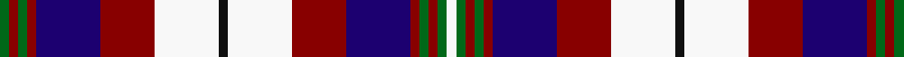

This page is one **sett** — a single exact thread-count. It belongs to the [tartan](/tartans/g1r1g1r1db7r6w7k1w7r6db7r1g1r1g1w1/)
(the same proportion at any scale), whose colour order is pattern [GRGRBRWKWRBRGRGW](/stripes/grgrbrwkwrbrgrgw/).

Sourced from register-of-tartans.  It is a [16 stripe tartan](/stripes/stripes16/).

Original link https://www.tartanregister.gov.uk/tartanDetails.aspx?ref=3238

## Register references

External register numbers recorded for this tartan.

- Scottish Register of Tartans: [3238](https://www.tartanregister.gov.uk/tartanDetails.aspx?ref=3238)
- Scottish Tartans Authority (ITI): 5526

## Thread count
G/4 DR4 G4 DR4 DB28 DR24 W28 K4 W28 DR24 DB28 DR4 G4 DR4 G4 W/4

## Palette

Palette: <strong>Tartan Register</strong>
<table><thead><tr><th>Colour</th><th>Threads</th><th>Shade</th><th>Base</th><th>OKLCh</th></tr></thead><tbody><tr><td>G/</td><td style="text-align:right;font-variant-numeric:tabular-nums">4</td><td><code style="background-color:#006818;">#006818</code> <small style="color:#888">#006818</small></td><td>G <code style="background-color:#006100;">#006100</code></td><td><small style="color:#888">oklch(45.0% 0.142 145.0)</small></td></tr><tr><td>DR</td><td style="text-align:right;font-variant-numeric:tabular-nums">4</td><td><code style="background-color:#880000;">#880000</code> <small style="color:#888">#880000</small></td><td>R <code style="background-color:#CC0000;">#CC0000</code></td><td><small style="color:#888">oklch(39.4% 0.162 29.2)</small></td></tr><tr><td>G</td><td style="text-align:right;font-variant-numeric:tabular-nums">4</td><td><code style="background-color:#006818;">#006818</code> <small style="color:#888">#006818</small></td><td>G <code style="background-color:#006100;">#006100</code></td><td><small style="color:#888">oklch(45.0% 0.142 145.0)</small></td></tr><tr><td>DR</td><td style="text-align:right;font-variant-numeric:tabular-nums">4</td><td><code style="background-color:#880000;">#880000</code> <small style="color:#888">#880000</small></td><td>R <code style="background-color:#CC0000;">#CC0000</code></td><td><small style="color:#888">oklch(39.4% 0.162 29.2)</small></td></tr><tr><td>DB</td><td style="text-align:right;font-variant-numeric:tabular-nums">28</td><td><code style="background-color:#1C0070;">#1C0070</code> <small style="color:#888">#1C0070</small></td><td>B <code style="background-color:#2A418A;">#2A418A</code></td><td><small style="color:#888">oklch(26.3% 0.162 277.1)</small></td></tr><tr><td>DR</td><td style="text-align:right;font-variant-numeric:tabular-nums">24</td><td><code style="background-color:#880000;">#880000</code> <small style="color:#888">#880000</small></td><td>R <code style="background-color:#CC0000;">#CC0000</code></td><td><small style="color:#888">oklch(39.4% 0.162 29.2)</small></td></tr><tr><td>W</td><td style="text-align:right;font-variant-numeric:tabular-nums">28</td><td><code style="background-color:#F8F8F8;">#F8F8F8</code> <small style="color:#888">#F8F8F8</small></td><td>W <code style="background-color:#F7F7F7;">#F7F7F7</code></td><td><small style="color:#888">oklch(97.9% 0.000 89.9)</small></td></tr><tr><td>K</td><td style="text-align:right;font-variant-numeric:tabular-nums">4</td><td><code style="background-color:#101010;">#101010</code> <small style="color:#888">#101010</small></td><td>K <code style="background-color:#000000;">#000000</code></td><td><small style="color:#888">oklch(17.3% 0.000 89.9)</small></td></tr><tr><td>W</td><td style="text-align:right;font-variant-numeric:tabular-nums">28</td><td><code style="background-color:#F8F8F8;">#F8F8F8</code> <small style="color:#888">#F8F8F8</small></td><td>W <code style="background-color:#F7F7F7;">#F7F7F7</code></td><td><small style="color:#888">oklch(97.9% 0.000 89.9)</small></td></tr><tr><td>DR</td><td style="text-align:right;font-variant-numeric:tabular-nums">24</td><td><code style="background-color:#880000;">#880000</code> <small style="color:#888">#880000</small></td><td>R <code style="background-color:#CC0000;">#CC0000</code></td><td><small style="color:#888">oklch(39.4% 0.162 29.2)</small></td></tr><tr><td>DB</td><td style="text-align:right;font-variant-numeric:tabular-nums">28</td><td><code style="background-color:#1C0070;">#1C0070</code> <small style="color:#888">#1C0070</small></td><td>B <code style="background-color:#2A418A;">#2A418A</code></td><td><small style="color:#888">oklch(26.3% 0.162 277.1)</small></td></tr><tr><td>DR</td><td style="text-align:right;font-variant-numeric:tabular-nums">4</td><td><code style="background-color:#880000;">#880000</code> <small style="color:#888">#880000</small></td><td>R <code style="background-color:#CC0000;">#CC0000</code></td><td><small style="color:#888">oklch(39.4% 0.162 29.2)</small></td></tr><tr><td>G</td><td style="text-align:right;font-variant-numeric:tabular-nums">4</td><td><code style="background-color:#006818;">#006818</code> <small style="color:#888">#006818</small></td><td>G <code style="background-color:#006100;">#006100</code></td><td><small style="color:#888">oklch(45.0% 0.142 145.0)</small></td></tr><tr><td>DR</td><td style="text-align:right;font-variant-numeric:tabular-nums">4</td><td><code style="background-color:#880000;">#880000</code> <small style="color:#888">#880000</small></td><td>R <code style="background-color:#CC0000;">#CC0000</code></td><td><small style="color:#888">oklch(39.4% 0.162 29.2)</small></td></tr><tr><td>G</td><td style="text-align:right;font-variant-numeric:tabular-nums">4</td><td><code style="background-color:#006818;">#006818</code> <small style="color:#888">#006818</small></td><td>G <code style="background-color:#006100;">#006100</code></td><td><small style="color:#888">oklch(45.0% 0.142 145.0)</small></td></tr><tr><td>W/</td><td style="text-align:right;font-variant-numeric:tabular-nums">4</td><td><code style="background-color:#F8F8F8;">#F8F8F8</code> <small style="color:#888">#F8F8F8</small></td><td>W <code style="background-color:#F7F7F7;">#F7F7F7</code></td><td><small style="color:#888">oklch(97.9% 0.000 89.9)</small></td></tr></tbody></table>

## Nearest tartans

The nearest existing variants by ΔTartan distance, with this tartan at the top so the swatches line up against it.

ΔTartan

Tartan

Sett

—

<a href="/ttd/edit/#slug=g1r1g1r1db7r6w7k1w7r6db7r1g1r1g1w1~x4">Oliver Dress (Dance)</a> <a class="nn-out" href="/setts/s16/g1r1g1r1db7r6w7k1w7r6db7r1g1r1g1w1~x4/" title="open its dictionary page">↗</a>

0.96

<a href="/ttd/edit/#slug=r8w30y5w8y5k12w6k12db28r4db8r8">Kinloch Anderson Dress</a> <a class="nn-out" href="/setts/s12/r8w30y5w8y5k12w6k12db28r4db8r8/" title="open its dictionary page">↗</a>

0.98

<a href="/ttd/edit/#slug=k4r6db3r16t18w4k4w4k4w4k4w4db18r4~x2">Edinburgh Military Tattoo (Dance)</a> <a class="nn-out" href="/setts/s14/k4r6db3r16t18w4k4w4k4w4k4w4db18r4~x2/" title="open its dictionary page">↗</a>

1.01

<a href="/ttd/edit/#slug=w4db1g9db9r9db1ly4db1r9db9g1db1g1db1g4db1w4~x2">Alaskan Scottish</a> <a class="nn-out" href="/setts/s17/w4db1g9db9r9db1ly4db1r9db9g1db1g1db1g4db1w4~x2/" title="open its dictionary page">↗</a>

1.04

<a href="/ttd/edit/#slug=w2r1w2r2w9k9r1db10r2k2ly2~x2">Cameron of Erracht Dress</a> <a class="nn-out" href="/setts/s11/w2r1w2r2w9k9r1db10r2k2ly2~x2/" title="open its dictionary page">↗</a>

1.06

<a href="/ttd/edit/#slug=r1k2w8k2r1k2db8k2r1k2ly1~x4">Andreou Family (Personal)</a> <a class="nn-out" href="/setts/s11/r1k2w8k2r1k2db8k2r1k2ly1~x4/" title="open its dictionary page">↗</a>

1.06

<a href="/ttd/edit/#slug=db2k1db6k1r5ly3r5k2w3k2w9k1w2k1ly2~x2">Unidentified #11</a> <a class="nn-out" href="/setts/s15/db2k1db6k1r5ly3r5k2w3k2w9k1w2k1ly2~x2/" title="open its dictionary page">↗</a>

1.16

<a href="/ttd/edit/#slug=db10r2db2r4db12r2k14w13r4w2r2w4r1ly3~x2">Carnegie #2</a> <a class="nn-out" href="/setts/s14/db10r2db2r4db12r2k14w13r4w2r2w4r1ly3~x2/" title="open its dictionary page">↗</a>

1.18

<a href="/ttd/edit/#slug=k1w7r6db7r1g1r1g1w1~x4">Oliver Dress (Dance)</a> <a class="nn-out" href="/setts/s9/k1w7r6db7r1g1r1g1w1~x4/" title="open its dictionary page">↗</a>

1.18

<a href="/ttd/edit/#slug=db16r4db6r10db30r4k30w34r9w6r4w16">MacDonald Pattern of Plaids</a> <a class="nn-out" href="/setts/s12/db16r4db6r10db30r4k30w34r9w6r4w16/" title="open its dictionary page">↗</a>

1.20

<a href="/ttd/edit/#slug=w4t1dg9t9r9t1ly4t1r9t9dg1t1dg1t1dg4t1w4~x2">Alaskan Scottish</a> <a class="nn-out" href="/setts/s17/w4t1dg9t9r9t1ly4t1r9t9dg1t1dg1t1dg4t1w4~x2/" title="open its dictionary page">↗</a>

## Neighbour map

Every grey dot is one of 14299 variants placed by the first two principal components of the ΔTartan feature space (44% of its variance). Red is this tartan; blue dots are its nearest — click one to open its page.

<svg viewBox="0 0 640 380" role="img" style="max-width:100%;height:auto;border:1px solid #e0e0e0;border-radius:4px;display:block" xmlns="http://www.w3.org/2000/svg"><image href="/nn/cloud.v1.png" width="640" height="380"/><a href="/setts/s12/r8w30y5w8y5k12w6k12db28r4db8r8/"><circle cx="66.5" cy="151.4" r="4" fill="#3465a4"><title>Kinloch Anderson Dress</title></circle></a><a href="/setts/s14/k4r6db3r16t18w4k4w4k4w4k4w4db18r4~x2/"><circle cx="43.8" cy="150.9" r="4" fill="#3465a4"><title>Edinburgh Military Tattoo (Dance)</title></circle></a><a href="/setts/s17/w4db1g9db9r9db1ly4db1r9db9g1db1g1db1g4db1w4~x2/"><circle cx="105.0" cy="130.9" r="4" fill="#3465a4"><title>Alaskan Scottish</title></circle></a><a href="/setts/s11/w2r1w2r2w9k9r1db10r2k2ly2~x2/"><circle cx="88.0" cy="130.2" r="4" fill="#3465a4"><title>Cameron of Erracht Dress</title></circle></a><a href="/setts/s11/r1k2w8k2r1k2db8k2r1k2ly1~x4/"><circle cx="105.0" cy="145.0" r="4" fill="#3465a4"><title>Andreou Family (Personal)</title></circle></a><a href="/setts/s15/db2k1db6k1r5ly3r5k2w3k2w9k1w2k1ly2~x2/"><circle cx="61.8" cy="134.3" r="4" fill="#3465a4"><title>Unidentified #11</title></circle></a><a href="/setts/s14/db10r2db2r4db12r2k14w13r4w2r2w4r1ly3~x2/"><circle cx="106.4" cy="117.2" r="4" fill="#3465a4"><title>Carnegie #2</title></circle></a><a href="/setts/s9/k1w7r6db7r1g1r1g1w1~x4/"><circle cx="95.5" cy="150.3" r="4" fill="#3465a4"><title>Oliver Dress (Dance)</title></circle></a><a href="/setts/s12/db16r4db6r10db30r4k30w34r9w6r4w16/"><circle cx="111.9" cy="162.3" r="4" fill="#3465a4"><title>MacDonald Pattern of Plaids</title></circle></a><a href="/setts/s17/w4t1dg9t9r9t1ly4t1r9t9dg1t1dg1t1dg4t1w4~x2/"><circle cx="107.7" cy="130.8" r="4" fill="#3465a4"><title>Alaskan Scottish</title></circle></a><circle cx="88.2" cy="130.5" r="5" fill="#c00000"/></svg>

ID: /setts/s16/g1r1g1r1db7r6w7k1w7r6db7r1g1r1g1w1~x4/
