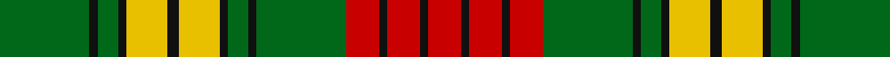

In pattern [GKGKYKYKGKGRKRKR](/stripes/gkgkykykgkgrkrkr/).

This was sourced from register-of-tartans.  It is a [16 stripe tartan](/stripes/stripes16/).

Original link https://www.tartanregister.gov.uk/tartanDetails.aspx?ref=5360

## Register references

External register numbers recorded for this tartan.

- Scottish Register of Tartans: [5360](https://www.tartanregister.gov.uk/tartanDetails.aspx?ref=5360)
- Scottish Tartans Authority (ITI): 3496

## Thread count
G/44 K4 G10 K4 Y20 K6 Y20 K4 G10 K4 G44 R16 K4 R16 K4 R/16

## Palette
Each colour and the base-6 reference it is a variant of.

| Colour | Shade | Base |
|---|---|---|
| G | <code style="background-color:#006818;">#006818</code> `oklch(45.0% 0.142 145.0)` <small>#006818</small> | G <code style="background-color:#006100;">#006100</code> |
| K | <code style="background-color:#101010;">#101010</code> `oklch(17.3% 0.000 89.9)` <small>#101010</small> | K <code style="background-color:#000000;">#000000</code> |
| R | <code style="background-color:#C80000;">#C80000</code> `oklch(52.3% 0.215 29.2)` <small>#C80000</small> | R <code style="background-color:#CC0000;">#CC0000</code> |
| Y | <code style="background-color:#E8C000;">#E8C000</code> `oklch(81.9% 0.168 93.7)` <small>#E8C000</small> | Y <code style="background-color:#F2BF00;">#F2BF00</code> |

## Nearest tartans

The nearest existing variants by ΔTartan distance.

1. [Confessore](/setts/s15/dg12y2dg2y7ly4r2ly8r2ly4y7dg2y2dg16w2dg4~x2/) — ΔT 1.15
1. [MacMillan Old Clan Tartan Tartan Number: 2025. Earliest known date: 1847 The term 'ancient' normally describes a change in colour that can be applied to any tartan. In the case of MacMillan the 'ancient' form involves a more radical change, justifying the traditional use of the adjective in the name of the tartan. James Logan, co-author of 'The Clans of the Scottish Highlands' (1847), states that this version is identical with Buchanan. The thread count was deduced by J. Cant from the illustration by R.R. MacIan in the same work. In 1951 Lieut. General Sir Gordon MacMillan, then G.O.C. Scottish Command, was recognised as chief of the clan by the Lord Lyon. See products available Copyright © Blair Urquhart, Comrie, 2015](/setts/s12/g2k1g18k1g2k1m12g4ly6k1ly6k1~x2/) — ΔT 1.17
1. [Confessore Family Tartan Tartan Number: 2165. Earliest known date: 1994 Designed for Mr Confessore of Napoli, Italy in 1994 by Mr. Keith Lumsden, researcher at the Scottish Tartans Society. The colours reflect the shades and tones of the Italian countryside. See products available Copyright © Blair Urquhart, Comrie, 2015](/setts/s15/dg12y2dg2y7ly4o2ly8o2ly4y7dg2y2dg16w2dg4~x2/) — ΔT 1.19
1. [Harmer](/setts/s12/dg36lo8k9lo24dg4lo12dg4lo24k9lo8dg36r4/) — ΔT 1.21
1. [Club World](/setts/s20/g14k7g21k2g2k2g2k4g7r25w2r2k3r16g9r2k4r2k4r2~x2/) — ΔT 1.23
1. [MacMillan Ancient](/setts/s12/dg2k1dg18k1dg2k1r12dg4ly6k1ly6k1~x2/) — ΔT 1.23
1. [MacMillan Ancient](/setts/s12/dg2k1dg18k1dg2k1r12dg4ly6k1ly6k1/) — ΔT 1.26
1. [Unnamed C18th - Prince Charles Edward #4](/setts/s16/r12g3ly4k2ly4g12ly2r3w1~x4/) — ΔT 1.26
1. [MacMillan, Ancient](/setts/s12/g2k1g18k1g2k1r12g4ly6k1ly6k1~x2/) — ΔT 1.27
1. [Bates](/setts/s12/k6r3k3r24t4k10r2g4r2g24r6t2~x2/) — ΔT 1.36

## Neighbour map

Every grey dot is one of 14299 variants placed by the first two principal components of the ΔTartan feature space (44% of its variance). Red is this tartan; blue dots are its nearest — click one to open its page.

<svg viewBox="0 0 640 380" role="img" style="max-width:100%;height:auto;border:1px solid #e0e0e0;border-radius:4px;display:block" xmlns="http://www.w3.org/2000/svg"><image href="/nn/cloud.v1.png" width="640" height="380"/><a href="/setts/s15/dg12y2dg2y7ly4r2ly8r2ly4y7dg2y2dg16w2dg4~x2/"><circle cx="180.1" cy="160.3" r="4" fill="#3465a4"><title>Confessore</title></circle></a><a href="/setts/s12/g2k1g18k1g2k1m12g4ly6k1ly6k1~x2/"><circle cx="251.8" cy="128.4" r="4" fill="#3465a4"><title>MacMillan Old Clan Tartan Tartan Number: 2025. Earliest known date: 1847 The term 'ancient' normally describes a change in colour that can be applied to any tartan. In the case of MacMillan the 'ancient' form involves a more radical change, justifying the traditional use of the adjective in the name of the tartan. James Logan, co-author of 'The Clans of the Scottish Highlands' (1847), states that this version is identical with Buchanan. The thread count was deduced by J. Cant from the illustration by R.R. MacIan in the same work. In 1951 Lieut. General Sir Gordon MacMillan, then G.O.C. Scottish Command, was recognised as chief of the clan by the Lord Lyon. See products available Copyright © Blair Urquhart, Comrie, 2015</title></circle></a><a href="/setts/s15/dg12y2dg2y7ly4o2ly8o2ly4y7dg2y2dg16w2dg4~x2/"><circle cx="180.2" cy="161.2" r="4" fill="#3465a4"><title>Confessore Family Tartan Tartan Number: 2165. Earliest known date: 1994 Designed for Mr Confessore of Napoli, Italy in 1994 by Mr. Keith Lumsden, researcher at the Scottish Tartans Society. The colours reflect the shades and tones of the Italian countryside. See products available Copyright © Blair Urquhart, Comrie, 2015</title></circle></a><a href="/setts/s12/dg36lo8k9lo24dg4lo12dg4lo24k9lo8dg36r4/"><circle cx="228.0" cy="188.7" r="4" fill="#3465a4"><title>Harmer</title></circle></a><a href="/setts/s20/g14k7g21k2g2k2g2k4g7r25w2r2k3r16g9r2k4r2k4r2~x2/"><circle cx="198.7" cy="117.1" r="4" fill="#3465a4"><title>Club World</title></circle></a><a href="/setts/s12/dg2k1dg18k1dg2k1r12dg4ly6k1ly6k1~x2/"><circle cx="253.7" cy="130.1" r="4" fill="#3465a4"><title>MacMillan Ancient</title></circle></a><a href="/setts/s12/dg2k1dg18k1dg2k1r12dg4ly6k1ly6k1/"><circle cx="241.7" cy="124.7" r="4" fill="#3465a4"><title>MacMillan Ancient</title></circle></a><a href="/setts/s16/r12g3ly4k2ly4g12ly2r3w1~x4/"><circle cx="165.1" cy="132.2" r="4" fill="#3465a4"><title>Unnamed C18th - Prince Charles Edward #4</title></circle></a><a href="/setts/s12/g2k1g18k1g2k1r12g4ly6k1ly6k1~x2/"><circle cx="238.6" cy="123.2" r="4" fill="#3465a4"><title>MacMillan, Ancient</title></circle></a><a href="/setts/s12/k6r3k3r24t4k10r2g4r2g24r6t2~x2/"><circle cx="212.8" cy="144.0" r="4" fill="#3465a4"><title>Bates</title></circle></a><circle cx="214.1" cy="149.7" r="5" fill="#c00000"/></svg>

ID: /setts/s16/g22k2g5k2ly10k3ly10k2g5k2g22r8k2r8k2r8~x2/
