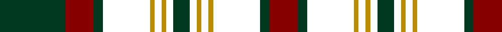

In pattern [GRGKYKYKGKYKYKGR](/patterns/grgkykykgkykykgr/).

This was sourced from register-of-tartans.  It is a [16 stripes tartan](/stripes/stripes16/).

Original link https://www.tartanregister.gov.uk/tartanDetails.aspx?ref=760

## Register references

External register numbers recorded for this tartan.

- Scottish Register of Tartans: [760](https://www.tartanregister.gov.uk/tartanDetails.aspx?ref=760)
- Scottish Tartans Authority (ITI): 2253
- Scottish Tartans World Register: 2253

## Thread count
DG/56 DR24 DG8 COM40 DY4 COM6 DY4 COM6 DG14 COM6 DY4 COM6 DY4 COM40 DG8 DR/24

## Palette
Each colour and its ΔE from the base-6 reference it is a variant of.

| Colour | Shade | Base | ΔE (OKLab) |
|---|---|---|---|
| DB | <code style="background-color:#1C0070;">#1C0070</code> `#1C0070` | B <code style="background-color:#2A418A;">#2A418A</code> | 0.14 |
| DBa | <code style="background-color:#202060;">#202060</code> `#202060` | B <code style="background-color:#2A418A;">#2A418A</code> | 0.11 |
| DBb | <code style="background-color:#1C0044;">#1C0044</code> `#1C0044` | B <code style="background-color:#2A418A;">#2A418A</code> | 0.20 |
| DG | <code style="background-color:#003820;">#003820</code> `#003820` | G <code style="background-color:#006100;">#006100</code> | 0.15 |
| DR | <code style="background-color:#880000;">#880000</code> `#880000` | R <code style="background-color:#CC0000;">#CC0000</code> | 0.15 |
| DRa | <code style="background-color:#A00000;">#A00000</code> `#A00000` | R <code style="background-color:#CC0000;">#CC0000</code> | 0.09 |
| DY | <code style="background-color:#BC8C00;">#BC8C00</code> `#BC8C00` | Y <code style="background-color:#F2BF00;">#F2BF00</code> | 0.16 |
| G | <code style="background-color:#005448;">#005448</code> `#005448` | G <code style="background-color:#006100;">#006100</code> | 0.10 |
| Ga | <code style="background-color:#006818;">#006818</code> `#006818` | G <code style="background-color:#006100;">#006100</code> | 0.02 |
| Y | <code style="background-color:#D8B000;">#D8B000</code> `#D8B000` | Y <code style="background-color:#F2BF00;">#F2BF00</code> | 0.06 |

## Nearest tartans

The nearest existing variants by ΔTartan distance.

1. [Buchan (d)](/setts/s13/k2b2r2k24r2g6r6b2k6r2g27r2k2~b000052-g11450d-k000000-raa0000~x2/) — ΔT 0.86
1. [Buchan](/setts/s13/k2b2r2k24r2g6r6b2k6r2g27r2k2~b000052-g11450d-k000000-raa0000/) — ΔT 0.86
1. [Cumming (d)](/setts/s13/k1b1r1k8r1g6r6b1k6r1g8r1k1~b000052-g11450d-k000000-raa0000~x2/) — ΔT 1.04
1. [Lunar](/setts/s11/k10r1k3b7ba1b1ba1b1ba1b1ba7~b3c2010-ba646464-k000000-r8c0000~x4/) — ΔT 1.06
1. [Urbino](/setts/s18/g3b2g2b2g2b20k20g22k1r3k1g22k20b20g2b2g2b2~b780078-g004c00-k000000-ra0783c~x4/) — ΔT 1.20
1. [Sonsub Corporate Tartan Tartan Number: 6984. Earliest known date: 2006 Corporate colours for Sonsub Ltd, Bridge of Don, Aberdeen. Sonsub is a well known provider of remote subsea systems technology, and provides services to the North Atlantic, Mediterranean, Africa, Caspian and Middle East. See products available Copyright © Blair Urquhart, Comrie, 2015](/setts/s10/k30ka5k19ka5k2b20y2b20ka5y4~b645858-k000000-ka101010-yc4bc68~x2/) — ΔT 1.37
1. [Lunar (Fashion)](/setts/s11/k10k1k3k7b1k1b1k1b1k1b7~b646464-k000000~x4/) — ΔT 1.37
1. [Pilette of Kinnear (Personal)](/setts/s21/k4r2k10g3k10g30k8g3r4b2r4y2r4g3k8g30k10g3k10r2k4~b788cb4-g204000-k000000-r8c0000-yc88c00~x2/) — ΔT 1.40
1. [Cochrane LC](/setts/s13/g22r4g2r2g2r4g12k12r2b10r4b4y3~b000052-g11450d-k000000-raa0000-yaaaa00~x2/) — ΔT 1.41
1. [Cochrane LC](/setts/s13/g22r4g2r2g2r4g12k12r2b10r4b4y3~b000052-g11450d-k000000-raa0000-yaaaa00/) — ΔT 1.41

## Neighbour map

Every grey dot is one of 15726 variants placed by the first two principal components of the ΔTartan feature space (44% of its variance). Red is this tartan; blue dots are its nearest — click one to open its page.

<svg viewBox="0 0 640 380" role="img" style="max-width:100%;height:auto;border:1px solid #e0e0e0;border-radius:4px;display:block" xmlns="http://www.w3.org/2000/svg"><image href="/nn/cloud.v1.png" width="640" height="380"/><a href="/setts/s13/k2b2r2k24r2g6r6b2k6r2g27r2k2~b000052-g11450d-k000000-raa0000~x2/"><circle cx="245.1" cy="147.0" r="4" fill="#3465a4"><title>Buchan (d)</title></circle></a><a href="/setts/s13/k2b2r2k24r2g6r6b2k6r2g27r2k2~b000052-g11450d-k000000-raa0000/"><circle cx="245.1" cy="147.0" r="4" fill="#3465a4"><title>Buchan</title></circle></a><a href="/setts/s13/k1b1r1k8r1g6r6b1k6r1g8r1k1~b000052-g11450d-k000000-raa0000~x2/"><circle cx="184.2" cy="184.1" r="4" fill="#3465a4"><title>Cumming (d)</title></circle></a><a href="/setts/s11/k10r1k3b7ba1b1ba1b1ba1b1ba7~b3c2010-ba646464-k000000-r8c0000~x4/"><circle cx="212.0" cy="177.0" r="4" fill="#3465a4"><title>Lunar</title></circle></a><a href="/setts/s18/g3b2g2b2g2b20k20g22k1r3k1g22k20b20g2b2g2b2~b780078-g004c00-k000000-ra0783c~x4/"><circle cx="225.6" cy="120.4" r="4" fill="#3465a4"><title>Urbino</title></circle></a><a href="/setts/s10/k30ka5k19ka5k2b20y2b20ka5y4~b645858-k000000-ka101010-yc4bc68~x2/"><circle cx="234.8" cy="176.5" r="4" fill="#3465a4"><title>Sonsub Corporate Tartan Tartan Number: 6984. Earliest known date: 2006 Corporate colours for Sonsub Ltd, Bridge of Don, Aberdeen. Sonsub is a well known provider of remote subsea systems technology, and provides services to the North Atlantic, Mediterranean, Africa, Caspian and Middle East. See products available Copyright © Blair Urquhart, Comrie, 2015</title></circle></a><a href="/setts/s11/k10k1k3k7b1k1b1k1b1k1b7~b646464-k000000~x4/"><circle cx="211.0" cy="184.6" r="4" fill="#3465a4"><title>Lunar (Fashion)</title></circle></a><a href="/setts/s21/k4r2k10g3k10g30k8g3r4b2r4y2r4g3k8g30k10g3k10r2k4~b788cb4-g204000-k000000-r8c0000-yc88c00~x2/"><circle cx="254.9" cy="125.7" r="4" fill="#3465a4"><title>Pilette of Kinnear (Personal)</title></circle></a><a href="/setts/s13/g22r4g2r2g2r4g12k12r2b10r4b4y3~b000052-g11450d-k000000-raa0000-yaaaa00~x2/"><circle cx="200.7" cy="158.1" r="4" fill="#3465a4"><title>Cochrane LC</title></circle></a><a href="/setts/s13/g22r4g2r2g2r4g12k12r2b10r4b4y3~b000052-g11450d-k000000-raa0000-yaaaa00/"><circle cx="200.7" cy="158.1" r="4" fill="#3465a4"><title>Cochrane LC</title></circle></a><circle cx="221.7" cy="151.4" r="5" fill="#c00000"/></svg>

ID: /setts/s16/g28r12g4k20y2k3y2k3g7k3y2k3y2k20g4r12~g003820-k000000-r880000-ybc8c00~x2/
