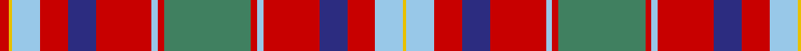

In pattern [RYWRBRWRGRWRBRWY](/stripes/rywrbrwrgrwrbrwy/).

This was sourced from register-of-tartans.  It is a [16 stripe tartan](/stripes/stripes16/).

Original link https://www.tartanregister.gov.uk/tartanDetails.aspx?ref=4366

## Register references

External register numbers recorded for this tartan.

- Scottish Register of Tartans: [4366](https://www.tartanregister.gov.uk/tartanDetails.aspx?ref=4366)
- Scottish Tartans Authority (ITI): 6335

## Thread count
R/6 Y2 LB18 R18 DB18 R36 LB4 R4 G56 R4 LB4 R36 DB18 R18 LB18 Y/2

## Palette
Each colour and its ΔE from the base-6 reference it is a variant of.

| Colour | Shade | Base | ΔE (OKLab) |
|---|---|---|---|
| DB | <code style="background-color:#2C2C80;">#2C2C80</code> `#2C2C80` | B <code style="background-color:#2A418A;">#2A418A</code> | 0.06 |
| G | <code style="background-color:#408060;">#408060</code> `#408060` | G <code style="background-color:#006100;">#006100</code> | 0.14 |
| LB | <code style="background-color:#98C8E8;">#98C8E8</code> `#98C8E8` | W <code style="background-color:#F7F7F7;">#F7F7F7</code> | 0.18 |
| R | <code style="background-color:#C80000;">#C80000</code> `#C80000` | R <code style="background-color:#CC0000;">#CC0000</code> | 0.01 |
| Y | <code style="background-color:#E8C000;">#E8C000</code> `#E8C000` | Y <code style="background-color:#F2BF00;">#F2BF00</code> | 0.02 |

## Nearest tartans

The nearest existing variants by ΔTartan distance.

1. [Brown-Wells (Personal)](/setts/s16/r4dt1ly3dt1r20dt4g9r3g9dt4lb3dt1g7dt2r6ly2~x2/) — ΔT 1.20
1. [Unidentified Scarlett #11](/setts/s19/b5r30g26r5w1r5b32r30lb1b3lb1b31r5w1r5g26r32b5w1~x2/) — ΔT 1.23
1. [Anderson Red (Westwood) (Estimated threadcount)](/setts/s18/r4t5r2t7r10k4lo2k2lo2k4w4k4t18r1k2r1t4r3~x2/) — ΔT 1.23
1. [MacDonald of Boisdale](/setts/s21/r16w1db6w1r6w1db32w1r24g1g16g1r4g1g6g1r4w1db6w1r16~x2/) — ΔT 1.27
1. [MacDougall Clan Tartan Tartan Number: 1776. Earliest known date: 1977 Matched to a sample by B Urquhart in 2004, from Lochcarron reiver cloth. The purple colour was lightened considerably to a pale mauve, giving an almost equal prominence to the white. See products available Copyright © Blair Urquhart, Comrie, 2015](/setts/s20/w2r2lp2r22db2r2g8r8g8lp2r2lp2db9r3g1r3g22r2lp2w2~x2/) — ΔT 1.31
1. [Strathdon (District?)](/setts/s15/lr3lo8r2lo8db11r2lo4r4r27db1r2db2r2db13r2~x2/) — ΔT 1.32
1. [MacColl Hunting](/setts/s18/r6m3r6db22r7m2w1r2db2r2w1m2r7g22r7g2r2m2~x2/) — ΔT 1.33
1. [Shaw of Tordarroch Red (Dress)](/setts/s14/t5k1r30dp15r8g30r8dp2~x2/) — ΔT 1.36
1. [Moir (Loch Insch) (Personal)](/setts/s15/r31g3r2g2r3g2r2g3r15k15g2t15g3t3w2~x2/) — ΔT 1.41
1. [MacQuarrie #2](/setts/s14/r4t2r50db26r10dg44r4r10r4dg44r51db2r4t2~x2/) — ΔT 1.41

## Neighbour map

Every grey dot is one of 14299 variants placed by the first two principal components of the ΔTartan feature space (44% of its variance). Red is this tartan; blue dots are its nearest — click one to open its page.

<svg viewBox="0 0 640 380" role="img" style="max-width:100%;height:auto;border:1px solid #e0e0e0;border-radius:4px;display:block" xmlns="http://www.w3.org/2000/svg"><image href="/nn/cloud.v1.png" width="640" height="380"/><a href="/setts/s16/r4dt1ly3dt1r20dt4g9r3g9dt4lb3dt1g7dt2r6ly2~x2/"><circle cx="219.4" cy="112.7" r="4" fill="#3465a4"><title>Brown-Wells (Personal)</title></circle></a><a href="/setts/s19/b5r30g26r5w1r5b32r30lb1b3lb1b31r5w1r5g26r32b5w1~x2/"><circle cx="290.1" cy="96.1" r="4" fill="#3465a4"><title>Unidentified Scarlett #11</title></circle></a><a href="/setts/s18/r4t5r2t7r10k4lo2k2lo2k4w4k4t18r1k2r1t4r3~x2/"><circle cx="191.6" cy="105.9" r="4" fill="#3465a4"><title>Anderson Red (Westwood) (Estimated threadcount)</title></circle></a><a href="/setts/s21/r16w1db6w1r6w1db32w1r24g1g16g1r4g1g6g1r4w1db6w1r16~x2/"><circle cx="289.3" cy="66.3" r="4" fill="#3465a4"><title>MacDonald of Boisdale</title></circle></a><a href="/setts/s20/w2r2lp2r22db2r2g8r8g8lp2r2lp2db9r3g1r3g22r2lp2w2~x2/"><circle cx="236.0" cy="83.8" r="4" fill="#3465a4"><title>MacDougall Clan Tartan Tartan Number: 1776. Earliest known date: 1977 Matched to a sample by B Urquhart in 2004, from Lochcarron reiver cloth. The purple colour was lightened considerably to a pale mauve, giving an almost equal prominence to the white. See products available Copyright © Blair Urquhart, Comrie, 2015</title></circle></a><a href="/setts/s15/lr3lo8r2lo8db11r2lo4r4r27db1r2db2r2db13r2~x2/"><circle cx="257.8" cy="100.9" r="4" fill="#3465a4"><title>Strathdon (District?)</title></circle></a><a href="/setts/s18/r6m3r6db22r7m2w1r2db2r2w1m2r7g22r7g2r2m2~x2/"><circle cx="232.4" cy="93.7" r="4" fill="#3465a4"><title>MacColl Hunting</title></circle></a><a href="/setts/s14/t5k1r30dp15r8g30r8dp2~x2/"><circle cx="283.5" cy="118.8" r="4" fill="#3465a4"><title>Shaw of Tordarroch Red (Dress)</title></circle></a><a href="/setts/s15/r31g3r2g2r3g2r2g3r15k15g2t15g3t3w2~x2/"><circle cx="257.1" cy="95.3" r="4" fill="#3465a4"><title>Moir (Loch Insch) (Personal)</title></circle></a><a href="/setts/s14/r4t2r50db26r10dg44r4r10r4dg44r51db2r4t2~x2/"><circle cx="309.7" cy="105.7" r="4" fill="#3465a4"><title>MacQuarrie #2</title></circle></a><circle cx="242.2" cy="95.5" r="5" fill="#c00000"/></svg>

ID: /setts/s16/g28r2lb2r18db9r9lb9ly1r3~x2/
