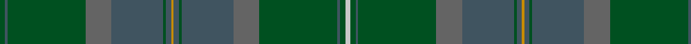

In pattern [GBGBBGBYBGBBGBGW](/patterns/gbgbbgbybgbbgbgw/).

This was sourced from register-of-tartans.  It is a [16 stripes tartan](/stripes/stripes16/).

Original link https://www.tartanregister.gov.uk/tartanDetails.aspx?ref=3709

## Attestations

This cloth appears in 2 source records; the oldest owns this page.

- 01/01/1996 — Scottish Borderland (register-of-tartans, [record](https://www.tartanregister.gov.uk/tartanDetails.aspx?ref=3709))
- undated — Scottish Borderland Fashion Tartan Tartan Number: 5359. Earliest known date: pre 1996 Lochcarron of Scotland. Sample in STA Johnston Collection. See products available Copyright © Blair Urquhart, Comrie, 2015 (house-of-tartan, [record](http://www.house-of-tartan.scotland.net/house/TartanViewjs.asp?colr=Def&tnam=5359))

## Register references

External register numbers recorded for this tartan.

- Scottish Register of Tartans: [3709](https://www.tartanregister.gov.uk/tartanDetails.aspx?ref=3709)
- Scottish Tartans Authority (ITI): 5359

## Thread count
G/4 N2 G60 Na20 N40 G2 N4 DY2 N4 G2 N40 Na20 G60 N2 G4 Nb/4

## Palette
Each colour and its ΔE from the base-6 reference it is a variant of.

| Colour | Shade | Base | ΔE (OKLab) |
|---|---|---|---|
| DY | <code style="background-color:#C88C00;">#C88C00</code> `#C88C00` | Y <code style="background-color:#F2BF00;">#F2BF00</code> | 0.15 |
| G | <code style="background-color:#005020;">#005020</code> `#005020` | G <code style="background-color:#006100;">#006100</code> | 0.07 |
| N | <code style="background-color:#405460;">#405460</code> `#405460` | B <code style="background-color:#2A418A;">#2A418A</code> | 0.11 |
| Na | <code style="background-color:#646464;">#646464</code> `#646464` | B <code style="background-color:#2A418A;">#2A418A</code> | 0.16 |
| Nb | <code style="background-color:#C8C8C8;">#C8C8C8</code> `#C8C8C8` | W <code style="background-color:#F7F7F7;">#F7F7F7</code> | 0.14 |

## Nearest tartans

The nearest existing variants by ΔTartan distance.

1. [Mack of Stoneywood Hunting (Personal)](/setts/s11/g18ga4b1ga5g6ga3k1gb6k1ga25b1~b218eed-g03331d-ga1e4901-gb5d2c01-k101010~x2/) — ΔT 1.36
1. [Mack of Stoneywood Hunting (Pers.)](/setts/s11/g18ga4b1ga5g6ga3k1gb6k1ga25b1~b2888c4-g003820-ga285800-gb604000-k101010~x2/) — ΔT 1.37
1. [Scottish Borderland (Fashion)](/setts/s9/w2g2b1g30ba10b20g1b2y1~b405460-ba646464-g005020-wc8c8c8-yc88c00~x2/) — ΔT 1.60
1. [Fiddes - 2007 (Personal)](/setts/s9/g14ga14b14k1b1k1ga38g9b9~b506880-g40783c-ga005834-k101010~x2/) — ΔT 1.73
1. [Ensign of Ontario (Fashion)](/setts/s15/g21k1r4k1ga21g3ga3g3ga21g3y4g21ga3g3ga3~g006038-ga604000-k101010-rc80000-ybc8c00~x2/) — ΔT 1.77
1. [Highlander (Corporate)](/setts/s12/g33g4g4g4g5g13r13g13r2g11r1g2~g003820-r888888~x2/) — ΔT 1.85
1. [Terry](/setts/s13/g33y1g3r3ga3y1ga21y1ga3r3ga3y1ga21~g5c6428-ga006818-rc80000-yd09800~x2/) — ΔT 1.87
1. [Queensferry](/setts/s17/g6b2w1g9ba2g7ba4g4ba7g2ba20r1ba2r1bb3ba3r3~b5c5c5c-ba14283c-bb4c0000-g003820-r880000-wc0c0c0~x2/) — ΔT 1.88
1. [Alasdair Dhana](/setts/s12/g3b20g16r2g2r3g3r5g16b20y1k2~b14283c-g003820-k101010-r880000-ye8c000~x2/) — ΔT 1.89
1. [Wicklow, County](/setts/s18/b1ba1b12bb1ba3b1g6b2ba1b2g6b1ba3bb1b12ba1b1g1~b5c5c5c-ba4c3428-bb5c8ca8-g006818~x4/) — ΔT 1.97

## Neighbour map

Every grey dot is one of 15726 variants placed by the first two principal components of the ΔTartan feature space (44% of its variance). Red is this tartan; blue dots are its nearest — click one to open its page.

<svg viewBox="0 0 640 380" role="img" style="max-width:100%;height:auto;border:1px solid #e0e0e0;border-radius:4px;display:block" xmlns="http://www.w3.org/2000/svg"><image href="/nn/cloud.v1.png" width="640" height="380"/><a href="/setts/s11/g18ga4b1ga5g6ga3k1gb6k1ga25b1~b218eed-g03331d-ga1e4901-gb5d2c01-k101010~x2/"><circle cx="460.7" cy="195.6" r="4" fill="#3465a4"><title>Mack of Stoneywood Hunting (Personal)</title></circle></a><a href="/setts/s11/g18ga4b1ga5g6ga3k1gb6k1ga25b1~b2888c4-g003820-ga285800-gb604000-k101010~x2/"><circle cx="448.5" cy="188.9" r="4" fill="#3465a4"><title>Mack of Stoneywood Hunting (Pers.)</title></circle></a><a href="/setts/s9/w2g2b1g30ba10b20g1b2y1~b405460-ba646464-g005020-wc8c8c8-yc88c00~x2/"><circle cx="413.5" cy="167.1" r="4" fill="#3465a4"><title>Scottish Borderland (Fashion)</title></circle></a><a href="/setts/s9/g14ga14b14k1b1k1ga38g9b9~b506880-g40783c-ga005834-k101010~x2/"><circle cx="468.3" cy="211.1" r="4" fill="#3465a4"><title>Fiddes - 2007 (Personal)</title></circle></a><a href="/setts/s15/g21k1r4k1ga21g3ga3g3ga21g3y4g21ga3g3ga3~g006038-ga604000-k101010-rc80000-ybc8c00~x2/"><circle cx="405.7" cy="172.9" r="4" fill="#3465a4"><title>Ensign of Ontario (Fashion)</title></circle></a><a href="/setts/s12/g33g4g4g4g5g13r13g13r2g11r1g2~g003820-r888888~x2/"><circle cx="405.4" cy="181.0" r="4" fill="#3465a4"><title>Highlander (Corporate)</title></circle></a><a href="/setts/s13/g33y1g3r3ga3y1ga21y1ga3r3ga3y1ga21~g5c6428-ga006818-rc80000-yd09800~x2/"><circle cx="482.3" cy="168.5" r="4" fill="#3465a4"><title>Terry</title></circle></a><a href="/setts/s17/g6b2w1g9ba2g7ba4g4ba7g2ba20r1ba2r1bb3ba3r3~b5c5c5c-ba14283c-bb4c0000-g003820-r880000-wc0c0c0~x2/"><circle cx="384.5" cy="168.5" r="4" fill="#3465a4"><title>Queensferry</title></circle></a><a href="/setts/s12/g3b20g16r2g2r3g3r5g16b20y1k2~b14283c-g003820-k101010-r880000-ye8c000~x2/"><circle cx="381.0" cy="199.8" r="4" fill="#3465a4"><title>Alasdair Dhana</title></circle></a><a href="/setts/s18/b1ba1b12bb1ba3b1g6b2ba1b2g6b1ba3bb1b12ba1b1g1~b5c5c5c-ba4c3428-bb5c8ca8-g006818~x4/"><circle cx="454.3" cy="205.0" r="4" fill="#3465a4"><title>Wicklow, County</title></circle></a><circle cx="435.9" cy="160.3" r="5" fill="#c00000"/></svg>

ID: /setts/s16/g2b1g30ba10b20g1b2y1b2g1b20ba10g30b1g2w2~b405460-ba646464-g005020-wc8c8c8-yc88c00~x2/
