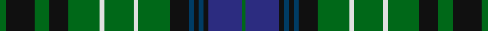

In pattern [GBKBKBKGWGWGKGKG](/stripes/gbkbkbkgwgwgkgkg/).

This was sourced from house-of-tartan.  It is a [16 stripe tartan](/stripes/stripes16/).

Original link http://www.house-of-tartan.scotland.net/house/TartanViewjs.asp?colr=Def&tnam=2217

## Thread count
G/5 K24 G12 K16 G26 LN4 G24 LN4 G26 K16 DBa4 K4 DBa4 K4 DB28 G/3

## Palette
Each colour and the base-6 reference it is a variant of.

| Colour | Shade | Base |
|---|---|---|
| DB | <code style="background-color:#2C2C80;">#2C2C80</code> `oklch(35.0% 0.138 276.6)` <small>#2C2C80</small> | B <code style="background-color:#2A418A;">#2A418A</code> |
| DBa | <code style="background-color:#003C64;">#003C64</code> `oklch(34.5% 0.089 246.0)` <small>#003C64</small> | B <code style="background-color:#2A418A;">#2A418A</code> |
| G | <code style="background-color:#006818;">#006818</code> `oklch(45.0% 0.142 145.0)` <small>#006818</small> | G <code style="background-color:#006100;">#006100</code> |
| K | <code style="background-color:#101010;">#101010</code> `oklch(17.3% 0.000 89.9)` <small>#101010</small> | K <code style="background-color:#000000;">#000000</code> |
| LN | <code style="background-color:#E0E0E0;">#E0E0E0</code> `oklch(90.7% 0.000 89.9)` <small>#E0E0E0</small> | W <code style="background-color:#F7F7F7;">#F7F7F7</code> |

## Nearest tartans

The nearest existing variants by ΔTartan distance, with this tartan at the top so the swatches line up against it.

ΔTartan

Tartan

Sett

—

<a href="/ttd/edit/#slug=g5k24g12k16g26w4g24w4g26k16dt4k4dt4k4db28g3">O'Conner Irish Family Tartan Tartan Number: 2217. Earliest known date: 1985 Designed by Jerry O'Connor of Keltic Klassics, Hillsdale, New Jersey who names it &quot;Royal na Connaught&quot; .Woven by House of Edgar who said they would call it O'Connor. Ref made to Lawrence &amp; Gerald O'Connor - possibly customers of Macnaughtons of Pitlochry (part of same group as House of Edgar) See products available Copyright © Blair Urquhart, Comrie, 2015</a> <a class="nn-out" href="/setts/s16/g5k24g12k16g26w4g24w4g26k16dt4k4dt4k4db28g3/" title="open its dictionary page">↗</a>

0.88

<a href="/ttd/edit/#slug=dp2k2g6t4k2db5k4g20k4t5k2t4g6k2dp2~x2">Letham Hunting (Name)</a> <a class="nn-out" href="/setts/s15/dp2k2g6t4k2db5k4g20k4t5k2t4g6k2dp2~x2/" title="open its dictionary page">↗</a>

0.91

<a href="/ttd/edit/#slug=db4g1db1g6k1g6db1g1db4w1k4g1k4ly1~x4">MacAlpine (1906)</a> <a class="nn-out" href="/setts/s14/db4g1db1g6k1g6db1g1db4w1k4g1k4ly1~x4/" title="open its dictionary page">↗</a>

0.93

<a href="/setts/s22/k10g4w1g4k1g4r1g4k5db5k1db5~x4/">Lloyd of Dolobran (Personal)</a>

1.06

<a href="/setts/s20/k16g2t2db4g16ly2k15db6t2k3t4~x2/">Wilson's No.030</a>

1.06

<a href="/setts/s16/db20ly3k7g11k2g3k2g3r4~x2/">Ogilvie of Inverarity (Wilson) / Ochterlonie</a>

1.08

<a href="/ttd/edit/#slug=g17t3r3t3k19ly2g17r4g17ly2k19t3r3t3g17db8~x2">Wilson's No.033</a> <a class="nn-out" href="/setts/s16/g17t3r3t3k19ly2g17r4g17ly2k19t3r3t3g17db8~x2/" title="open its dictionary page">↗</a>

1.08

<a href="/ttd/edit/#slug=g5k12g6k8g13w2g12w2g13k8b2k2b2k2b14g3~x2">O'Connor (Name)</a> <a class="nn-out" href="/setts/s16/g5k12g6k8g13w2g12w2g13k8b2k2b2k2b14g3~x2/" title="open its dictionary page">↗</a>

1.09

<a href="/ttd/edit/#slug=g14t2r3t2k16ly2t16g16r3g16t16ly2k16t2r3t2g14k6~x2">Norwich No.038</a> <a class="nn-out" href="/setts/s18/g14t2r3t2k16ly2t16g16r3g16t16ly2k16t2r3t2g14k6~x2/" title="open its dictionary page">↗</a>

1.09

<a href="/ttd/edit/#slug=w1r2g10r2g2k8g2db8g2r2g10r2w1~x2">Reid Family Tartan Tartan Number: 2066. Earliest known date: 1991 Designed for Mr. William Reid, President of DELCO Scottish games. See products available Copyright © Blair Urquhart, Comrie, 2015</a> <a class="nn-out" href="/setts/s13/w1r2g10r2g2k8g2db8g2r2g10r2w1~x2/" title="open its dictionary page">↗</a>

1.10

<a href="/ttd/edit/#slug=g17t3r3t3k19w2g17r4g17w2k19t3r3t3g17db8~x2">Wilson's No.033 #2</a> <a class="nn-out" href="/setts/s16/g17t3r3t3k19w2g17r4g17w2k19t3r3t3g17db8~x2/" title="open its dictionary page">↗</a>

## Neighbour map

Every grey dot is one of 14299 variants placed by the first two principal components of the ΔTartan feature space (44% of its variance). Red is this tartan; blue dots are its nearest — click one to open its page.

<svg viewBox="0 0 640 380" role="img" style="max-width:100%;height:auto;border:1px solid #e0e0e0;border-radius:4px;display:block" xmlns="http://www.w3.org/2000/svg"><image href="/nn/cloud.v1.png" width="640" height="380"/><a href="/setts/s15/dp2k2g6t4k2db5k4g20k4t5k2t4g6k2dp2~x2/"><circle cx="205.0" cy="163.8" r="4" fill="#3465a4"><title>Letham Hunting (Name)</title></circle></a><a href="/setts/s14/db4g1db1g6k1g6db1g1db4w1k4g1k4ly1~x4/"><circle cx="159.6" cy="198.7" r="4" fill="#3465a4"><title>MacAlpine (1906)</title></circle></a><a href="/setts/s22/k10g4w1g4k1g4r1g4k5db5k1db5~x4/"><circle cx="166.8" cy="171.8" r="4" fill="#3465a4"><title>Lloyd of Dolobran (Personal)</title></circle></a><a href="/setts/s20/k16g2t2db4g16ly2k15db6t2k3t4~x2/"><circle cx="171.4" cy="160.4" r="4" fill="#3465a4"><title>Wilson's No.030</title></circle></a><a href="/setts/s16/db20ly3k7g11k2g3k2g3r4~x2/"><circle cx="166.3" cy="157.1" r="4" fill="#3465a4"><title>Ogilvie of Inverarity (Wilson) / Ochterlonie</title></circle></a><a href="/setts/s16/g17t3r3t3k19ly2g17r4g17ly2k19t3r3t3g17db8~x2/"><circle cx="187.0" cy="152.7" r="4" fill="#3465a4"><title>Wilson's No.033</title></circle></a><a href="/setts/s16/g5k12g6k8g13w2g12w2g13k8b2k2b2k2b14g3~x2/"><circle cx="209.1" cy="206.4" r="4" fill="#3465a4"><title>O'Connor (Name)</title></circle></a><a href="/setts/s18/g14t2r3t2k16ly2t16g16r3g16t16ly2k16t2r3t2g14k6~x2/"><circle cx="146.2" cy="166.8" r="4" fill="#3465a4"><title>Norwich No.038</title></circle></a><a href="/setts/s13/w1r2g10r2g2k8g2db8g2r2g10r2w1~x2/"><circle cx="214.4" cy="165.1" r="4" fill="#3465a4"><title>Reid Family Tartan Tartan Number: 2066. Earliest known date: 1991 Designed for Mr. William Reid, President of DELCO Scottish games. See products available Copyright © Blair Urquhart, Comrie, 2015</title></circle></a><a href="/setts/s16/g17t3r3t3k19w2g17r4g17w2k19t3r3t3g17db8~x2/"><circle cx="180.2" cy="149.3" r="4" fill="#3465a4"><title>Wilson's No.033 #2</title></circle></a><circle cx="202.9" cy="179.8" r="5" fill="#c00000"/></svg>

ID: /setts/s16/g5k24g12k16g26w4g24w4g26k16dt4k4dt4k4db28g3/
