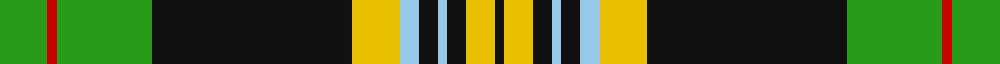

This page is one **sett** — a single exact thread-count. It belongs to the [tartan](/tartans/g5r1g10ka5k1ka1k2ka2k10y5lb2ka2lb1ka2y3k1/)
(the same proportion at any scale), whose colour order is pattern [GRGKKKKKKYWKWKYK](/stripes/grgkkkkkkywkwkyk/).

Sourced from tartans-authority.  It is a [16 stripe tartan](/stripes/stripes16/).

Original link http://www.tartansauthority.com/tartan-ferret/display/7913/

## Thread count
G/10 R2 G20 Ka10 K2 Ka2 K4 Ka4 K20 Y10 LB4 Ka4 LB2 Ka4 Y6 K/2

## Palette
Each colour and the base-6 reference it is a variant of.

| Colour | Shade | Base |
|---|---|---|
| G | <code style="background-color:#289C18;">#289C18</code> `oklch(60.6% 0.191 141.6)` <small>#289C18</small> | G <code style="background-color:#006100;">#006100</code> |
| K | <code style="background-color:#101010;">#101010</code> `oklch(17.3% 0.000 89.9)` <small>#101010</small> | K <code style="background-color:#000000;">#000000</code> |
| Ka | <code style="background-color:#101010;">#101010</code> `oklch(17.3% 0.000 89.9)` <small>#101010</small> | K <code style="background-color:#000000;">#000000</code> |
| LB | <code style="background-color:#98C8E8;">#98C8E8</code> `oklch(81.0% 0.068 237.9)` <small>#98C8E8</small> | W <code style="background-color:#F7F7F7;">#F7F7F7</code> |
| R | <code style="background-color:#C80000;">#C80000</code> `oklch(52.3% 0.215 29.2)` <small>#C80000</small> | R <code style="background-color:#CC0000;">#CC0000</code> |
| Y | <code style="background-color:#E8C000;">#E8C000</code> `oklch(81.9% 0.168 93.7)` <small>#E8C000</small> | Y <code style="background-color:#F2BF00;">#F2BF00</code> |

## Nearest tartans

The nearest existing variants by ΔTartan distance, with this tartan at the top so the swatches line up against it.

ΔTartan

Tartan

Sett

—

<a href="/ttd/edit/#slug=g5r1g10k5k1k1k2k2k10ly5lb2k2lb1k2ly3k1~x2">Glendinning (Personal)</a> <a class="nn-out" href="/setts/s16/g5r1g10k5k1k1k2k2k10ly5lb2k2lb1k2ly3k1~x2/" title="open its dictionary page">↗</a>

1.02

<a href="/ttd/edit/#slug=w2o14ly3k6w2k2w2k2g8y6k2y3w1~x2">O'Farrell</a> <a class="nn-out" href="/setts/s13/w2o14ly3k6w2k2w2k2g8y6k2y3w1~x2/" title="open its dictionary page">↗</a>

1.08

<a href="/ttd/edit/#slug=w2y3k2y6g8k2w2k2g2k6ly3db14w1~x2">Bowling</a> <a class="nn-out" href="/setts/s13/w2y3k2y6g8k2w2k2g2k6ly3db14w1~x2/" title="open its dictionary page">↗</a>

1.10

<a href="/ttd/edit/#slug=g10r2g2r3g11lb2k10r2db12k1lo2r2lo2r2lo2~x2">Esteba-Quer (Personal)</a> <a class="nn-out" href="/setts/s15/g10r2g2r3g11lb2k10r2db12k1lo2r2lo2r2lo2~x2/" title="open its dictionary page">↗</a>

1.10

<a href="/ttd/edit/#slug=k2g2lo1g2dp1g2dp1g10dt3k2dt2k2dt2k2dt3w9dp2~x2">Kennedy Dress, (Pendleton)</a> <a class="nn-out" href="/setts/s17/k2g2lo1g2dp1g2dp1g10dt3k2dt2k2dt2k2dt3w9dp2~x2/" title="open its dictionary page">↗</a>

1.18

<a href="/ttd/edit/#slug=g12r2g2r5g16db3lr2k2lr3db6k20ly3~x2">Kelsey, William (Personal)</a> <a class="nn-out" href="/setts/s12/g12r2g2r5g16db3lr2k2lr3db6k20ly3~x2/" title="open its dictionary page">↗</a>

1.20

<a href="/ttd/edit/#slug=w2dy14ly3k6w2k2w2k2g8lo6k2lo3w2~x2">O'Farrell Irish Family Tartan Tartan Number: 1875. Earliest known date: c1880 This pattern was recorded by Bill Johnston, Shippak, USA in 1978 along with other patterns extracted from the 'Clan Originaux' at Pendleton Mill. This and other Irish patterns appear to have originated in the former Waterford Mill in Ireland before they arrived at Pendleton in the late 19thC See products available Copyright © Blair Urquhart, Comrie, 2015</a> <a class="nn-out" href="/setts/s13/w2dy14ly3k6w2k2w2k2g8lo6k2lo3w2~x2/" title="open its dictionary page">↗</a>

1.21

<a href="/ttd/edit/#slug=r3g2w2g3db3g20k20db2k2db2lo15db3lo3~x2">U.S. Ancient Order of Hibernians (Co</a> <a class="nn-out" href="/setts/s13/r3g2w2g3db3g20k20db2k2db2lo15db3lo3~x2/" title="open its dictionary page">↗</a>

1.22

<a href="/ttd/edit/#slug=db7w2g3db18ly2k15ly2g17r5g3r2g7~x2">Paisley</a> <a class="nn-out" href="/setts/s12/db7w2g3db18ly2k15ly2g17r5g3r2g7~x2/" title="open its dictionary page">↗</a>

1.23

<a href="/ttd/edit/#slug=g3k2r12t9k2t9k16ly3k3w5k3g25r13k4r5w3~x2">Wilson's, No 152</a> <a class="nn-out" href="/setts/s16/g3k2r12t9k2t9k16ly3k3w5k3g25r13k4r5w3~x2/" title="open its dictionary page">↗</a>

1.24

<a href="/ttd/edit/#slug=g10r2g2r3g11lb2k10r2db12k1lo2r2lo2r2~x2">Esteba-Quer (Personal)</a> <a class="nn-out" href="/setts/s14/g10r2g2r3g11lb2k10r2db12k1lo2r2lo2r2~x2/" title="open its dictionary page">↗</a>

## Neighbour map

Every grey dot is one of 14299 variants placed by the first two principal components of the ΔTartan feature space (44% of its variance). Red is this tartan; blue dots are its nearest — click one to open its page.

<svg viewBox="0 0 640 380" role="img" style="max-width:100%;height:auto;border:1px solid #e0e0e0;border-radius:4px;display:block" xmlns="http://www.w3.org/2000/svg"><image href="/nn/cloud.v1.png" width="640" height="380"/><a href="/setts/s13/w2o14ly3k6w2k2w2k2g8y6k2y3w1~x2/"><circle cx="50.6" cy="109.4" r="4" fill="#3465a4"><title>O'Farrell</title></circle></a><a href="/setts/s13/w2y3k2y6g8k2w2k2g2k6ly3db14w1~x2/"><circle cx="51.2" cy="115.3" r="4" fill="#3465a4"><title>Bowling</title></circle></a><a href="/setts/s15/g10r2g2r3g11lb2k10r2db12k1lo2r2lo2r2lo2~x2/"><circle cx="97.7" cy="118.9" r="4" fill="#3465a4"><title>Esteba-Quer (Personal)</title></circle></a><a href="/setts/s17/k2g2lo1g2dp1g2dp1g10dt3k2dt2k2dt2k2dt3w9dp2~x2/"><circle cx="77.7" cy="116.1" r="4" fill="#3465a4"><title>Kennedy Dress, (Pendleton)</title></circle></a><a href="/setts/s12/g12r2g2r5g16db3lr2k2lr3db6k20ly3~x2/"><circle cx="113.4" cy="127.4" r="4" fill="#3465a4"><title>Kelsey, William (Personal)</title></circle></a><a href="/setts/s13/w2dy14ly3k6w2k2w2k2g8lo6k2lo3w2~x2/"><circle cx="32.7" cy="140.4" r="4" fill="#3465a4"><title>O'Farrell Irish Family Tartan Tartan Number: 1875. Earliest known date: c1880 This pattern was recorded by Bill Johnston, Shippak, USA in 1978 along with other patterns extracted from the 'Clan Originaux' at Pendleton Mill. This and other Irish patterns appear to have originated in the former Waterford Mill in Ireland before they arrived at Pendleton in the late 19thC See products available Copyright © Blair Urquhart, Comrie, 2015</title></circle></a><a href="/setts/s13/r3g2w2g3db3g20k20db2k2db2lo15db3lo3~x2/"><circle cx="114.2" cy="122.4" r="4" fill="#3465a4"><title>U.S. Ancient Order of Hibernians (Co</title></circle></a><a href="/setts/s12/db7w2g3db18ly2k15ly2g17r5g3r2g7~x2/"><circle cx="102.1" cy="143.1" r="4" fill="#3465a4"><title>Paisley</title></circle></a><a href="/setts/s16/g3k2r12t9k2t9k16ly3k3w5k3g25r13k4r5w3~x2/"><circle cx="52.4" cy="106.1" r="4" fill="#3465a4"><title>Wilson's, No 152</title></circle></a><a href="/setts/s14/g10r2g2r3g11lb2k10r2db12k1lo2r2lo2r2~x2/"><circle cx="105.8" cy="124.4" r="4" fill="#3465a4"><title>Esteba-Quer (Personal)</title></circle></a><circle cx="55.9" cy="120.5" r="5" fill="#c00000"/></svg>

ID: /setts/s16/g5r1g10k5k1k1k2k2k10ly5lb2k2lb1k2ly3k1~x2/
