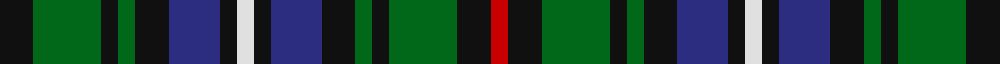

This page is one **sett** — a single exact thread-count. It belongs to the [tartan](/tartans/k2ga4k1ga1k2db3k1ln1k1db3k2ga1k1ga4k2r1/)
(the same proportion at any scale), whose colour order is pattern [KGKGKBKWKBKGKGKR](/stripes/kgkgkbkwkbkgkgkr/).

Sourced from house-of-tartan.  It is a [16 stripe tartan](/stripes/stripes16/).

Original link http://www.house-of-tartan.scotland.net/house/TartanViewjs.asp?colr=Def&tnam=2339

## Thread count
K/12 Ga24 K6 Ga6 K12 DB18 K6 LN6 K6 DB18 K12 Ga6 K6 Ga24 K12 R/6

## Palette
Each colour and the base-6 reference it is a variant of.

| Colour | Shade | Base |
|---|---|---|
| DB | <code style="background-color:#2C2C80;">#2C2C80</code> `oklch(35.0% 0.138 276.6)` <small>#2C2C80</small> | B <code style="background-color:#2A418A;">#2A418A</code> |
| G | <code style="background-color:#285800;">#285800</code> `oklch(41.0% 0.122 135.8)` <small>#285800</small> | G <code style="background-color:#006100;">#006100</code> |
| Ga | <code style="background-color:#006818;">#006818</code> `oklch(45.0% 0.142 145.0)` <small>#006818</small> | G <code style="background-color:#006100;">#006100</code> |
| K | <code style="background-color:#101010;">#101010</code> `oklch(17.3% 0.000 89.9)` <small>#101010</small> | K <code style="background-color:#000000;">#000000</code> |
| LN | <code style="background-color:#E0E0E0;">#E0E0E0</code> `oklch(90.7% 0.000 89.9)` <small>#E0E0E0</small> | W <code style="background-color:#F7F7F7;">#F7F7F7</code> |
| R | <code style="background-color:#C80000;">#C80000</code> `oklch(52.3% 0.215 29.2)` <small>#C80000</small> | R <code style="background-color:#CC0000;">#CC0000</code> |

## Nearest tartans

The nearest existing variants by ΔTartan distance, with this tartan at the top so the swatches line up against it.

ΔTartan

Tartan

Sett

—

<a href="/ttd/edit/#slug=k2g4k1g1k2db3k1w1k1db3k2g1k1g4k2r1~x6">MacKean dress Family/Clan Tartan Tartan Number: 2339. Earliest known date: 1995 This was designed as a special design for silk squares woven by D C Dalgliesh. Assumption is that all these New Zealand MacKeans are Personal tartans rather than Clan/Family. See products available Copyright © Blair Urquhart, Comrie, 2015</a> <a class="nn-out" href="/setts/s16/k2g4k1g1k2db3k1w1k1db3k2g1k1g4k2r1~x6/" title="open its dictionary page">↗</a>

0.79

<a href="/ttd/edit/#slug=k5g4w1g4k1g4r1g4k5db5k1db5~x4">Lloyd of Dolobran Family Tartan Tartan Number: 1970. Earliest known date: 1930-50 This sample comes from the MacGregor-Hastie collection which forms the basis of the cloth archive of the Scottish Tartans Society. Some of the samples, including this one, were unmarked. One can assume that the sample dates between 1930 and 1950. See products available Copyright © Blair Urquhart, Comrie, 2015</a> <a class="nn-out" href="/setts/s12/k5g4w1g4k1g4r1g4k5db5k1db5~x4/" title="open its dictionary page">↗</a>

0.81

<a href="/ttd/edit/#slug=dg6k3dg7r3dg6k13db13k3db13k13dg3w3dg6k3r4~x2">MacRae #2</a> <a class="nn-out" href="/setts/s15/dg6k3dg7r3dg6k13db13k3db13k13dg3w3dg6k3r4~x2/" title="open its dictionary page">↗</a>

1.02

<a href="/ttd/edit/#slug=k2b1g6b2g2k4g5lo1g5k4db4k2db2~x4">Gordon Dress (US Fashion)</a> <a class="nn-out" href="/setts/s13/k2b1g6b2g2k4g5lo1g5k4db4k2db2~x4/" title="open its dictionary page">↗</a>

1.02

<a href="/setts/s14/g5r4g19k10g8w4db18r4~x2/">CSCA</a>

1.04

<a href="/ttd/edit/#slug=db9dg3db9k4dg10r4dg10k6dg2k7dg2k7dg2k6dg10ly4dg10k8~x2">Stuart/Stewart Hunting Plaid</a> <a class="nn-out" href="/setts/s18/db9dg3db9k4dg10r4dg10k6dg2k7dg2k7dg2k6dg10ly4dg10k8~x2/" title="open its dictionary page">↗</a>

1.04

<a href="/setts/s20/k8w2g11t2k2t2g11db6k7db6g8~x2/">Wilson's No.149</a>

1.11

<a href="/ttd/edit/#slug=db4g1db1g6k1g6db1g1db4w1k4g1k4ly1~x4">MacAlpine (1906)</a> <a class="nn-out" href="/setts/s14/db4g1db1g6k1g6db1g1db4w1k4g1k4ly1~x4/" title="open its dictionary page">↗</a>

1.13

<a href="/ttd/edit/#slug=dp6k6g6w1g6k6g6w1g6k6dp6y1~x4">Wilson's No.233</a> <a class="nn-out" href="/setts/s12/dp6k6g6w1g6k6g6w1g6k6dp6y1~x4/" title="open its dictionary page">↗</a>

1.14

<a href="/ttd/edit/#slug=ly3g15k15db15k2db15k15g15m3g15k15g15ly3~x2">MacBride Family Tartan Tartan Number: 2153. Earliest known date: 1992 The family of MacBride, (from SaintBride or Brigid) are known to have been a sept of the MacDonalds. Head of the family, Mr Stuart C. MacBride, commissioned Mr Harry Lindley to create a MacBride tartan from the Ensigns Armorial recently granted by Lord Lyon. Mr MacBride is a member of the Weaver Incorporation of Aberdeen. Traditionally members of the family, as a courtesy, ask permission of the chief or head of the family before wearing his tartan. See products available Copyright © Blair Urquhart, Comrie, 2015</a> <a class="nn-out" href="/setts/s13/ly3g15k15db15k2db15k15g15m3g15k15g15ly3~x2/" title="open its dictionary page">↗</a>

1.17

<a href="/ttd/edit/#slug=k14g14k8ly4k4g14k14db14dp5db4dp5db14~x2">Price-Powell (Personal)</a> <a class="nn-out" href="/setts/s12/k14g14k8ly4k4g14k14db14dp5db4dp5db14~x2/" title="open its dictionary page">↗</a>

## Neighbour map

Every grey dot is one of 14299 variants placed by the first two principal components of the ΔTartan feature space (44% of its variance). Red is this tartan; blue dots are its nearest — click one to open its page.

<svg viewBox="0 0 640 380" role="img" style="max-width:100%;height:auto;border:1px solid #e0e0e0;border-radius:4px;display:block" xmlns="http://www.w3.org/2000/svg"><image href="/nn/cloud.v1.png" width="640" height="380"/><a href="/setts/s12/k5g4w1g4k1g4r1g4k5db5k1db5~x4/"><circle cx="132.1" cy="238.8" r="4" fill="#3465a4"><title>Lloyd of Dolobran Family Tartan Tartan Number: 1970. Earliest known date: 1930-50 This sample comes from the MacGregor-Hastie collection which forms the basis of the cloth archive of the Scottish Tartans Society. Some of the samples, including this one, were unmarked. One can assume that the sample dates between 1930 and 1950. See products available Copyright © Blair Urquhart, Comrie, 2015</title></circle></a><a href="/setts/s15/dg6k3dg7r3dg6k13db13k3db13k13dg3w3dg6k3r4~x2/"><circle cx="113.4" cy="221.0" r="4" fill="#3465a4"><title>MacRae #2</title></circle></a><a href="/setts/s13/k2b1g6b2g2k4g5lo1g5k4db4k2db2~x4/"><circle cx="152.7" cy="228.7" r="4" fill="#3465a4"><title>Gordon Dress (US Fashion)</title></circle></a><a href="/setts/s14/g5r4g19k10g8w4db18r4~x2/"><circle cx="123.4" cy="205.2" r="4" fill="#3465a4"><title>CSCA</title></circle></a><a href="/setts/s18/db9dg3db9k4dg10r4dg10k6dg2k7dg2k7dg2k6dg10ly4dg10k8~x2/"><circle cx="151.0" cy="235.9" r="4" fill="#3465a4"><title>Stuart/Stewart Hunting Plaid</title></circle></a><a href="/setts/s20/k8w2g11t2k2t2g11db6k7db6g8~x2/"><circle cx="146.2" cy="201.5" r="4" fill="#3465a4"><title>Wilson's No.149</title></circle></a><a href="/setts/s14/db4g1db1g6k1g6db1g1db4w1k4g1k4ly1~x4/"><circle cx="159.6" cy="198.7" r="4" fill="#3465a4"><title>MacAlpine (1906)</title></circle></a><a href="/setts/s12/dp6k6g6w1g6k6g6w1g6k6dp6y1~x4/"><circle cx="133.4" cy="229.5" r="4" fill="#3465a4"><title>Wilson's No.233</title></circle></a><a href="/setts/s13/ly3g15k15db15k2db15k15g15m3g15k15g15ly3~x2/"><circle cx="144.8" cy="220.0" r="4" fill="#3465a4"><title>MacBride Family Tartan Tartan Number: 2153. Earliest known date: 1992 The family of MacBride, (from SaintBride or Brigid) are known to have been a sept of the MacDonalds. Head of the family, Mr Stuart C. MacBride, commissioned Mr Harry Lindley to create a MacBride tartan from the Ensigns Armorial recently granted by Lord Lyon. Mr MacBride is a member of the Weaver Incorporation of Aberdeen. Traditionally members of the family, as a courtesy, ask permission of the chief or head of the family before wearing his tartan. See products available Copyright © Blair Urquhart, Comrie, 2015</title></circle></a><a href="/setts/s12/k14g14k8ly4k4g14k14db14dp5db4dp5db14~x2/"><circle cx="93.7" cy="256.4" r="4" fill="#3465a4"><title>Price-Powell (Personal)</title></circle></a><circle cx="119.5" cy="225.1" r="5" fill="#c00000"/></svg>

ID: /setts/s16/k2g4k1g1k2db3k1w1k1db3k2g1k1g4k2r1~x6/
