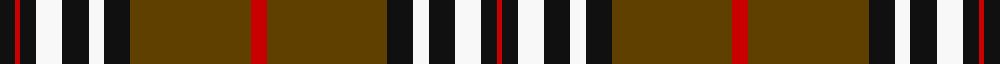

In pattern [KRKWKWKGRGKWKWKR](/stripes/krkwkwkgrgkwkwkr/).

This was sourced from register-of-tartans.  It is a [16 stripe tartan](/stripes/stripes16/).

Original link https://www.tartanregister.gov.uk/tartanDetails.aspx?ref=3845

## Register references

External register numbers recorded for this tartan.

- Scottish Register of Tartans: [3845](https://www.tartanregister.gov.uk/tartanDetails.aspx?ref=3845)
- Scottish Tartans Authority (ITI): 1194
- Scottish Tartans World Register: 1194

## Thread count
K/6 R2 K6 W10 K10 W6 K10 T46 R6 T46 K10 W6 K10 W10 K6 R/2

## Palette
Each colour and the base-6 reference it is a variant of.

| Colour | Shade | Base |
|---|---|---|
| K | <code style="background-color:#101010;">#101010</code> `oklch(17.3% 0.000 89.9)` <small>#101010</small> | K <code style="background-color:#000000;">#000000</code> |
| LN | <code style="background-color:#E0E0E0;">#E0E0E0</code> `oklch(90.7% 0.000 89.9)` <small>#E0E0E0</small> | W <code style="background-color:#F7F7F7;">#F7F7F7</code> |
| R | <code style="background-color:#C80000;">#C80000</code> `oklch(52.3% 0.215 29.2)` <small>#C80000</small> | R <code style="background-color:#CC0000;">#CC0000</code> |
| T | <code style="background-color:#604000;">#604000</code> `oklch(39.8% 0.083 76.8)` <small>#604000</small> | G <code style="background-color:#006100;">#006100</code> |
| W | <code style="background-color:#F8F8F8;">#F8F8F8</code> `oklch(97.9% 0.000 89.9)` <small>#F8F8F8</small> | W <code style="background-color:#F7F7F7;">#F7F7F7</code> |

## Nearest tartans

The nearest existing variants by ΔTartan distance.

1. [Cates Dress (Clan)](/setts/s12/ly2w1r2k20r9k20ly7o20k5ly1k1r1~x2/) — ΔT 1.16
1. [Vaughan (Welsh Series)](/setts/s11/w2k35g30k3lo30k2lo4k2lo30k3w2/) — ΔT 1.19
1. [Wcwm 1399](/setts/s10/k44lb3lo16lb2lo2lb2lo2y10k3y8~x2/) — ΔT 1.19
1. [Southdown (Fashion)](/setts/s9/k3r1k3w5k5w3k5dy23r3~x2/) — ΔT 1.21
1. [MacMillan Ancient](/setts/s12/dg2k1dg18k1dg2k1r12dg4ly6k1ly6k1~x2/) — ΔT 1.28
1. [Cates Dress](/setts/s12/ly2w1r2k20r9k20ly7n20k5ly1k1r1~x2/) — ΔT 1.30
1. [Drummond of Megginch - 1969 Carpet](/setts/s15/r12db3r4db4r36lb6r4db18r4dg2r4dg36r4db4r8/) — ΔT 1.32
1. [Stewart of Appin](/setts/s16/r3db2lb1r2dg24r4dg2r2db8r2dg2r24db2lb1r2dg2~x2/) — ΔT 1.35
1. [Abergavenny](/setts/s17/lb36k41lb4lb6k8o24lb12lb4o4k6lb4lb4k48o4lb8k22lb18/) — ΔT 1.36
1. [Liberty Square](/setts/s12/w12lb2k5lb2k10lb2k15lb2k20lb2y25lb2~x2/) — ΔT 1.36

## Neighbour map

Every grey dot is one of 14299 variants placed by the first two principal components of the ΔTartan feature space (44% of its variance). Red is this tartan; blue dots are its nearest — click one to open its page.

<svg viewBox="0 0 640 380" role="img" style="max-width:100%;height:auto;border:1px solid #e0e0e0;border-radius:4px;display:block" xmlns="http://www.w3.org/2000/svg"><image href="/nn/cloud.v1.png" width="640" height="380"/><a href="/setts/s12/ly2w1r2k20r9k20ly7o20k5ly1k1r1~x2/"><circle cx="248.5" cy="111.3" r="4" fill="#3465a4"><title>Cates Dress (Clan)</title></circle></a><a href="/setts/s11/w2k35g30k3lo30k2lo4k2lo30k3w2/"><circle cx="235.6" cy="128.5" r="4" fill="#3465a4"><title>Vaughan (Welsh Series)</title></circle></a><a href="/setts/s10/k44lb3lo16lb2lo2lb2lo2y10k3y8~x2/"><circle cx="287.7" cy="112.6" r="4" fill="#3465a4"><title>Wcwm 1399</title></circle></a><a href="/setts/s9/k3r1k3w5k5w3k5dy23r3~x2/"><circle cx="253.5" cy="127.2" r="4" fill="#3465a4"><title>Southdown (Fashion)</title></circle></a><a href="/setts/s12/dg2k1dg18k1dg2k1r12dg4ly6k1ly6k1~x2/"><circle cx="253.7" cy="130.1" r="4" fill="#3465a4"><title>MacMillan Ancient</title></circle></a><a href="/setts/s12/ly2w1r2k20r9k20ly7n20k5ly1k1r1~x2/"><circle cx="258.0" cy="117.5" r="4" fill="#3465a4"><title>Cates Dress</title></circle></a><a href="/setts/s15/r12db3r4db4r36lb6r4db18r4dg2r4dg36r4db4r8/"><circle cx="289.3" cy="119.0" r="4" fill="#3465a4"><title>Drummond of Megginch - 1969 Carpet</title></circle></a><a href="/setts/s16/r3db2lb1r2dg24r4dg2r2db8r2dg2r24db2lb1r2dg2~x2/"><circle cx="309.3" cy="94.5" r="4" fill="#3465a4"><title>Stewart of Appin</title></circle></a><a href="/setts/s17/lb36k41lb4lb6k8o24lb12lb4o4k6lb4lb4k48o4lb8k22lb18/"><circle cx="216.5" cy="128.6" r="4" fill="#3465a4"><title>Abergavenny</title></circle></a><a href="/setts/s12/w12lb2k5lb2k10lb2k15lb2k20lb2y25lb2~x2/"><circle cx="222.6" cy="145.3" r="4" fill="#3465a4"><title>Liberty Square</title></circle></a><circle cx="255.5" cy="104.4" r="5" fill="#c00000"/></svg>

ID: /setts/s16/k3r1k3w5k5w3k5dy23r3~x2/
