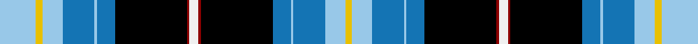

This page is one **sett** — a single exact thread-count. It belongs to the [tartan](/tartans/lb16ya3lb9ba14lb1ba8k32dr1w4/)
(the same proportion at any scale), whose colour order is pattern [WYWBWBKRWRKBWBWY](/stripes/wywbwbkrwrkbwbwy/).

Sourced from register-of-tartans.  It is a [16 stripe tartan](/stripes/stripes16/).

Original link https://www.tartanregister.gov.uk/tartanDetails.aspx?ref=4785

2 attestations — the source records this cloth was collapsed from (oldest owns this page)

<ul>
<li>01/01/1997 — Wrens (WRNS) (register-of-tartans, <a href="https://www.tartanregister.gov.uk/tartanDetails.aspx?ref=4785">record</a>)</li>
<li>undated — Wrens Corporate Tartan Tartan Number: 2345. Earliest known date: 1995 Popularly known as the Wrens. Lochcarron swatch. See products available Copyright © Blair Urquhart, Comrie, 2015 (house-of-tartan, <a href="http://www.house-of-tartan.scotland.net/house/TartanViewjs.asp?colr=Def&tnam=2345">record</a>)</li>
</ul>

## Register references

External register numbers recorded for this tartan.

- Scottish Register of Tartans: [4785](https://www.tartanregister.gov.uk/tartanDetails.aspx?ref=4785)
- Scottish Tartans Authority (ITI): 2345
- Scottish Tartans World Register: 2345

## Thread count
LB/32 Ya6 LB18 Ba28 LB2 Ba16 K64 DR2 W8 DR2 K64 Ba16 LB2 Ba28 LB18 Ya/6

## Palette
Each colour and the base-6 reference it is a variant of.

| Colour | Shade | Base |
|---|---|---|
| B | <code style="background-color:#788CB4;">#788CB4</code> `oklch(63.9% 0.065 264.0)` <small>#788CB4</small> | B <code style="background-color:#2A418A;">#2A418A</code> |
| Ba | <code style="background-color:#1474B4;">#1474B4</code> `oklch(54.0% 0.129 245.1)` <small>#1474B4</small> | B <code style="background-color:#2A418A;">#2A418A</code> |
| DB | <code style="background-color:#00008C;">#00008C</code> `oklch(28.9% 0.200 264.1)` <small>#00008C</small> | B <code style="background-color:#2A418A;">#2A418A</code> |
| DR | <code style="background-color:#8C0000;">#8C0000</code> `oklch(40.2% 0.165 29.2)` <small>#8C0000</small> | R <code style="background-color:#CC0000;">#CC0000</code> |
| G | <code style="background-color:#007800;">#007800</code> `oklch(49.6% 0.169 142.5)` <small>#007800</small> | G <code style="background-color:#006100;">#006100</code> |
| K | <code style="background-color:#000000;">#000000</code> `oklch(0.0% 0.000 0.0)` <small>#000000</small> | K <code style="background-color:#000000;">#000000</code> |
| LB | <code style="background-color:#98C8E8;">#98C8E8</code> `oklch(81.0% 0.068 237.9)` <small>#98C8E8</small> | W <code style="background-color:#F7F7F7;">#F7F7F7</code> |
| P | <code style="background-color:#64008C;">#64008C</code> `oklch(38.5% 0.193 311.3)` <small>#64008C</small> | B <code style="background-color:#2A418A;">#2A418A</code> |
| W | <code style="background-color:#F0F0F0;">#F0F0F0</code> `oklch(95.5% 0.000 89.9)` <small>#F0F0F0</small> | W <code style="background-color:#F7F7F7;">#F7F7F7</code> |
| Y | <code style="background-color:#DCC000;">#DCC000</code> `oklch(80.7% 0.167 98.6)` <small>#DCC000</small> | Y <code style="background-color:#F2BF00;">#F2BF00</code> |
| Ya | <code style="background-color:#E8C000;">#E8C000</code> `oklch(81.9% 0.168 93.7)` <small>#E8C000</small> | Y <code style="background-color:#F2BF00;">#F2BF00</code> |

## Nearest tartans

The nearest existing variants by ΔTartan distance, with this tartan at the top so the swatches line up against it.

ΔTartan

Tartan

Sett

—

<a href="/ttd/edit/#slug=lb16ly3lb9b14lb1b8k32r1w4~x2">Wrens (WRNS)</a> <a class="nn-out" href="/setts/s16/lb16ly3lb9b14lb1b8k32r1w4~x2/" title="open its dictionary page">↗</a>

1.13

<a href="/ttd/edit/#slug=db28ly6k2ly1k2ly6w6dg2w1dg2w6db28n4k5dg8k5n4~x2">Bog Myrtle Corner</a> <a class="nn-out" href="/setts/s17/db28ly6k2ly1k2ly6w6dg2w1dg2w6db28n4k5dg8k5n4~x2/" title="open its dictionary page">↗</a>

1.25

<a href="/ttd/edit/#slug=r3db36lb10k8g13lo6g3lo3g3lo1~x2">Crookdake Cheng Family Tartan Tartan Number: 2207. Earliest known date: 1994 Designed by Phil Smith 1994 for the then Treasurer/Accountant of the Scottish Tartans Society at the request of Keith Lumsden. The yellow represents rice stalks. See products available Copyright © Blair Urquhart, Comrie, 2015</a> <a class="nn-out" href="/setts/s10/r3db36lb10k8g13lo6g3lo3g3lo1~x2/" title="open its dictionary page">↗</a>

1.28

<a href="/ttd/edit/#slug=r2db24lb6k6g6ly4g2ly2g2ly1~x2">Crookdake-Cheng (Personal)</a> <a class="nn-out" href="/setts/s10/r2db24lb6k6g6ly4g2ly2g2ly1~x2/" title="open its dictionary page">↗</a>

1.31

<a href="/ttd/edit/#slug=r3db36w10k8g13ly6g3ly3g3ly1~x2">Crookdake Cheng</a> <a class="nn-out" href="/setts/s10/r3db36w10k8g13ly6g3ly3g3ly1~x2/" title="open its dictionary page">↗</a>

1.31

<a href="/ttd/edit/#slug=lb16ly3lb9b14lb1b8k32r1w4~x2">Wrens (WRNS) (Military)</a> <a class="nn-out" href="/setts/s9/lb16ly3lb9b14lb1b8k32r1w4~x2/" title="open its dictionary page">↗</a>

1.42

<a href="/ttd/edit/#slug=r12lt50dt20db2dt10db4dt8db6dt6db6dt4db8dt2db32lb12db5">Help for Heroes Corporate Tartan Tartan Number: 10561. Earliest known date: 20/01/2012 The use of the tartan is restricted in line with a legal agreement between Help for Heroes and Lochcarron of Scotland. Woven by Lochcarron of Scotland This tartan was inspired by William McGregor and George Neil of G B Tailoring, and has been produced to raise funds for Help for Heroes. The colours represent the UK Army, Navy and Airforce See products available Copyright © Blair Urquhart, Comrie, 2015</a> <a class="nn-out" href="/setts/s16/r12lt50dt20db2dt10db4dt8db6dt6db6dt4db8dt2db32lb12db5/" title="open its dictionary page">↗</a>

1.43

<a href="/ttd/edit/#slug=r3dt14k12t24k1w3k1t24k12dt2k2dt2k2dt8ly1r3~x2">Royal Scottish Country Dance Society</a> <a class="nn-out" href="/setts/s16/r3dt14k12t24k1w3k1t24k12dt2k2dt2k2dt8ly1r3~x2/" title="open its dictionary page">↗</a>

1.44

<a href="/ttd/edit/#slug=db88k15g9r12g20k3ly8k3g20r12g9k15db24k36~x2">Gillies</a> <a class="nn-out" href="/setts/s14/db88k15g9r12g20k3ly8k3g20r12g9k15db24k36~x2/" title="open its dictionary page">↗</a>

1.47

<a href="/ttd/edit/#slug=w4k1db24k1r8w2dg8w2db8k1ly2k8ly2k1~x2">South Africa</a> <a class="nn-out" href="/setts/s14/w4k1db24k1r8w2dg8w2db8k1ly2k8ly2k1~x2/" title="open its dictionary page">↗</a>

1.47

<a href="/ttd/edit/#slug=k33w3k2db7k2w3k5db21k15db1lt18db1~x2">Covington, Christopher (Personal)</a> <a class="nn-out" href="/setts/s12/k33w3k2db7k2w3k5db21k15db1lt18db1~x2/" title="open its dictionary page">↗</a>

## Neighbour map

Every grey dot is one of 14299 variants placed by the first two principal components of the ΔTartan feature space (44% of its variance). Red is this tartan; blue dots are its nearest — click one to open its page.

<svg viewBox="0 0 640 380" role="img" style="max-width:100%;height:auto;border:1px solid #e0e0e0;border-radius:4px;display:block" xmlns="http://www.w3.org/2000/svg"><image href="/nn/cloud.v1.png" width="640" height="380"/><a href="/setts/s17/db28ly6k2ly1k2ly6w6dg2w1dg2w6db28n4k5dg8k5n4~x2/"><circle cx="204.0" cy="62.4" r="4" fill="#3465a4"><title>Bog Myrtle Corner</title></circle></a><a href="/setts/s10/r3db36lb10k8g13lo6g3lo3g3lo1~x2/"><circle cx="187.4" cy="80.7" r="4" fill="#3465a4"><title>Crookdake Cheng Family Tartan Tartan Number: 2207. Earliest known date: 1994 Designed by Phil Smith 1994 for the then Treasurer/Accountant of the Scottish Tartans Society at the request of Keith Lumsden. The yellow represents rice stalks. See products available Copyright © Blair Urquhart, Comrie, 2015</title></circle></a><a href="/setts/s10/r2db24lb6k6g6ly4g2ly2g2ly1~x2/"><circle cx="173.8" cy="88.8" r="4" fill="#3465a4"><title>Crookdake-Cheng (Personal)</title></circle></a><a href="/setts/s10/r3db36w10k8g13ly6g3ly3g3ly1~x2/"><circle cx="179.0" cy="75.3" r="4" fill="#3465a4"><title>Crookdake Cheng</title></circle></a><a href="/setts/s9/lb16ly3lb9b14lb1b8k32r1w4~x2/"><circle cx="150.1" cy="92.6" r="4" fill="#3465a4"><title>Wrens (WRNS) (Military)</title></circle></a><a href="/setts/s16/r12lt50dt20db2dt10db4dt8db6dt6db6dt4db8dt2db32lb12db5/"><circle cx="141.8" cy="89.8" r="4" fill="#3465a4"><title>Help for Heroes Corporate Tartan Tartan Number: 10561. Earliest known date: 20/01/2012 The use of the tartan is restricted in line with a legal agreement between Help for Heroes and Lochcarron of Scotland. Woven by Lochcarron of Scotland This tartan was inspired by William McGregor and George Neil of G B Tailoring, and has been produced to raise funds for Help for Heroes. The colours represent the UK Army, Navy and Airforce See products available Copyright © Blair Urquhart, Comrie, 2015</title></circle></a><a href="/setts/s16/r3dt14k12t24k1w3k1t24k12dt2k2dt2k2dt8ly1r3~x2/"><circle cx="199.5" cy="89.5" r="4" fill="#3465a4"><title>Royal Scottish Country Dance Society</title></circle></a><a href="/setts/s14/db88k15g9r12g20k3ly8k3g20r12g9k15db24k36~x2/"><circle cx="206.2" cy="100.7" r="4" fill="#3465a4"><title>Gillies</title></circle></a><a href="/setts/s14/w4k1db24k1r8w2dg8w2db8k1ly2k8ly2k1~x2/"><circle cx="191.1" cy="77.4" r="4" fill="#3465a4"><title>South Africa</title></circle></a><a href="/setts/s12/k33w3k2db7k2w3k5db21k15db1lt18db1~x2/"><circle cx="247.4" cy="100.3" r="4" fill="#3465a4"><title>Covington, Christopher (Personal)</title></circle></a><circle cx="165.6" cy="70.0" r="5" fill="#c00000"/></svg>

ID: /setts/s16/lb16ly3lb9b14lb1b8k32r1w4~x2/
