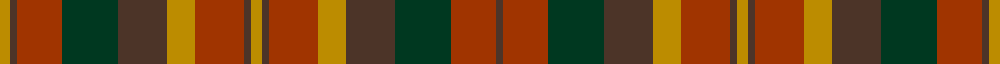

In pattern [BRGBYRBYBRYBGRBY](/stripes/brgbyrbybrybgrby/).

This was sourced from register-of-tartans.  It is a [16 stripe tartan](/stripes/stripes16/).

Original link https://www.tartanregister.gov.uk/tartanDetails.aspx?ref=2977

## Register references

External register numbers recorded for this tartan.

- Scottish Register of Tartans: [2977](https://www.tartanregister.gov.uk/tartanDetails.aspx?ref=2977)
- Scottish Tartans Authority (ITI): 2267
- Scottish Tartans World Register: 2267

## Thread count
DY/6 T4 R26 DG32 T28 DY16 R28 T4 DY6 T4 R28 DY16 T28 DG32 R26 T/4

## Palette
Each colour and the base-6 reference it is a variant of.

| Colour | Shade | Base |
|---|---|---|
| DG | <code style="background-color:#003820;">#003820</code> `oklch(30.0% 0.070 158.3)` <small>#003820</small> | G <code style="background-color:#006100;">#006100</code> |
| DY | <code style="background-color:#BC8C00;">#BC8C00</code> `oklch(66.8% 0.137 84.1)` <small>#BC8C00</small> | Y <code style="background-color:#F2BF00;">#F2BF00</code> |
| R | <code style="background-color:#A03400;">#A03400</code> `oklch(47.9% 0.152 39.6)` <small>#A03400</small> | R <code style="background-color:#CC0000;">#CC0000</code> |
| T | <code style="background-color:#4C3428;">#4C3428</code> `oklch(34.9% 0.040 47.5)` <small>#4C3428</small> | B <code style="background-color:#2A418A;">#2A418A</code> |

## Nearest tartans

The nearest existing variants by ΔTartan distance, with this tartan at the top so the swatches line up against it.

ΔTartan

Tartan

Sett

—

<a href="/ttd/edit/#slug=lo3do2o14lo8do14dg16o13do2lo3~x2">Monaghan, County</a> <a class="nn-out" href="/setts/s16/lo3do2o14lo8do14dg16o13do2lo3~x2/" title="open its dictionary page">↗</a>

0.69

<a href="/ttd/edit/#slug=r7do1do3do1dg4do3dg4do1do4do1dg4do1dg4do1do4do1r7dg1~x4">Buchanan Variation (Fashion)</a> <a class="nn-out" href="/setts/s18/r7do1do3do1dg4do3dg4do1do4do1dg4do1dg4do1do4do1r7dg1~x4/" title="open its dictionary page">↗</a>

1.06

<a href="/ttd/edit/#slug=dy6m2dy2m4dy13dy12o13m4o2m2o6~x2">Glenmorangie #2</a> <a class="nn-out" href="/setts/s11/dy6m2dy2m4dy13dy12o13m4o2m2o6~x2/" title="open its dictionary page">↗</a>

1.21

<a href="/ttd/edit/#slug=lo3do2o14lo8do14dg16o13do2lo3~x2">Monaghan, County (District)</a> <a class="nn-out" href="/setts/s9/lo3do2o14lo8do14dg16o13do2lo3~x2/" title="open its dictionary page">↗</a>

1.26

<a href="/ttd/edit/#slug=lo18do3lo3do3lo3do16y16w3y16do16lo17do3lo3do3lo17do16y16w3~x2">Lamont Heather</a> <a class="nn-out" href="/setts/s18/lo18do3lo3do3lo3do16y16w3y16do16lo17do3lo3do3lo17do16y16w3~x2/" title="open its dictionary page">↗</a>

1.27

<a href="/ttd/edit/#slug=lo25r8lo8r8lo8r46dy46r8dy46r46lo46r8lo8">Poulter SG 101 (Fashion)</a> <a class="nn-out" href="/setts/s13/lo25r8lo8r8lo8r46dy46r8dy46r46lo46r8lo8/" title="open its dictionary page">↗</a>

1.38

<a href="/ttd/edit/#slug=r20dy2r2dy2r2dy15g13dy2w2dy2g13dy15r14dy2r2~x2">Mauthe Unidentified (Name?)</a> <a class="nn-out" href="/setts/s15/r20dy2r2dy2r2dy15g13dy2w2dy2g13dy15r14dy2r2~x2/" title="open its dictionary page">↗</a>

1.39

<a href="/setts/s12/dg25db4r24db21dy25db4dg3~x2/">Orban-Prentice (Personal)</a>

1.47

<a href="/ttd/edit/#slug=r10do10r4dg2r2do2r4dg12dp12dg3dp4~x2">Hueg (Munich) Hunting (Personal)</a> <a class="nn-out" href="/setts/s11/r10do10r4dg2r2do2r4dg12dp12dg3dp4~x2/" title="open its dictionary page">↗</a>

1.53

<a href="/ttd/edit/#slug=r2dy2r20dy2r2dy2r2dy15g13dy2w2dy2g13dy15r14dy2r2~x2">Mauthe Unidentified</a> <a class="nn-out" href="/setts/s17/r2dy2r20dy2r2dy2r2dy15g13dy2w2dy2g13dy15r14dy2r2~x2/" title="open its dictionary page">↗</a>

1.54

<a href="/setts/s14/db8lo1g12r10y2r6y2r4~x4/">Indiana 'Cardinal'</a>

## Neighbour map

Every grey dot is one of 14299 variants placed by the first two principal components of the ΔTartan feature space (44% of its variance). Red is this tartan; blue dots are its nearest — click one to open its page.

<svg viewBox="0 0 640 380" role="img" style="max-width:100%;height:auto;border:1px solid #e0e0e0;border-radius:4px;display:block" xmlns="http://www.w3.org/2000/svg"><image href="/nn/cloud.v1.png" width="640" height="380"/><a href="/setts/s18/r7do1do3do1dg4do3dg4do1do4do1dg4do1dg4do1do4do1r7dg1~x4/"><circle cx="211.7" cy="210.8" r="4" fill="#3465a4"><title>Buchanan Variation (Fashion)</title></circle></a><a href="/setts/s11/dy6m2dy2m4dy13dy12o13m4o2m2o6~x2/"><circle cx="181.9" cy="225.1" r="4" fill="#3465a4"><title>Glenmorangie #2</title></circle></a><a href="/setts/s9/lo3do2o14lo8do14dg16o13do2lo3~x2/"><circle cx="201.9" cy="231.3" r="4" fill="#3465a4"><title>Monaghan, County (District)</title></circle></a><a href="/setts/s18/lo18do3lo3do3lo3do16y16w3y16do16lo17do3lo3do3lo17do16y16w3~x2/"><circle cx="191.8" cy="216.3" r="4" fill="#3465a4"><title>Lamont Heather</title></circle></a><a href="/setts/s13/lo25r8lo8r8lo8r46dy46r8dy46r46lo46r8lo8/"><circle cx="237.4" cy="227.3" r="4" fill="#3465a4"><title>Poulter SG 101 (Fashion)</title></circle></a><a href="/setts/s15/r20dy2r2dy2r2dy15g13dy2w2dy2g13dy15r14dy2r2~x2/"><circle cx="252.3" cy="180.8" r="4" fill="#3465a4"><title>Mauthe Unidentified (Name?)</title></circle></a><a href="/setts/s12/dg25db4r24db21dy25db4dg3~x2/"><circle cx="174.3" cy="220.2" r="4" fill="#3465a4"><title>Orban-Prentice (Personal)</title></circle></a><a href="/setts/s11/r10do10r4dg2r2do2r4dg12dp12dg3dp4~x2/"><circle cx="175.1" cy="238.9" r="4" fill="#3465a4"><title>Hueg (Munich) Hunting (Personal)</title></circle></a><a href="/setts/s17/r2dy2r20dy2r2dy2r2dy15g13dy2w2dy2g13dy15r14dy2r2~x2/"><circle cx="257.7" cy="171.5" r="4" fill="#3465a4"><title>Mauthe Unidentified</title></circle></a><a href="/setts/s14/db8lo1g12r10y2r6y2r4~x4/"><circle cx="246.8" cy="180.4" r="4" fill="#3465a4"><title>Indiana 'Cardinal'</title></circle></a><circle cx="198.8" cy="216.4" r="5" fill="#c00000"/></svg>

ID: /setts/s16/lo3do2o14lo8do14dg16o13do2lo3~x2/
