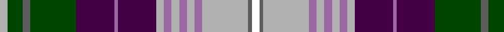

**Bands:** [WBYRYRYRYBRBGBGY](/stripes/wbyryryrybrbgbgy/) · **Stripes:** [W N LR M LR M LR M LR DP M DP DG N DG LR](/stripes/stripes16/) W N LR M LR M LR M LR DP M DP DG N DG LR

This was sourced from register-of-tartans.  It is a [16 band tartan](/bands/bands16/).

Original link https://www.tartanregister.gov.uk/tartanDetails.aspx?ref=11455

## Register references

External register numbers recorded for this tartan.

- Scottish Register of Tartans: [11455](https://www.tartanregister.gov.uk/tartanDetails.aspx?ref=11455)

## Thread count
Na/4 G8 N4 G24 DP20 LP2 DP20 Na4 LP4 Na4 LP4 Na4 LP4 Na24 N2 W/4

## Palette
Each colour and its ΔE from the base-6 reference it is a variant of.

| Colour | Shade | Base | ΔE (OKLab) |
|---|---|---|---|
| DP | <code style="background-color:#440044;">#440044</code> `#440044` | B <code style="background-color:#2A418A;">#2A418A</code> | 0.18 |
| G | <code style="background-color:#004600;">#004600</code> `#004600` | G <code style="background-color:#006100;">#006100</code> | 0.09 |
| LP | <code style="background-color:#9C68A4;">#9C68A4</code> `#9C68A4` | R <code style="background-color:#CC0000;">#CC0000</code> | 0.21 |
| N | <code style="background-color:#5C5C5C;">#5C5C5C</code> `#5C5C5C` | B <code style="background-color:#2A418A;">#2A418A</code> | 0.15 |
| Na | <code style="background-color:#B0B0B0;">#B0B0B0</code> `#B0B0B0` | Y <code style="background-color:#F2BF00;">#F2BF00</code> | 0.18 |
| W | <code style="background-color:#FFFFFF;">#FFFFFF</code> `#FFFFFF` | W <code style="background-color:#F7F7F7;">#F7F7F7</code> | 0.02 |

## Nearest tartans

The nearest existing variants by ΔTartan distance.

1. [Borders (Personal)](/setts/s16/w2k15n7lr7k1r1k1lr7k1w7k7n7lr7w1k1r1~x2/) — ΔT 0.86
1. [Norwich No.014](/setts/s16/r22lt3db5ly2r2w2dg11db4w3db4dg11w2r2ly2db5lt3~x2/) — ΔT 0.87
1. [Wexford County Crest (Fashion)](/setts/s15/w6y6w6y12lr8y14lo24k4lr4k4dp44w12y20k4lr5/) — ΔT 0.88
1. [Dalrymple of Castleton](/setts/s14/lo2r15lo3dr2lo3k14lo2t6w2t6lo2r7t10w1~x2/) — ΔT 0.91
1. [Hebridean Arisaid Red (Dance)](/setts/s16/r6k4r23lr2w2g12db12k4w37k4db12g12w2lr2r23k4~x2/) — ΔT 0.94
1. [Wilson's No.227](/setts/s16/r26t7dp8ly3r3w3g20dp10w2dp10g20w3r3ly3dp8t7~x2/) — ΔT 1.01
1. [Anderson (MacGregor-Hastie #3)](/setts/s24/r6dg10r2k2r4k2r2dg10r4k9r2k9ly2k3ly2k4w6k6t27r2k2r2t10r6~x2/) — ΔT 1.05
1. [Enable (Corporate)](/setts/s13/ly3g4n14dp3n2dp18lb16g14n2dp3lb3n2lo1~x2/) — ΔT 1.06
1. [Declaration of Scottish Independence](/setts/s19/w16b38db2b6db2b4db4b2db6b2db12r16k8ly8r4ly3r2ly16r10/) — ΔT 1.06
1. [Prince Albert](/setts/s13/db23r6db6k10ly3k2w2k2dg11r12k2r10w2~x2/) — ΔT 1.06

## Neighbour map

Every grey dot is one of 14313 variants placed by the first two principal components of the ΔTartan feature space (44% of its variance). Red is this tartan; blue dots are its nearest — click one to open its page.

<svg viewBox="0 0 640 380" role="img" style="max-width:100%;height:auto;border:1px solid #e0e0e0;border-radius:4px;display:block" xmlns="http://www.w3.org/2000/svg"><image href="/nn/cloud.v1.png" width="640" height="380"/><a href="/setts/s16/w2k15n7lr7k1r1k1lr7k1w7k7n7lr7w1k1r1~x2/"><circle cx="97.5" cy="99.9" r="4" fill="#3465a4"><title>Borders (Personal)</title></circle></a><a href="/setts/s16/r22lt3db5ly2r2w2dg11db4w3db4dg11w2r2ly2db5lt3~x2/"><circle cx="83.1" cy="96.3" r="4" fill="#3465a4"><title>Norwich No.014</title></circle></a><a href="/setts/s15/w6y6w6y12lr8y14lo24k4lr4k4dp44w12y20k4lr5/"><circle cx="86.9" cy="111.5" r="4" fill="#3465a4"><title>Wexford County Crest (Fashion)</title></circle></a><a href="/setts/s14/lo2r15lo3dr2lo3k14lo2t6w2t6lo2r7t10w1~x2/"><circle cx="95.3" cy="107.6" r="4" fill="#3465a4"><title>Dalrymple of Castleton</title></circle></a><a href="/setts/s16/r6k4r23lr2w2g12db12k4w37k4db12g12w2lr2r23k4~x2/"><circle cx="105.8" cy="80.7" r="4" fill="#3465a4"><title>Hebridean Arisaid Red (Dance)</title></circle></a><a href="/setts/s16/r26t7dp8ly3r3w3g20dp10w2dp10g20w3r3ly3dp8t7~x2/"><circle cx="89.7" cy="110.4" r="4" fill="#3465a4"><title>Wilson's No.227</title></circle></a><a href="/setts/s24/r6dg10r2k2r4k2r2dg10r4k9r2k9ly2k3ly2k4w6k6t27r2k2r2t10r6~x2/"><circle cx="81.1" cy="85.1" r="4" fill="#3465a4"><title>Anderson (MacGregor-Hastie #3)</title></circle></a><a href="/setts/s13/ly3g4n14dp3n2dp18lb16g14n2dp3lb3n2lo1~x2/"><circle cx="106.7" cy="105.4" r="4" fill="#3465a4"><title>Enable (Corporate)</title></circle></a><a href="/setts/s19/w16b38db2b6db2b4db4b2db6b2db12r16k8ly8r4ly3r2ly16r10/"><circle cx="95.5" cy="70.0" r="4" fill="#3465a4"><title>Declaration of Scottish Independence</title></circle></a><a href="/setts/s13/db23r6db6k10ly3k2w2k2dg11r12k2r10w2~x2/"><circle cx="109.8" cy="125.4" r="4" fill="#3465a4"><title>Prince Albert</title></circle></a><circle cx="94.2" cy="107.5" r="5" fill="#c00000"/></svg>

ID: /setts/s16/lr2dg4n2dg12dp10m1dp10lr2m2lr2m2lr2m2lr12n1w2~x2/
