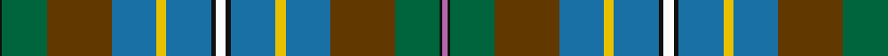

**Bands:** [KGGBYBKWKBYBGGKR](/stripes/kggbybkwkbybggkr/) · **Stripes:** [K G DY B LY B K W K B LY B DY G K M](/stripes/stripes16/) K G DY B LY B K W K B LY B DY G K M

This was sourced from register-of-tartans.  It is a [16 band tartan](/bands/bands16/).

Original link https://www.tartanregister.gov.uk/tartanDetails.aspx?ref=1781

## Register references

External register numbers recorded for this tartan.

- Scottish Register of Tartans: [1781](https://www.tartanregister.gov.uk/tartanDetails.aspx?ref=1781)
- Scottish Tartans Authority (ITI): 6037

## Thread count
K/2 G36 T52 B36 Y8 B36 K4 W8 K4 B36 Y8 B36 T52 G36 K2 P/4

## Palette
Each colour and its ΔE from the base-6 reference it is a variant of.

| Colour | Shade | Base | ΔE (OKLab) |
|---|---|---|---|
| B | <code style="background-color:#1870A4;">#1870A4</code> `#1870A4` | B <code style="background-color:#2A418A;">#2A418A</code> | 0.13 |
| Ba | <code style="background-color:#3850C8;">#3850C8</code> `#3850C8` | B <code style="background-color:#2A418A;">#2A418A</code> | 0.11 |
| G | <code style="background-color:#00643C;">#00643C</code> `#00643C` | G <code style="background-color:#006100;">#006100</code> | 0.05 |
| K | <code style="background-color:#101010;">#101010</code> `#101010` | K <code style="background-color:#000000;">#000000</code> | 0.17 |
| P | <code style="background-color:#B468AC;">#B468AC</code> `#B468AC` | R <code style="background-color:#CC0000;">#CC0000</code> | 0.21 |
| T | <code style="background-color:#603800;">#603800</code> `#603800` | G <code style="background-color:#006100;">#006100</code> | 0.16 |
| W | <code style="background-color:#FCFCFC;">#FCFCFC</code> `#FCFCFC` | W <code style="background-color:#F7F7F7;">#F7F7F7</code> | 0.01 |
| Y | <code style="background-color:#E8C000;">#E8C000</code> `#E8C000` | Y <code style="background-color:#F2BF00;">#F2BF00</code> | 0.02 |

## Nearest tartans

The nearest existing variants by ΔTartan distance.

1. [Teviotdale District Tartan Tartan Number: 5136. Earliest known date: 01/01/1996 Lochcarron. The colours are representative of those in the valley through which flows the River Teviot in the Scottish Borders. Sample in Scottish Tartans Authority's Johnston Collection. Blues lightened to show sett. See products available Copyright © Blair Urquhart, Comrie, 2015](/setts/s14/k5k3dy4ly1db13dy13g29w2g29dy13db13ly1dy4k3~x2/) — ΔT 1.21
1. [Hughes Interconnection Int. (Pers)](/setts/s9/w4k2b18ly4b18dy26g18k1m2~x2/) — ΔT 1.27
1. [Campbell, Brown](/setts/s13/ly9k1o31g30db36g3db3g3db36g30o31k1w9~x2/) — ΔT 1.29
1. [Campbell Brown](/setts/s13/ly9k1dy31dg30db36dg3db3dg3db36dg30dy31k1w9~x2/) — ΔT 1.35
1. [Les Cercles de Fermieres du Quebec](/setts/s17/db16dg40w5db25g30ly4dg3w3k4db15g22w2dg19g2dy8k4dy16~x2/) — ΔT 1.41
1. [Mill o Forest Primary School (Corp)](/setts/s13/db3dg22r5dg5o5w1o1dg1g8db6o1db5dg2~x2/) — ΔT 1.44
1. [Causeway, The](/setts/s15/n38t8lg3n20t42k2g6k2t2m3t2w2lg10t2k6/) — ΔT 1.49
1. [Norwegian Night (Fashion)](/setts/s18/n2dt9y1dt4y2dt2y4n1y15g1y3g3y2g4y1g7ly1r2~x2/) — ΔT 1.51
1. [Inverclyde Green](/setts/s20/db5b2db9dp10k2dp4k2g10g33w2g33g10k2dp4k2dp10db9b2db5w3~x2/) — ΔT 1.52
1. [California State American District Tartan Tartan Number: 2454. Earliest known date: 1998 Designed by J.Howard Standing of Tarzana, California and Thomas Ferguson of Sydney, British Columbia. Adopted as the 'official' California State tartan by the State Legislature. For general use by all those living in the State. Based on Muir, after the famous botanist and environmentalist John Muir who lived in California. Assembly Bill 2362, february 20th 1998. See products available Copyright © Blair Urquhart, Comrie, 2015](/setts/s13/lb4k1t28k16g10r2g10r4g10r2g10k1lo4~x2/) — ΔT 1.54

## Neighbour map

Every grey dot is one of 14313 variants placed by the first two principal components of the ΔTartan feature space (44% of its variance). Red is this tartan; blue dots are its nearest — click one to open its page.

<svg viewBox="0 0 640 380" role="img" style="max-width:100%;height:auto;border:1px solid #e0e0e0;border-radius:4px;display:block" xmlns="http://www.w3.org/2000/svg"><image href="/nn/cloud.v1.png" width="640" height="380"/><a href="/setts/s14/k5k3dy4ly1db13dy13g29w2g29dy13db13ly1dy4k3~x2/"><circle cx="222.7" cy="103.3" r="4" fill="#3465a4"><title>Teviotdale District Tartan Tartan Number: 5136. Earliest known date: 01/01/1996 Lochcarron. The colours are representative of those in the valley through which flows the River Teviot in the Scottish Borders. Sample in Scottish Tartans Authority's Johnston Collection. Blues lightened to show sett. See products available Copyright © Blair Urquhart, Comrie, 2015</title></circle></a><a href="/setts/s9/w4k2b18ly4b18dy26g18k1m2~x2/"><circle cx="182.1" cy="120.3" r="4" fill="#3465a4"><title>Hughes Interconnection Int. (Pers)</title></circle></a><a href="/setts/s13/ly9k1o31g30db36g3db3g3db36g30o31k1w9~x2/"><circle cx="190.6" cy="112.2" r="4" fill="#3465a4"><title>Campbell, Brown</title></circle></a><a href="/setts/s13/ly9k1dy31dg30db36dg3db3dg3db36dg30dy31k1w9~x2/"><circle cx="210.5" cy="127.1" r="4" fill="#3465a4"><title>Campbell Brown</title></circle></a><a href="/setts/s17/db16dg40w5db25g30ly4dg3w3k4db15g22w2dg19g2dy8k4dy16~x2/"><circle cx="117.1" cy="113.4" r="4" fill="#3465a4"><title>Les Cercles de Fermieres du Quebec</title></circle></a><a href="/setts/s13/db3dg22r5dg5o5w1o1dg1g8db6o1db5dg2~x2/"><circle cx="240.4" cy="118.8" r="4" fill="#3465a4"><title>Mill o Forest Primary School (Corp)</title></circle></a><a href="/setts/s15/n38t8lg3n20t42k2g6k2t2m3t2w2lg10t2k6/"><circle cx="223.6" cy="87.3" r="4" fill="#3465a4"><title>Causeway, The</title></circle></a><a href="/setts/s18/n2dt9y1dt4y2dt2y4n1y15g1y3g3y2g4y1g7ly1r2~x2/"><circle cx="220.3" cy="129.3" r="4" fill="#3465a4"><title>Norwegian Night (Fashion)</title></circle></a><a href="/setts/s20/db5b2db9dp10k2dp4k2g10g33w2g33g10k2dp4k2dp10db9b2db5w3~x2/"><circle cx="164.7" cy="81.5" r="4" fill="#3465a4"><title>Inverclyde Green</title></circle></a><a href="/setts/s13/lb4k1t28k16g10r2g10r4g10r2g10k1lo4~x2/"><circle cx="187.7" cy="107.3" r="4" fill="#3465a4"><title>California State American District Tartan Tartan Number: 2454. Earliest known date: 1998 Designed by J.Howard Standing of Tarzana, California and Thomas Ferguson of Sydney, British Columbia. Adopted as the 'official' California State tartan by the State Legislature. For general use by all those living in the State. Based on Muir, after the famous botanist and environmentalist John Muir who lived in California. Assembly Bill 2362, february 20th 1998. See products available Copyright © Blair Urquhart, Comrie, 2015</title></circle></a><circle cx="188.0" cy="109.1" r="5" fill="#c00000"/></svg>

ID: /setts/s16/m2k1g18dy26b18ly4b18k2w4k2b18ly4b18dy26g18k1~x2/
