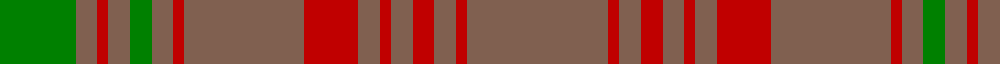

This page is one **sett** — a single exact thread-count. It belongs to the [tartan](/tartans/lt13r1lt2r2lt2r1lt2r5lt11r1lt2g2lt2r1lt2g7/)
(the same proportion at any scale), whose colour order is pattern [GRRRGRRRRRRRRRRR](/stripes/grrrgrrrrrrrrrrr/).

Sourced from weddslist.  It is a [16 stripe tartan](/stripes/stripes16/).

Original link http://www.weddslist.com/cgi-bin/tartans/pg.pl?source=sts

## Thread count
LT/26 R2 LT4 R4 LT4 R2 LT4 R10 LT22 R2 LT4 G4 LT4 R2 LT4 G/14

## Palette
Each colour and the base-6 reference it is a variant of.

| Colour | Shade | Base |
|---|---|---|
| G | <code style="background-color:#008000;">#008000</code> `oklch(52.0% 0.177 142.5)` <small>#008000</small> | G <code style="background-color:#006100;">#006100</code> |
| LT | <code style="background-color:#806050;">#806050</code> `oklch(51.7% 0.049 47.8)` <small>#806050</small> | R <code style="background-color:#CC0000;">#CC0000</code> |
| R | <code style="background-color:#C00000;">#C00000</code> `oklch(50.7% 0.208 29.2)` <small>#C00000</small> | R <code style="background-color:#CC0000;">#CC0000</code> |

## Nearest tartans

The nearest existing variants by ΔTartan distance, with this tartan at the top so the swatches line up against it.

ΔTartan

Tartan

Sett

—

<a href="/ttd/edit/#slug=o13r1o2r2o2r1o2r5o11r1o2g2o2r1o2g7~x2">Sarna</a> <a class="nn-out" href="/setts/s16/o13r1o2r2o2r1o2r5o11r1o2g2o2r1o2g7~x2/" title="open its dictionary page">↗</a>

0.92

<a href="/ttd/edit/#slug=dy13r1dy2r2dy2r1dy2r5dy11r1dy2g2dy2r1dy2g7~x2">Sarna (District)</a> <a class="nn-out" href="/setts/s16/dy13r1dy2r2dy2r1dy2r5dy11r1dy2g2dy2r1dy2g7~x2/" title="open its dictionary page">↗</a>

1.29

<a href="/ttd/edit/#slug=n33g10r3g3r3g3r8n10r3n10r8g3r3g3r3g10n33r3~x2">Gray (Personal)</a> <a class="nn-out" href="/setts/s18/n33g10r3g3r3g3r8n10r3n10r8g3r3g3r3g10n33r3~x2/" title="open its dictionary page">↗</a>

1.41

<a href="/ttd/edit/#slug=g4o2g2o2g2o3db1o1g4o1db1o12db2o3~x2">MacAlister of Glenbarr</a> <a class="nn-out" href="/setts/s14/g4o2g2o2g2o3db1o1g4o1db1o12db2o3~x2/" title="open its dictionary page">↗</a>

1.61

<a href="/setts/s30/dy13r1dy2r2dy2r1dy2r5dy11r1dy2g2dy2r1dy2g7~x2/">Sarna (Town)</a>

1.67

<a href="/ttd/edit/#slug=r3y33g10r3g3r3g3r8y10r3~x2">Gray (Name)</a> <a class="nn-out" href="/setts/s10/r3y33g10r3g3r3g3r8y10r3~x2/" title="open its dictionary page">↗</a>

1.72

<a href="/ttd/edit/#slug=g4dy2g2dy2g2dy3db1dy1g4dy1db1dy12db2dy3~x2">MacAlister of Glenbarr Clan Tartan Tartan Number: 910. Earliest known date: pre 1984 This version of the MacAlister of Glenbarr tartan is the same as the MacGillivray hunting tartan. This sample was taken from a piece woven by Lochcarron Weavers around 1984. See products available Copyright © Blair Urquhart, Comrie, 2015</a> <a class="nn-out" href="/setts/s14/g4dy2g2dy2g2dy3db1dy1g4dy1db1dy12db2dy3~x2/" title="open its dictionary page">↗</a>

1.77

<a href="/setts/s14/r4o3dy2o38y30dy3y3dy3~x2/">Unidentified Lindley #6</a>

1.80

<a href="/ttd/edit/#slug=dg4dy14r1dy1dg1dy1r1dy14r14dy1r1dg1~x4">Frame - Ferniegair (Personal)</a> <a class="nn-out" href="/setts/s12/dg4dy14r1dy1dg1dy1r1dy14r14dy1r1dg1~x4/" title="open its dictionary page">↗</a>

1.88

<a href="/ttd/edit/#slug=n16r1dg3n5r1n5dg3n4dg12n14ly1n14dg12ly2r6~x2">Howells</a> <a class="nn-out" href="/setts/s15/n16r1dg3n5r1n5dg3n4dg12n14ly1n14dg12ly2r6~x2/" title="open its dictionary page">↗</a>

2.02

<a href="/ttd/edit/#slug=g8o5g5o5g5o6db1o2g8o2db1o24db4o6~x2">MacGillivray Htg (Clan)</a> <a class="nn-out" href="/setts/s14/g8o5g5o5g5o6db1o2g8o2db1o24db4o6~x2/" title="open its dictionary page">↗</a>

## Neighbour map

Every grey dot is one of 14299 variants placed by the first two principal components of the ΔTartan feature space (44% of its variance). Red is this tartan; blue dots are its nearest — click one to open its page.

<svg viewBox="0 0 640 380" role="img" style="max-width:100%;height:auto;border:1px solid #e0e0e0;border-radius:4px;display:block" xmlns="http://www.w3.org/2000/svg"><image href="/nn/cloud.v1.png" width="640" height="380"/><a href="/setts/s16/dy13r1dy2r2dy2r1dy2r5dy11r1dy2g2dy2r1dy2g7~x2/"><circle cx="479.1" cy="214.3" r="4" fill="#3465a4"><title>Sarna (District)</title></circle></a><a href="/setts/s18/n33g10r3g3r3g3r8n10r3n10r8g3r3g3r3g10n33r3~x2/"><circle cx="430.4" cy="216.7" r="4" fill="#3465a4"><title>Gray (Personal)</title></circle></a><a href="/setts/s14/g4o2g2o2g2o3db1o1g4o1db1o12db2o3~x2/"><circle cx="440.2" cy="228.7" r="4" fill="#3465a4"><title>MacAlister of Glenbarr</title></circle></a><a href="/setts/s30/dy13r1dy2r2dy2r1dy2r5dy11r1dy2g2dy2r1dy2g7~x2/"><circle cx="466.0" cy="183.3" r="4" fill="#3465a4"><title>Sarna (Town)</title></circle></a><a href="/setts/s10/r3y33g10r3g3r3g3r8y10r3~x2/"><circle cx="413.4" cy="225.0" r="4" fill="#3465a4"><title>Gray (Name)</title></circle></a><a href="/setts/s14/g4dy2g2dy2g2dy3db1dy1g4dy1db1dy12db2dy3~x2/"><circle cx="467.8" cy="247.7" r="4" fill="#3465a4"><title>MacAlister of Glenbarr Clan Tartan Tartan Number: 910. Earliest known date: pre 1984 This version of the MacAlister of Glenbarr tartan is the same as the MacGillivray hunting tartan. This sample was taken from a piece woven by Lochcarron Weavers around 1984. See products available Copyright © Blair Urquhart, Comrie, 2015</title></circle></a><a href="/setts/s14/r4o3dy2o38y30dy3y3dy3~x2/"><circle cx="411.0" cy="169.3" r="4" fill="#3465a4"><title>Unidentified Lindley #6</title></circle></a><a href="/setts/s12/dg4dy14r1dy1dg1dy1r1dy14r14dy1r1dg1~x4/"><circle cx="446.2" cy="192.8" r="4" fill="#3465a4"><title>Frame - Ferniegair (Personal)</title></circle></a><a href="/setts/s15/n16r1dg3n5r1n5dg3n4dg12n14ly1n14dg12ly2r6~x2/"><circle cx="390.5" cy="197.5" r="4" fill="#3465a4"><title>Howells</title></circle></a><a href="/setts/s14/g8o5g5o5g5o6db1o2g8o2db1o24db4o6~x2/"><circle cx="446.5" cy="183.7" r="4" fill="#3465a4"><title>MacGillivray Htg (Clan)</title></circle></a><circle cx="480.8" cy="212.3" r="5" fill="#c00000"/></svg>

ID: /setts/s16/o13r1o2r2o2r1o2r5o11r1o2g2o2r1o2g7~x2/
