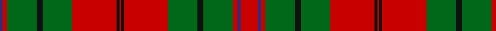

**Bands:** [BRGKGRKRKRGKGRBR](/stripes/brgkgrkrkrgkgrbr/) · **Stripes:** [DB R G K G R K R K R G K G R DB R](/stripes/stripes16/) DB R G K G R K R K R G K G R DB R

This was sourced from register-of-tartans.  It is a [16 band tartan](/bands/bands16/).

Original link https://www.tartanregister.gov.uk/tartanDetails.aspx?ref=4817

## Register references

External register numbers recorded for this tartan.

- Scottish Register of Tartans: [4817](https://www.tartanregister.gov.uk/tartanDetails.aspx?ref=4817)
- Scottish Tartans Authority (ITI): 2166
- Scottish Tartans World Register: 2166

## Thread count
DBa/4 R6 G40 K8 G40 R60 K4 R2 K4 R60 G40 K8 G40 R6 DBa4 R/24

## Palette
Each colour and its ΔE from the base-6 reference it is a variant of.

| Colour | Shade | Base | ΔE (OKLab) |
|---|---|---|---|
| DB | <code style="background-color:#1C0070;">#1C0070</code> `#1C0070` | B <code style="background-color:#2A418A;">#2A418A</code> | 0.14 |
| DBa | <code style="background-color:#2C2C80;">#2C2C80</code> `#2C2C80` | B <code style="background-color:#2A418A;">#2A418A</code> | 0.06 |
| DG | <code style="background-color:#003820;">#003820</code> `#003820` | G <code style="background-color:#006100;">#006100</code> | 0.15 |
| G | <code style="background-color:#006818;">#006818</code> `#006818` | G <code style="background-color:#006100;">#006100</code> | 0.02 |
| K | <code style="background-color:#101010;">#101010</code> `#101010` | K <code style="background-color:#000000;">#000000</code> | 0.17 |
| R | <code style="background-color:#C80000;">#C80000</code> `#C80000` | R <code style="background-color:#CC0000;">#CC0000</code> | 0.01 |

## Nearest tartans

The nearest existing variants by ΔTartan distance.

1. [MacAulay](/setts/s15/k2r18g7r3g10w1g10r3g10w1g10r3g7r18k1~x4/) — ΔT 1.14
1. [Strang (Personal)](/setts/s14/r36g18r4g6k1lb2k1g2k1lb2k1g6r4g18~x2/) — ΔT 1.15
1. [Oriel #1 (District)](/setts/s9/r12db2r3g20k4g20r30k2r1~x2/) — ΔT 1.22
1. [MacQuarrie 1](/setts/s14/r4t2r50db26r10g44r4r10r4g44r51db2r4t2~x2/) — ΔT 1.23
1. [MacKinnon](/setts/s27/w4r6g4db4r12g32r4db8g4r32g16w4r8w4r8w4g16r32g4db8r4g32r12db4g4r6w1~x2/) — ΔT 1.30
1. [Scott](/setts/s12/g4r3k1r28g14r4g4w3g4r4g4w3~x2/) — ΔT 1.33
1. [Grant, Piper to the Laird of](/setts/s12/o24k2y8k2o8k1y24db6k2o14y18k4/) — ΔT 1.35
1. [Unidentified](/setts/s22/ly3g30r7g2r1g8r1g2r7g16k18t8r14g8r1g1r7g1r1g8r27ly3~x2/) — ΔT 1.37
1. [Matheson](/setts/s21/g8r4g1r1g1r24db8g4r1g1r1g4r8g1r1g1r1db8g8r2g4~x2/) — ΔT 1.38
1. [Unnamed C18/19th - Antigonish (A)](/setts/s18/dt13r6dt2r6w1y26r2dt26y6r26y6dt26r2y26w1r6dt2r6~x2/) — ΔT 1.40

## Neighbour map

Every grey dot is one of 14313 variants placed by the first two principal components of the ΔTartan feature space (44% of its variance). Red is this tartan; blue dots are its nearest — click one to open its page.

<svg viewBox="0 0 640 380" role="img" style="max-width:100%;height:auto;border:1px solid #e0e0e0;border-radius:4px;display:block" xmlns="http://www.w3.org/2000/svg"><image href="/nn/cloud.v1.png" width="640" height="380"/><a href="/setts/s15/k2r18g7r3g10w1g10r3g10w1g10r3g7r18k1~x4/"><circle cx="322.7" cy="157.9" r="4" fill="#3465a4"><title>MacAulay</title></circle></a><a href="/setts/s14/r36g18r4g6k1lb2k1g2k1lb2k1g6r4g18~x2/"><circle cx="360.6" cy="99.6" r="4" fill="#3465a4"><title>Strang (Personal)</title></circle></a><a href="/setts/s9/r12db2r3g20k4g20r30k2r1~x2/"><circle cx="345.5" cy="146.1" r="4" fill="#3465a4"><title>Oriel #1 (District)</title></circle></a><a href="/setts/s14/r4t2r50db26r10g44r4r10r4g44r51db2r4t2~x2/"><circle cx="313.3" cy="110.7" r="4" fill="#3465a4"><title>MacQuarrie 1</title></circle></a><a href="/setts/s27/w4r6g4db4r12g32r4db8g4r32g16w4r8w4r8w4g16r32g4db8r4g32r12db4g4r6w1~x2/"><circle cx="278.3" cy="89.2" r="4" fill="#3465a4"><title>MacKinnon</title></circle></a><a href="/setts/s12/g4r3k1r28g14r4g4w3g4r4g4w3~x2/"><circle cx="335.1" cy="109.1" r="4" fill="#3465a4"><title>Scott</title></circle></a><a href="/setts/s12/o24k2y8k2o8k1y24db6k2o14y18k4/"><circle cx="310.9" cy="160.1" r="4" fill="#3465a4"><title>Grant, Piper to the Laird of</title></circle></a><a href="/setts/s22/ly3g30r7g2r1g8r1g2r7g16k18t8r14g8r1g1r7g1r1g8r27ly3~x2/"><circle cx="254.7" cy="82.7" r="4" fill="#3465a4"><title>Unidentified</title></circle></a><a href="/setts/s21/g8r4g1r1g1r24db8g4r1g1r1g4r8g1r1g1r1db8g8r2g4~x2/"><circle cx="326.4" cy="117.7" r="4" fill="#3465a4"><title>Matheson</title></circle></a><a href="/setts/s18/dt13r6dt2r6w1y26r2dt26y6r26y6dt26r2y26w1r6dt2r6~x2/"><circle cx="255.7" cy="127.3" r="4" fill="#3465a4"><title>Unnamed C18/19th - Antigonish (A)</title></circle></a><circle cx="318.2" cy="124.4" r="5" fill="#c00000"/></svg>

ID: /setts/s16/r12db2r3g20k4g20r30k2r1k2r30g20k4g20r3db2~x2/
