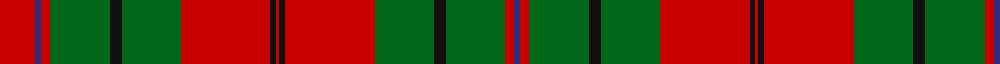

In pattern [BRGKGRKRKRGKGRBR](/stripes/brgkgrkrkrgkgrbr/).

This was sourced from register-of-tartans.  It is a [16 stripe tartan](/stripes/stripes16/).

Original link https://www.tartanregister.gov.uk/tartanDetails.aspx?ref=4817

## Register references

External register numbers recorded for this tartan.

- Scottish Register of Tartans: [4817](https://www.tartanregister.gov.uk/tartanDetails.aspx?ref=4817)
- Scottish Tartans Authority (ITI): 2166
- Scottish Tartans World Register: 2166

## Thread count
R/24 DBa4 R6 G40 K8 G40 R60 K4 R2 K4 R60 G40 K8 G40 R6 DBa/4

## Palette
Each colour and the base-6 reference it is a variant of.

| Colour | Shade | Base |
|---|---|---|
| DB | <code style="background-color:#1C0070;">#1C0070</code> `oklch(26.3% 0.162 277.1)` <small>#1C0070</small> | B <code style="background-color:#2A418A;">#2A418A</code> |
| DBa | <code style="background-color:#2C2C80;">#2C2C80</code> `oklch(35.0% 0.138 276.6)` <small>#2C2C80</small> | B <code style="background-color:#2A418A;">#2A418A</code> |
| DG | <code style="background-color:#003820;">#003820</code> `oklch(30.0% 0.070 158.3)` <small>#003820</small> | G <code style="background-color:#006100;">#006100</code> |
| G | <code style="background-color:#006818;">#006818</code> `oklch(45.0% 0.142 145.0)` <small>#006818</small> | G <code style="background-color:#006100;">#006100</code> |
| K | <code style="background-color:#101010;">#101010</code> `oklch(17.3% 0.000 89.9)` <small>#101010</small> | K <code style="background-color:#000000;">#000000</code> |
| R | <code style="background-color:#C80000;">#C80000</code> `oklch(52.3% 0.215 29.2)` <small>#C80000</small> | R <code style="background-color:#CC0000;">#CC0000</code> |

## Nearest tartans

The nearest existing variants by ΔTartan distance, with this tartan at the top so the swatches line up against it.

ΔTartan

Tartan

Sett

—

<a href="/ttd/edit/#slug=r12db2r3g20k4g20r30k2r1~x2">Oriel #1</a> <a class="nn-out" href="/setts/s16/r12db2r3g20k4g20r30k2r1~x2/" title="open its dictionary page">↗</a>

1.14

<a href="/ttd/edit/#slug=k2r18g7r3g10w1g10r3g10w1g10r3g7r18k1~x4">MacAulay</a> <a class="nn-out" href="/setts/s15/k2r18g7r3g10w1g10r3g10w1g10r3g7r18k1~x4/" title="open its dictionary page">↗</a>

1.15

<a href="/setts/s14/r36g18r4g6k1lb2k1g2~x2/">Strang (Personal)</a>

1.22

<a href="/ttd/edit/#slug=r12db2r3g20k4g20r30k2r1~x2">Oriel #1 (District)</a> <a class="nn-out" href="/setts/s9/r12db2r3g20k4g20r30k2r1~x2/" title="open its dictionary page">↗</a>

1.23

<a href="/ttd/edit/#slug=r4t2r50db26r10g44r4r10r4g44r51db2r4t2~x2">MacQuarrie 1</a> <a class="nn-out" href="/setts/s14/r4t2r50db26r10g44r4r10r4g44r51db2r4t2~x2/" title="open its dictionary page">↗</a>

1.30

<a href="/ttd/edit/#slug=w4r6g4db4r12g32r4db8g4r32g16w4r8w4r8w4g16r32g4db8r4g32r12db4g4r6w1~x2">MacKinnon</a> <a class="nn-out" href="/setts/s27/w4r6g4db4r12g32r4db8g4r32g16w4r8w4r8w4g16r32g4db8r4g32r12db4g4r6w1~x2/" title="open its dictionary page">↗</a>

1.33

<a href="/ttd/edit/#slug=g4r3k1r28g14r4g4w3g4r4g4w3~x2">Scott</a> <a class="nn-out" href="/setts/s12/g4r3k1r28g14r4g4w3g4r4g4w3~x2/" title="open its dictionary page">↗</a>

1.35

<a href="/ttd/edit/#slug=o24k2y8k2o8k1y24db6k2o14y18k4~x2">Grant, Piper to the Laird of</a> <a class="nn-out" href="/setts/s12/o24k2y8k2o8k1y24db6k2o14y18k4~x2/" title="open its dictionary page">↗</a>

1.37

<a href="/ttd/edit/#slug=ly3g30r7g2r1g8r1g2r7g16k18t8r14g8r1g1r7g1r1g8r27ly3~x2">Unidentified</a> <a class="nn-out" href="/setts/s22/ly3g30r7g2r1g8r1g2r7g16k18t8r14g8r1g1r7g1r1g8r27ly3~x2/" title="open its dictionary page">↗</a>

1.38

<a href="/ttd/edit/#slug=g8r4g1r1g1r24db8g4r1g1r1g4r8g1r1g1r1db8g8r2g4~x2">Matheson</a> <a class="nn-out" href="/setts/s21/g8r4g1r1g1r24db8g4r1g1r1g4r8g1r1g1r1db8g8r2g4~x2/" title="open its dictionary page">↗</a>

1.40

<a href="/setts/s18/r26y6dt26r2y26w1r6dt2r6dt13~x2/">Unnamed C18/19th - Antigonish (A)</a>

## Neighbour map

Every grey dot is one of 14299 variants placed by the first two principal components of the ΔTartan feature space (44% of its variance). Red is this tartan; blue dots are its nearest — click one to open its page.

<svg viewBox="0 0 640 380" role="img" style="max-width:100%;height:auto;border:1px solid #e0e0e0;border-radius:4px;display:block" xmlns="http://www.w3.org/2000/svg"><image href="/nn/cloud.v1.png" width="640" height="380"/><a href="/setts/s15/k2r18g7r3g10w1g10r3g10w1g10r3g7r18k1~x4/"><circle cx="322.4" cy="157.9" r="4" fill="#3465a4"><title>MacAulay</title></circle></a><a href="/setts/s14/r36g18r4g6k1lb2k1g2~x2/"><circle cx="360.2" cy="99.5" r="4" fill="#3465a4"><title>Strang (Personal)</title></circle></a><a href="/setts/s9/r12db2r3g20k4g20r30k2r1~x2/"><circle cx="345.2" cy="146.0" r="4" fill="#3465a4"><title>Oriel #1 (District)</title></circle></a><a href="/setts/s14/r4t2r50db26r10g44r4r10r4g44r51db2r4t2~x2/"><circle cx="312.9" cy="110.7" r="4" fill="#3465a4"><title>MacQuarrie 1</title></circle></a><a href="/setts/s27/w4r6g4db4r12g32r4db8g4r32g16w4r8w4r8w4g16r32g4db8r4g32r12db4g4r6w1~x2/"><circle cx="277.9" cy="89.2" r="4" fill="#3465a4"><title>MacKinnon</title></circle></a><a href="/setts/s12/g4r3k1r28g14r4g4w3g4r4g4w3~x2/"><circle cx="334.7" cy="109.0" r="4" fill="#3465a4"><title>Scott</title></circle></a><a href="/setts/s12/o24k2y8k2o8k1y24db6k2o14y18k4~x2/"><circle cx="310.5" cy="160.1" r="4" fill="#3465a4"><title>Grant, Piper to the Laird of</title></circle></a><a href="/setts/s22/ly3g30r7g2r1g8r1g2r7g16k18t8r14g8r1g1r7g1r1g8r27ly3~x2/"><circle cx="254.4" cy="82.7" r="4" fill="#3465a4"><title>Unidentified</title></circle></a><a href="/setts/s21/g8r4g1r1g1r24db8g4r1g1r1g4r8g1r1g1r1db8g8r2g4~x2/"><circle cx="326.0" cy="117.7" r="4" fill="#3465a4"><title>Matheson</title></circle></a><a href="/setts/s18/r26y6dt26r2y26w1r6dt2r6dt13~x2/"><circle cx="255.5" cy="127.3" r="4" fill="#3465a4"><title>Unnamed C18/19th - Antigonish (A)</title></circle></a><circle cx="317.9" cy="124.4" r="5" fill="#c00000"/></svg>

ID: /setts/s16/r12db2r3g20k4g20r30k2r1~x2/
