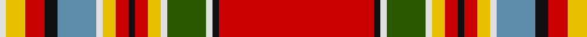

In pattern [RKWGWYRKRYWBKRYW](/patterns/rkwgwyrkrywbkryw/).

This was sourced from register-of-tartans.  It is a [16 stripes tartan](/stripes/stripes16/).

Original link https://www.tartanregister.gov.uk/tartanDetails.aspx?ref=2569

## Attestations

This cloth appears in 3 source records; the oldest owns this page.

- 01/01/1850 — MacKintosh (Chief) (register-of-tartans, [record](https://www.tartanregister.gov.uk/tartanDetails.aspx?ref=2569))
- 1850 — Hong Kong Police Pipe Band (Corp) (tartans-authority, [record](http://www.tartansauthority.com/tartan-ferret/display/6131/))
- c1800 — MacKintosh Chief - 1819 (Clan) (tartans-authority, [record](http://www.tartansauthority.com/tartan-ferret/display/1622/))

## Register references

External register numbers recorded for this tartan.

- Scottish Register of Tartans: [2569](https://www.tartanregister.gov.uk/tartanDetails.aspx?ref=2569)
- Scottish Tartans Authority (ITI): 1622
- Scottish Tartans World Register: 1622

## Thread count
LN/2 Y6 R6 K4 B12 LN2 Y4 R4 K2 R4 Y4 LN2 G12 LN2 K2 R/48

## Palette
Each colour and its ΔE from the base-6 reference it is a variant of.

| Colour | Shade | Base | ΔE (OKLab) |
|---|---|---|---|
| B | <code style="background-color:#5C8CA8;">#5C8CA8</code> `#5C8CA8` | B <code style="background-color:#2A418A;">#2A418A</code> | 0.23 |
| G | <code style="background-color:#285800;">#285800</code> `#285800` | G <code style="background-color:#006100;">#006100</code> | 0.03 |
| K | <code style="background-color:#101010;">#101010</code> `#101010` | K <code style="background-color:#000000;">#000000</code> | 0.17 |
| LN | <code style="background-color:#E0E0E0;">#E0E0E0</code> `#E0E0E0` | W <code style="background-color:#F7F7F7;">#F7F7F7</code> | 0.07 |
| R | <code style="background-color:#C80000;">#C80000</code> `#C80000` | R <code style="background-color:#CC0000;">#CC0000</code> | 0.01 |
| Y | <code style="background-color:#E8C000;">#E8C000</code> `#E8C000` | Y <code style="background-color:#F2BF00;">#F2BF00</code> | 0.02 |

## Nearest tartans

The nearest existing variants by ΔTartan distance.

1. [MacKintosh #8](/setts/s19/r24k1w1g6w1g1y2r2k1r2y2g1w1b6k2r3y3g2w1~b3c82af-g005020-k101010-rdc0000-we0e0e0-ye8c000~x2/) — ΔT 0.55
1. [MacKintosh (Chief) Clan Tartan Tartan Number: 1616. Earliest known date: 1810-15 Logan wrote 'The Chief also wears a particular tartan of a very showy pattern' and the Smiths of Mauchline illustrated it in their 1850 book 'Authenticated Tartans of the Clans & Families of Scotland' See products available Copyright © Blair Urquhart, Comrie, 2015](/setts/s19/r24k1w1g6w1g1y2r2k1r2y2g1w1b6k2r3y3g2w1~b5c8ca8-g006818-k101010-rc80000-we0e0e0-ye8c000~x2/) — ΔT 0.61
1. [MacGill Clan Tartan Tartan Number: 1487. Earliest known date: pre 1745 This sample comes from the MacGregor-Hastie collection which forms the basis of the cloth archive of the Scottish Tartans Society. One can assume that the sample dates between 1930 and 1950. The family tartan, which originated with the MacGills of Jura, was in use before 1745 but when tartan was proscribed the sett seemed to have been lost until a piece was discovered in Kintyre. It is now in the Museum of Antiquities, Edinburgh. The current version, which first appeared in 1930, is known as the MacGill Society tartan. See products available Copyright © Blair Urquhart, Comrie, 2015](/setts/s13/r47g16k8w3y3r2y3w3b6k3r4y4w3~b2c2c80-g006818-k101010-rc80000-we0e0e0-ye8c000~x2/) — ΔT 0.71
1. [MacKintosh 7](/setts/s19/r24k1w1g6w1g1y2r2k1r2y2g1w1b6k2r3y3g2w1~b5480b0-g008000-k000000-rc00000-we0e0e0-yf0c000~x2/) — ΔT 0.76
1. [MacBain/MacBean](/setts/s19/r60w2b5k2w2k2b5w2k2g12k2w2r5ra5g2ra5r5w2g10~b5480b0-g008000-k000000-rc00000-ra900030-we0e0e0~x2/) — ΔT 0.87
1. [MacBain Clan Tartan Tartan Number: 951. Earliest known date: 1960 (1847) MacBains, MacBeans, and MacVeans are all forms of the same name possibly from the same origin as the early Scottish King, Donald Ban. The principle family is MacBean of Kinchyle from the northern end of Loch Ness. The MacBains are closely associated with Mackintosh and this is apparent in the design of the tartan. This version, recorded by Lord Lyon under the name MacBain, shows a minor variation on the earlier MacBean sett attributed to McIan (1847). See products available Copyright © Blair Urquhart, Comrie, 2015](/setts/s19/r60w2b5k2w2k2b5w2k2g12k2w2r5ra5g2ra5r5w2g10~b5c8ca8-g006818-k101010-rc80000-raa00048-we0e0e0~x2/) — ΔT 0.92
1. [North West, Mounted Police](/setts/s16/r39ra3w2g14w2y4r4ra2r4y4w2b12ra6r6y7w2~b5480b0-g008000-rc00000-ra800000-we0e0e0-yf0c000~x2/) — ΔT 1.01
1. [North West Mounted Police Corporate Tartan Tartan Number: 1652. Earliest known date: 1982 Variant of Chattan or MacPherson. See products available Copyright © Blair Urquhart, Comrie, 2015](/setts/s16/r39ra3w2g14w2y4r4ra2r4y4w2b12ra6r6y7w2~b5c8ca8-g006818-rc80000-ra880000-we0e0e0-ye8c000~x2/) — ΔT 1.04
1. [MacBain](/setts/s20/r60w2wa5k2w2k2wa5w2k2g12k2wa2r5ra5g2ra5r5wa2k2g6~g004c00-k000000-rc80000-raff0000-wc0c0c0-wad0d0d0/) — ΔT 1.06
1. [MacBean (1847)](/setts/s19/r57w2k4b2w2b2k2w2k2g10k2w2r4ra4g2ra4r4w2g7~b2c2c80-g006818-k101010-rc80000-rab468ac-we0e0e0~x2/) — ΔT 1.07

## Neighbour map

Every grey dot is one of 15726 variants placed by the first two principal components of the ΔTartan feature space (44% of its variance). Red is this tartan; blue dots are its nearest — click one to open its page.

<svg viewBox="0 0 640 380" role="img" style="max-width:100%;height:auto;border:1px solid #e0e0e0;border-radius:4px;display:block" xmlns="http://www.w3.org/2000/svg"><image href="/nn/cloud.v1.png" width="640" height="380"/><a href="/setts/s19/r24k1w1g6w1g1y2r2k1r2y2g1w1b6k2r3y3g2w1~b3c82af-g005020-k101010-rdc0000-we0e0e0-ye8c000~x2/"><circle cx="252.3" cy="31.0" r="4" fill="#3465a4"><title>MacKintosh #8</title></circle></a><a href="/setts/s19/r24k1w1g6w1g1y2r2k1r2y2g1w1b6k2r3y3g2w1~b5c8ca8-g006818-k101010-rc80000-we0e0e0-ye8c000~x2/"><circle cx="255.7" cy="34.0" r="4" fill="#3465a4"><title>MacKintosh (Chief) Clan Tartan Tartan Number: 1616. Earliest known date: 1810-15 Logan wrote 'The Chief also wears a particular tartan of a very showy pattern' and the Smiths of Mauchline illustrated it in their 1850 book 'Authenticated Tartans of the Clans &amp; Families of Scotland' See products available Copyright © Blair Urquhart, Comrie, 2015</title></circle></a><a href="/setts/s13/r47g16k8w3y3r2y3w3b6k3r4y4w3~b2c2c80-g006818-k101010-rc80000-we0e0e0-ye8c000~x2/"><circle cx="253.8" cy="53.7" r="4" fill="#3465a4"><title>MacGill Clan Tartan Tartan Number: 1487. Earliest known date: pre 1745 This sample comes from the MacGregor-Hastie collection which forms the basis of the cloth archive of the Scottish Tartans Society. One can assume that the sample dates between 1930 and 1950. The family tartan, which originated with the MacGills of Jura, was in use before 1745 but when tartan was proscribed the sett seemed to have been lost until a piece was discovered in Kintyre. It is now in the Museum of Antiquities, Edinburgh. The current version, which first appeared in 1930, is known as the MacGill Society tartan. See products available Copyright © Blair Urquhart, Comrie, 2015</title></circle></a><a href="/setts/s19/r24k1w1g6w1g1y2r2k1r2y2g1w1b6k2r3y3g2w1~b5480b0-g008000-k000000-rc00000-we0e0e0-yf0c000~x2/"><circle cx="245.0" cy="31.0" r="4" fill="#3465a4"><title>MacKintosh 7</title></circle></a><a href="/setts/s19/r60w2b5k2w2k2b5w2k2g12k2w2r5ra5g2ra5r5w2g10~b5480b0-g008000-k000000-rc00000-ra900030-we0e0e0~x2/"><circle cx="296.7" cy="18.4" r="4" fill="#3465a4"><title>MacBain/MacBean</title></circle></a><a href="/setts/s19/r60w2b5k2w2k2b5w2k2g12k2w2r5ra5g2ra5r5w2g10~b5c8ca8-g006818-k101010-rc80000-raa00048-we0e0e0~x2/"><circle cx="309.9" cy="21.9" r="4" fill="#3465a4"><title>MacBain Clan Tartan Tartan Number: 951. Earliest known date: 1960 (1847) MacBains, MacBeans, and MacVeans are all forms of the same name possibly from the same origin as the early Scottish King, Donald Ban. The principle family is MacBean of Kinchyle from the northern end of Loch Ness. The MacBains are closely associated with Mackintosh and this is apparent in the design of the tartan. This version, recorded by Lord Lyon under the name MacBain, shows a minor variation on the earlier MacBean sett attributed to McIan (1847). See products available Copyright © Blair Urquhart, Comrie, 2015</title></circle></a><a href="/setts/s16/r39ra3w2g14w2y4r4ra2r4y4w2b12ra6r6y7w2~b5480b0-g008000-rc00000-ra800000-we0e0e0-yf0c000~x2/"><circle cx="226.0" cy="63.4" r="4" fill="#3465a4"><title>North West, Mounted Police</title></circle></a><a href="/setts/s16/r39ra3w2g14w2y4r4ra2r4y4w2b12ra6r6y7w2~b5c8ca8-g006818-rc80000-ra880000-we0e0e0-ye8c000~x2/"><circle cx="229.0" cy="63.8" r="4" fill="#3465a4"><title>North West Mounted Police Corporate Tartan Tartan Number: 1652. Earliest known date: 1982 Variant of Chattan or MacPherson. See products available Copyright © Blair Urquhart, Comrie, 2015</title></circle></a><a href="/setts/s20/r60w2wa5k2w2k2wa5w2k2g12k2wa2r5ra5g2ra5r5wa2k2g6~g004c00-k000000-rc80000-raff0000-wc0c0c0-wad0d0d0/"><circle cx="297.7" cy="14.0" r="4" fill="#3465a4"><title>MacBain</title></circle></a><a href="/setts/s19/r57w2k4b2w2b2k2w2k2g10k2w2r4ra4g2ra4r4w2g7~b2c2c80-g006818-k101010-rc80000-rab468ac-we0e0e0~x2/"><circle cx="325.0" cy="16.5" r="4" fill="#3465a4"><title>MacBean (1847)</title></circle></a><circle cx="279.6" cy="43.1" r="5" fill="#c00000"/></svg>

ID: /setts/s16/r24k1w1g6w1y2r2k1r2y2w1b6k2r3y3w1~b5c8ca8-g285800-k101010-rc80000-we0e0e0-ye8c000~x2/
