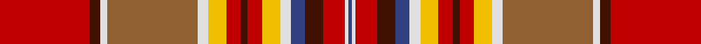

In pattern [BWRBBWYRBRYWRWBR](/stripes/bwrbbwyrbrywrwbr/).

This was sourced from weddslist.  It is a [16 stripe tartan](/stripes/stripes16/).

Original link http://www.weddslist.com/cgi-bin/tartans/pg.pl?source=sts

## Thread count
R/50 DR6 LN4 LT50 LN6 Y10 R8 DR4 R8 Y10 LN6 B8 DR10 R12 LN2 B/2

## Palette
Each colour and the base-6 reference it is a variant of.

| Colour | Shade | Base |
|---|---|---|
| B | <code style="background-color:#304080;">#304080</code> `oklch(39.4% 0.109 270.2)` <small>#304080</small> | B <code style="background-color:#2A418A;">#2A418A</code> |
| DR | <code style="background-color:#401000;">#401000</code> `oklch(25.3% 0.079 39.9)` <small>#401000</small> | B <code style="background-color:#2A418A;">#2A418A</code> |
| LN | <code style="background-color:#E0E0E0;">#E0E0E0</code> `oklch(90.7% 0.000 89.9)` <small>#E0E0E0</small> | W <code style="background-color:#F7F7F7;">#F7F7F7</code> |
| LT | <code style="background-color:#906030;">#906030</code> `oklch(53.1% 0.089 63.7)` <small>#906030</small> | R <code style="background-color:#CC0000;">#CC0000</code> |
| R | <code style="background-color:#C00000;">#C00000</code> `oklch(50.7% 0.208 29.2)` <small>#C00000</small> | R <code style="background-color:#CC0000;">#CC0000</code> |
| Y | <code style="background-color:#F0C000;">#F0C000</code> `oklch(82.7% 0.169 90.5)` <small>#F0C000</small> | Y <code style="background-color:#F2BF00;">#F2BF00</code> |

## Nearest tartans

The nearest existing variants by ΔTartan distance.

1. [MacGlashan Clan Tartan Tartan Number: 656. Earliest known date: 1982 Author an historian, Dr Philip Smith, lives in the USA and provides up to date information of new designs of tartan produced in the Americas. MacGlashan is associated with Clan MacKintosh or Clan Stewart. See products available Copyright © Blair Urquhart, Comrie, 2015](/setts/s16/r25do3w2lo25w3ly5r4do2r4ly5w3db4do5r6w1db1~x2/) — ΔT 0.36
1. [MacGlashan](/setts/s16/r25dy3w2o25w3ly5r4dy2r4ly5w3db4dy5r6w1db1~x2/) — ΔT 0.47
1. [MacGlashan #3](/setts/s16/r20k3w2lo25w2ly5r4k2r4ly5w3t4k5r6w1t1~x2/) — ΔT 0.71
1. [North West, Mounted Police](/setts/s16/r39r3w2g14w2ly4r4r2r4ly4w2t12r6r6ly7w2~x2/) — ΔT 0.82
1. [Chattan Chief Clan Tartan Tartan Number: 1851. Earliest known date: 1816 Also known as Finzean's fancy. The record of the Lord Lyon states, 'Note - this tartan is specifically for the Chief of Clan Chattan and his immediate family.' Logan descibed this sett (without the chiefs extra white line) thus: 'The Chief also wears a particular tartan of a very showy pattern.' It is illustrated by Smith in 1850. Chief of the Clan Mackintosh Sir Aeneas Mackintosh of that Ilk, acknowledged this sett as the Clan tartan in 1816. See products available Copyright © Blair Urquhart, Comrie, 2015](/setts/s17/w4ly12r8k8t32w4ly7r7k2r7ly7w4g32w2k4r60w2/) — ΔT 1.10
1. [Purdy, R Scott (Personal)](/setts/s15/r1k1w1k1lo6dg3o7w1lo12k1r21w1k1r1lo1~x2/) — ΔT 1.12
1. [Scobie (Blackford)](/setts/s12/p1r1p1r6g26m14r20lt1r1lt1r2m1~x2/) — ΔT 1.13
1. [Chattan, Chief of Clan](/setts/s17/w4ly12r8k8t32w4ly7r7k2r7ly7w4g32w2k4r60w2~x2/) — ΔT 1.20
1. [Canadian Dental Association (Corp.)](/setts/s18/r8k3o15k1w3k1o8k1w3k1r19k2ly2k2g2k2r2k2~x2/) — ΔT 1.21
1. [MacLean of Duart Dress](/setts/s12/n12o2dy4lo2dy3w3dy3w19r30o2r4dy2~x2/) — ΔT 1.23

## Neighbour map

Every grey dot is one of 14299 variants placed by the first two principal components of the ΔTartan feature space (44% of its variance). Red is this tartan; blue dots are its nearest — click one to open its page.

<svg viewBox="0 0 640 380" role="img" style="max-width:100%;height:auto;border:1px solid #e0e0e0;border-radius:4px;display:block" xmlns="http://www.w3.org/2000/svg"><image href="/nn/cloud.v1.png" width="640" height="380"/><a href="/setts/s16/r25do3w2lo25w3ly5r4do2r4ly5w3db4do5r6w1db1~x2/"><circle cx="199.9" cy="58.2" r="4" fill="#3465a4"><title>MacGlashan Clan Tartan Tartan Number: 656. Earliest known date: 1982 Author an historian, Dr Philip Smith, lives in the USA and provides up to date information of new designs of tartan produced in the Americas. MacGlashan is associated with Clan MacKintosh or Clan Stewart. See products available Copyright © Blair Urquhart, Comrie, 2015</title></circle></a><a href="/setts/s16/r25dy3w2o25w3ly5r4dy2r4ly5w3db4dy5r6w1db1~x2/"><circle cx="203.0" cy="56.6" r="4" fill="#3465a4"><title>MacGlashan</title></circle></a><a href="/setts/s16/r20k3w2lo25w2ly5r4k2r4ly5w3t4k5r6w1t1~x2/"><circle cx="175.4" cy="58.9" r="4" fill="#3465a4"><title>MacGlashan #3</title></circle></a><a href="/setts/s16/r39r3w2g14w2ly4r4r2r4ly4w2t12r6r6ly7w2~x2/"><circle cx="226.4" cy="63.6" r="4" fill="#3465a4"><title>North West, Mounted Police</title></circle></a><a href="/setts/s17/w4ly12r8k8t32w4ly7r7k2r7ly7w4g32w2k4r60w2/"><circle cx="191.5" cy="43.5" r="4" fill="#3465a4"><title>Chattan Chief Clan Tartan Tartan Number: 1851. Earliest known date: 1816 Also known as Finzean's fancy. The record of the Lord Lyon states, 'Note - this tartan is specifically for the Chief of Clan Chattan and his immediate family.' Logan descibed this sett (without the chiefs extra white line) thus: 'The Chief also wears a particular tartan of a very showy pattern.' It is illustrated by Smith in 1850. Chief of the Clan Mackintosh Sir Aeneas Mackintosh of that Ilk, acknowledged this sett as the Clan tartan in 1816. See products available Copyright © Blair Urquhart, Comrie, 2015</title></circle></a><a href="/setts/s15/r1k1w1k1lo6dg3o7w1lo12k1r21w1k1r1lo1~x2/"><circle cx="235.3" cy="63.2" r="4" fill="#3465a4"><title>Purdy, R Scott (Personal)</title></circle></a><a href="/setts/s12/p1r1p1r6g26m14r20lt1r1lt1r2m1~x2/"><circle cx="245.9" cy="70.3" r="4" fill="#3465a4"><title>Scobie (Blackford)</title></circle></a><a href="/setts/s17/w4ly12r8k8t32w4ly7r7k2r7ly7w4g32w2k4r60w2~x2/"><circle cx="186.5" cy="40.7" r="4" fill="#3465a4"><title>Chattan, Chief of Clan</title></circle></a><a href="/setts/s18/r8k3o15k1w3k1o8k1w3k1r19k2ly2k2g2k2r2k2~x2/"><circle cx="172.4" cy="64.2" r="4" fill="#3465a4"><title>Canadian Dental Association (Corp.)</title></circle></a><a href="/setts/s12/n12o2dy4lo2dy3w3dy3w19r30o2r4dy2~x2/"><circle cx="182.6" cy="86.0" r="4" fill="#3465a4"><title>MacLean of Duart Dress</title></circle></a><circle cx="206.0" cy="61.6" r="5" fill="#c00000"/></svg>

ID: /setts/s16/r25dr3w2o25w3ly5r4dr2r4ly5w3db4dr5r6w1db1~x2/
