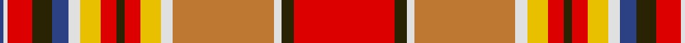

In pattern [BWRGBWYRGRYWRWGR](/stripes/bwrgbwyrgrywrwgr/).

This was sourced from register-of-tartans.  It is a [16 stripe tartan](/stripes/stripes16/).

Original link https://www.tartanregister.gov.uk/tartanDetails.aspx?ref=2444

## Register references

External register numbers recorded for this tartan.

- Scottish Register of Tartans: [2444](https://www.tartanregister.gov.uk/tartanDetails.aspx?ref=2444)
- Scottish Tartans World Register: 656

## Thread count
R/50 K6 LN4 DO50 LN6 Y10 R8 K4 R8 Y10 LN6 B8 K10 R12 LN2 B/2

## Palette
Each colour and the base-6 reference it is a variant of.

| Colour | Shade | Base |
|---|---|---|
| B | <code style="background-color:#2C4084;">#2C4084</code> `oklch(39.4% 0.117 268.3)` <small>#2C4084</small> | B <code style="background-color:#2A418A;">#2A418A</code> |
| DO | <code style="background-color:#BE7832;">#BE7832</code> `oklch(63.5% 0.121 62.2)` <small>#BE7832</small> | R <code style="background-color:#CC0000;">#CC0000</code> |
| K | <code style="background-color:#2A2303;">#2A2303</code> `oklch(25.7% 0.049 96.8)` <small>#2A2303</small> | G <code style="background-color:#006100;">#006100</code> |
| LN | <code style="background-color:#E0E0E0;">#E0E0E0</code> `oklch(90.7% 0.000 89.9)` <small>#E0E0E0</small> | W <code style="background-color:#F7F7F7;">#F7F7F7</code> |
| R | <code style="background-color:#DC0000;">#DC0000</code> `oklch(56.2% 0.230 29.2)` <small>#DC0000</small> | R <code style="background-color:#CC0000;">#CC0000</code> |
| Y | <code style="background-color:#E8C000;">#E8C000</code> `oklch(81.9% 0.168 93.7)` <small>#E8C000</small> | Y <code style="background-color:#F2BF00;">#F2BF00</code> |

## Nearest tartans

The nearest existing variants by ΔTartan distance, with this tartan at the top so the swatches line up against it.

ΔTartan

Tartan

Sett

—

<a href="/ttd/edit/#slug=r25dy3w2o25w3ly5r4dy2r4ly5w3db4dy5r6w1db1~x2">MacGlashan</a> <a class="nn-out" href="/setts/s16/r25dy3w2o25w3ly5r4dy2r4ly5w3db4dy5r6w1db1~x2/" title="open its dictionary page">↗</a>

0.39

<a href="/ttd/edit/#slug=r25do3w2lo25w3ly5r4do2r4ly5w3db4do5r6w1db1~x2">MacGlashan Clan Tartan Tartan Number: 656. Earliest known date: 1982 Author an historian, Dr Philip Smith, lives in the USA and provides up to date information of new designs of tartan produced in the Americas. MacGlashan is associated with Clan MacKintosh or Clan Stewart. See products available Copyright © Blair Urquhart, Comrie, 2015</a> <a class="nn-out" href="/setts/s16/r25do3w2lo25w3ly5r4do2r4ly5w3db4do5r6w1db1~x2/" title="open its dictionary page">↗</a>

0.47

<a href="/ttd/edit/#slug=r25dr3w2o25w3ly5r4dr2r4ly5w3db4dr5r6w1db1~x2">MacGlashan</a> <a class="nn-out" href="/setts/s16/r25dr3w2o25w3ly5r4dr2r4ly5w3db4dr5r6w1db1~x2/" title="open its dictionary page">↗</a>

0.74

<a href="/ttd/edit/#slug=r20k3w2lo25w2ly5r4k2r4ly5w3t4k5r6w1t1~x2">MacGlashan #3</a> <a class="nn-out" href="/setts/s16/r20k3w2lo25w2ly5r4k2r4ly5w3t4k5r6w1t1~x2/" title="open its dictionary page">↗</a>

0.84

<a href="/ttd/edit/#slug=r39r3w2g14w2ly4r4r2r4ly4w2t12r6r6ly7w2~x2">North West, Mounted Police</a> <a class="nn-out" href="/setts/s16/r39r3w2g14w2ly4r4r2r4ly4w2t12r6r6ly7w2~x2/" title="open its dictionary page">↗</a>

1.01

<a href="/ttd/edit/#slug=r1k1w1k1lo6dg3o7w1lo12k1r21w1k1r1lo1~x2">Purdy, R Scott (Personal)</a> <a class="nn-out" href="/setts/s15/r1k1w1k1lo6dg3o7w1lo12k1r21w1k1r1lo1~x2/" title="open its dictionary page">↗</a>

1.21

<a href="/ttd/edit/#slug=w4ly12r8k8t32w4ly7r7k2r7ly7w4g32w2k4r60w2">Chattan Chief Clan Tartan Tartan Number: 1851. Earliest known date: 1816 Also known as Finzean's fancy. The record of the Lord Lyon states, 'Note - this tartan is specifically for the Chief of Clan Chattan and his immediate family.' Logan descibed this sett (without the chiefs extra white line) thus: 'The Chief also wears a particular tartan of a very showy pattern.' It is illustrated by Smith in 1850. Chief of the Clan Mackintosh Sir Aeneas Mackintosh of that Ilk, acknowledged this sett as the Clan tartan in 1816. See products available Copyright © Blair Urquhart, Comrie, 2015</a> <a class="nn-out" href="/setts/s17/w4ly12r8k8t32w4ly7r7k2r7ly7w4g32w2k4r60w2/" title="open its dictionary page">↗</a>

1.25

<a href="/ttd/edit/#slug=n12o2dy4lo2dy3w3dy3w19r30o2r4dy2~x2">MacLean of Duart Dress</a> <a class="nn-out" href="/setts/s12/n12o2dy4lo2dy3w3dy3w19r30o2r4dy2~x2/" title="open its dictionary page">↗</a>

1.27

<a href="/ttd/edit/#slug=y12n2dy4ly2dy3w3dy3w19r30y2r4dy2~x2">MacLean of Duart Dress #3</a> <a class="nn-out" href="/setts/s12/y12n2dy4ly2dy3w3dy3w19r30y2r4dy2~x2/" title="open its dictionary page">↗</a>

1.27

<a href="/ttd/edit/#slug=w4ly12r8k8t32w4ly7r7k2r7ly7w4g32w2k4r60w2~x2">Chattan, Chief of Clan</a> <a class="nn-out" href="/setts/s17/w4ly12r8k8t32w4ly7r7k2r7ly7w4g32w2k4r60w2~x2/" title="open its dictionary page">↗</a>

1.31

<a href="/ttd/edit/#slug=w4ly10r8k7y28w3ly6r5k2r5ly6w3g30w2k3r50w2~x2">Chattan</a> <a class="nn-out" href="/setts/s17/w4ly10r8k7y28w3ly6r5k2r5ly6w3g30w2k3r50w2~x2/" title="open its dictionary page">↗</a>

## Neighbour map

Every grey dot is one of 14299 variants placed by the first two principal components of the ΔTartan feature space (44% of its variance). Red is this tartan; blue dots are its nearest — click one to open its page.

<svg viewBox="0 0 640 380" role="img" style="max-width:100%;height:auto;border:1px solid #e0e0e0;border-radius:4px;display:block" xmlns="http://www.w3.org/2000/svg"><image href="/nn/cloud.v1.png" width="640" height="380"/><a href="/setts/s16/r25do3w2lo25w3ly5r4do2r4ly5w3db4do5r6w1db1~x2/"><circle cx="199.9" cy="58.2" r="4" fill="#3465a4"><title>MacGlashan Clan Tartan Tartan Number: 656. Earliest known date: 1982 Author an historian, Dr Philip Smith, lives in the USA and provides up to date information of new designs of tartan produced in the Americas. MacGlashan is associated with Clan MacKintosh or Clan Stewart. See products available Copyright © Blair Urquhart, Comrie, 2015</title></circle></a><a href="/setts/s16/r25dr3w2o25w3ly5r4dr2r4ly5w3db4dr5r6w1db1~x2/"><circle cx="206.0" cy="61.6" r="4" fill="#3465a4"><title>MacGlashan</title></circle></a><a href="/setts/s16/r20k3w2lo25w2ly5r4k2r4ly5w3t4k5r6w1t1~x2/"><circle cx="175.4" cy="58.9" r="4" fill="#3465a4"><title>MacGlashan #3</title></circle></a><a href="/setts/s16/r39r3w2g14w2ly4r4r2r4ly4w2t12r6r6ly7w2~x2/"><circle cx="226.4" cy="63.6" r="4" fill="#3465a4"><title>North West, Mounted Police</title></circle></a><a href="/setts/s15/r1k1w1k1lo6dg3o7w1lo12k1r21w1k1r1lo1~x2/"><circle cx="235.3" cy="63.2" r="4" fill="#3465a4"><title>Purdy, R Scott (Personal)</title></circle></a><a href="/setts/s17/w4ly12r8k8t32w4ly7r7k2r7ly7w4g32w2k4r60w2/"><circle cx="191.5" cy="43.5" r="4" fill="#3465a4"><title>Chattan Chief Clan Tartan Tartan Number: 1851. Earliest known date: 1816 Also known as Finzean's fancy. The record of the Lord Lyon states, 'Note - this tartan is specifically for the Chief of Clan Chattan and his immediate family.' Logan descibed this sett (without the chiefs extra white line) thus: 'The Chief also wears a particular tartan of a very showy pattern.' It is illustrated by Smith in 1850. Chief of the Clan Mackintosh Sir Aeneas Mackintosh of that Ilk, acknowledged this sett as the Clan tartan in 1816. See products available Copyright © Blair Urquhart, Comrie, 2015</title></circle></a><a href="/setts/s12/n12o2dy4lo2dy3w3dy3w19r30o2r4dy2~x2/"><circle cx="182.6" cy="86.0" r="4" fill="#3465a4"><title>MacLean of Duart Dress</title></circle></a><a href="/setts/s12/y12n2dy4ly2dy3w3dy3w19r30y2r4dy2~x2/"><circle cx="182.6" cy="83.1" r="4" fill="#3465a4"><title>MacLean of Duart Dress #3</title></circle></a><a href="/setts/s17/w4ly12r8k8t32w4ly7r7k2r7ly7w4g32w2k4r60w2~x2/"><circle cx="186.5" cy="40.7" r="4" fill="#3465a4"><title>Chattan, Chief of Clan</title></circle></a><a href="/setts/s17/w4ly10r8k7y28w3ly6r5k2r5ly6w3g30w2k3r50w2~x2/"><circle cx="170.4" cy="47.1" r="4" fill="#3465a4"><title>Chattan</title></circle></a><circle cx="203.0" cy="56.6" r="5" fill="#c00000"/></svg>

ID: /setts/s16/r25dy3w2o25w3ly5r4dy2r4ly5w3db4dy5r6w1db1~x2/
