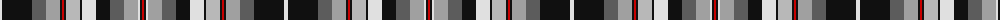

In pattern [RKWYBKWKYKRKYBKW](/patterns/rkwybkwkykrkybkw/).

This was sourced from tartans-authority.  It is a [16 stripes tartan](/stripes/stripes16/).

Original link http://www.tartansauthority.com/tartan-ferret/display/8246/

## Thread count
LN/4 K30 N14 Na14 K2 R2 K2 Nb14 K2 LN14 K14 N14 Na14 LN2 K2 R/2

## Palette
Each colour and its ΔE from the base-6 reference it is a variant of.

| Colour | Shade | Base | ΔE (OKLab) |
|---|---|---|---|
| K | <code style="background-color:#101010;">#101010</code> `#101010` | K <code style="background-color:#000000;">#000000</code> | 0.17 |
| LN | <code style="background-color:#E0E0E0;">#E0E0E0</code> `#E0E0E0` | W <code style="background-color:#F4F4F0;">#F4F4F0</code> | 0.06 |
| N | <code style="background-color:#5C5C5C;">#5C5C5C</code> `#5C5C5C` | B <code style="background-color:#2C4084;">#2C4084</code> | 0.14 |
| Na | <code style="background-color:#A0A0A0;">#A0A0A0</code> `#A0A0A0` | Y <code style="background-color:#E8C000;">#E8C000</code> | 0.20 |
| Nb | <code style="background-color:#B8B8B8;">#B8B8B8</code> `#B8B8B8` | Y <code style="background-color:#E8C000;">#E8C000</code> | 0.17 |
| R | <code style="background-color:#C80000;">#C80000</code> `#C80000` | R <code style="background-color:#C80000;">#C80000</code> | 0.00 |

ID: /setts/s16/r2k2w2y14b14k14w14k2ya14k2r2k2y14b14k30w4-b5c5c5c-k101010-rc80000-we0e0e0-ya0a0a0-yab8b8b8/
