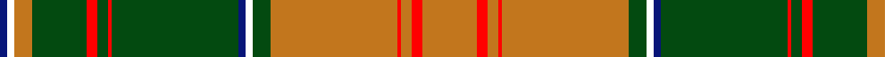

In pattern [BWRGRGRGBWGRRRRR](/patterns/bwrgrgrgbwgrrrrr/).

This was sourced from register-of-tartans.  It is a [16 stripes tartan](/stripes/stripes16/).

Original link https://www.tartanregister.gov.uk/tartanDetails.aspx?ref=10853

## Thread count
DB/4 W4 DO10 DG30 R6 DG6 R2 DG70 DB4 W4 DG10 DO70 R2 DO6 R6 DO/30

## Palette
Each colour and its ΔE from the base-6 reference it is a variant of.

| Colour | Shade | Base | ΔE (OKLab) |
|---|---|---|---|
| DB | <code style="background-color:#071579;">#071579</code> `#071579` | B <code style="background-color:#2C4084;">#2C4084</code> | 0.12 |
| DG | <code style="background-color:#034A10;">#034A10</code> `#034A10` | G <code style="background-color:#006400;">#006400</code> | 0.09 |
| DO | <code style="background-color:#C2761D;">#C2761D</code> `#C2761D` | R <code style="background-color:#C80000;">#C80000</code> | 0.17 |
| R | <code style="background-color:#FF0000;">#FF0000</code> `#FF0000` | R <code style="background-color:#C80000;">#C80000</code> | 0.11 |
| W | <code style="background-color:#FFFFFF;">#FFFFFF</code> `#FFFFFF` | W <code style="background-color:#F4F4F0;">#F4F4F0</code> | 0.03 |

## Nearest tartans

The nearest existing variants by ΔTartan distance.

1. [Connemarra Irish District Tartan Tartan Number: 3897. Earliest known date: pre 1997 The Connemara tartan has been created to represent the wild yet picturesque area situated in the north west of County Galway. Strictly speaking this should be a fashion tartan but it has been placed in the same class as the House of Edgar irish tartans. See products available Copyright © Blair Urquhart, Comrie, 2015](/setts/s16/b8y2g2r60g36g6g2k6g2g6g36r60g2y2b8g4-b2888c4-g289c18-k000000-r800000-yf0c400/) — ΔT 0.64
1. [Leask](/setts/s14/g4r4w2r4k2r48g24y4g6y4g24r4g6y4-g008000-k000000-rc00000-we0e0e0-yf0c000/) — ΔT 0.91
1. [Leask Family Tartan Tartan Number: 905. Earliest known date: 1981 Designed by Madam Leask and the Scottish Tartans Society Accredited in 1981. See products available Copyright © Blair Urquhart, Comrie, 2015](/setts/s14/g4r4w2r4k2r48g24y4g6y4g24r4g6y4-g006818-k101010-rc80000-we0e0e0-ye8c000/) — ΔT 0.92
1. [Hay](/setts/s14/r9g6y4g54r4g4r4g18r72g6r4k2r4w9-g008000-k000000-rc00000-we0e0e0-yf0c000/) — ΔT 0.93
1. [Hay Clan Tartan Tartan Number: 1555. Earliest known date: 1842 The design comes from the Vestiarium Scoticum (1842). The authors, the Sobieski Stuart brothers, enjoyed a popular following among the Scottish gentry in the early Victorian era, and in the spirit of the times, added mystery, romance and some spurious historical documentation to the subject of tartan. Of the better known tartans, the book offers some minor variation, but in other cases it provides the only recorded version of many tartans in use today. See products available Copyright © Blair Urquhart, Comrie, 2015](/setts/s14/r9g6y4g54r4g4r4g18r72g6r4k2r4w9-g006818-k101010-rc80000-we0e0e0-ye8c000/) — ΔT 1.08
1. [Unidentified](/setts/s22/y6g60r14g4r2g16r2g4r14g32k36b16r28g16r2g2r14g2r2g16r54y6-b5c8ca8-g006818-k101010-rc80000-yfccc00/) — ΔT 1.20
1. [Strang (Personal)](/setts/s14/r72g36r8g12k2w4k2g4k2w4k2g12r8g36-g146400-k000000-rb00000-wc8c8c8/) — ΔT 1.24
1. [Glendronach](/setts/s12/g42r4w2ga6r4g10r42ga2y2ga2r2g16-g008000-ga908000-r900030-we0e0e0-yf0c000/) — ΔT 1.28
1. [Lomond (1983)](/setts/s13/g120k8ga8k8ga8w12k4w8k4w4ga48y8k24-g8c7038-ga006818-k101010-wc0c0c0-yd09800/) — ΔT 1.29
1. [Stewart of Ardshiel](/setts/s18/g14r6ra2k3r65k2b2r6k34r6b2k2r4g66r12ra2k2b4-b5480b0-g008000-k000030-rc00000-rad03030/) — ΔT 1.29

## Neighbour map

Every grey dot is one of 15726 variants placed by the first two principal components of the ΔTartan feature space (44% of its variance). Red is this tartan; blue dots are its nearest — click one to open its page.

<svg viewBox="0 0 640 380" role="img" style="max-width:100%;height:auto;border:1px solid #e0e0e0;border-radius:4px;display:block" xmlns="http://www.w3.org/2000/svg"><image href="/nn/cloud.v1.png" width="640" height="380"/><a href="/setts/s16/b8y2g2r60g36g6g2k6g2g6g36r60g2y2b8g4-b2888c4-g289c18-k000000-r800000-yf0c400/"><circle cx="305.6" cy="76.7" r="4" fill="#3465a4"><title>Connemarra Irish District Tartan Tartan Number: 3897. Earliest known date: pre 1997 The Connemara tartan has been created to represent the wild yet picturesque area situated in the north west of County Galway. Strictly speaking this should be a fashion tartan but it has been placed in the same class as the House of Edgar irish tartans. See products available Copyright © Blair Urquhart, Comrie, 2015</title></circle></a><a href="/setts/s14/g4r4w2r4k2r48g24y4g6y4g24r4g6y4-g008000-k000000-rc00000-we0e0e0-yf0c000/"><circle cx="288.9" cy="90.6" r="4" fill="#3465a4"><title>Leask</title></circle></a><a href="/setts/s14/g4r4w2r4k2r48g24y4g6y4g24r4g6y4-g006818-k101010-rc80000-we0e0e0-ye8c000/"><circle cx="295.1" cy="92.6" r="4" fill="#3465a4"><title>Leask Family Tartan Tartan Number: 905. Earliest known date: 1981 Designed by Madam Leask and the Scottish Tartans Society Accredited in 1981. See products available Copyright © Blair Urquhart, Comrie, 2015</title></circle></a><a href="/setts/s14/r9g6y4g54r4g4r4g18r72g6r4k2r4w9-g008000-k000000-rc00000-we0e0e0-yf0c000/"><circle cx="336.3" cy="68.8" r="4" fill="#3465a4"><title>Hay</title></circle></a><a href="/setts/s14/r9g6y4g54r4g4r4g18r72g6r4k2r4w9-g006818-k101010-rc80000-we0e0e0-ye8c000/"><circle cx="342.4" cy="70.4" r="4" fill="#3465a4"><title>Hay Clan Tartan Tartan Number: 1555. Earliest known date: 1842 The design comes from the Vestiarium Scoticum (1842). The authors, the Sobieski Stuart brothers, enjoyed a popular following among the Scottish gentry in the early Victorian era, and in the spirit of the times, added mystery, romance and some spurious historical documentation to the subject of tartan. Of the better known tartans, the book offers some minor variation, but in other cases it provides the only recorded version of many tartans in use today. See products available Copyright © Blair Urquhart, Comrie, 2015</title></circle></a><a href="/setts/s22/y6g60r14g4r2g16r2g4r14g32k36b16r28g16r2g2r14g2r2g16r54y6-b5c8ca8-g006818-k101010-rc80000-yfccc00/"><circle cx="250.4" cy="81.0" r="4" fill="#3465a4"><title>Unidentified</title></circle></a><a href="/setts/s14/r72g36r8g12k2w4k2g4k2w4k2g12r8g36-g146400-k000000-rb00000-wc8c8c8/"><circle cx="357.1" cy="97.7" r="4" fill="#3465a4"><title>Strang (Personal)</title></circle></a><a href="/setts/s12/g42r4w2ga6r4g10r42ga2y2ga2r2g16-g008000-ga908000-r900030-we0e0e0-yf0c000/"><circle cx="323.4" cy="114.4" r="4" fill="#3465a4"><title>Glendronach</title></circle></a><a href="/setts/s13/g120k8ga8k8ga8w12k4w8k4w4ga48y8k24-g8c7038-ga006818-k101010-wc0c0c0-yd09800/"><circle cx="276.1" cy="81.4" r="4" fill="#3465a4"><title>Lomond (1983)</title></circle></a><a href="/setts/s18/g14r6ra2k3r65k2b2r6k34r6b2k2r4g66r12ra2k2b4-b5480b0-g008000-k000030-rc00000-rad03030/"><circle cx="260.9" cy="51.9" r="4" fill="#3465a4"><title>Stewart of Ardshiel</title></circle></a><circle cx="291.7" cy="72.0" r="5" fill="#c00000"/></svg>

ID: /setts/s16/r30ra6r6ra2r70g10w4b4g70ra2g6ra6g30r10w4b4-b071579-g034a10-rc2761d-raff0000-wffffff/
