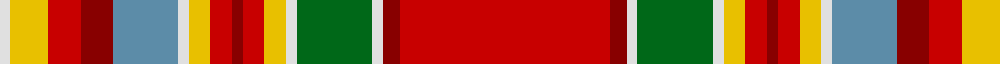

In pattern [RRWGWYRRRYWBRRYW](/patterns/rrwgwyrrrywbrryw/).

This was sourced from house-of-tartan.  It is a [16 stripes tartan](/stripes/stripes16/).

Original link http://www.house-of-tartan.scotland.net/house/TartanViewjs.asp?colr=Def&tnam=1652

## Thread count
LN/4 Y14 R12 DR12 B24 LN4 Y8 R8 DR4 R8 Y8 LN4 G28 LN4 DR6 R/78

## Palette
Each colour and its ΔE from the base-6 reference it is a variant of.

| Colour | Shade | Base | ΔE (OKLab) |
|---|---|---|---|
| B | <code style="background-color:#5C8CA8;">#5C8CA8</code> `#5C8CA8` | B <code style="background-color:#2A418A;">#2A418A</code> | 0.23 |
| DR | <code style="background-color:#880000;">#880000</code> `#880000` | R <code style="background-color:#CC0000;">#CC0000</code> | 0.15 |
| G | <code style="background-color:#006818;">#006818</code> `#006818` | G <code style="background-color:#006100;">#006100</code> | 0.02 |
| LN | <code style="background-color:#E0E0E0;">#E0E0E0</code> `#E0E0E0` | W <code style="background-color:#F7F7F7;">#F7F7F7</code> | 0.07 |
| R | <code style="background-color:#C80000;">#C80000</code> `#C80000` | R <code style="background-color:#CC0000;">#CC0000</code> | 0.01 |
| Y | <code style="background-color:#E8C000;">#E8C000</code> `#E8C000` | Y <code style="background-color:#F2BF00;">#F2BF00</code> | 0.02 |

## Nearest tartans

The nearest existing variants by ΔTartan distance.

1. [North West, Mounted Police](/setts/s16/r39ra3w2g14w2y4r4ra2r4y4w2b12ra6r6y7w2~b5480b0-g008000-rc00000-ra800000-we0e0e0-yf0c000~x2/) — ΔT 0.12
1. [MacGlashan Clan Tartan Tartan Number: 656. Earliest known date: 1982 Author an historian, Dr Philip Smith, lives in the USA and provides up to date information of new designs of tartan produced in the Americas. MacGlashan is associated with Clan MacKintosh or Clan Stewart. See products available Copyright © Blair Urquhart, Comrie, 2015](/setts/s16/r25b3w2y25w3ya5r4b2r4ya5w3ba4b5r6w1ba1~b441800-ba2c2c80-rc80000-we0e0e0-ya08858-yae8c000~x2/) — ΔT 0.75
1. [MacGlashan](/setts/s16/r25g3w2ra25w3y5r4g2r4y5w3b4g5r6w1b1~b2c4084-g2a2303-rdc0000-rabe7832-we0e0e0-ye8c000~x2/) — ΔT 0.80
1. [MacGlashan](/setts/s16/r25b3w2ra25w3y5r4b2r4y5w3ba4b5r6w1ba1~b401000-ba304080-rc00000-ra906030-we0e0e0-yf0c000~x2/) — ΔT 0.80
1. [MacKintosh (Chief) Clan Tartan Tartan Number: 1616. Earliest known date: 1810-15 Logan wrote 'The Chief also wears a particular tartan of a very showy pattern' and the Smiths of Mauchline illustrated it in their 1850 book 'Authenticated Tartans of the Clans & Families of Scotland' See products available Copyright © Blair Urquhart, Comrie, 2015](/setts/s19/r24k1w1g6w1g1y2r2k1r2y2g1w1b6k2r3y3g2w1~b5c8ca8-g006818-k101010-rc80000-we0e0e0-ye8c000~x2/) — ΔT 0.98
1. [MacKintosh #8](/setts/s19/r24k1w1g6w1g1y2r2k1r2y2g1w1b6k2r3y3g2w1~b3c82af-g005020-k101010-rdc0000-we0e0e0-ye8c000~x2/) — ΔT 1.03
1. [MacKintosh (Chief)](/setts/s16/r24k1w1g6w1y2r2k1r2y2w1b6k2r3y3w1~b5c8ca8-g285800-k101010-rc80000-we0e0e0-ye8c000~x2/) — ΔT 1.04
1. [MacGlashan #3](/setts/s16/r20k3w2y25w2ya5r4k2r4ya5w3b4k5r6w1b1~b5c8ca8-k101010-rc80000-we0e0e0-ya08858-yae8c000~x2/) — ΔT 1.08
1. [MacGill Clan Tartan Tartan Number: 1487. Earliest known date: pre 1745 This sample comes from the MacGregor-Hastie collection which forms the basis of the cloth archive of the Scottish Tartans Society. One can assume that the sample dates between 1930 and 1950. The family tartan, which originated with the MacGills of Jura, was in use before 1745 but when tartan was proscribed the sett seemed to have been lost until a piece was discovered in Kintyre. It is now in the Museum of Antiquities, Edinburgh. The current version, which first appeared in 1930, is known as the MacGill Society tartan. See products available Copyright © Blair Urquhart, Comrie, 2015](/setts/s13/r47g16k8w3y3r2y3w3b6k3r4y4w3~b2c2c80-g006818-k101010-rc80000-we0e0e0-ye8c000~x2/) — ΔT 1.14
1. [MacLean of Duart Dress](/setts/s12/b12r2g4y2g3w3g3w19ra30r2ra4g2~b5c5c5c-g604000-r888888-rac80000-we0e0e0-ybc8c00~x2/) — ΔT 1.15

## Neighbour map

Every grey dot is one of 15726 variants placed by the first two principal components of the ΔTartan feature space (44% of its variance). Red is this tartan; blue dots are its nearest — click one to open its page.

<svg viewBox="0 0 640 380" role="img" style="max-width:100%;height:auto;border:1px solid #e0e0e0;border-radius:4px;display:block" xmlns="http://www.w3.org/2000/svg"><image href="/nn/cloud.v1.png" width="640" height="380"/><a href="/setts/s16/r39ra3w2g14w2y4r4ra2r4y4w2b12ra6r6y7w2~b5480b0-g008000-rc00000-ra800000-we0e0e0-yf0c000~x2/"><circle cx="226.0" cy="63.4" r="4" fill="#3465a4"><title>North West, Mounted Police</title></circle></a><a href="/setts/s16/r25b3w2y25w3ya5r4b2r4ya5w3ba4b5r6w1ba1~b441800-ba2c2c80-rc80000-we0e0e0-ya08858-yae8c000~x2/"><circle cx="199.4" cy="57.2" r="4" fill="#3465a4"><title>MacGlashan Clan Tartan Tartan Number: 656. Earliest known date: 1982 Author an historian, Dr Philip Smith, lives in the USA and provides up to date information of new designs of tartan produced in the Americas. MacGlashan is associated with Clan MacKintosh or Clan Stewart. See products available Copyright © Blair Urquhart, Comrie, 2015</title></circle></a><a href="/setts/s16/r25g3w2ra25w3y5r4g2r4y5w3b4g5r6w1b1~b2c4084-g2a2303-rdc0000-rabe7832-we0e0e0-ye8c000~x2/"><circle cx="202.9" cy="55.8" r="4" fill="#3465a4"><title>MacGlashan</title></circle></a><a href="/setts/s16/r25b3w2ra25w3y5r4b2r4y5w3ba4b5r6w1ba1~b401000-ba304080-rc00000-ra906030-we0e0e0-yf0c000~x2/"><circle cx="205.6" cy="60.1" r="4" fill="#3465a4"><title>MacGlashan</title></circle></a><a href="/setts/s19/r24k1w1g6w1g1y2r2k1r2y2g1w1b6k2r3y3g2w1~b5c8ca8-g006818-k101010-rc80000-we0e0e0-ye8c000~x2/"><circle cx="255.7" cy="34.0" r="4" fill="#3465a4"><title>MacKintosh (Chief) Clan Tartan Tartan Number: 1616. Earliest known date: 1810-15 Logan wrote 'The Chief also wears a particular tartan of a very showy pattern' and the Smiths of Mauchline illustrated it in their 1850 book 'Authenticated Tartans of the Clans &amp; Families of Scotland' See products available Copyright © Blair Urquhart, Comrie, 2015</title></circle></a><a href="/setts/s19/r24k1w1g6w1g1y2r2k1r2y2g1w1b6k2r3y3g2w1~b3c82af-g005020-k101010-rdc0000-we0e0e0-ye8c000~x2/"><circle cx="252.3" cy="31.0" r="4" fill="#3465a4"><title>MacKintosh #8</title></circle></a><a href="/setts/s16/r24k1w1g6w1y2r2k1r2y2w1b6k2r3y3w1~b5c8ca8-g285800-k101010-rc80000-we0e0e0-ye8c000~x2/"><circle cx="279.6" cy="43.1" r="4" fill="#3465a4"><title>MacKintosh (Chief)</title></circle></a><a href="/setts/s16/r20k3w2y25w2ya5r4k2r4ya5w3b4k5r6w1b1~b5c8ca8-k101010-rc80000-we0e0e0-ya08858-yae8c000~x2/"><circle cx="174.6" cy="58.1" r="4" fill="#3465a4"><title>MacGlashan #3</title></circle></a><a href="/setts/s13/r47g16k8w3y3r2y3w3b6k3r4y4w3~b2c2c80-g006818-k101010-rc80000-we0e0e0-ye8c000~x2/"><circle cx="253.8" cy="53.7" r="4" fill="#3465a4"><title>MacGill Clan Tartan Tartan Number: 1487. Earliest known date: pre 1745 This sample comes from the MacGregor-Hastie collection which forms the basis of the cloth archive of the Scottish Tartans Society. One can assume that the sample dates between 1930 and 1950. The family tartan, which originated with the MacGills of Jura, was in use before 1745 but when tartan was proscribed the sett seemed to have been lost until a piece was discovered in Kintyre. It is now in the Museum of Antiquities, Edinburgh. The current version, which first appeared in 1930, is known as the MacGill Society tartan. See products available Copyright © Blair Urquhart, Comrie, 2015</title></circle></a><a href="/setts/s12/b12r2g4y2g3w3g3w19ra30r2ra4g2~b5c5c5c-g604000-r888888-rac80000-we0e0e0-ybc8c00~x2/"><circle cx="181.8" cy="85.9" r="4" fill="#3465a4"><title>MacLean of Duart Dress</title></circle></a><circle cx="229.0" cy="63.8" r="5" fill="#c00000"/></svg>

ID: /setts/s16/r39ra3w2g14w2y4r4ra2r4y4w2b12ra6r6y7w2~b5c8ca8-g006818-rc80000-ra880000-we0e0e0-ye8c000~x2/
