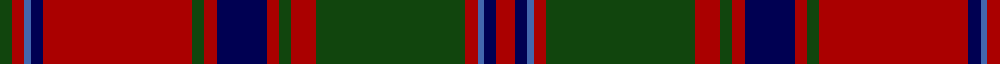

In pattern [GRBBRGRBRGRGRBBR](/patterns/grbbrgrbrgrgrbbr/).

This was sourced from weddslist.  It is a [16 stripes tartan](/stripes/stripes16/).

Original link http://www.weddslist.com/cgi-bin/tartans/pg.pl?source=x

## Thread count
DG/2 DR2 B1 DB2 DR24 DG2 DR2 DB8 DR2 DG2 DR4 DG24 DR2 B1 DB2 DR/3

## Palette
Each colour and its ΔE from the base-6 reference it is a variant of.

| Colour | Shade | Base | ΔE (OKLab) |
|---|---|---|---|
| B | <code style="background-color:#4367AE;">#4367AE</code> `#4367AE` | B <code style="background-color:#2A418A;">#2A418A</code> | 0.12 |
| DB | <code style="background-color:#000052;">#000052</code> `#000052` | B <code style="background-color:#2A418A;">#2A418A</code> | 0.20 |
| DG | <code style="background-color:#11450D;">#11450D</code> `#11450D` | G <code style="background-color:#006100;">#006100</code> | 0.09 |
| DR | <code style="background-color:#AA0000;">#AA0000</code> `#AA0000` | R <code style="background-color:#CC0000;">#CC0000</code> | 0.07 |

## Nearest tartans

The nearest existing variants by ΔTartan distance.

1. [Stewart of Appin](/setts/s16/r3b2ba1r2g24r4g2r2b8r2g2r24b2ba1r2g2~b000052-ba4367ae-g11450d-raa0000~x2/) — ΔT 0.00
1. [Stewart of Appin - 1906](/setts/s16/r3b2ba1r2g24r4g2r2b8r2g2r24b2ba1r2g2~b2c2c80-ba5c8ca8-g006818-rc80000~x2/) — ΔT 0.83
1. [Unidentified Coat](/setts/s14/g6r2g2r24b1ba1r2ba12r2ba1b1r2g24r2~b3c82af-ba2c4084-g005020-rdc0000~x2/) — ΔT 0.91
1. [Drumbeg](/setts/s12/r12b3r3ba4r16ra3r3ra3r3ra16ba52r4~b5c5c5c-ba14283c-rb07430-ra880000/) — ΔT 0.93
1. [Stewart of Appin](/setts/s16/r3b2w1r2g24r4g2r2b8r2g2r24b2w1r2g2~b000064-g004c00-rc80000-wd0d0d0/) — ΔT 0.95
1. [MacDonald of Glenaladale](/setts/s12/r7ra2b2r2g32r6b12r41g2r5ra2g5~b304080-g008000-r900030-rad03030~x2/) — ΔT 1.02
1. [MacQuarrie 1815](/setts/s13/g2r3g2r52g2r2b28r2g42r2g2r3g2~b000052-g11450d-raa0000~x2/) — ΔT 1.02
1. [MacQuarrie 1815](/setts/s13/g2r3g2r52g2r2b28r2g42r2g2r3g2~b000052-g11450d-raa0000/) — ΔT 1.02
1. [Harbor Club (Corporate)](/setts/s10/r47g14k5y2k3g7k3y2k5g14~g006428-k101010-r800028-ye8c000~x2/) — ΔT 1.07
1. [Grant and Drummond](/setts/s15/r3b2r2g38r2g2r2b10r2w2r37b2r2b2r3~b1c0070-g006818-rc80000-wa8ace8~x2/) — ΔT 1.09

## Neighbour map

Every grey dot is one of 15726 variants placed by the first two principal components of the ΔTartan feature space (44% of its variance). Red is this tartan; blue dots are its nearest — click one to open its page.

<svg viewBox="0 0 640 380" role="img" style="max-width:100%;height:auto;border:1px solid #e0e0e0;border-radius:4px;display:block" xmlns="http://www.w3.org/2000/svg"><image href="/nn/cloud.v1.png" width="640" height="380"/><a href="/setts/s16/r3b2ba1r2g24r4g2r2b8r2g2r24b2ba1r2g2~b000052-ba4367ae-g11450d-raa0000~x2/"><circle cx="333.0" cy="108.4" r="4" fill="#3465a4"><title>Stewart of Appin</title></circle></a><a href="/setts/s16/r3b2ba1r2g24r4g2r2b8r2g2r24b2ba1r2g2~b2c2c80-ba5c8ca8-g006818-rc80000~x2/"><circle cx="325.7" cy="100.8" r="4" fill="#3465a4"><title>Stewart of Appin - 1906</title></circle></a><a href="/setts/s14/g6r2g2r24b1ba1r2ba12r2ba1b1r2g24r2~b3c82af-ba2c4084-g005020-rdc0000~x2/"><circle cx="296.8" cy="107.5" r="4" fill="#3465a4"><title>Unidentified Coat</title></circle></a><a href="/setts/s12/r12b3r3ba4r16ra3r3ra3r3ra16ba52r4~b5c5c5c-ba14283c-rb07430-ra880000/"><circle cx="307.1" cy="133.8" r="4" fill="#3465a4"><title>Drumbeg</title></circle></a><a href="/setts/s16/r3b2w1r2g24r4g2r2b8r2g2r24b2w1r2g2~b000064-g004c00-rc80000-wd0d0d0/"><circle cx="308.0" cy="95.4" r="4" fill="#3465a4"><title>Stewart of Appin</title></circle></a><a href="/setts/s12/r7ra2b2r2g32r6b12r41g2r5ra2g5~b304080-g008000-r900030-rad03030~x2/"><circle cx="350.3" cy="133.2" r="4" fill="#3465a4"><title>MacDonald of Glenaladale</title></circle></a><a href="/setts/s13/g2r3g2r52g2r2b28r2g42r2g2r3g2~b000052-g11450d-raa0000~x2/"><circle cx="348.1" cy="124.5" r="4" fill="#3465a4"><title>MacQuarrie 1815</title></circle></a><a href="/setts/s13/g2r3g2r52g2r2b28r2g42r2g2r3g2~b000052-g11450d-raa0000/"><circle cx="348.1" cy="124.5" r="4" fill="#3465a4"><title>MacQuarrie 1815</title></circle></a><a href="/setts/s10/r47g14k5y2k3g7k3y2k5g14~g006428-k101010-r800028-ye8c000~x2/"><circle cx="323.1" cy="136.6" r="4" fill="#3465a4"><title>Harbor Club (Corporate)</title></circle></a><a href="/setts/s15/r3b2r2g38r2g2r2b10r2w2r37b2r2b2r3~b1c0070-g006818-rc80000-wa8ace8~x2/"><circle cx="320.2" cy="97.5" r="4" fill="#3465a4"><title>Grant and Drummond</title></circle></a><circle cx="333.0" cy="108.4" r="5" fill="#c00000"/></svg>

ID: /setts/s16/r3b2ba1r2g24r4g2r2b8r2g2r24b2ba1r2g2~b000052-ba4367ae-g11450d-raa0000/
