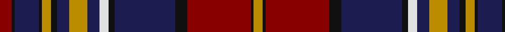

In pattern [RKBKYKBYBWKBKRKY](/patterns/rkbkykbybwkbkrky/).

This was sourced from tartans-authority.  It is a [16 stripes tartan](/stripes/stripes16/).

Original link http://www.tartansauthority.com/tartan-ferret/display/7434/

## Attestations

This cloth appears in 2 source records; the oldest owns this page.

- 2004 — Westmeath County Crest (Fashion) (tartans-authority, [record](http://www.tartansauthority.com/tartan-ferret/display/7434/))
- 01/05/2005 — Westmeath County, Crest Range (register-of-tartans, [record](https://www.tartanregister.gov.uk/tartanDetails.aspx?ref=5398))

## Register references

External register numbers recorded for this tartan.

- Scottish Register of Tartans: [5398](https://www.tartanregister.gov.uk/tartanDetails.aspx?ref=5398)
- Scottish Tartans Authority (ITI): 7434
- Scottish Tartans World Register: 3103

## Thread count
DR/8 K2 DB16 K2 DY6 K4 DB8 DY12 DB8 LN6 K4 DB40 K8 DR42 K2 DY/6

## Palette
Each colour and its ΔE from the base-6 reference it is a variant of.

| Colour | Shade | Base | ΔE (OKLab) |
|---|---|---|---|
| DB | <code style="background-color:#1C1C50;">#1C1C50</code> `#1C1C50` | B <code style="background-color:#2A418A;">#2A418A</code> | 0.14 |
| DR | <code style="background-color:#880000;">#880000</code> `#880000` | R <code style="background-color:#CC0000;">#CC0000</code> | 0.15 |
| DY | <code style="background-color:#BC8C00;">#BC8C00</code> `#BC8C00` | Y <code style="background-color:#F2BF00;">#F2BF00</code> | 0.16 |
| K | <code style="background-color:#101010;">#101010</code> `#101010` | K <code style="background-color:#000000;">#000000</code> | 0.17 |
| LN | <code style="background-color:#E0E0E0;">#E0E0E0</code> `#E0E0E0` | W <code style="background-color:#F7F7F7;">#F7F7F7</code> | 0.07 |

## Nearest tartans

The nearest existing variants by ΔTartan distance.

1. [Baron of Greencastle Dress #2 (Personal)](/setts/s13/r4k2r24y2k12b3k2b2k2b12w1b1w3~b2c2c80-k101010-r880000-wf8f8f8-ye8c000~x2/) — ΔT 0.66
1. [Kormylo (Personal)](/setts/s12/w2b2r18b2g20r2b40r2g12b3r9y2~b202060-g003820-rc80000-wfcfcfc-ye8c000~x2/) — ΔT 0.79
1. [Ruxton](/setts/s15/r22k3y1k1w3k3b1k3b8k19y4k2y1k7y3~b1c0070-k101010-r880000-wf8f8f8-yd09800~x2/) — ΔT 0.88
1. [Strathdon](/setts/s15/w3y8b2y8ba11b2y4r4b27ba1b2ba2b2ba13b2~b4d1a3a-ba401a4f-r7c0000-wd8e9ff-yda8d24~x2/) — ΔT 0.89
1. [Kormylo (Personal)](/setts/s22/r9b3g12r2b40r2g20b2r18b2w2b2r18b2g20r2b40r2g12b3r9y2~b202060-g003820-rc80000-wfcfcfc-ye8c000~x2/) — ΔT 0.97
1. [Nike Golf Dark (Corporate)](/setts/s17/r5k20b1k2b1k2b2k2b5ra2b2ra2b2ra3b2ra10w3~b5c5c5c-k101010-rc80000-ra888888-wfcfcfc~x2/) — ΔT 1.02
1. [El Dorado Hills Firefighters Pipes and Drums](/setts/s14/k5r1w2r1k26r3y1b10w1r3w1b10w1r3~b3f4441-k1c1714-rca2625-we5e0d2-ye0a126~x2/) — ΔT 1.04
1. [Largs District Tartan Tartan Number: 478. Earliest known date: 1981 The Largs tartan is a new design created for the town and officially adopted in 1981. There is also a dress version. See products available Copyright © Blair Urquhart, Comrie, 2015](/setts/s13/b4r4ba44w6ba5g4ba3g8ba3g16b4r22w4~b1c0070-ba202060-g604000-r880000-we0e0e0/) — ΔT 1.05
1. [Brooks Brothers (Corporate)](/setts/s11/r48k10b12k2r3k2b12k10ra10k2y3~b003074-k000000-r70000c-ra888888-y9c9c00~x2/) — ΔT 1.09
1. [New Hampshire District Tartan Tartan Number: 1102. Earliest known date: 1994 New Hampshire State Representative Steven Avery, arranged for Governor Stephen Merrill to proclaim the Tartan as the State Tartan of New Hampshire in June 1994. In January 1995, Avery introduced the bill to the NH Legislature for permanent recognition, which was passed in May, 1995. The purple represents the finch and the lilac, green the forests, black the granite mountains, white for the snow, and red for the States heroes. New Hampshire Revised Statutes Annotated (RSA) 3:21. See products available Copyright © Blair Urquhart, Comrie, 2015](/setts/s21/g20k1g1k6w1k6b1k1b4r3b14r3b4k1b1k6w1k6g1k1g8~b780078-g006818-k101010-rc80000-we0e0e0~x2/) — ΔT 1.10

## Neighbour map

Every grey dot is one of 15726 variants placed by the first two principal components of the ΔTartan feature space (44% of its variance). Red is this tartan; blue dots are its nearest — click one to open its page.

<svg viewBox="0 0 640 380" role="img" style="max-width:100%;height:auto;border:1px solid #e0e0e0;border-radius:4px;display:block" xmlns="http://www.w3.org/2000/svg"><image href="/nn/cloud.v1.png" width="640" height="380"/><a href="/setts/s13/r4k2r24y2k12b3k2b2k2b12w1b1w3~b2c2c80-k101010-r880000-wf8f8f8-ye8c000~x2/"><circle cx="229.2" cy="97.5" r="4" fill="#3465a4"><title>Baron of Greencastle Dress #2 (Personal)</title></circle></a><a href="/setts/s12/w2b2r18b2g20r2b40r2g12b3r9y2~b202060-g003820-rc80000-wfcfcfc-ye8c000~x2/"><circle cx="247.0" cy="117.6" r="4" fill="#3465a4"><title>Kormylo (Personal)</title></circle></a><a href="/setts/s15/r22k3y1k1w3k3b1k3b8k19y4k2y1k7y3~b1c0070-k101010-r880000-wf8f8f8-yd09800~x2/"><circle cx="244.9" cy="99.0" r="4" fill="#3465a4"><title>Ruxton</title></circle></a><a href="/setts/s15/w3y8b2y8ba11b2y4r4b27ba1b2ba2b2ba13b2~b4d1a3a-ba401a4f-r7c0000-wd8e9ff-yda8d24~x2/"><circle cx="243.4" cy="96.5" r="4" fill="#3465a4"><title>Strathdon</title></circle></a><a href="/setts/s22/r9b3g12r2b40r2g20b2r18b2w2b2r18b2g20r2b40r2g12b3r9y2~b202060-g003820-rc80000-wfcfcfc-ye8c000~x2/"><circle cx="246.8" cy="99.2" r="4" fill="#3465a4"><title>Kormylo (Personal)</title></circle></a><a href="/setts/s17/r5k20b1k2b1k2b2k2b5ra2b2ra2b2ra3b2ra10w3~b5c5c5c-k101010-rc80000-ra888888-wfcfcfc~x2/"><circle cx="193.2" cy="92.6" r="4" fill="#3465a4"><title>Nike Golf Dark (Corporate)</title></circle></a><a href="/setts/s14/k5r1w2r1k26r3y1b10w1r3w1b10w1r3~b3f4441-k1c1714-rca2625-we5e0d2-ye0a126~x2/"><circle cx="269.2" cy="89.1" r="4" fill="#3465a4"><title>El Dorado Hills Firefighters Pipes and Drums</title></circle></a><a href="/setts/s13/b4r4ba44w6ba5g4ba3g8ba3g16b4r22w4~b1c0070-ba202060-g604000-r880000-we0e0e0/"><circle cx="230.5" cy="127.3" r="4" fill="#3465a4"><title>Largs District Tartan Tartan Number: 478. Earliest known date: 1981 The Largs tartan is a new design created for the town and officially adopted in 1981. There is also a dress version. See products available Copyright © Blair Urquhart, Comrie, 2015</title></circle></a><a href="/setts/s11/r48k10b12k2r3k2b12k10ra10k2y3~b003074-k000000-r70000c-ra888888-y9c9c00~x2/"><circle cx="257.1" cy="111.2" r="4" fill="#3465a4"><title>Brooks Brothers (Corporate)</title></circle></a><a href="/setts/s21/g20k1g1k6w1k6b1k1b4r3b14r3b4k1b1k6w1k6g1k1g8~b780078-g006818-k101010-rc80000-we0e0e0~x2/"><circle cx="184.3" cy="95.4" r="4" fill="#3465a4"><title>New Hampshire District Tartan Tartan Number: 1102. Earliest known date: 1994 New Hampshire State Representative Steven Avery, arranged for Governor Stephen Merrill to proclaim the Tartan as the State Tartan of New Hampshire in June 1994. In January 1995, Avery introduced the bill to the NH Legislature for permanent recognition, which was passed in May, 1995. The purple represents the finch and the lilac, green the forests, black the granite mountains, white for the snow, and red for the States heroes. New Hampshire Revised Statutes Annotated (RSA) 3:21. See products available Copyright © Blair Urquhart, Comrie, 2015</title></circle></a><circle cx="221.8" cy="103.8" r="5" fill="#c00000"/></svg>

ID: /setts/s16/r4k1b8k1y3k2b4y6b4w3k2b20k4r21k1y3~b1c1c50-k101010-r880000-we0e0e0-ybc8c00~x2/
