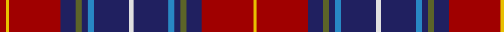

In pattern [RYRBGBBBWBBBGBRY](/patterns/ryrbgbbbwbbbgbry/).

This was sourced from register-of-tartans.  It is a [16 stripes tartan](/stripes/stripes16/).

Original link https://www.tartanregister.gov.uk/tartanDetails.aspx?ref=1680

## Register references

External register numbers recorded for this tartan.

- Scottish Register of Tartans: [1680](https://www.tartanregister.gov.uk/tartanDetails.aspx?ref=1680)
- Scottish Tartans Authority (ITI): 6407

## Thread count
DR/8 Y4 DR68 DB20 G8 DB8 B8 DB46 LN6 DB46 B8 DB8 G8 DB20 DR68 Y/4

## Palette
Each colour and its ΔE from the base-6 reference it is a variant of.

| Colour | Shade | Base | ΔE (OKLab) |
|---|---|---|---|
| B | <code style="background-color:#2888C4;">#2888C4</code> `#2888C4` | B <code style="background-color:#2A418A;">#2A418A</code> | 0.21 |
| DB | <code style="background-color:#202060;">#202060</code> `#202060` | B <code style="background-color:#2A418A;">#2A418A</code> | 0.11 |
| DR | <code style="background-color:#A00000;">#A00000</code> `#A00000` | R <code style="background-color:#CC0000;">#CC0000</code> | 0.09 |
| G | <code style="background-color:#5C6428;">#5C6428</code> `#5C6428` | G <code style="background-color:#006100;">#006100</code> | 0.10 |
| LB | <code style="background-color:#98C8E8;">#98C8E8</code> `#98C8E8` | W <code style="background-color:#F7F7F7;">#F7F7F7</code> | 0.18 |
| LN | <code style="background-color:#E0E0E0;">#E0E0E0</code> `#E0E0E0` | W <code style="background-color:#F7F7F7;">#F7F7F7</code> | 0.07 |
| Y | <code style="background-color:#E8C000;">#E8C000</code> `#E8C000` | Y <code style="background-color:#F2BF00;">#F2BF00</code> | 0.02 |

## Nearest tartans

The nearest existing variants by ΔTartan distance.

1. [Wishart Dress](/setts/s12/k7b4r31ba3y2ba27w4ba27y2ba3r31b4~b2c2c80-ba202060-k000000-rc80000-wc8c8c8-ye8c000~x2/) — ΔT 1.05
1. [Guild, The](/setts/s18/b20r1ra3y1ra30g5b8r1b8r1b8g5ra30y1ra3r1b20w2~b1c0070-g004c00-rff0000-ra880000-wffffff-ya0a0a0~x2/) — ΔT 1.11
1. [Hueg Scottish Blue Thistle (Personal](/setts/s15/r2g4k2b25g4b4y2b2w2b5g3r7k2r3w2~b440044-g006818-k101010-rc80000-we8ccb8-ybc8c00~x2/) — ΔT 1.18
1. [Heirloom Red Alba (Fashion)](/setts/s9/r4y2r34b10g4b4ba4b23w3~b202060-ba2888c4-g5c6428-ra00000-we0e0e0-ye8c000~x2/) — ΔT 1.20
1. [Hyland Evening (Personal)](/setts/s14/b3y2r19ra4ba6k36ba2y3ba2k36ba6ra4r19y2~b440044-ba780078-k101010-rc8002c-rab03000-ydc943c~x2/) — ΔT 1.23
1. [Catalan Dance](/setts/s16/k2b12r12b2r2ba2r2ba2r12b6r2g12k2y1r1y1~b1c1c50-ba5c8ca8-g003820-k101010-rc80000-ye8c000~x2/) — ΔT 1.28
1. [Hueg (Bavaria) Scottish Blue Thistle (Personal)](/setts/s15/r2g4k2b25g4b4y2b2w2b5g3r7k2r3w2~b433a5a-g23321b-k1c1714-rca2625-we5e0d2-ye0a126~x2/) — ΔT 1.29
1. [Sydney Academy](/setts/s14/b31k4b4k4b4k4b6w5k4r3ba19r3b4ra3~b5c5c5c-ba780078-k101010-rb84c00-rac80000-wfcfcfc~x2/) — ΔT 1.30
1. [Blais](/setts/s11/b20y1r1b3k1g2k1ra10k1g2ra4~b304080-g808080-k000000-r806050-rac00000-yf0c000~x2/) — ΔT 1.30
1. [Blais (Personal)](/setts/s11/b20y1g1b3k1r2k1ra10k1r2ra4~b2c2c80-g604000-k101010-r888888-rac80000-ye8c000~x4/) — ΔT 1.32

## Neighbour map

Every grey dot is one of 15726 variants placed by the first two principal components of the ΔTartan feature space (44% of its variance). Red is this tartan; blue dots are its nearest — click one to open its page.

<svg viewBox="0 0 640 380" role="img" style="max-width:100%;height:auto;border:1px solid #e0e0e0;border-radius:4px;display:block" xmlns="http://www.w3.org/2000/svg"><image href="/nn/cloud.v1.png" width="640" height="380"/><a href="/setts/s12/k7b4r31ba3y2ba27w4ba27y2ba3r31b4~b2c2c80-ba202060-k000000-rc80000-wc8c8c8-ye8c000~x2/"><circle cx="219.4" cy="110.7" r="4" fill="#3465a4"><title>Wishart Dress</title></circle></a><a href="/setts/s18/b20r1ra3y1ra30g5b8r1b8r1b8g5ra30y1ra3r1b20w2~b1c0070-g004c00-rff0000-ra880000-wffffff-ya0a0a0~x2/"><circle cx="283.5" cy="74.5" r="4" fill="#3465a4"><title>Guild, The</title></circle></a><a href="/setts/s15/r2g4k2b25g4b4y2b2w2b5g3r7k2r3w2~b440044-g006818-k101010-rc80000-we8ccb8-ybc8c00~x2/"><circle cx="246.1" cy="98.9" r="4" fill="#3465a4"><title>Hueg Scottish Blue Thistle (Personal</title></circle></a><a href="/setts/s9/r4y2r34b10g4b4ba4b23w3~b202060-ba2888c4-g5c6428-ra00000-we0e0e0-ye8c000~x2/"><circle cx="251.2" cy="122.6" r="4" fill="#3465a4"><title>Heirloom Red Alba (Fashion)</title></circle></a><a href="/setts/s14/b3y2r19ra4ba6k36ba2y3ba2k36ba6ra4r19y2~b440044-ba780078-k101010-rc8002c-rab03000-ydc943c~x2/"><circle cx="255.2" cy="94.6" r="4" fill="#3465a4"><title>Hyland Evening (Personal)</title></circle></a><a href="/setts/s16/k2b12r12b2r2ba2r2ba2r12b6r2g12k2y1r1y1~b1c1c50-ba5c8ca8-g003820-k101010-rc80000-ye8c000~x2/"><circle cx="182.5" cy="111.0" r="4" fill="#3465a4"><title>Catalan Dance</title></circle></a><a href="/setts/s15/r2g4k2b25g4b4y2b2w2b5g3r7k2r3w2~b433a5a-g23321b-k1c1714-rca2625-we5e0d2-ye0a126~x2/"><circle cx="260.1" cy="108.6" r="4" fill="#3465a4"><title>Hueg (Bavaria) Scottish Blue Thistle (Personal)</title></circle></a><a href="/setts/s14/b31k4b4k4b4k4b6w5k4r3ba19r3b4ra3~b5c5c5c-ba780078-k101010-rb84c00-rac80000-wfcfcfc~x2/"><circle cx="227.7" cy="120.5" r="4" fill="#3465a4"><title>Sydney Academy</title></circle></a><a href="/setts/s11/b20y1r1b3k1g2k1ra10k1g2ra4~b304080-g808080-k000000-r806050-rac00000-yf0c000~x2/"><circle cx="281.7" cy="93.6" r="4" fill="#3465a4"><title>Blais</title></circle></a><a href="/setts/s11/b20y1g1b3k1r2k1ra10k1r2ra4~b2c2c80-g604000-k101010-r888888-rac80000-ye8c000~x4/"><circle cx="283.8" cy="93.6" r="4" fill="#3465a4"><title>Blais (Personal)</title></circle></a><circle cx="248.2" cy="104.2" r="5" fill="#c00000"/></svg>

ID: /setts/s16/r4y2r34b10g4b4ba4b23w3b23ba4b4g4b10r34y2~b202060-ba2888c4-g5c6428-ra00000-we0e0e0-ye8c000~x2/
