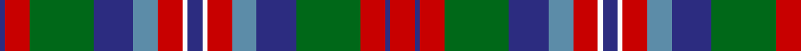

In pattern [BRGBBRWBWRBBGRBR](/patterns/brgbbrwbwrbbgrbr/).

This was sourced from register-of-tartans.  It is a [16 stripes tartan](/stripes/stripes16/).

Original link https://www.tartanregister.gov.uk/tartanDetails.aspx?ref=3187

## Thread count
DB/2 R10 G26 DB16 B10 R10 W2 DB6 W2 R10 B10 DB16 G26 R10 DB2 R/10

## Palette
Each colour and its ΔE from the base-6 reference it is a variant of.

| Colour | Shade | Base | ΔE (OKLab) |
|---|---|---|---|
| B | <code style="background-color:#5C8CA8;">#5C8CA8</code> `#5C8CA8` | B <code style="background-color:#2A418A;">#2A418A</code> | 0.23 |
| DB | <code style="background-color:#2C2C80;">#2C2C80</code> `#2C2C80` | B <code style="background-color:#2A418A;">#2A418A</code> | 0.06 |
| G | <code style="background-color:#006818;">#006818</code> `#006818` | G <code style="background-color:#006100;">#006100</code> | 0.02 |
| R | <code style="background-color:#C80000;">#C80000</code> `#C80000` | R <code style="background-color:#CC0000;">#CC0000</code> | 0.01 |
| W | <code style="background-color:#FCFCFC;">#FCFCFC</code> `#FCFCFC` | W <code style="background-color:#F7F7F7;">#F7F7F7</code> | 0.01 |

## Nearest tartans

The nearest existing variants by ΔTartan distance.

1. [Teirney (Estimated threadcount)](/setts/s14/g10w2g2w2b8r8k1r7k1r8b8g8w2g2~b1474b4-g006818-k101010-rc80000-wf8f8f8~x2/) — ΔT 0.93
1. [Jones-MacGregor (Name)](/setts/s14/b2g2b3g8ga4b4ga3b8r12ga7r3ga2k1w1~b2c2c80-g789484-ga006818-k101010-rc80000-wfcfcfc~x2/) — ΔT 0.95
1. [Red Hackle Pipe Band (Corporate)](/setts/s16/b30k2r18k3w24b12k3b24k2g26b12g12r12w12r12w2~b5c6c84-g006818-k101010-rc80000-we0e0e0/) — ΔT 1.00
1. [Jones-MacGregor](/setts/s14/b2y2b3y8g4b4g3b8r12g7r3g2k1w1~b123d59-g085e23-k101010-rd82819-wf7f1e8-y78a692~x2/) — ΔT 1.08
1. [MacPherson #9](/setts/s15/r13y4r13g28y3ga26y10ga2gb2ga2y10r14y4ga4r4~g005020-ga503c14-gb2a2303-r960028-yb0b0b0~x2/) — ΔT 1.09
1. [Black Scottish National Tartan Tartan Number: 6622. Earliest known date: Marton Mills./Threadcount and colours aren't 100% original. Generated manually./ See products available Copyright © Blair Urquhart, Comrie, 2015](/setts/s15/r8w1r1b1r1k7ba7k1ba3k1ba7k7r7k1b3~b58486c-ba534e4b-k080808-r928d89-we0e0e0~x2/) — ΔT 1.12
1. [MacBrine (Name)](/setts/s11/k4r6g8r16k6b10k2b10k2g8y1~b2c2c80-g00881c-k101010-rc80000-ye8c000~x2/) — ΔT 1.13
1. [Norwich No.057](/setts/s18/b4ba8y1g12r6ba2r6w1r6w1r6ba2r6g12y1ba8b4r4~b2888c4-ba2c2c80-g006818-rc80000-wfcfcfc-ye8c000~x4/) — ΔT 1.15
1. [Bowie, Black (Name)](/setts/s12/b9r3b3r5b16r2k17g16r5g3y1k9~b1870a4-g285800-k101010-rc80000-yd09800~x2/) — ΔT 1.15
1. [MacKenzie Hunting (Brown)](/setts/s15/y12k2y2k2y2k12r12k1w2k1r12k12y12k1ra2~k101010-ra07c58-rac80000-we0e0e0-ya08858~x2/) — ΔT 1.18

## Neighbour map

Every grey dot is one of 15726 variants placed by the first two principal components of the ΔTartan feature space (44% of its variance). Red is this tartan; blue dots are its nearest — click one to open its page.

<svg viewBox="0 0 640 380" role="img" style="max-width:100%;height:auto;border:1px solid #e0e0e0;border-radius:4px;display:block" xmlns="http://www.w3.org/2000/svg"><image href="/nn/cloud.v1.png" width="640" height="380"/><a href="/setts/s14/g10w2g2w2b8r8k1r7k1r8b8g8w2g2~b1474b4-g006818-k101010-rc80000-wf8f8f8~x2/"><circle cx="114.2" cy="158.9" r="4" fill="#3465a4"><title>Teirney (Estimated threadcount)</title></circle></a><a href="/setts/s14/b2g2b3g8ga4b4ga3b8r12ga7r3ga2k1w1~b2c2c80-g789484-ga006818-k101010-rc80000-wfcfcfc~x2/"><circle cx="97.6" cy="138.4" r="4" fill="#3465a4"><title>Jones-MacGregor (Name)</title></circle></a><a href="/setts/s16/b30k2r18k3w24b12k3b24k2g26b12g12r12w12r12w2~b5c6c84-g006818-k101010-rc80000-we0e0e0/"><circle cx="138.4" cy="135.1" r="4" fill="#3465a4"><title>Red Hackle Pipe Band (Corporate)</title></circle></a><a href="/setts/s14/b2y2b3y8g4b4g3b8r12g7r3g2k1w1~b123d59-g085e23-k101010-rd82819-wf7f1e8-y78a692~x2/"><circle cx="98.9" cy="140.1" r="4" fill="#3465a4"><title>Jones-MacGregor</title></circle></a><a href="/setts/s15/r13y4r13g28y3ga26y10ga2gb2ga2y10r14y4ga4r4~g005020-ga503c14-gb2a2303-r960028-yb0b0b0~x2/"><circle cx="161.0" cy="136.0" r="4" fill="#3465a4"><title>MacPherson #9</title></circle></a><a href="/setts/s15/r8w1r1b1r1k7ba7k1ba3k1ba7k7r7k1b3~b58486c-ba534e4b-k080808-r928d89-we0e0e0~x2/"><circle cx="115.2" cy="164.8" r="4" fill="#3465a4"><title>Black Scottish National Tartan Tartan Number: 6622. Earliest known date: Marton Mills./Threadcount and colours aren't 100% original. Generated manually./ See products available Copyright © Blair Urquhart, Comrie, 2015</title></circle></a><a href="/setts/s11/k4r6g8r16k6b10k2b10k2g8y1~b2c2c80-g00881c-k101010-rc80000-ye8c000~x2/"><circle cx="121.5" cy="160.4" r="4" fill="#3465a4"><title>MacBrine (Name)</title></circle></a><a href="/setts/s18/b4ba8y1g12r6ba2r6w1r6w1r6ba2r6g12y1ba8b4r4~b2888c4-ba2c2c80-g006818-rc80000-wfcfcfc-ye8c000~x4/"><circle cx="126.2" cy="128.4" r="4" fill="#3465a4"><title>Norwich No.057</title></circle></a><a href="/setts/s12/b9r3b3r5b16r2k17g16r5g3y1k9~b1870a4-g285800-k101010-rc80000-yd09800~x2/"><circle cx="148.1" cy="152.2" r="4" fill="#3465a4"><title>Bowie, Black (Name)</title></circle></a><a href="/setts/s15/y12k2y2k2y2k12r12k1w2k1r12k12y12k1ra2~k101010-ra07c58-rac80000-we0e0e0-ya08858~x2/"><circle cx="158.2" cy="135.3" r="4" fill="#3465a4"><title>MacKenzie Hunting (Brown)</title></circle></a><circle cx="127.1" cy="148.8" r="5" fill="#c00000"/></svg>

ID: /setts/s16/r5b1r5g13b8ba5r5w1b3w1r5ba5b8g13r5b1~b2c2c80-ba5c8ca8-g006818-rc80000-wfcfcfc~x2/
