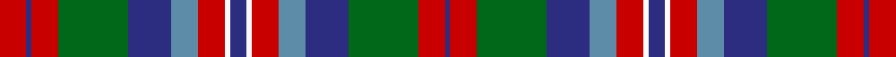

This page is one **sett** — a single exact thread-count. It belongs to the [tartan](/tartans/r5db1r5g13db8t5r5w1db3/)
(the same proportion at any scale), whose colour order is pattern [BRGBBRWBWRBBGRBR](/stripes/brgbbrwbwrbbgrbr/).

Sourced from register-of-tartans.  It is a [16 stripe tartan](/stripes/stripes16/).

Original link https://www.tartanregister.gov.uk/tartanDetails.aspx?ref=3187

## Register references

External register numbers recorded for this tartan.

- Scottish Register of Tartans: [3187](https://www.tartanregister.gov.uk/tartanDetails.aspx?ref=3187)
- Scottish Tartans Authority (ITI): 5559

## Thread count
R/10 DB2 R10 G26 DB16 B10 R10 W2 DB6 W2 R10 B10 DB16 G26 R10 DB/2

## Palette

Palette: <strong>Tartan Register</strong>
<table><thead><tr><th>Colour</th><th>Threads</th><th>Shade</th><th>Base</th><th>OKLCh</th></tr></thead><tbody><tr><td>R/</td><td style="text-align:right;font-variant-numeric:tabular-nums">10</td><td><code style="background-color:#C80000;">#C80000</code> <small style="color:#888">#C80000</small></td><td>R <code style="background-color:#CC0000;">#CC0000</code></td><td><small style="color:#888">oklch(52.3% 0.215 29.2)</small></td></tr><tr><td>DB</td><td style="text-align:right;font-variant-numeric:tabular-nums">2</td><td><code style="background-color:#2C2C80;">#2C2C80</code> <small style="color:#888">#2C2C80</small></td><td>B <code style="background-color:#2A418A;">#2A418A</code></td><td><small style="color:#888">oklch(35.0% 0.138 276.6)</small></td></tr><tr><td>R</td><td style="text-align:right;font-variant-numeric:tabular-nums">10</td><td><code style="background-color:#C80000;">#C80000</code> <small style="color:#888">#C80000</small></td><td>R <code style="background-color:#CC0000;">#CC0000</code></td><td><small style="color:#888">oklch(52.3% 0.215 29.2)</small></td></tr><tr><td>G</td><td style="text-align:right;font-variant-numeric:tabular-nums">26</td><td><code style="background-color:#006818;">#006818</code> <small style="color:#888">#006818</small></td><td>G <code style="background-color:#006100;">#006100</code></td><td><small style="color:#888">oklch(45.0% 0.142 145.0)</small></td></tr><tr><td>DB</td><td style="text-align:right;font-variant-numeric:tabular-nums">16</td><td><code style="background-color:#2C2C80;">#2C2C80</code> <small style="color:#888">#2C2C80</small></td><td>B <code style="background-color:#2A418A;">#2A418A</code></td><td><small style="color:#888">oklch(35.0% 0.138 276.6)</small></td></tr><tr><td>B</td><td style="text-align:right;font-variant-numeric:tabular-nums">10</td><td><code style="background-color:#5C8CA8;">#5C8CA8</code> <small style="color:#888">#5C8CA8</small></td><td>B <code style="background-color:#2A418A;">#2A418A</code></td><td><small style="color:#888">oklch(61.7% 0.067 235.0)</small></td></tr><tr><td>R</td><td style="text-align:right;font-variant-numeric:tabular-nums">10</td><td><code style="background-color:#C80000;">#C80000</code> <small style="color:#888">#C80000</small></td><td>R <code style="background-color:#CC0000;">#CC0000</code></td><td><small style="color:#888">oklch(52.3% 0.215 29.2)</small></td></tr><tr><td>W</td><td style="text-align:right;font-variant-numeric:tabular-nums">2</td><td><code style="background-color:#FCFCFC;">#FCFCFC</code> <small style="color:#888">#FCFCFC</small></td><td>W <code style="background-color:#F7F7F7;">#F7F7F7</code></td><td><small style="color:#888">oklch(99.1% 0.000 89.9)</small></td></tr><tr><td>DB</td><td style="text-align:right;font-variant-numeric:tabular-nums">6</td><td><code style="background-color:#2C2C80;">#2C2C80</code> <small style="color:#888">#2C2C80</small></td><td>B <code style="background-color:#2A418A;">#2A418A</code></td><td><small style="color:#888">oklch(35.0% 0.138 276.6)</small></td></tr><tr><td>W</td><td style="text-align:right;font-variant-numeric:tabular-nums">2</td><td><code style="background-color:#FCFCFC;">#FCFCFC</code> <small style="color:#888">#FCFCFC</small></td><td>W <code style="background-color:#F7F7F7;">#F7F7F7</code></td><td><small style="color:#888">oklch(99.1% 0.000 89.9)</small></td></tr><tr><td>R</td><td style="text-align:right;font-variant-numeric:tabular-nums">10</td><td><code style="background-color:#C80000;">#C80000</code> <small style="color:#888">#C80000</small></td><td>R <code style="background-color:#CC0000;">#CC0000</code></td><td><small style="color:#888">oklch(52.3% 0.215 29.2)</small></td></tr><tr><td>B</td><td style="text-align:right;font-variant-numeric:tabular-nums">10</td><td><code style="background-color:#5C8CA8;">#5C8CA8</code> <small style="color:#888">#5C8CA8</small></td><td>B <code style="background-color:#2A418A;">#2A418A</code></td><td><small style="color:#888">oklch(61.7% 0.067 235.0)</small></td></tr><tr><td>DB</td><td style="text-align:right;font-variant-numeric:tabular-nums">16</td><td><code style="background-color:#2C2C80;">#2C2C80</code> <small style="color:#888">#2C2C80</small></td><td>B <code style="background-color:#2A418A;">#2A418A</code></td><td><small style="color:#888">oklch(35.0% 0.138 276.6)</small></td></tr><tr><td>G</td><td style="text-align:right;font-variant-numeric:tabular-nums">26</td><td><code style="background-color:#006818;">#006818</code> <small style="color:#888">#006818</small></td><td>G <code style="background-color:#006100;">#006100</code></td><td><small style="color:#888">oklch(45.0% 0.142 145.0)</small></td></tr><tr><td>R</td><td style="text-align:right;font-variant-numeric:tabular-nums">10</td><td><code style="background-color:#C80000;">#C80000</code> <small style="color:#888">#C80000</small></td><td>R <code style="background-color:#CC0000;">#CC0000</code></td><td><small style="color:#888">oklch(52.3% 0.215 29.2)</small></td></tr><tr><td>DB/</td><td style="text-align:right;font-variant-numeric:tabular-nums">2</td><td><code style="background-color:#2C2C80;">#2C2C80</code> <small style="color:#888">#2C2C80</small></td><td>B <code style="background-color:#2A418A;">#2A418A</code></td><td><small style="color:#888">oklch(35.0% 0.138 276.6)</small></td></tr></tbody></table>

## Nearest tartans

The nearest existing variants by ΔTartan distance, with this tartan at the top so the swatches line up against it.

ΔTartan

Tartan

Sett

—

<a href="/ttd/edit/#slug=r5db1r5g13db8t5r5w1db3~x2">Norwich No.056</a> <a class="nn-out" href="/setts/s16/r5db1r5g13db8t5r5w1db3~x2/" title="open its dictionary page">↗</a>

0.93

<a href="/ttd/edit/#slug=g10w2g2w2b8r8k1r7k1r8b8g8w2g2~x2">Teirney (Estimated threadcount)</a> <a class="nn-out" href="/setts/s14/g10w2g2w2b8r8k1r7k1r8b8g8w2g2~x2/" title="open its dictionary page">↗</a>

0.96

<a href="/ttd/edit/#slug=db2y2db3y8g4db4g3db8r12g7r3g2k1w1~x2">Jones-MacGregor (Name)</a> <a class="nn-out" href="/setts/s14/db2y2db3y8g4db4g3db8r12g7r3g2k1w1~x2/" title="open its dictionary page">↗</a>

1.00

<a href="/ttd/edit/#slug=n30k2r18k3w24n12k3n24k2g26n12g12r12w12r12w2">Red Hackle Pipe Band (Corporate)</a> <a class="nn-out" href="/setts/s16/n30k2r18k3w24n12k3n24k2g26n12g12r12w12r12w2/" title="open its dictionary page">↗</a>

1.08

<a href="/ttd/edit/#slug=dt2lg2dt3lg8dg4dt4dg3dt8r12dg7r3dg2k1w1~x2">Jones-MacGregor</a> <a class="nn-out" href="/setts/s14/dt2lg2dt3lg8dg4dt4dg3dt8r12dg7r3dg2k1w1~x2/" title="open its dictionary page">↗</a>

1.09

<a href="/ttd/edit/#slug=r13lr4r13dg28lr3dy26lr10dy2dy2dy2lr10r14lr4dy4r4~x2">MacPherson #9</a> <a class="nn-out" href="/setts/s15/r13lr4r13dg28lr3dy26lr10dy2dy2dy2lr10r14lr4dy4r4~x2/" title="open its dictionary page">↗</a>

1.12

<a href="/ttd/edit/#slug=o8w1o1n1o1k7n7k1n3k1n7k7o7k1n3~x2">Black Scottish National Tartan Tartan Number: 6622. Earliest known date: Marton Mills./Threadcount and colours aren't 100% original. Generated manually./ See products available Copyright © Blair Urquhart, Comrie, 2015</a> <a class="nn-out" href="/setts/s15/o8w1o1n1o1k7n7k1n3k1n7k7o7k1n3~x2/" title="open its dictionary page">↗</a>

1.13

<a href="/ttd/edit/#slug=k4r6g8r16k6db10k2db10k2g8ly1~x2">MacBrine (Name)</a> <a class="nn-out" href="/setts/s11/k4r6g8r16k6db10k2db10k2g8ly1~x2/" title="open its dictionary page">↗</a>

1.15

<a href="/setts/s18/r4t4db8ly1g12r6db2r6w1r6w1r6db2r6g12ly1db8t4~x4/">Norwich No.057</a>

1.15

<a href="/ttd/edit/#slug=k9lo1dg3r5dg16k17r2b16r5b3r3b9~x2">Bowie, Black (Name)</a> <a class="nn-out" href="/setts/s12/k9lo1dg3r5dg16k17r2b16r5b3r3b9~x2/" title="open its dictionary page">↗</a>

1.18

<a href="/ttd/edit/#slug=lo12k2lo2k2lo2k12o12k1w2k1o12k12lo12k1r2~x2">MacKenzie Hunting (Brown)</a> <a class="nn-out" href="/setts/s15/lo12k2lo2k2lo2k12o12k1w2k1o12k12lo12k1r2~x2/" title="open its dictionary page">↗</a>

## Neighbour map

Every grey dot is one of 14299 variants placed by the first two principal components of the ΔTartan feature space (44% of its variance). Red is this tartan; blue dots are its nearest — click one to open its page.

<svg viewBox="0 0 640 380" role="img" style="max-width:100%;height:auto;border:1px solid #e0e0e0;border-radius:4px;display:block" xmlns="http://www.w3.org/2000/svg"><image href="/nn/cloud.v1.png" width="640" height="380"/><a href="/setts/s14/g10w2g2w2b8r8k1r7k1r8b8g8w2g2~x2/"><circle cx="116.4" cy="160.3" r="4" fill="#3465a4"><title>Teirney (Estimated threadcount)</title></circle></a><a href="/setts/s14/db2y2db3y8g4db4g3db8r12g7r3g2k1w1~x2/"><circle cx="100.1" cy="143.2" r="4" fill="#3465a4"><title>Jones-MacGregor (Name)</title></circle></a><a href="/setts/s16/n30k2r18k3w24n12k3n24k2g26n12g12r12w12r12w2/"><circle cx="140.5" cy="137.0" r="4" fill="#3465a4"><title>Red Hackle Pipe Band (Corporate)</title></circle></a><a href="/setts/s14/dt2lg2dt3lg8dg4dt4dg3dt8r12dg7r3dg2k1w1~x2/"><circle cx="101.5" cy="145.5" r="4" fill="#3465a4"><title>Jones-MacGregor</title></circle></a><a href="/setts/s15/r13lr4r13dg28lr3dy26lr10dy2dy2dy2lr10r14lr4dy4r4~x2/"><circle cx="162.7" cy="140.7" r="4" fill="#3465a4"><title>MacPherson #9</title></circle></a><a href="/setts/s15/o8w1o1n1o1k7n7k1n3k1n7k7o7k1n3~x2/"><circle cx="118.2" cy="168.2" r="4" fill="#3465a4"><title>Black Scottish National Tartan Tartan Number: 6622. Earliest known date: Marton Mills./Threadcount and colours aren't 100% original. Generated manually./ See products available Copyright © Blair Urquhart, Comrie, 2015</title></circle></a><a href="/setts/s11/k4r6g8r16k6db10k2db10k2g8ly1~x2/"><circle cx="123.9" cy="162.4" r="4" fill="#3465a4"><title>MacBrine (Name)</title></circle></a><a href="/setts/s18/r4t4db8ly1g12r6db2r6w1r6w1r6db2r6g12ly1db8t4~x4/"><circle cx="128.0" cy="131.2" r="4" fill="#3465a4"><title>Norwich No.057</title></circle></a><a href="/setts/s12/k9lo1dg3r5dg16k17r2b16r5b3r3b9~x2/"><circle cx="151.2" cy="156.5" r="4" fill="#3465a4"><title>Bowie, Black (Name)</title></circle></a><a href="/setts/s15/lo12k2lo2k2lo2k12o12k1w2k1o12k12lo12k1r2~x2/"><circle cx="160.5" cy="136.5" r="4" fill="#3465a4"><title>MacKenzie Hunting (Brown)</title></circle></a><circle cx="129.4" cy="152.5" r="5" fill="#c00000"/></svg>

ID: /setts/s16/r5db1r5g13db8t5r5w1db3~x2/
