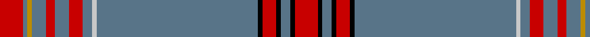

In pattern [RBYBRBRBWBKRKBKR](/stripes/rbybrbrbwbkrkbkr/).

This was sourced from tartans-authority.  It is a [16 stripe tartan](/stripes/stripes16/).

Original link http://www.tartansauthority.com/tartan-ferret/display/8041/

## Thread count
R/10 K2 B4 K2 R6 K2 B70 N2 B4 R6 B6 R4 B6 DY2 B2 R/10

## Palette
Each colour and the base-6 reference it is a variant of.

| Colour | Shade | Base |
|---|---|---|
| B | <code style="background-color:#587488;">#587488</code> `oklch(54.5% 0.045 239.7)` <small>#587488</small> | B <code style="background-color:#2A418A;">#2A418A</code> |
| DY | <code style="background-color:#BC8C00;">#BC8C00</code> `oklch(66.8% 0.137 84.1)` <small>#BC8C00</small> | Y <code style="background-color:#F2BF00;">#F2BF00</code> |
| K | <code style="background-color:#000000;">#000000</code> `oklch(0.0% 0.000 0.0)` <small>#000000</small> | K <code style="background-color:#000000;">#000000</code> |
| N | <code style="background-color:#C8C8C8;">#C8C8C8</code> `oklch(83.3% 0.000 89.9)` <small>#C8C8C8</small> | W <code style="background-color:#F7F7F7;">#F7F7F7</code> |
| R | <code style="background-color:#C80000;">#C80000</code> `oklch(52.3% 0.215 29.2)` <small>#C80000</small> | R <code style="background-color:#CC0000;">#CC0000</code> |

## Nearest tartans

The nearest existing variants by ΔTartan distance, with this tartan at the top so the swatches line up against it.

ΔTartan

Tartan

Sett

—

<a href="/ttd/edit/#slug=r5k1n2k1r3k1n35lb1n2r3n3r2n3lo1n1r5~x2">Crieff High (Corporate)</a> <a class="nn-out" href="/setts/s16/r5k1n2k1r3k1n35lb1n2r3n3r2n3lo1n1r5~x2/" title="open its dictionary page">↗</a>

1.09

<a href="/ttd/edit/#slug=n48r2n12w2o2r2o2w2n2db12r3o3w3n3~x2">Wcwm 1543</a> <a class="nn-out" href="/setts/s14/n48r2n12w2o2r2o2w2n2db12r3o3w3n3~x2/" title="open its dictionary page">↗</a>

1.15

<a href="/ttd/edit/#slug=dp4m2dp2dp4m2dp8m2n2o43n2o43dp2dp8o2">Orkney Heather</a> <a class="nn-out" href="/setts/s14/dp4m2dp2dp4m2dp8m2n2o43n2o43dp2dp8o2/" title="open its dictionary page">↗</a>

1.30

<a href="/ttd/edit/#slug=o52k4ly2k8o78k8lr8k4lr4k4o13ly2o4k4w4k4~x4">Maxem Eyewear (Corporate)</a> <a class="nn-out" href="/setts/s16/o52k4ly2k8o78k8lr8k4lr4k4o13ly2o4k4w4k4~x4/" title="open its dictionary page">↗</a>

1.43

<a href="/ttd/edit/#slug=n38k5y5k5n5w2n12k10dy5k5dy10k9n76k9y2k5~x2">Guildford Town Centre (British Columbia)</a> <a class="nn-out" href="/setts/s16/n38k5y5k5n5w2n12k10dy5k5dy10k9n76k9y2k5~x2/" title="open its dictionary page">↗</a>

1.46

<a href="/ttd/edit/#slug=db3k1r1n24r1n4lo3db1k4r1n8r1k1~x4">Wcwm 1445</a> <a class="nn-out" href="/setts/s13/db3k1r1n24r1n4lo3db1k4r1n8r1k1~x4/" title="open its dictionary page">↗</a>

1.46

<a href="/ttd/edit/#slug=o60g2db4r1db4g2o3w1dp20w1o5db2~x2">Scottish Parliament Official (Corp)</a> <a class="nn-out" href="/setts/s12/o60g2db4r1db4g2o3w1dp20w1o5db2~x2/" title="open its dictionary page">↗</a>

1.48

<a href="/ttd/edit/#slug=o45k10ly2k2w2k2r10o5k1o5w1~x2">Cavalier Green.. Trade Tartan Tartan Number: 1292. Earliest known date: pre 2003 The 10th century Compte de Barcelona, Guifre Pilos, with his dying breath brushed his four bloodstained fingers down his shield leaving four vertical stripes creating the heraldic device of Catalunya. Later the stripes were turned sideways for the Bandera. (flag). The tartan also incorporates white for the snow, green for the flora and blue for the Mediterranean Sea. It was first seen at the Barcelona Olympic Games, 1992. See products available Copyright © Blair Urquhart, Comrie, 2015</a> <a class="nn-out" href="/setts/s11/o45k10ly2k2w2k2r10o5k1o5w1~x2/" title="open its dictionary page">↗</a>

1.55

<a href="/ttd/edit/#slug=r1y20r1y3w1k1w1k4y3k1y2ly1~x2">Stuart/Stewart Authentic Grey</a> <a class="nn-out" href="/setts/s12/r1y20r1y3w1k1w1k4y3k1y2ly1~x2/" title="open its dictionary page">↗</a>

1.58

<a href="/ttd/edit/#slug=n6k1lo6k1n28w1k2w1n16w1r5~x2">Historic Caledonian Railway Enthusiasts', The</a> <a class="nn-out" href="/setts/s11/n6k1lo6k1n28w1k2w1n16w1r5~x2/" title="open its dictionary page">↗</a>

1.62

<a href="/ttd/edit/#slug=n68b5k9lo3k3lb3k3n20r9k3r5lb4">British Caledonian Airways #2</a> <a class="nn-out" href="/setts/s12/n68b5k9lo3k3lb3k3n20r9k3r5lb4/" title="open its dictionary page">↗</a>

## Neighbour map

Every grey dot is one of 14299 variants placed by the first two principal components of the ΔTartan feature space (44% of its variance). Red is this tartan; blue dots are its nearest — click one to open its page.

<svg viewBox="0 0 640 380" role="img" style="max-width:100%;height:auto;border:1px solid #e0e0e0;border-radius:4px;display:block" xmlns="http://www.w3.org/2000/svg"><image href="/nn/cloud.v1.png" width="640" height="380"/><a href="/setts/s14/n48r2n12w2o2r2o2w2n2db12r3o3w3n3~x2/"><circle cx="418.3" cy="90.4" r="4" fill="#3465a4"><title>Wcwm 1543</title></circle></a><a href="/setts/s14/dp4m2dp2dp4m2dp8m2n2o43n2o43dp2dp8o2/"><circle cx="455.9" cy="103.8" r="4" fill="#3465a4"><title>Orkney Heather</title></circle></a><a href="/setts/s16/o52k4ly2k8o78k8lr8k4lr4k4o13ly2o4k4w4k4~x4/"><circle cx="464.4" cy="62.6" r="4" fill="#3465a4"><title>Maxem Eyewear (Corporate)</title></circle></a><a href="/setts/s16/n38k5y5k5n5w2n12k10dy5k5dy10k9n76k9y2k5~x2/"><circle cx="437.4" cy="93.7" r="4" fill="#3465a4"><title>Guildford Town Centre (British Columbia)</title></circle></a><a href="/setts/s13/db3k1r1n24r1n4lo3db1k4r1n8r1k1~x4/"><circle cx="450.0" cy="117.5" r="4" fill="#3465a4"><title>Wcwm 1445</title></circle></a><a href="/setts/s12/o60g2db4r1db4g2o3w1dp20w1o5db2~x2/"><circle cx="428.0" cy="45.2" r="4" fill="#3465a4"><title>Scottish Parliament Official (Corp)</title></circle></a><a href="/setts/s11/o45k10ly2k2w2k2r10o5k1o5w1~x2/"><circle cx="412.3" cy="65.4" r="4" fill="#3465a4"><title>Cavalier Green.. Trade Tartan Tartan Number: 1292. Earliest known date: pre 2003 The 10th century Compte de Barcelona, Guifre Pilos, with his dying breath brushed his four bloodstained fingers down his shield leaving four vertical stripes creating the heraldic device of Catalunya. Later the stripes were turned sideways for the Bandera. (flag). The tartan also incorporates white for the snow, green for the flora and blue for the Mediterranean Sea. It was first seen at the Barcelona Olympic Games, 1992. See products available Copyright © Blair Urquhart, Comrie, 2015</title></circle></a><a href="/setts/s12/r1y20r1y3w1k1w1k4y3k1y2ly1~x2/"><circle cx="437.7" cy="96.6" r="4" fill="#3465a4"><title>Stuart/Stewart Authentic Grey</title></circle></a><a href="/setts/s11/n6k1lo6k1n28w1k2w1n16w1r5~x2/"><circle cx="476.0" cy="117.4" r="4" fill="#3465a4"><title>Historic Caledonian Railway Enthusiasts', The</title></circle></a><a href="/setts/s12/n68b5k9lo3k3lb3k3n20r9k3r5lb4/"><circle cx="405.0" cy="96.4" r="4" fill="#3465a4"><title>British Caledonian Airways #2</title></circle></a><circle cx="460.3" cy="64.0" r="5" fill="#c00000"/></svg>

ID: /setts/s16/r5k1n2k1r3k1n35lb1n2r3n3r2n3lo1n1r5~x2/
