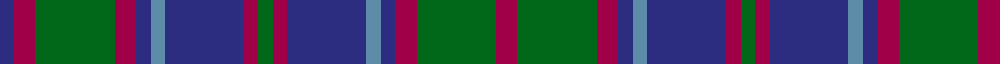

In pattern [BRGRBBBRGRBBBRGR](/patterns/brgrbbbrgrbbbrgr/).

This was sourced from register-of-tartans.  It is a [16 stripes tartan](/stripes/stripes16/).

Original link https://www.tartanregister.gov.uk/tartanDetails.aspx?ref=1662

## Thread count
DB/4 R6 G22 R6 DB4 B4 DB22 R4 G4 R4 DB22 B4 DB4 R6 G22 R/6

## Palette
Each colour and its ΔE from the base-6 reference it is a variant of.

| Colour | Shade | Base | ΔE (OKLab) |
|---|---|---|---|
| B | <code style="background-color:#5C8CA8;">#5C8CA8</code> `#5C8CA8` | B <code style="background-color:#2C4084;">#2C4084</code> | 0.23 |
| DB | <code style="background-color:#2C2C80;">#2C2C80</code> `#2C2C80` | B <code style="background-color:#2C4084;">#2C4084</code> | 0.05 |
| G | <code style="background-color:#006818;">#006818</code> `#006818` | G <code style="background-color:#006400;">#006400</code> | 0.02 |
| R | <code style="background-color:#A00048;">#A00048</code> `#A00048` | R <code style="background-color:#C80000;">#C80000</code> | 0.11 |

## Nearest tartans

The nearest existing variants by ΔTartan distance.

1. [Poulter, Jet Black (Corporate)](/setts/s13/b25k8b8k8b8k46ba46w8ba46k46b46k8b8-b5c5c5c-ba1c1c50-k101010-we0e0e0/) — ΔT 1.14
1. [Scottish Scouts (1922) (Corporate)](/setts/s13/b22ba4b4ba4b4ba24r24ba4r24ba24b22ba4b4-b5c5c5c-ba1c1c1c-r888888/) — ΔT 1.17
1. [MacDonald #2](/setts/s12/b22r4b4r8b30r4k30g30r8g4r4g22-b2c4084-g005020-k101010-rdc0000/) — ΔT 1.19
1. [MacLachlan Hunting](/setts/s15/g24k6g6k6g6k30b30r12b12r12b30g30k6g6k6-b2c2c80-g006818-k101010-rc80000/) — ΔT 1.21
1. [Murray #2](/setts/s13/b24k4b4k4b4k24g24r8g24k24b24k4b8-b2c2c80-g006818-k101010-rc80000/) — ΔT 1.22
1. [New South Wales Scottish Rifles](/setts/s13/b12k2b2k2b2k12g12r4g12k12b12k2b4-b2c2c80-g006818-k101010-rc80000/) — ΔT 1.22
1. [Gordon Regimental Tartan Tartan Number: 214. Earliest known date: 1793 Source references: Cockburn Collection No 10. Logan. Smibert No: 46. Smith No 35. Grant No: 17. Bain. The Setts No: 64. Wilson advertised a range of different quality Gordon tartans in the same colours. e.g. Sergt's Plaids 56 8 8 8 8 58 54 10 54 58 54 8 8. Forsythe, it is said, produced samples with one, two and three yellow stripes. The Duke chose the single stripe. See products available Copyright © Blair Urquhart, Comrie, 2015](/setts/s13/b24k4b4k4b4k24g24y4g24k24b24k4b4-b2c2c80-g006818-k101010-ye8c000/) — ΔT 1.28
1. [Lorne, Louise of](/setts/s15/b4r2g16k4g4k4g4k16b4k4b4k4b16k2g4-b2c2c80-g006818-k101010-rc80000/) — ΔT 1.28
1. [Glenalmond College](/setts/s12/b24k4b4k4b4k24g24r6g24k24b24r6-b2c2c80-g306048-k101010-rc80000/) — ΔT 1.29
1. [Cheape of Torosay (Clan)](/setts/s13/b24k4b4k4b4k24g24ba8g24k24b24k4b8-b2c2c80-ba5c8ca8-g006818-k101010/) — ΔT 1.30

## Neighbour map

Every grey dot is one of 15726 variants placed by the first two principal components of the ΔTartan feature space (44% of its variance). Red is this tartan; blue dots are its nearest — click one to open its page.

<svg viewBox="0 0 640 380" role="img" style="max-width:100%;height:auto;border:1px solid #e0e0e0;border-radius:4px;display:block" xmlns="http://www.w3.org/2000/svg"><image href="/nn/cloud.v1.png" width="640" height="380"/><a href="/setts/s13/b25k8b8k8b8k46ba46w8ba46k46b46k8b8-b5c5c5c-ba1c1c50-k101010-we0e0e0/"><circle cx="196.5" cy="226.1" r="4" fill="#3465a4"><title>Poulter, Jet Black (Corporate)</title></circle></a><a href="/setts/s13/b22ba4b4ba4b4ba24r24ba4r24ba24b22ba4b4-b5c5c5c-ba1c1c1c-r888888/"><circle cx="214.7" cy="230.9" r="4" fill="#3465a4"><title>Scottish Scouts (1922) (Corporate)</title></circle></a><a href="/setts/s12/b22r4b4r8b30r4k30g30r8g4r4g22-b2c4084-g005020-k101010-rdc0000/"><circle cx="166.1" cy="205.8" r="4" fill="#3465a4"><title>MacDonald #2</title></circle></a><a href="/setts/s15/g24k6g6k6g6k30b30r12b12r12b30g30k6g6k6-b2c2c80-g006818-k101010-rc80000/"><circle cx="132.6" cy="219.3" r="4" fill="#3465a4"><title>MacLachlan Hunting</title></circle></a><a href="/setts/s13/b24k4b4k4b4k24g24r8g24k24b24k4b8-b2c2c80-g006818-k101010-rc80000/"><circle cx="172.9" cy="227.9" r="4" fill="#3465a4"><title>Murray #2</title></circle></a><a href="/setts/s13/b12k2b2k2b2k12g12r4g12k12b12k2b4-b2c2c80-g006818-k101010-rc80000/"><circle cx="172.9" cy="227.9" r="4" fill="#3465a4"><title>New South Wales Scottish Rifles</title></circle></a><a href="/setts/s13/b24k4b4k4b4k24g24y4g24k24b24k4b4-b2c2c80-g006818-k101010-ye8c000/"><circle cx="173.3" cy="220.1" r="4" fill="#3465a4"><title>Gordon Regimental Tartan Tartan Number: 214. Earliest known date: 1793 Source references: Cockburn Collection No 10. Logan. Smibert No: 46. Smith No 35. Grant No: 17. Bain. The Setts No: 64. Wilson advertised a range of different quality Gordon tartans in the same colours. e.g. Sergt's Plaids 56 8 8 8 8 58 54 10 54 58 54 8 8. Forsythe, it is said, produced samples with one, two and three yellow stripes. The Duke chose the single stripe. See products available Copyright © Blair Urquhart, Comrie, 2015</title></circle></a><a href="/setts/s15/b4r2g16k4g4k4g4k16b4k4b4k4b16k2g4-b2c2c80-g006818-k101010-rc80000/"><circle cx="201.5" cy="202.6" r="4" fill="#3465a4"><title>Lorne, Louise of</title></circle></a><a href="/setts/s12/b24k4b4k4b4k24g24r6g24k24b24r6-b2c2c80-g306048-k101010-rc80000/"><circle cx="170.0" cy="234.4" r="4" fill="#3465a4"><title>Glenalmond College</title></circle></a><a href="/setts/s13/b24k4b4k4b4k24g24ba8g24k24b24k4b8-b2c2c80-ba5c8ca8-g006818-k101010/"><circle cx="172.9" cy="229.8" r="4" fill="#3465a4"><title>Cheape of Torosay (Clan)</title></circle></a><circle cx="194.2" cy="202.1" r="5" fill="#c00000"/></svg>

ID: /setts/s16/r6g22r6b4ba4b22r4g4r4b22ba4b4r6g22r6b4-b2c2c80-ba5c8ca8-g006818-ra00048/
