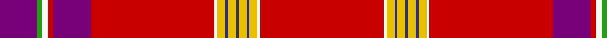

In pattern [BGWRBRWYBYBYBYWR](/patterns/bgwrbrwybybybywr/).

This was sourced from register-of-tartans.  It is a [16 stripes tartan](/stripes/stripes16/).

Original link https://www.tartanregister.gov.uk/tartanDetails.aspx?ref=1190

## Attestations

This cloth appears in 2 source records; the oldest owns this page.

- 01/08/2005 — Firenze ~ Florence (register-of-tartans, [record](https://www.tartanregister.gov.uk/tartanDetails.aspx?ref=1190))
- 2005 August — Firenze ~ Florence (District) (tartans-authority, [record](http://www.tartansauthority.com/tartan-ferret/display/6756/))

## Thread count
P/28 G4 W4 R4 P28 R92 W2 Y6 DB2 Y6 DB2 Y6 DB2 Y6 W2 R/92

## Palette
Each colour and its ΔE from the base-6 reference it is a variant of.

| Colour | Shade | Base | ΔE (OKLab) |
|---|---|---|---|
| DB | <code style="background-color:#2C2C80;">#2C2C80</code> `#2C2C80` | B <code style="background-color:#2C4084;">#2C4084</code> | 0.05 |
| G | <code style="background-color:#289C18;">#289C18</code> `#289C18` | G <code style="background-color:#006400;">#006400</code> | 0.18 |
| P | <code style="background-color:#780078;">#780078</code> `#780078` | B <code style="background-color:#2C4084;">#2C4084</code> | 0.16 |
| R | <code style="background-color:#C80000;">#C80000</code> `#C80000` | R <code style="background-color:#C80000;">#C80000</code> | 0.00 |
| W | <code style="background-color:#F8F8F8;">#F8F8F8</code> `#F8F8F8` | W <code style="background-color:#F4F4F0;">#F4F4F0</code> | 0.01 |
| Y | <code style="background-color:#E8C000;">#E8C000</code> `#E8C000` | Y <code style="background-color:#E8C000;">#E8C000</code> | 0.00 |

## Nearest tartans

The nearest existing variants by ΔTartan distance.

1. [Rathmore (Fashion)](/setts/s12/r80w4r12b4r4b4y4b18wa10ra4wa8y2-b5c5c5c-rc80000-rae87878-wa8ace8-wae0e0e0-yd09800/) — ΔT 1.11
1. [MacFarhadian (Personal)](/setts/s18/r110b2y2r6b14r6y2b2r6g32r6b2y2k6w2g10r6k4-b740074-g006818-k101010-rc80000-wececec-ye8c000/) — ΔT 1.21
1. [Stewart/Stuart, Royal](/setts/s12/r87b8k11y2k3w2k3g13r11k2r5w3-b2c2c80-g006818-k101010-rc80000-we0e0e0-ye8c000/) — ΔT 1.24
1. [MacKintosh/MacPherson](/setts/s13/r72g16y2k12b8k2b2k2b8r22w2k2r2-b3c82af-g005020-k101010-rdc0000-we0e0e0-ye8c000/) — ΔT 1.29
1. [Brittish Lions Corporate Tartan Tartan Number: 6636. Earliest known date: 2005 March Designed for the British Lions rugby team and unveiled in New York in April at the 2005 Tartan Day celebrations. Originally called Lion's Pride this tartan has a shield and other emblems woven into the red squares./Threadcount and colours aren't 100% original. Generated manually./ See products available Copyright © Blair Urquhart, Comrie, 2015](/setts/s12/r140w4r2w8r2k4b18k2y4r2g18w6-b3d4367-g45983c-k080808-rc80000-we0e0e0-ye8c000/) — ΔT 1.30
1. [MacRae of Ardentoul](/setts/s15/r160k2r4k6r4k2r6g36k2w2b4y2b36ba6r24-b2c2c80-ba5c8ca8-g285800-k101010-rc80000-wfcfcfc-ye8c000/) — ΔT 1.35
1. [Unidentified #34](/setts/s18/r132b2ba2r12g60r12ba2b2r6ba32r6b2ba2r108g6ra2r12g12-b2c4084-ba080848-g005020-rdc0000-rac82828/) — ΔT 1.36
1. [Fennell Grandmothers (Personal)](/setts/s20/r110b2y2r6b14r6y2b2r6g32r6b2y2k6w2g10r6k4b4w2-b740074-g006818-k101010-rc80000-wececec-ye8c000/) — ΔT 1.36
1. [Royal Stewart - 1819](/setts/s12/r134b10k14y2k3w3k3g21r11k3r4w2-b2c2c80-g006818-k101010-rc80000-we0e0e0-ye8c000/) — ΔT 1.37
1. [Scotia Village (Corporate)](/setts/s18/r180k2r4b16r4k18k6w2k4y2k6g26r22k2g4k2r10w4-b2c2c80-g006818-k101010-rc80000-we0e0e0-ye8c000/) — ΔT 1.42

## Neighbour map

Every grey dot is one of 15726 variants placed by the first two principal components of the ΔTartan feature space (44% of its variance). Red is this tartan; blue dots are its nearest — click one to open its page.

<svg viewBox="0 0 640 380" role="img" style="max-width:100%;height:auto;border:1px solid #e0e0e0;border-radius:4px;display:block" xmlns="http://www.w3.org/2000/svg"><image href="/nn/cloud.v1.png" width="640" height="380"/><a href="/setts/s12/r80w4r12b4r4b4y4b18wa10ra4wa8y2-b5c5c5c-rc80000-rae87878-wa8ace8-wae0e0e0-yd09800/"><circle cx="405.7" cy="43.6" r="4" fill="#3465a4"><title>Rathmore (Fashion)</title></circle></a><a href="/setts/s18/r110b2y2r6b14r6y2b2r6g32r6b2y2k6w2g10r6k4-b740074-g006818-k101010-rc80000-wececec-ye8c000/"><circle cx="428.7" cy="14.0" r="4" fill="#3465a4"><title>MacFarhadian (Personal)</title></circle></a><a href="/setts/s12/r87b8k11y2k3w2k3g13r11k2r5w3-b2c2c80-g006818-k101010-rc80000-we0e0e0-ye8c000/"><circle cx="447.1" cy="32.4" r="4" fill="#3465a4"><title>Stewart/Stuart, Royal</title></circle></a><a href="/setts/s13/r72g16y2k12b8k2b2k2b8r22w2k2r2-b3c82af-g005020-k101010-rdc0000-we0e0e0-ye8c000/"><circle cx="382.7" cy="40.8" r="4" fill="#3465a4"><title>MacKintosh/MacPherson</title></circle></a><a href="/setts/s12/r140w4r2w8r2k4b18k2y4r2g18w6-b3d4367-g45983c-k080808-rc80000-we0e0e0-ye8c000/"><circle cx="469.2" cy="15.6" r="4" fill="#3465a4"><title>Brittish Lions Corporate Tartan Tartan Number: 6636. Earliest known date: 2005 March Designed for the British Lions rugby team and unveiled in New York in April at the 2005 Tartan Day celebrations. Originally called Lion's Pride this tartan has a shield and other emblems woven into the red squares./Threadcount and colours aren't 100% original. Generated manually./ See products available Copyright © Blair Urquhart, Comrie, 2015</title></circle></a><a href="/setts/s15/r160k2r4k6r4k2r6g36k2w2b4y2b36ba6r24-b2c2c80-ba5c8ca8-g285800-k101010-rc80000-wfcfcfc-ye8c000/"><circle cx="437.6" cy="14.0" r="4" fill="#3465a4"><title>MacRae of Ardentoul</title></circle></a><a href="/setts/s18/r132b2ba2r12g60r12ba2b2r6ba32r6b2ba2r108g6ra2r12g12-b2c4084-ba080848-g005020-rdc0000-rac82828/"><circle cx="476.7" cy="35.5" r="4" fill="#3465a4"><title>Unidentified #34</title></circle></a><a href="/setts/s20/r110b2y2r6b14r6y2b2r6g32r6b2y2k6w2g10r6k4b4w2-b740074-g006818-k101010-rc80000-wececec-ye8c000/"><circle cx="411.6" cy="14.0" r="4" fill="#3465a4"><title>Fennell Grandmothers (Personal)</title></circle></a><a href="/setts/s12/r134b10k14y2k3w3k3g21r11k3r4w2-b2c2c80-g006818-k101010-rc80000-we0e0e0-ye8c000/"><circle cx="483.7" cy="23.6" r="4" fill="#3465a4"><title>Royal Stewart - 1819</title></circle></a><a href="/setts/s18/r180k2r4b16r4k18k6w2k4y2k6g26r22k2g4k2r10w4-b2c2c80-g006818-k101010-rc80000-we0e0e0-ye8c000/"><circle cx="475.2" cy="14.0" r="4" fill="#3465a4"><title>Scotia Village (Corporate)</title></circle></a><circle cx="435.5" cy="25.2" r="5" fill="#c00000"/></svg>

ID: /setts/s16/r92w2y6b2y6b2y6b2y6w2r92ba28r4w4g4ba28-b2c2c80-ba780078-g289c18-rc80000-wf8f8f8-ye8c000/
