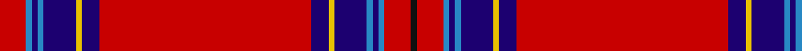

**Bands:** [KRBBBBYBRBYBBBBR](/stripes/krbbbbybrbybbbbr/) · **Stripes:** [K R T DB T DB LY DB R DB LY DB T DB T R](/stripes/stripes16/) K R T DB T DB LY DB R DB LY DB T DB T R

This was sourced from register-of-tartans.  It is a [16 band tartan](/bands/bands16/).

Original link https://www.tartanregister.gov.uk/tartanDetails.aspx?ref=1914

## Register references

External register numbers recorded for this tartan.

- Scottish Register of Tartans: [1914](https://www.tartanregister.gov.uk/tartanDetails.aspx?ref=1914)
- Scottish Tartans Authority (ITI): 2611
- Scottish Tartans World Register: 2611

## Thread count
R/18 B4 DB4 B4 DB22 Y4 DB12 R144 DB12 Y4 DB22 B4 DB4 B4 R18 K/4

## Palette
Each colour and its ΔE from the base-6 reference it is a variant of.

| Colour | Shade | Base | ΔE (OKLab) |
|---|---|---|---|
| B | <code style="background-color:#2888C4;">#2888C4</code> `#2888C4` | B <code style="background-color:#2A418A;">#2A418A</code> | 0.21 |
| DB | <code style="background-color:#1C0070;">#1C0070</code> `#1C0070` | B <code style="background-color:#2A418A;">#2A418A</code> | 0.14 |
| K | <code style="background-color:#101010;">#101010</code> `#101010` | K <code style="background-color:#000000;">#000000</code> | 0.17 |
| R | <code style="background-color:#C80000;">#C80000</code> `#C80000` | R <code style="background-color:#CC0000;">#CC0000</code> | 0.01 |
| Y | <code style="background-color:#E8C000;">#E8C000</code> `#E8C000` | Y <code style="background-color:#F2BF00;">#F2BF00</code> | 0.02 |

## Nearest tartans

The nearest existing variants by ΔTartan distance.

1. [Inverness](/setts/s14/r36db3w1db6g1k1g1r9~x4/) — ΔT 0.57
1. [Day (2016)](/setts/s13/r60k1r2ly1dg6db6r2lb3r2db6dg6ly1k5~x2/) — ΔT 1.14
1. [Trevison](/setts/s12/r47k1r6w3dt2w3r6k13g2w2r2k13~x2/) — ΔT 1.41
1. [MacFarlane Red](/setts/s14/r98k3g21w5r5k2r5w5g2db21k7r7w8g4/) — ΔT 1.43
1. [Heritage Plaid](/setts/s11/r44db3k6lo2k2lo2k10r5k2r3w2~x2/) — ΔT 1.46
1. [University of Alabama (Corporate)](/setts/s14/m32k2n3w4n3k2m22k1m5k2w6k2m4w5~x2/) — ΔT 1.47
1. [Hilton Champion Corporate Golf Tartan Tartan Number: 2336. Earliest known date: c.1970 Originally called Hilton Champion, this tartan was designed by Kinloch Anderson for the officials and winning jacket for the Hilton-sponsored Heritage Classic golf tournament. The name was changed to Heritage Plaid in September 2000 See products available Copyright © Blair Urquhart, Comrie, 2015](/setts/s11/r44t3k6k2k2k2k10r5k2r3w2~x2/) — ΔT 1.51
1. [MacKintosh/MacPherson](/setts/s13/r36dg8ly1k6t4k1t1k1t4r11w1k1r1~x2/) — ΔT 1.54
1. [Melrose (District)](/setts/s13/r64k2r2k6g2k2g2o2g6r5g2k6ly2~x2/) — ΔT 1.58
1. [MacKintosh, MacPherson](/setts/s13/r36g8ly1k6t4k1t1k1t4r11w1k1r1~x2/) — ΔT 1.58

## Neighbour map

Every grey dot is one of 14299 variants placed by the first two principal components of the ΔTartan feature space (44% of its variance). Red is this tartan; blue dots are its nearest — click one to open its page.

<svg viewBox="0 0 640 380" role="img" style="max-width:100%;height:auto;border:1px solid #e0e0e0;border-radius:4px;display:block" xmlns="http://www.w3.org/2000/svg"><image href="/nn/cloud.v1.png" width="640" height="380"/><a href="/setts/s14/r36db3w1db6g1k1g1r9~x4/"><circle cx="426.8" cy="51.5" r="4" fill="#3465a4"><title>Inverness</title></circle></a><a href="/setts/s13/r60k1r2ly1dg6db6r2lb3r2db6dg6ly1k5~x2/"><circle cx="426.3" cy="18.0" r="4" fill="#3465a4"><title>Day (2016)</title></circle></a><a href="/setts/s12/r47k1r6w3dt2w3r6k13g2w2r2k13~x2/"><circle cx="393.5" cy="50.1" r="4" fill="#3465a4"><title>Trevison</title></circle></a><a href="/setts/s14/r98k3g21w5r5k2r5w5g2db21k7r7w8g4/"><circle cx="376.4" cy="28.9" r="4" fill="#3465a4"><title>MacFarlane Red</title></circle></a><a href="/setts/s11/r44db3k6lo2k2lo2k10r5k2r3w2~x2/"><circle cx="407.7" cy="81.3" r="4" fill="#3465a4"><title>Heritage Plaid</title></circle></a><a href="/setts/s14/m32k2n3w4n3k2m22k1m5k2w6k2m4w5~x2/"><circle cx="429.5" cy="84.1" r="4" fill="#3465a4"><title>University of Alabama (Corporate)</title></circle></a><a href="/setts/s11/r44t3k6k2k2k2k10r5k2r3w2~x2/"><circle cx="399.1" cy="78.5" r="4" fill="#3465a4"><title>Hilton Champion Corporate Golf Tartan Tartan Number: 2336. Earliest known date: c.1970 Originally called Hilton Champion, this tartan was designed by Kinloch Anderson for the officials and winning jacket for the Hilton-sponsored Heritage Classic golf tournament. The name was changed to Heritage Plaid in September 2000 See products available Copyright © Blair Urquhart, Comrie, 2015</title></circle></a><a href="/setts/s13/r36dg8ly1k6t4k1t1k1t4r11w1k1r1~x2/"><circle cx="384.7" cy="39.9" r="4" fill="#3465a4"><title>MacKintosh/MacPherson</title></circle></a><a href="/setts/s13/r64k2r2k6g2k2g2o2g6r5g2k6ly2~x2/"><circle cx="473.5" cy="51.2" r="4" fill="#3465a4"><title>Melrose (District)</title></circle></a><a href="/setts/s13/r36g8ly1k6t4k1t1k1t4r11w1k1r1~x2/"><circle cx="372.1" cy="38.3" r="4" fill="#3465a4"><title>MacKintosh, MacPherson</title></circle></a><circle cx="422.4" cy="38.4" r="5" fill="#c00000"/></svg>

ID: /setts/s16/r9t2db2t2db11ly2db6r72db6ly2db11t2db2t2r9k2~x2/
