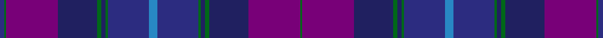

In pattern [BGBBGBGBBBGBGBBG](/stripes/bgbbgbgbbbgbgbbg/).

This was sourced from register-of-tartans.  It is a [16 stripe tartan](/stripes/stripes16/).

Original link https://www.tartanregister.gov.uk/tartanDetails.aspx?ref=3862

## Also known as

This cloth is also recorded under:

- Spirit of Alba Fashion Weavers

## Attestations

This cloth appears in 2 source records; the oldest owns this page.

- 19/09/2001 — Spirit of Alba (register-of-tartans, [record](https://www.tartanregister.gov.uk/tartanDetails.aspx?ref=3862))
- undated — Spirit of Alba Fashion Weavers Tartan Tartan Number: 3904. Earliest known date: 2001 Designed by Claire Donaldson of the House of Edgar for Robert Nicol of Perth & Dunfermline. See products available Copyright © Blair Urquhart, Comrie, 2015 (house-of-tartan, [record](http://www.house-of-tartan.scotland.net/house/TartanViewjs.asp?colr=Def&tnam=3904))

## Register references

External register numbers recorded for this tartan.

- Scottish Register of Tartans: [3862](https://www.tartanregister.gov.uk/tartanDetails.aspx?ref=3862)
- Scottish Tartans Authority (ITI): 3904
- Scottish Tartans World Register: 2846

## Thread count
DBa/4 G2 P48 DB36 G4 DB4 G2 DBa38 B8 DBa38 G2 DB4 G4 DB36 P48 G/2

## Palette
Each colour and the base-6 reference it is a variant of.

| Colour | Shade | Base |
|---|---|---|
| B | <code style="background-color:#2888C4;">#2888C4</code> `oklch(60.1% 0.125 241.5)` <small>#2888C4</small> | B <code style="background-color:#2A418A;">#2A418A</code> |
| DB | <code style="background-color:#202060;">#202060</code> `oklch(28.9% 0.111 276.9)` <small>#202060</small> | B <code style="background-color:#2A418A;">#2A418A</code> |
| DBa | <code style="background-color:#2C2C80;">#2C2C80</code> `oklch(35.0% 0.138 276.6)` <small>#2C2C80</small> | B <code style="background-color:#2A418A;">#2A418A</code> |
| G | <code style="background-color:#006818;">#006818</code> `oklch(45.0% 0.142 145.0)` <small>#006818</small> | G <code style="background-color:#006100;">#006100</code> |
| P | <code style="background-color:#780078;">#780078</code> `oklch(40.2% 0.185 328.4)` <small>#780078</small> | B <code style="background-color:#2A418A;">#2A418A</code> |

## Nearest tartans

The nearest existing variants by ΔTartan distance.

1. [Spirit of Alba (Fashion)](/setts/s9/t4db19g1db2g2db18dp24g1db2~x2/) — ΔT 1.24
1. [Highland Cathedral (Fashion)](/setts/s15/r4g1db22db2dp2r1dp2r4db1dp10r2db20dp1db2ly2~x2/) — ΔT 1.39
1. [Rangers F. C. Corporate Tartan Tartan Number: 2170. Earliest known date: 1994 The original tartan was designed in 1989 by Tartan Sportswear. Chris Aitken, designer for Geoffrey (Tailor) Highland Crafts, Edinburgh, increased the size of the sett and changed the shade of blue to suit the Rangers team colours. See products available Copyright © Blair Urquhart, Comrie, 2015](/setts/s20/db14r3db14k12db40k12db2k2db2k2db7r3db7k2db2k2db2k12db40k12~x2/) — ΔT 1.70
1. [Highland Cathedral](/setts/s28/r4g1db22db2dp2r1dp2r4db1dp10r2db20dp1db2ly2~x2/) — ΔT 1.78
1. [Rangers F. C. Corporate Tartan Tartan Number: 2062. Earliest known date: 1989 First of a new range of football club tartans designed by the Glasgow kiltmakers, Messrs John MacGregor, who formed a new company, Tartan Sportswear, to develop the idea. The Glasgow Rangers Tartan was launched at September first's game with Ally McCoist in full Highland Dress. See products available Copyright © Blair Urquhart, Comrie, 2015](/setts/s11/r3db12k12db32k12db2k2db2k2db4r3/) — ΔT 1.95
1. [Timmins (Personal)](/setts/s10/r4dt2dp14dt12ly1db32dt12db14dt2g4~x2/) — ΔT 1.97
1. [Scottish Canals Corporate Tartan Tartan Number: 3916. Earliest known date: 2001 Designed by Claire Donaldson of House of Edgar for BWB. Initially called Highland Canals, later changed (April 2002) to Caledonian Canal and then in January 2003 to Scottish Canals. See products available Copyright © Blair Urquhart, Comrie, 2015](/setts/s12/g2db1db29db2g9db26ly2~x2/) — ΔT 2.00
1. [Benedictus Blue (Personal)](/setts/s14/k16t6db12dt4dp4dt4db35dt40db4dt4db4dt6dp4m6/) — ΔT 2.03
1. [Strathtummel (District?)](/setts/s14/db37dp2db2dp3k13dp10w2dp10y1dp2y2dp2y9dp13~x2/) — ΔT 2.11
1. [Newlands, Charlie (Personal)](/setts/s11/db6k2dp9lb1dp9k2dt4k6dt24w1db6~x2/) — ΔT 2.13

## Neighbour map

Every grey dot is one of 14299 variants placed by the first two principal components of the ΔTartan feature space (44% of its variance). Red is this tartan; blue dots are its nearest — click one to open its page.

<svg viewBox="0 0 640 380" role="img" style="max-width:100%;height:auto;border:1px solid #e0e0e0;border-radius:4px;display:block" xmlns="http://www.w3.org/2000/svg"><image href="/nn/cloud.v1.png" width="640" height="380"/><a href="/setts/s9/t4db19g1db2g2db18dp24g1db2~x2/"><circle cx="296.6" cy="180.9" r="4" fill="#3465a4"><title>Spirit of Alba (Fashion)</title></circle></a><a href="/setts/s15/r4g1db22db2dp2r1dp2r4db1dp10r2db20dp1db2ly2~x2/"><circle cx="266.6" cy="129.5" r="4" fill="#3465a4"><title>Highland Cathedral (Fashion)</title></circle></a><a href="/setts/s20/db14r3db14k12db40k12db2k2db2k2db7r3db7k2db2k2db2k12db40k12~x2/"><circle cx="343.5" cy="175.5" r="4" fill="#3465a4"><title>Rangers F. C. Corporate Tartan Tartan Number: 2170. Earliest known date: 1994 The original tartan was designed in 1989 by Tartan Sportswear. Chris Aitken, designer for Geoffrey (Tailor) Highland Crafts, Edinburgh, increased the size of the sett and changed the shade of blue to suit the Rangers team colours. See products available Copyright © Blair Urquhart, Comrie, 2015</title></circle></a><a href="/setts/s28/r4g1db22db2dp2r1dp2r4db1dp10r2db20dp1db2ly2~x2/"><circle cx="287.2" cy="118.4" r="4" fill="#3465a4"><title>Highland Cathedral</title></circle></a><a href="/setts/s11/r3db12k12db32k12db2k2db2k2db4r3/"><circle cx="312.5" cy="205.2" r="4" fill="#3465a4"><title>Rangers F. C. Corporate Tartan Tartan Number: 2062. Earliest known date: 1989 First of a new range of football club tartans designed by the Glasgow kiltmakers, Messrs John MacGregor, who formed a new company, Tartan Sportswear, to develop the idea. The Glasgow Rangers Tartan was launched at September first's game with Ally McCoist in full Highland Dress. See products available Copyright © Blair Urquhart, Comrie, 2015</title></circle></a><a href="/setts/s10/r4dt2dp14dt12ly1db32dt12db14dt2g4~x2/"><circle cx="342.1" cy="169.0" r="4" fill="#3465a4"><title>Timmins (Personal)</title></circle></a><a href="/setts/s12/g2db1db29db2g9db26ly2~x2/"><circle cx="376.5" cy="198.2" r="4" fill="#3465a4"><title>Scottish Canals Corporate Tartan Tartan Number: 3916. Earliest known date: 2001 Designed by Claire Donaldson of House of Edgar for BWB. Initially called Highland Canals, later changed (April 2002) to Caledonian Canal and then in January 2003 to Scottish Canals. See products available Copyright © Blair Urquhart, Comrie, 2015</title></circle></a><a href="/setts/s14/k16t6db12dt4dp4dt4db35dt40db4dt4db4dt6dp4m6/"><circle cx="279.8" cy="195.2" r="4" fill="#3465a4"><title>Benedictus Blue (Personal)</title></circle></a><a href="/setts/s14/db37dp2db2dp3k13dp10w2dp10y1dp2y2dp2y9dp13~x2/"><circle cx="310.6" cy="125.1" r="4" fill="#3465a4"><title>Strathtummel (District?)</title></circle></a><a href="/setts/s11/db6k2dp9lb1dp9k2dt4k6dt24w1db6~x2/"><circle cx="308.6" cy="184.2" r="4" fill="#3465a4"><title>Newlands, Charlie (Personal)</title></circle></a><circle cx="301.8" cy="165.5" r="5" fill="#c00000"/></svg>

ID: /setts/s16/t4db19g1db2g2db18dp24g1db2~x2/
