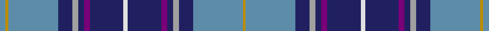

In pattern [BYBBYBBBWBBBYBBY](/stripes/bybbybbbwbbbybby/).

This was sourced from register-of-tartans.  It is a [16 stripe tartan](/stripes/stripes16/).

Original link https://www.tartanregister.gov.uk/tartanDetails.aspx?ref=1678

## Register references

External register numbers recorded for this tartan.

- Scottish Register of Tartans: [1678](https://www.tartanregister.gov.uk/tartanDetails.aspx?ref=1678)
- Scottish Tartans Authority (ITI): 6406

## Thread count
B/8 DY4 B68 DB20 N8 DB8 P8 DB46 LN6 DB46 P8 DB8 N8 DB20 B68 DY/4

## Palette
Each colour and the base-6 reference it is a variant of.

| Colour | Shade | Base |
|---|---|---|
| B | <code style="background-color:#5C8CA8;">#5C8CA8</code> `oklch(61.7% 0.067 235.0)` <small>#5C8CA8</small> | B <code style="background-color:#2A418A;">#2A418A</code> |
| DB | <code style="background-color:#202060;">#202060</code> `oklch(28.9% 0.111 276.9)` <small>#202060</small> | B <code style="background-color:#2A418A;">#2A418A</code> |
| DR | <code style="background-color:#901C38;">#901C38</code> `oklch(43.2% 0.150 13.1)` <small>#901C38</small> | R <code style="background-color:#CC0000;">#CC0000</code> |
| DY | <code style="background-color:#BC8C00;">#BC8C00</code> `oklch(66.8% 0.137 84.1)` <small>#BC8C00</small> | Y <code style="background-color:#F2BF00;">#F2BF00</code> |
| LN | <code style="background-color:#E0E0E0;">#E0E0E0</code> `oklch(90.7% 0.000 89.9)` <small>#E0E0E0</small> | W <code style="background-color:#F7F7F7;">#F7F7F7</code> |
| N | <code style="background-color:#A0A0A0;">#A0A0A0</code> `oklch(70.6% 0.000 89.9)` <small>#A0A0A0</small> | Y <code style="background-color:#F2BF00;">#F2BF00</code> |
| P | <code style="background-color:#780078;">#780078</code> `oklch(40.2% 0.185 328.4)` <small>#780078</small> | B <code style="background-color:#2A418A;">#2A418A</code> |

## Nearest tartans

The nearest existing variants by ΔTartan distance.

1. [Matchpoint Dress](/setts/s15/db6ly2o24db4o8db6o6db6o3db10n14db4r3db34lb4/) — ΔT 1.02
1. [Spirit of Fife](/setts/s14/dg10w2dt3g2m14dt26dg2dt6~x2/) — ΔT 1.09
1. [Heirloom Blue Alba (Fashion)](/setts/s9/t4lo2t34db10lr4db4dp4db23w3~x2/) — ΔT 1.19
1. [Historic Scotland (1998) (Corporate)](/setts/s12/db8w8db4dp4db36dp4db4o26db2o26g2db5/) — ΔT 1.23
1. [McCartney (Evening/Night)](/setts/s11/db4g2db24g8t2r2t2ly2t10db2w3~x2/) — ΔT 1.23
1. [Historic Scotland (1998)](/setts/s22/db8w8db4dp4db36dp4db4o26db2o26g2db5/) — ΔT 1.28
1. [Leith](/setts/s13/t5k2t17db3t3db22t3g22t3db3t27k2r4~x2/) — ΔT 1.29
1. [Royal Air Force Regimental Tartan Tartan Number: 2123. Earliest known date: 1988 The Royal Air Force initially declined to approve this tartan for members of the Air Services. However the tartan was worn by Scottish ex-servicemen and those who have served in Scotland and became quite popular. In 2002 it was officially adopted by the RAF. See products available Copyright © Blair Urquhart, Comrie, 2015](/setts/s11/w4db8r3db25k13db4t29db3t8db2r3~x2/) — ΔT 1.29
1. [McCartney (Night)](/setts/s11/db4g2db24g8b2r2b2ly2b10db2w3~x2/) — ΔT 1.29
1. [Tartan Army](/setts/s21/b22db2b4db2b4db8w2db2w2db10r5ly2r5db10w2db2w2db8b18db2b4~x2/) — ΔT 1.34

## Neighbour map

Every grey dot is one of 14299 variants placed by the first two principal components of the ΔTartan feature space (44% of its variance). Red is this tartan; blue dots are its nearest — click one to open its page.

<svg viewBox="0 0 640 380" role="img" style="max-width:100%;height:auto;border:1px solid #e0e0e0;border-radius:4px;display:block" xmlns="http://www.w3.org/2000/svg"><image href="/nn/cloud.v1.png" width="640" height="380"/><a href="/setts/s15/db6ly2o24db4o8db6o6db6o3db10n14db4r3db34lb4/"><circle cx="276.7" cy="127.6" r="4" fill="#3465a4"><title>Matchpoint Dress</title></circle></a><a href="/setts/s14/dg10w2dt3g2m14dt26dg2dt6~x2/"><circle cx="247.5" cy="134.5" r="4" fill="#3465a4"><title>Spirit of Fife</title></circle></a><a href="/setts/s9/t4lo2t34db10lr4db4dp4db23w3~x2/"><circle cx="238.0" cy="130.4" r="4" fill="#3465a4"><title>Heirloom Blue Alba (Fashion)</title></circle></a><a href="/setts/s12/db8w8db4dp4db36dp4db4o26db2o26g2db5/"><circle cx="255.8" cy="128.7" r="4" fill="#3465a4"><title>Historic Scotland (1998) (Corporate)</title></circle></a><a href="/setts/s11/db4g2db24g8t2r2t2ly2t10db2w3~x2/"><circle cx="226.5" cy="130.5" r="4" fill="#3465a4"><title>McCartney (Evening/Night)</title></circle></a><a href="/setts/s22/db8w8db4dp4db36dp4db4o26db2o26g2db5/"><circle cx="231.5" cy="102.5" r="4" fill="#3465a4"><title>Historic Scotland (1998)</title></circle></a><a href="/setts/s13/t5k2t17db3t3db22t3g22t3db3t27k2r4~x2/"><circle cx="213.6" cy="128.0" r="4" fill="#3465a4"><title>Leith</title></circle></a><a href="/setts/s11/w4db8r3db25k13db4t29db3t8db2r3~x2/"><circle cx="174.9" cy="135.1" r="4" fill="#3465a4"><title>Royal Air Force Regimental Tartan Tartan Number: 2123. Earliest known date: 1988 The Royal Air Force initially declined to approve this tartan for members of the Air Services. However the tartan was worn by Scottish ex-servicemen and those who have served in Scotland and became quite popular. In 2002 it was officially adopted by the RAF. See products available Copyright © Blair Urquhart, Comrie, 2015</title></circle></a><a href="/setts/s11/db4g2db24g8b2r2b2ly2b10db2w3~x2/"><circle cx="231.3" cy="128.8" r="4" fill="#3465a4"><title>McCartney (Night)</title></circle></a><a href="/setts/s21/b22db2b4db2b4db8w2db2w2db10r5ly2r5db10w2db2w2db8b18db2b4~x2/"><circle cx="221.0" cy="138.7" r="4" fill="#3465a4"><title>Tartan Army</title></circle></a><circle cx="233.2" cy="112.2" r="5" fill="#c00000"/></svg>

ID: /setts/s16/t4lo2t34db10lr4db4dp4db23w3~x2/
