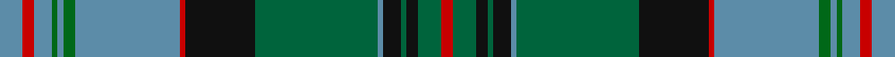

This page is one **sett** — a single exact thread-count. It belongs to the [tartan](/tartans/b4r2b3g1b1g2b18r1k12ga21b1k3ga1k2ga4r2/)
(the same proportion at any scale), whose colour order is pattern [BRBGBGBRKGBKGKGR](/stripes/brbgbgbrkgbkgkgr/).

Sourced from register-of-tartans.  It is a [16 stripe tartan](/stripes/stripes16/).

Original link https://www.tartanregister.gov.uk/tartanDetails.aspx?ref=3052

2 attestations — the source records this cloth was collapsed from (oldest owns this page)

<ul>
<li>01/01/1997 — Munster (register-of-tartans, <a href="https://www.tartanregister.gov.uk/tartanDetails.aspx?ref=3052">record</a>)</li>
<li>1997 — Munster (District) (tartans-authority, <a href="http://www.tartansauthority.com/tartan-ferret/display/4061/">record</a>)</li>
</ul>

## Register references

External register numbers recorded for this tartan.

- Scottish Register of Tartans: [3052](https://www.tartanregister.gov.uk/tartanDetails.aspx?ref=3052)
- Scottish Tartans Authority (ITI): 4061

## Thread count
B/8 R4 B6 G2 B2 G4 B36 R2 K24 Ga42 B2 K6 Ga2 K4 Ga8 R/4

## Palette
Each colour and the base-6 reference it is a variant of.

| Colour | Shade | Base |
|---|---|---|
| B | <code style="background-color:#5C8CA8;">#5C8CA8</code> `oklch(61.7% 0.067 235.0)` <small>#5C8CA8</small> | B <code style="background-color:#2A418A;">#2A418A</code> |
| G | <code style="background-color:#006818;">#006818</code> `oklch(45.0% 0.142 145.0)` <small>#006818</small> | G <code style="background-color:#006100;">#006100</code> |
| Ga | <code style="background-color:#00643C;">#00643C</code> `oklch(44.3% 0.104 157.7)` <small>#00643C</small> | G <code style="background-color:#006100;">#006100</code> |
| K | <code style="background-color:#101010;">#101010</code> `oklch(17.3% 0.000 89.9)` <small>#101010</small> | K <code style="background-color:#000000;">#000000</code> |
| R | <code style="background-color:#C80000;">#C80000</code> `oklch(52.3% 0.215 29.2)` <small>#C80000</small> | R <code style="background-color:#CC0000;">#CC0000</code> |

## Nearest tartans

The nearest existing variants by ΔTartan distance, with this tartan at the top so the swatches line up against it.

ΔTartan

Tartan

Sett

—

<a href="/ttd/edit/#slug=t4r2t3g1t1g2t18r1k12g21t1k3g1k2g4r2~x2">Munster</a> <a class="nn-out" href="/setts/s16/t4r2t3g1t1g2t18r1k12g21t1k3g1k2g4r2~x2/" title="open its dictionary page">↗</a>

0.61

<a href="/ttd/edit/#slug=t2k1dg15w2dg15k1t2k1r2k20t2k2t2k2t25k1~x2">Rankin, John (Personal)</a> <a class="nn-out" href="/setts/s16/t2k1dg15w2dg15k1t2k1r2k20t2k2t2k2t25k1~x2/" title="open its dictionary page">↗</a>

0.86

<a href="/ttd/edit/#slug=dt36k5r2k5g15r2g10w2g10r2g15k5r2k5dt10r2dt2r2dt4w2~x2">Ranking Corporate Tartan Tartan Number: 3242. Earliest known date: 2002 Personal/Family tartan for the Ranking family and its close relatives as determined by the current head of the family. A minor variation of Rankine tartan. See products available Copyright © Blair Urquhart, Comrie, 2015</a> <a class="nn-out" href="/setts/s20/dt36k5r2k5g15r2g10w2g10r2g15k5r2k5dt10r2dt2r2dt4w2~x2/" title="open its dictionary page">↗</a>

0.90

<a href="/ttd/edit/#slug=g3n1g1n12k2n2k2n3k12g24w3~x2">Selby (Name)</a> <a class="nn-out" href="/setts/s11/g3n1g1n12k2n2k2n3k12g24w3~x2/" title="open its dictionary page">↗</a>

0.91

<a href="/ttd/edit/#slug=db4ly2g24ly2k12db3k2db2k2db14r1db1r3~x2">Baron of Greencastle Htg (Personal)</a> <a class="nn-out" href="/setts/s13/db4ly2g24ly2k12db3k2db2k2db14r1db1r3~x2/" title="open its dictionary page">↗</a>

0.92

<a href="/ttd/edit/#slug=g3r2r1db18r2g8r4t1db8r2g18r2r1db3t1~x2">Glen Orchy</a> <a class="nn-out" href="/setts/s15/g3r2r1db18r2g8r4t1db8r2g18r2r1db3t1~x2/" title="open its dictionary page">↗</a>

0.95

<a href="/ttd/edit/#slug=g19r1g2r2g15r1dt13w1db2r2db21r1w3~x2">Ontario (Official)</a> <a class="nn-out" href="/setts/s13/g19r1g2r2g15r1dt13w1db2r2db21r1w3~x2/" title="open its dictionary page">↗</a>

1.08

<a href="/ttd/edit/#slug=db2lp4r2g24db4g2db4k10lp4db2lp4g8db1k1db22lp4db2r2~x2">Couper of Gogar</a> <a class="nn-out" href="/setts/s18/db2lp4r2g24db4g2db4k10lp4db2lp4g8db1k1db22lp4db2r2~x2/" title="open its dictionary page">↗</a>

1.10

<a href="/ttd/edit/#slug=r2lp4db2g24db4g2db4k10lp4db2lp4g8db1k2db22lp4db2r2~x2">Couper of Gogar (Clan)</a> <a class="nn-out" href="/setts/s18/r2lp4db2g24db4g2db4k10lp4db2lp4g8db1k2db22lp4db2r2~x2/" title="open its dictionary page">↗</a>

1.10

<a href="/ttd/edit/#slug=k28r2n9g2n4g20k1g1w2g1k1g20n4g2n9r1n3~x2">Blairlogie (District)</a> <a class="nn-out" href="/setts/s17/k28r2n9g2n4g20k1g1w2g1k1g20n4g2n9r1n3~x2/" title="open its dictionary page">↗</a>

1.11

<a href="/ttd/edit/#slug=g3db1g1db12k2db2k2db3k12g24w3~x2">Selby</a> <a class="nn-out" href="/setts/s11/g3db1g1db12k2db2k2db3k12g24w3~x2/" title="open its dictionary page">↗</a>

## Neighbour map

Every grey dot is one of 14299 variants placed by the first two principal components of the ΔTartan feature space (44% of its variance). Red is this tartan; blue dots are its nearest — click one to open its page.

<svg viewBox="0 0 640 380" role="img" style="max-width:100%;height:auto;border:1px solid #e0e0e0;border-radius:4px;display:block" xmlns="http://www.w3.org/2000/svg"><image href="/nn/cloud.v1.png" width="640" height="380"/><a href="/setts/s16/t2k1dg15w2dg15k1t2k1r2k20t2k2t2k2t25k1~x2/"><circle cx="225.7" cy="100.5" r="4" fill="#3465a4"><title>Rankin, John (Personal)</title></circle></a><a href="/setts/s20/dt36k5r2k5g15r2g10w2g10r2g15k5r2k5dt10r2dt2r2dt4w2~x2/"><circle cx="219.1" cy="120.4" r="4" fill="#3465a4"><title>Ranking Corporate Tartan Tartan Number: 3242. Earliest known date: 2002 Personal/Family tartan for the Ranking family and its close relatives as determined by the current head of the family. A minor variation of Rankine tartan. See products available Copyright © Blair Urquhart, Comrie, 2015</title></circle></a><a href="/setts/s11/g3n1g1n12k2n2k2n3k12g24w3~x2/"><circle cx="223.9" cy="128.0" r="4" fill="#3465a4"><title>Selby (Name)</title></circle></a><a href="/setts/s13/db4ly2g24ly2k12db3k2db2k2db14r1db1r3~x2/"><circle cx="207.0" cy="116.7" r="4" fill="#3465a4"><title>Baron of Greencastle Htg (Personal)</title></circle></a><a href="/setts/s15/g3r2r1db18r2g8r4t1db8r2g18r2r1db3t1~x2/"><circle cx="241.6" cy="126.6" r="4" fill="#3465a4"><title>Glen Orchy</title></circle></a><a href="/setts/s13/g19r1g2r2g15r1dt13w1db2r2db21r1w3~x2/"><circle cx="237.1" cy="122.7" r="4" fill="#3465a4"><title>Ontario (Official)</title></circle></a><a href="/setts/s18/db2lp4r2g24db4g2db4k10lp4db2lp4g8db1k1db22lp4db2r2~x2/"><circle cx="198.5" cy="97.2" r="4" fill="#3465a4"><title>Couper of Gogar</title></circle></a><a href="/setts/s18/r2lp4db2g24db4g2db4k10lp4db2lp4g8db1k2db22lp4db2r2~x2/"><circle cx="194.9" cy="98.2" r="4" fill="#3465a4"><title>Couper of Gogar (Clan)</title></circle></a><a href="/setts/s17/k28r2n9g2n4g20k1g1w2g1k1g20n4g2n9r1n3~x2/"><circle cx="264.2" cy="107.1" r="4" fill="#3465a4"><title>Blairlogie (District)</title></circle></a><a href="/setts/s11/g3db1g1db12k2db2k2db3k12g24w3~x2/"><circle cx="211.4" cy="124.5" r="4" fill="#3465a4"><title>Selby</title></circle></a><circle cx="209.1" cy="109.2" r="5" fill="#c00000"/></svg>

ID: /setts/s16/t4r2t3g1t1g2t18r1k12g21t1k3g1k2g4r2~x2/
