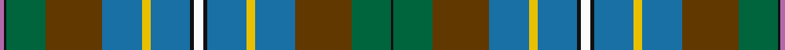

This page is one **sett** — a single exact thread-count. It belongs to the [tartan](/tartans/w4k2b18ly4b18dy26g18k1m2/)
(the same proportion at any scale), whose colour order is pattern [KGGBYBKWKBYBGGKR](/stripes/kggbybkwkbybggkr/).

Sourced from register-of-tartans.  It is a [16 stripe tartan](/stripes/stripes16/).

Original link https://www.tartanregister.gov.uk/tartanDetails.aspx?ref=1781

## Register references

External register numbers recorded for this tartan.

- Scottish Register of Tartans: [1781](https://www.tartanregister.gov.uk/tartanDetails.aspx?ref=1781)
- Scottish Tartans Authority (ITI): 6037

## Thread count
P/4 K2 G36 T52 B36 Y8 B36 K4 W8 K4 B36 Y8 B36 T52 G36 K/2

## Palette

Palette: <strong>Tartan Register</strong> <small style="color:#888">(7 of 8 colours)</small>
<table><thead><tr><th>Colour</th><th>Threads</th><th>Shade</th><th>Base</th><th>OKLCh</th></tr></thead><tbody><tr><td>P/</td><td style="text-align:right;font-variant-numeric:tabular-nums">4</td><td><code style="background-color:#B468AC;">#B468AC</code> <small style="color:#888">#B468AC</small></td><td>R <code style="background-color:#CC0000;">#CC0000</code></td><td><small style="color:#888">oklch(62.5% 0.131 330.9)</small></td></tr><tr><td>K</td><td style="text-align:right;font-variant-numeric:tabular-nums">2</td><td><code style="background-color:#101010;">#101010</code> <small style="color:#888">#101010</small></td><td>K <code style="background-color:#000000;">#000000</code></td><td><small style="color:#888">oklch(17.3% 0.000 89.9)</small></td></tr><tr><td>G</td><td style="text-align:right;font-variant-numeric:tabular-nums">36</td><td><code style="background-color:#00643C;">#00643C</code> <small style="color:#888">#00643C</small></td><td>G <code style="background-color:#006100;">#006100</code></td><td><small style="color:#888">oklch(44.3% 0.104 157.7)</small></td></tr><tr><td>T</td><td style="text-align:right;font-variant-numeric:tabular-nums">52</td><td><code style="background-color:#603800;">#603800</code> <small style="color:#888">#603800</small></td><td>G <code style="background-color:#006100;">#006100</code></td><td><small style="color:#888">oklch(38.1% 0.084 66.7)</small></td></tr><tr><td>B</td><td style="text-align:right;font-variant-numeric:tabular-nums">36</td><td><code style="background-color:#1870A4;">#1870A4</code> <small style="color:#888">#1870A4</small></td><td>B <code style="background-color:#2A418A;">#2A418A</code></td><td><small style="color:#888">oklch(52.2% 0.113 241.2)</small></td></tr><tr><td>Y</td><td style="text-align:right;font-variant-numeric:tabular-nums">8</td><td><code style="background-color:#E8C000;">#E8C000</code> <small style="color:#888">#E8C000</small></td><td>Y <code style="background-color:#F2BF00;">#F2BF00</code></td><td><small style="color:#888">oklch(81.9% 0.168 93.7)</small></td></tr><tr><td>B</td><td style="text-align:right;font-variant-numeric:tabular-nums">36</td><td><code style="background-color:#1870A4;">#1870A4</code> <small style="color:#888">#1870A4</small></td><td>B <code style="background-color:#2A418A;">#2A418A</code></td><td><small style="color:#888">oklch(52.2% 0.113 241.2)</small></td></tr><tr><td>K</td><td style="text-align:right;font-variant-numeric:tabular-nums">4</td><td><code style="background-color:#101010;">#101010</code> <small style="color:#888">#101010</small></td><td>K <code style="background-color:#000000;">#000000</code></td><td><small style="color:#888">oklch(17.3% 0.000 89.9)</small></td></tr><tr><td>W</td><td style="text-align:right;font-variant-numeric:tabular-nums">8</td><td><code style="background-color:#FCFCFC;">#FCFCFC</code> <small style="color:#888">#FCFCFC</small></td><td>W <code style="background-color:#F7F7F7;">#F7F7F7</code></td><td><small style="color:#888">oklch(99.1% 0.000 89.9)</small></td></tr><tr><td>K</td><td style="text-align:right;font-variant-numeric:tabular-nums">4</td><td><code style="background-color:#101010;">#101010</code> <small style="color:#888">#101010</small></td><td>K <code style="background-color:#000000;">#000000</code></td><td><small style="color:#888">oklch(17.3% 0.000 89.9)</small></td></tr><tr><td>B</td><td style="text-align:right;font-variant-numeric:tabular-nums">36</td><td><code style="background-color:#1870A4;">#1870A4</code> <small style="color:#888">#1870A4</small></td><td>B <code style="background-color:#2A418A;">#2A418A</code></td><td><small style="color:#888">oklch(52.2% 0.113 241.2)</small></td></tr><tr><td>Y</td><td style="text-align:right;font-variant-numeric:tabular-nums">8</td><td><code style="background-color:#E8C000;">#E8C000</code> <small style="color:#888">#E8C000</small></td><td>Y <code style="background-color:#F2BF00;">#F2BF00</code></td><td><small style="color:#888">oklch(81.9% 0.168 93.7)</small></td></tr><tr><td>B</td><td style="text-align:right;font-variant-numeric:tabular-nums">36</td><td><code style="background-color:#1870A4;">#1870A4</code> <small style="color:#888">#1870A4</small></td><td>B <code style="background-color:#2A418A;">#2A418A</code></td><td><small style="color:#888">oklch(52.2% 0.113 241.2)</small></td></tr><tr><td>T</td><td style="text-align:right;font-variant-numeric:tabular-nums">52</td><td><code style="background-color:#603800;">#603800</code> <small style="color:#888">#603800</small></td><td>G <code style="background-color:#006100;">#006100</code></td><td><small style="color:#888">oklch(38.1% 0.084 66.7)</small></td></tr><tr><td>G</td><td style="text-align:right;font-variant-numeric:tabular-nums">36</td><td><code style="background-color:#00643C;">#00643C</code> <small style="color:#888">#00643C</small></td><td>G <code style="background-color:#006100;">#006100</code></td><td><small style="color:#888">oklch(44.3% 0.104 157.7)</small></td></tr><tr><td>K/</td><td style="text-align:right;font-variant-numeric:tabular-nums">2</td><td><code style="background-color:#101010;">#101010</code> <small style="color:#888">#101010</small></td><td>K <code style="background-color:#000000;">#000000</code></td><td><small style="color:#888">oklch(17.3% 0.000 89.9)</small></td></tr></tbody></table>

## Nearest tartans

The nearest existing variants by ΔTartan distance, with this tartan at the top so the swatches line up against it.

ΔTartan

Tartan

Sett

—

<a href="/ttd/edit/#slug=w4k2b18ly4b18dy26g18k1m2~x2">Hughes Interconnection Int.</a> <a class="nn-out" href="/setts/s16/w4k2b18ly4b18dy26g18k1m2~x2/" title="open its dictionary page">↗</a>

1.21

<a href="/setts/s14/k5k3dy4ly1db13dy13g29w2~x2/">Teviotdale District Tartan Tartan Number: 5136. Earliest known date: 01/01/1996 Lochcarron. The colours are representative of those in the valley through which flows the River Teviot in the Scottish Borders. Sample in Scottish Tartans Authority's Johnston Collection. Blues lightened to show sett. See products available Copyright © Blair Urquhart, Comrie, 2015</a>

1.27

<a href="/ttd/edit/#slug=w4k2b18ly4b18dy26g18k1m2~x2">Hughes Interconnection Int. (Pers)</a> <a class="nn-out" href="/setts/s9/w4k2b18ly4b18dy26g18k1m2~x2/" title="open its dictionary page">↗</a>

1.35

<a href="/ttd/edit/#slug=w9k1dy31dg30db36dg3db3dg3db36dg30dy31k1ly9~x2">Campbell Brown</a> <a class="nn-out" href="/setts/s13/w9k1dy31dg30db36dg3db3dg3db36dg30dy31k1ly9~x2/" title="open its dictionary page">↗</a>

1.42

<a href="/ttd/edit/#slug=dy16k4dy8g2dg19w2g22db15k4w3dg3ly4g30db25w5dg40db16~x2">Les Cercles de Fermieres du Quebec</a> <a class="nn-out" href="/setts/s17/dy16k4dy8g2dg19w2g22db15k4w3dg3ly4g30db25w5dg40db16~x2/" title="open its dictionary page">↗</a>

1.44

<a href="/ttd/edit/#slug=db3dg22r5dg5o5w1o1dg1g8db6o1db5dg2~x2">Mill o Forest Primary School (Corp)</a> <a class="nn-out" href="/setts/s13/db3dg22r5dg5o5w1o1dg1g8db6o1db5dg2~x2/" title="open its dictionary page">↗</a>

1.49

<a href="/ttd/edit/#slug=n38t8lg3n20t42k2g6k2t2m3t2w2lg10t2k6">Causeway, The</a> <a class="nn-out" href="/setts/s15/n38t8lg3n20t42k2g6k2t2m3t2w2lg10t2k6/" title="open its dictionary page">↗</a>

1.51

<a href="/ttd/edit/#slug=n2dt9y1dt4y2dt2y4n1y15g1y3g3y2g4y1g7ly1r2~x2">Norwegian Night (Fashion)</a> <a class="nn-out" href="/setts/s18/n2dt9y1dt4y2dt2y4n1y15g1y3g3y2g4y1g7ly1r2~x2/" title="open its dictionary page">↗</a>

1.52

<a href="/ttd/edit/#slug=db5b2db9dp10k2dp4k2g10g33w2g33g10k2dp4k2dp10db9b2db5w3~x2">Inverclyde Green</a> <a class="nn-out" href="/setts/s20/db5b2db9dp10k2dp4k2g10g33w2g33g10k2dp4k2dp10db9b2db5w3~x2/" title="open its dictionary page">↗</a>

1.54

<a href="/ttd/edit/#slug=lo4k1g10r2g10r4g10r2g10k16t28k1lb4~x2">California State American District Tartan Tartan Number: 2454. Earliest known date: 1998 Designed by J.Howard Standing of Tarzana, California and Thomas Ferguson of Sydney, British Columbia. Adopted as the 'official' California State tartan by the State Legislature. For general use by all those living in the State. Based on Muir, after the famous botanist and environmentalist John Muir who lived in California. Assembly Bill 2362, february 20th 1998. See products available Copyright © Blair Urquhart, Comrie, 2015</a> <a class="nn-out" href="/setts/s13/lo4k1g10r2g10r4g10r2g10k16t28k1lb4~x2/" title="open its dictionary page">↗</a>

1.56

<a href="/ttd/edit/#slug=db20y2w1y5dg8ly1dg2r1dg8y16~x4">Connecticut</a> <a class="nn-out" href="/setts/s10/db20y2w1y5dg8ly1dg2r1dg8y16~x4/" title="open its dictionary page">↗</a>

## Neighbour map

Every grey dot is one of 14299 variants placed by the first two principal components of the ΔTartan feature space (44% of its variance). Red is this tartan; blue dots are its nearest — click one to open its page.

<svg viewBox="0 0 640 380" role="img" style="max-width:100%;height:auto;border:1px solid #e0e0e0;border-radius:4px;display:block" xmlns="http://www.w3.org/2000/svg"><image href="/nn/cloud.v1.png" width="640" height="380"/><a href="/setts/s14/k5k3dy4ly1db13dy13g29w2~x2/"><circle cx="222.7" cy="103.5" r="4" fill="#3465a4"><title>Teviotdale District Tartan Tartan Number: 5136. Earliest known date: 01/01/1996 Lochcarron. The colours are representative of those in the valley through which flows the River Teviot in the Scottish Borders. Sample in Scottish Tartans Authority's Johnston Collection. Blues lightened to show sett. See products available Copyright © Blair Urquhart, Comrie, 2015</title></circle></a><a href="/setts/s9/w4k2b18ly4b18dy26g18k1m2~x2/"><circle cx="182.1" cy="120.4" r="4" fill="#3465a4"><title>Hughes Interconnection Int. (Pers)</title></circle></a><a href="/setts/s13/w9k1dy31dg30db36dg3db3dg3db36dg30dy31k1ly9~x2/"><circle cx="210.5" cy="127.3" r="4" fill="#3465a4"><title>Campbell Brown</title></circle></a><a href="/setts/s17/dy16k4dy8g2dg19w2g22db15k4w3dg3ly4g30db25w5dg40db16~x2/"><circle cx="117.2" cy="113.7" r="4" fill="#3465a4"><title>Les Cercles de Fermieres du Quebec</title></circle></a><a href="/setts/s13/db3dg22r5dg5o5w1o1dg1g8db6o1db5dg2~x2/"><circle cx="240.3" cy="119.0" r="4" fill="#3465a4"><title>Mill o Forest Primary School (Corp)</title></circle></a><a href="/setts/s15/n38t8lg3n20t42k2g6k2t2m3t2w2lg10t2k6/"><circle cx="223.5" cy="87.5" r="4" fill="#3465a4"><title>Causeway, The</title></circle></a><a href="/setts/s18/n2dt9y1dt4y2dt2y4n1y15g1y3g3y2g4y1g7ly1r2~x2/"><circle cx="220.2" cy="129.5" r="4" fill="#3465a4"><title>Norwegian Night (Fashion)</title></circle></a><a href="/setts/s20/db5b2db9dp10k2dp4k2g10g33w2g33g10k2dp4k2dp10db9b2db5w3~x2/"><circle cx="164.6" cy="81.8" r="4" fill="#3465a4"><title>Inverclyde Green</title></circle></a><a href="/setts/s13/lo4k1g10r2g10r4g10r2g10k16t28k1lb4~x2/"><circle cx="187.7" cy="107.4" r="4" fill="#3465a4"><title>California State American District Tartan Tartan Number: 2454. Earliest known date: 1998 Designed by J.Howard Standing of Tarzana, California and Thomas Ferguson of Sydney, British Columbia. Adopted as the 'official' California State tartan by the State Legislature. For general use by all those living in the State. Based on Muir, after the famous botanist and environmentalist John Muir who lived in California. Assembly Bill 2362, february 20th 1998. See products available Copyright © Blair Urquhart, Comrie, 2015</title></circle></a><a href="/setts/s10/db20y2w1y5dg8ly1dg2r1dg8y16~x4/"><circle cx="217.9" cy="139.8" r="4" fill="#3465a4"><title>Connecticut</title></circle></a><circle cx="188.0" cy="109.4" r="5" fill="#c00000"/></svg>

ID: /setts/s16/w4k2b18ly4b18dy26g18k1m2~x2/
